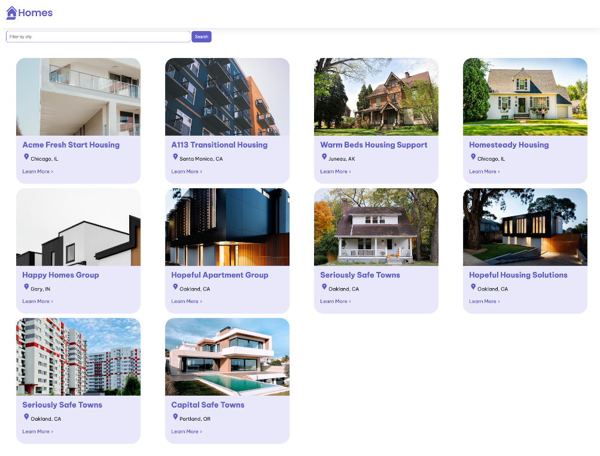

## 什么是 Angular？

Angular 是一个由 Google 维护的开源 Web 应用框架，用于帮助我们构建高性能、高效率的单页应用（SPA）。它提供了一套丰富的工具和库，包括但不限于组件开发套件（CDK）、路由、表单管理、客户端服务器通信以及更多，一切都为了简化开发过程，优化应用性能。

Angular 的核心特性如双向数据绑定、依赖注入和模块化开发，都适用于开发大型、可维护的应用。此外，Angular 的强大生态系统和社区支持也为开发者提供了额外的资源和工具，进一步加速开发流程。

<SiteInfo
name="Angular"
desc="A platform and framework for building single-page client applications"
url="https://angular.dev"
preview="/assets/pageImg/03_angular.jpg"
repo="https://github.com/angular/angular"
/>

## 快速入门

下面，我们跟着官方教程，先快速入门 Angular 框架，创建第一个Angular 应用。

::: tip 假设你已经拥有以下能力

- 可通过直接编辑 HTML 创建网页。
- 能使用 JavaScript 编写网站内容。
- 会阅读并理解 CSS 以及选择器的使用。
- 能够使用命令行指令执行计算机任务。

::: 

根据官方教程，我们会创建并完善一个Angular应用，该应用功能包括列出出租房屋及显示每个房屋的详细信息。在这个过程中，将会使用到Angular中的多个常见特性。

应用演示效果如下：



你也可以直接阅读官方教程，地址如下：

- [你的第一个 Angular 应用 • Angular](https://angular.cn/tutorials/first-app)

## 本地开发环境

### Node

**识别 Angular 所需的 Node.js 版本**是否符合要求。首先打开终端窗口，运行以下命令：

```shell
node --version
```

检查你的 Node.js 版本是否符合 Angular 所需的活跃 LTS 或维护 LTS 版本：


> 如果你的 Node.js 版本不符合要求，访问 [nodejs.org](https://nodejs.org/) 根据安装说明更新或安装正确的 Node.js 版本。

### Angular CLI

安装了 Node.js 和 npm 后，我们需要安装 Angular CLI ，一个有效的 Angular 开发工具。

打开终端窗口，运行以下命令：

```shell
npm install -g @angular/cli
```

这将全局安装 Angular CLI，使其在我们系统上的任何位置都可用。

完成安装后，运行 `ng version` 命令可检查是否安装成功：

```shell
C:\Users\zhengyiyi>ng version

     _                      _                 ____ _     ___
    / \   _ __   __ _ _   _| | __ _ _ __     / ___| |   |_ _|
   / △ \ | '_ \ / _` | | | | |/ _` | '__|   | |   | |    | |
  / ___ \| | | | (_| | |_| | | (_| | |      | |___| |___ | |
 /_/   \_\_| |_|\__, |\__,_|_|\__,_|_|       \____|_____|___|
                |___/


Angular CLI: 18.0.7
Node: 20.11.1
Package Manager: npm 8.19.4
OS: win32 x64

Angular: undefined
...

Package                      Version
------------------------------------------------------
@angular-devkit/architect    0.1800.7 (cli-only)
@angular-devkit/core         18.0.7 (cli-only)
@angular-devkit/schematics   18.0.7 (cli-only)
@schematics/angular          18.0.7 (cli-only)
```

### 开发工具

推荐使用 [Visual Studio Code](https://code.visualstudio.com/) 作为开发工具，构建 `Angular` 应用。


另外，你还可以安装 Angular 语言服务以提升开发体验，运行以下命令即可（当然，这一步骤是可选的）：

```shell
npm install -g @angular/language-service
```

## Hello World

下面，我们通过计算机传统项目 Hello World 来认识 Angular。首先，将项目代码克隆到本地：

```shell
git clone -b homes-app-start git@github.com:angular/codelabs.git homes-app
```

该命令会从 GitHub 克隆 `homes-app-start` 分支到名为 `homes-app` 的文件夹中。

克隆项目后，切换到项目目录：

```bash
cd homes-app
```

然后，安装项目依赖：

```bash
npm install
```

这一步会根据项目根目录下的 `package.json` 文件中列出的依赖项，下载并安装所需的所有包。

依赖安装完成后，我们可以启动开发服务器来运行应用程序：

```bash
ng serve
```

`ng serve` 命令会启动一个开发服务器，并在 `http://localhost:4200` 上提供应用程序。

我们可以打开浏览器并访问这个地址，此时可看到以下内容：


## 项目结构


其中，`src` 目录是我们主要的工作目录，它包含了应用程序的逻辑、样式、图片和 HTML 模板：


所有的 Angular 组件都会在 **`index.html`** 文档中通过 `<app-root></app-root>` 标签被加载：


**`main.ts`** 是应用程序的入口点，Angular 通过这个文件启动并运行应用程序。


`app.component.ts`中定义的 `AppComponent` 是顶级组件，即应用的主组件（组件树的根）：


> 更多相关内容：
>
> - [组件的剖析 • Angular](https://angular.cn/guide/components)
> - [Angular CLI • 概览 • Angular](https://angular.cn/tools/cli)

## 认识组件

Angular 组件是构建 Angular 应用程序的基本构建块，每个组件都封装了应用程序的一部分功能。

```tsx
import {Component} from '@angular/core';

// 装饰器 (Decorator): 用于标记类并提供关于它的元数据
@Component({
    selector: 'app-root',
    standalone: true,
    imports: [], // 在这里列出需要导入的其他组件或模块
    template: `
    <h1>Hello world!</h1>
  `,
    styleUrls: ['./app.component.css'],
})

// 类 (Class): 用于处理数据和逻辑
export class AppComponent { 
    title = 'homes';
    // 这里可以添加更多的属性和方法，用于处理组件的逻辑
}
```

其中：

- `selector: 'app-root'`表示该组件可以通过在 HTML 文档中通过 `<app-root></app-root>` 标签来引用。

- `standalone: true`表示该组件是独立的，可以不依赖 Angular 模块（`NgModule`）单独使用。这是 Angular 14 引入的新特性。
- `template` 定义了组件的 HTML 模板，即组件的视图。
- `styleUrls` 指定了组件样式文件的位置。

## 创建并应用新组件

### 创建Home组件

使用 Angular CLI 创建新组件，跳过自动导入到模块：

```shell
ng generate component home --skip-import
```

> 使用 `--skip-import` 参数避免自动添加到 `NgModule`，手动管理组件导入。

完成上述命令后， `src/app` 目录下会生成一个 `home` 文件夹，其中包含以下四个文件：


- `home.component.ts`：组件逻辑和装饰器定义。
- `home.component.html`：组件 HTML 模板。
- `home.component.css`：组件样式文件。
- `home.component.spec.ts`：组件单元测试文件。

我们可以在 `@Component 装饰器` 中添加 `standalone: true,` 表示该组件是一个独立组件：

```tsx
// home.component.ts
import { Component } from '@angular/core';

// 使用 @Component 装饰器来定义组件的元数据
@Component({
    selector: 'app-home',
    templateUrl: './home.component.html',
    styleUrls: ['./home.component.css'],
    standalone: true // 添加这一行，表示该组件是独立的
})

// 定义 HomeComponent 类，这个类就是我们的组件类
export class HomeComponent {
    // 在这个类中可以定义组件的属性和方法
}
```

### 引入Home组件到根组件中

我们打开 `src/app` 目录下的 `app.component.ts` 文件，并在顶部导入 `HomeComponent` 组件：

```tsx
import {HomeComponent} from './home/home.component';
```

在 `@Component`中更新 `imports`数组属性，并添加 `HomeComponent`：

```tsx
imports: [HomeComponent],
```

接着，我们更新`template`属性：

```tsx
template: `
    <main>
      <header class="brand-name">
        
      </header>
      <section class="content">
        <app-home></app-home>
      </section>
    </main>
  `,
```

此时保存修改并刷新页面，效果如下（如果 `ng serve`未运行，请重新启动）：


### 修改Home组件内容

在上面的内容中，我们生成了一个子组件 `HomeComponent` 并导入至根组件 `AppComponent`中。

现在，我们可以进一步修改Home组件 `HomeComponent` 的内容。

首先打开 `home.component.ts` 文件，在 `@Component`中修改 `template`属性：

```tsx
template: `
    <section>
      <form>
        <input type="text" placeholder="Filter by city" />
        <button class="primary" type="button">Search</button>
      </form>
    </section>
  `,
```

此时刷新页面，效果如下：


由于需要有一个组件来呈现搜索结果，因此我们可以再创建一个新的组件，运行以下命令：

```shell
ng generate component HousingLocation --standalone --inline-template
```

`--standalone`选项表示生成独立组件，`--inline-template`表示使用内联模板而不是外部 HTML 文件。

> 通常，Angular 组件的模板会被放在一个单独的 HTML 文件中。使用`--inline-template`可以改为内联模式。

创建好新的组件后，我们打开 `home.component.ts` ，添加以下内容：


此时刷新页面，效果如下：


> 更多相关内容：
>
> - [ng generate • 概览 • Angular](https://angular.cn/cli/generate#component-command)
> - [Angular • 组件](https://angular.cn/api/core/Component)

## 完善页面效果

### Angular 接口（Interface）

接口（Interface）是 TypeScript 的一个特性，用于定义对象的结构。通过定义接口，你可以指定一个对象应该包含哪些属性和方法，以及它们的类型。

使用 `ng generate interface` 命令可以快速创建一个接口。

在这里，我们可以定义一个表示住房位置的接口 `HousingLocation`，在终端中运行以下命令：

```shell
ng generate interface housingLocation
```

这将在项目中创建一个新的 TypeScript 文件，其中包含 `HousingLocation` 接口的基本结构。我们根据需要添加属性：

```tsx
export interface HousingLocation {
	id: number,
    name: string,
    city: string,
    state: string,
    photo: string,
    availableUnits: number,
    wifi: boolean,
    laundry: boolean
}
```

### 输入属性与模板语法

在 Angular 中，`@Input()` 装饰器允许我们将数据从父组件传递到子组件。这是组件通信的一种方式。通过在子组件的类定义中使用 `@Input()` 装饰器，可以标记一个字段作为输入属性。

此外，Angular 提供了多种数据绑定方式，其中最常见的是文本插值和属性绑定。

- **文本插值**：使用双花括号 `{{ }}` 来显示组件类中的属性值。例如，`{{ location.city }}` 会显示 `location` 对象的 `city` 属性值。
- **属性绑定**：使用方括号 `[ ]` 来绑定目标属性到表达式。例如，`` 会将 `` 的 `src` 属性绑定到 `location` 对象的 `imageUrl` 属性。

在这里，`HousingLocationComponent` 组件需要从父组件接收一个 `HousingLocation` 对象，那么我们可以这样修改 `housing-location.component.ts` 文件：

```tsx
import { Component, Input } from '@angular/core';
import { CommonModule } from '@angular/common';
import { HousingLocation } from '../housing-location';

@Component({
  selector: 'app-housing-location',
  standalone: true,
  imports: [CommonModule],
  template: `
    <section class="listing">
      
      <h2 class="listing-heading"> {{housingLocation.name}} </h2>
      <p class="listing-location"> {{ housingLocation.city }}, {{ housingLocation.state }} </p>
    </section>
  `,
  styleUrls: ['./housing-location.component.css']
})

export class HousingLocationComponent {
  @Input() housingLocation !: HousingLocation;
}
```

### 结构指令

结构指令是用来修改 DOM 布局的指令。`*ngFor` 是 Angular 提供的一种结构指令，用于循环渲染一个列表。

在这里，我们想渲染住房位置列表，那么可以在`home.component.ts` 模板中这样使用 `*ngFor` 指令：

```tsx
import { Component } from '@angular/core';
import { CommonModule } from '@angular/common';
import { HousingLocationComponent } from '../housing-location/housing-location.component';
import { HousingLocation } from '../housing-location';

@Component({
  standalone: true,
  imports: [HousingLocationComponent, CommonModule],
  selector: 'app-home',
  template: `
    <section>
      <form>
        <input type="text" placeholder="Filter by city" />
        <button class="primary" type="button">Search</button>
      </form>
    </section>
    <section class="results">
      <app-housing-location *ngFor="let housingLocation of housingLocationList"
      [housingLocation]="housingLocation">
      </app-housing-location>
    </section>
  `,
  styleUrls: ['./home.component.css'],
})

export class HomeComponent {
  housingLocationList: HousingLocation[] = [
    {
      id: 0,
      name: 'Acme Fresh Start Housing',
      city: 'Chicago',
      state: 'IL',
      photo: '/assets/bernard-hermant-CLKGGwIBTaY-unsplash.jpg',
      availableUnits: 4,
      wifi: true,
      laundry: true
    },
    {
      id: 1,
      name: 'A113 Transitional Housing',
      city: 'Santa Monica',
      state: 'CA',
      photo: '/assets/brandon-griggs-wR11KBaB86U-unsplash.jpg',
      availableUnits: 0,
      wifi: false,
      laundry: true
    },
    {
      id: 2,
      name: 'Warm Beds Housing Support',
      city: 'Juneau',
      state: 'AK',
      photo: '/assets/i-do-nothing-but-love-lAyXdl1-Wmc-unsplash.jpg',
      availableUnits: 1,
      wifi: false,
      laundry: false
    },
    {
      id: 3,
      name: 'Homesteady Housing',
      city: 'Chicago',
      state: 'IL',
      photo: '/assets/ian-macdonald-W8z6aiwfi1E-unsplash.jpg',
      availableUnits: 1,
      wifi: true,
      laundry: false
    },
    {
      id: 4,
      name: 'Happy Homes Group',
      city: 'Gary',
      state: 'IN',
      photo: '/assets/krzysztof-hepner-978RAXoXnH4-unsplash.jpg',
      availableUnits: 1,
      wifi: true,
      laundry: false
    },
    {
      id: 5,
      name: 'Hopeful Apartment Group',
      city: 'Oakland',
      state: 'CA',
      photo: '/assets/r-architecture-JvQ0Q5IkeMM-unsplash.jpg',
      availableUnits: 2,
      wifi: true,
      laundry: true
    },
    {
      id: 6,
      name: 'Seriously Safe Towns',
      city: 'Oakland',
      state: 'CA',
      photo: '/assets/phil-hearing-IYfp2Ixe9nM-unsplash.jpg',
      availableUnits: 5,
      wifi: true,
      laundry: true
    },
    {
      id: 7,
      name: 'Hopeful Housing Solutions',
      city: 'Oakland',
      state: 'CA',
      photo: '/assets/r-architecture-GGupkreKwxA-unsplash.jpg',
      availableUnits: 2,
      wifi: true,
      laundry: true
    },
    {
      id: 8,
      name: 'Seriously Safe Towns',
      city: 'Oakland',
      state: 'CA',
      photo: '/assets/saru-robert-9rP3mxf8qWI-unsplash.jpg',
      availableUnits: 10,
      wifi: false,
      laundry: false
    },
    {
      id: 9,
      name: 'Capital Safe Towns',
      city: 'Portland',
      state: 'OR',
      photo: '/assets/webaliser-_TPTXZd9mOo-unsplash.jpg',
      availableUnits: 6,
      wifi: true,
      laundry: true
    }
  ];
}
```

刷新页面，效果如下：


## 修改样式

- `app.component.css`：

```css
:host {
    --content-padding: 10px;
}

header {
    display: block;
    height: 60px;
    padding: var(--content-padding);
    box-shadow: 0px 5px 25px var(--shadow-color);
}

.content {
    padding: var(--content-padding);
}
```

- `home.component.css`：

```css
.results {
  display: grid;
  column-gap: 14px;
  row-gap: 14px;
  grid-template-columns: repeat(auto-fill, minmax(400px, 400px));
  margin-top: 50px;
  justify-content: space-around;
}

input[type="text"] {
  border: solid 1px var(--primary-color);
  padding: 10px;
  border-radius: 8px;
  margin-right: 4px;
  display: inline-block;
  width: 30%;
}

button {
  padding: 10px;
  border: solid 1px var(--primary-color);
  background: var(--primary-color);
  color: white;
  border-radius: 8px;
}

@media (min-width: 500px) and (max-width: 768px) {
  .results {
      grid-template-columns: repeat(2, 1fr);
  }
  input[type="text"] {
      width: 70%;
  }   
}

@media (max-width: 499px) {
  .results {
      grid-template-columns: 1fr;
  }    
}
```

- `housing-location.component.css`：

```css
.listing {
    background: var(--accent-color);
    border-radius: 30px;
    padding-bottom: 30px;
}

.listing-heading {
    color: var(--primary-color);
    padding: 10px 20px 0 20px;
}

.listing-photo {
    height: 250px;
    width: 100%;
    object-fit: cover;
    border-radius: 30px 30px 0 0;
}

.listing-location {
    padding: 10px 20px 20px 20px;
}

.listing-location::before {
    content: url("/assets/location-pin.svg") / "";
}

section.listing a {
    padding-left: 20px;
    text-decoration: none;
    color: var(--primary-color);
}

section.listing a::after {
    content: "\203A";
    margin-left: 5px;
}
```

- `styles.css`：

```css
* {
    margin: 0;
    padding: 0;
}

body {
    font-family: 'Be Vietnam Pro', sans-serif;
}

:root {
    --primary-color: #605DC8;
    --secondary-color: #8B89E6;
    --accent-color: #e8e7fa;
    --shadow-color: #E8E8E8;
}

button.primary {
    padding: 10px;
    border: solid 1px var(--primary-color);
    background: var(--primary-color);
    color: white;
    border-radius: 8px;
}
```

最终呈现的效果如下：


