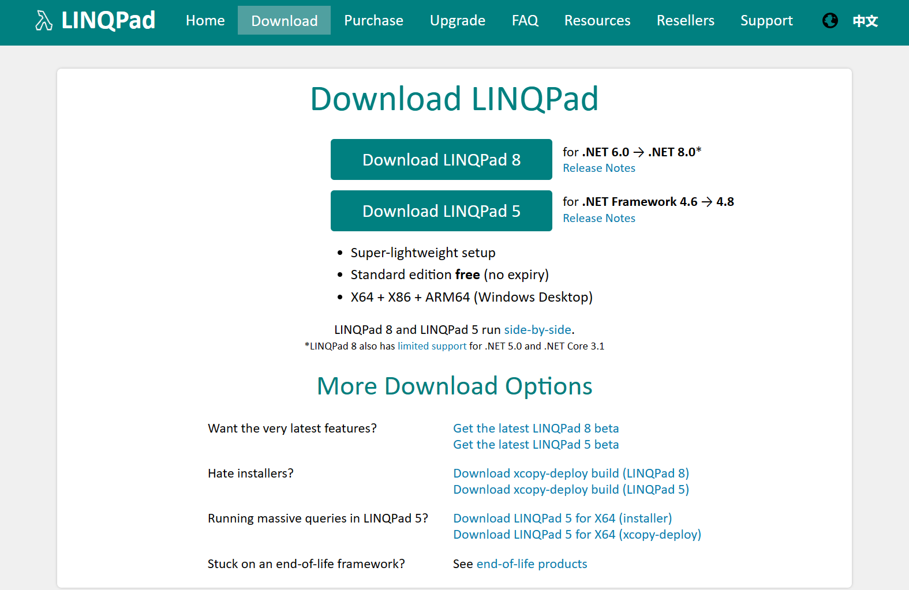
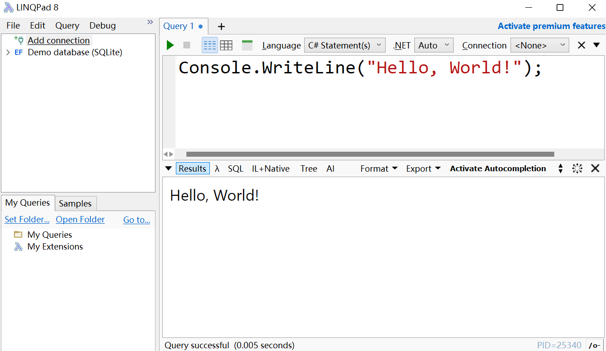
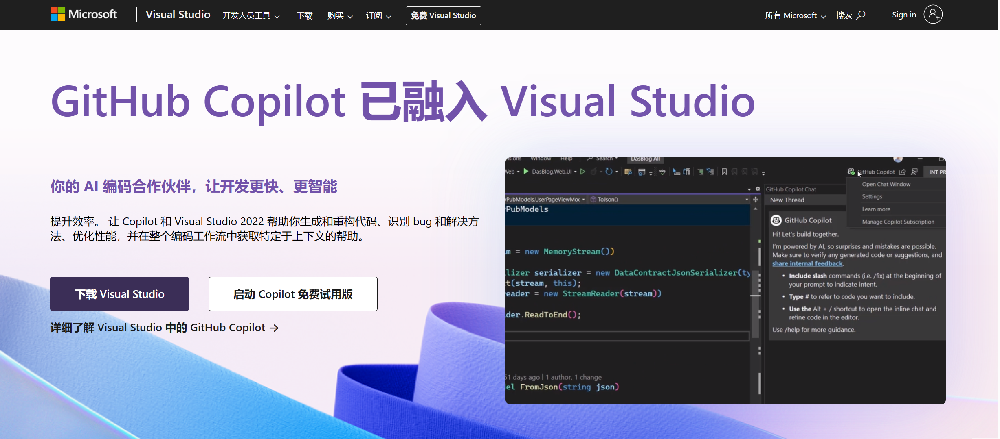
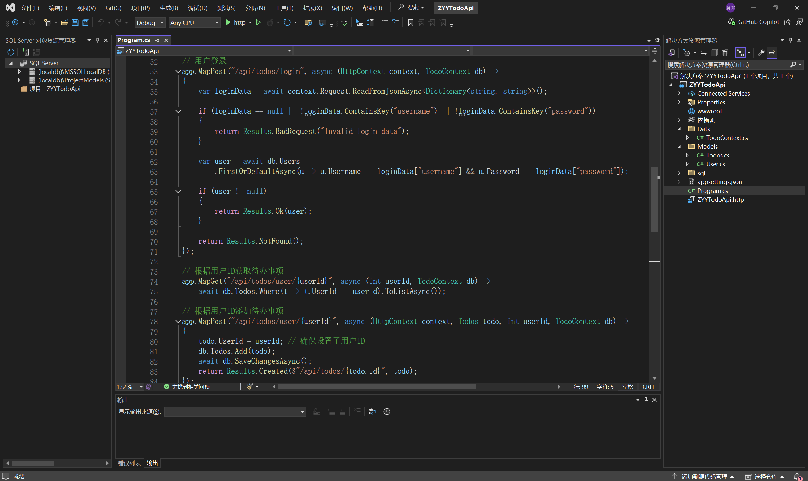

## C# 与 .NET

### 概述

`C#`（发音为 "C sharp"）是一种高级、强大、类型安全且面向对象的编程语言，由微软开发。

 `.NET` 则是一个由 Microsoft 创建的开发平台，用于构建各种类型的应用程序，包括桌面应用、Web应用、Web服务和移动应用。

`C#` 通常作为开发 `.NET` 应用程序的首选语言之一。

官方文档：

- [概述 - A tour of C# | Microsoft Learn](https://learn.microsoft.com/zh-cn/dotnet/csharp/tour-of-csharp/overview)
- [.NET 文档 | Microsoft Learn](https://learn.microsoft.com/zh-cn/dotnet/)

### 技术内容

`C#` 的语言特性包括类型安全、委托、事件、LINQ（语言集成查询）、异步编程模型等。任何熟悉 C、Java 和类似语言的人在适应 `C#` 的过程中几乎不会遇到什么障碍。`C#` 是一种面向对象编程的语言，同样有类、接口、继承、多态性等概念。

`.NET Framework` 是早期的 `.NET` 实现，主要用于 Windows 应用程序。`.NET Core` 是一个跨平台的 `.NET` 实现，从 `.NET 5` 开始，`.NET Core` 被重新命名为 `.NET`，并且是未来的发展方向。截止到 2024 年 7 月，最新的版本是 `.NET 8`。

::: tip 小结

`.NET`是一个由微软开发的免费、跨平台的开发平台，用于构建各种类型的应用程序，包括Web、移动、桌面、游戏和物联网应用程序。它提供了一套统一的`API`，这些 `API` 适用于所有`.NET`支持的平台。`C#`是`.NET`平台上的主要编程语言之一。通过`C#`，开发者可以利用`.NET`平台提供的丰富库和`API`来构建应用程序。

:::

## 下载并安装 .NET

下载地址：

-  [下载 .NET(Linux、macOS 和 Windows)](https://dotnet.microsoft.com/zh-cn/download)。

选择与你的操作系统相对应的SDK版本进行下载，安装完成后，可打开命令行窗口，输入以下命令验证 .NET SDK 是否正确安装：

```shell
dotnet --version
```

如果安装成功，命令将输出安装的.NET SDK版本号。通过以上步骤，你就可以开始使用`.NET`和`C#`进行应用程序开发了。

## 开发环境

### LINQPad

对于新手，我推荐使用 `LINQPad`，这是一款实用的 .NET 代码片段编辑器，支持 LINQ（语言集成查询）以及 C#、VB.NET 和 F# 编程语言。它被广泛用于测试代码片段、数据库查询、以及动态地执行 LINQ 查询。

下载地址：

- [Download LINQPad](https://www.linqpad.net/Download.aspx)



运行效果：



### Visual Studio

到后面开始做项目和解决方案时，我们就需要下载 Visual Studio，这是一款由微软开发的集成开发环境（IDE），支持多种语言，并提供了代码编辑器、调试器、GUI设计工具等。

下载地址：

[Visual Studio: 面向软件开发人员和 Teams 的 IDE 和代码编辑器](https://visualstudio.microsoft.com/zh-hans/)



安装过程中，你需要选择相应的工作负载（Workloads），例如“.NET桌面开发”、“ASP.NET和Web开发”、“跨平台的移动开发”等，这将决定安装哪些组件和工具集。

运行效果：

