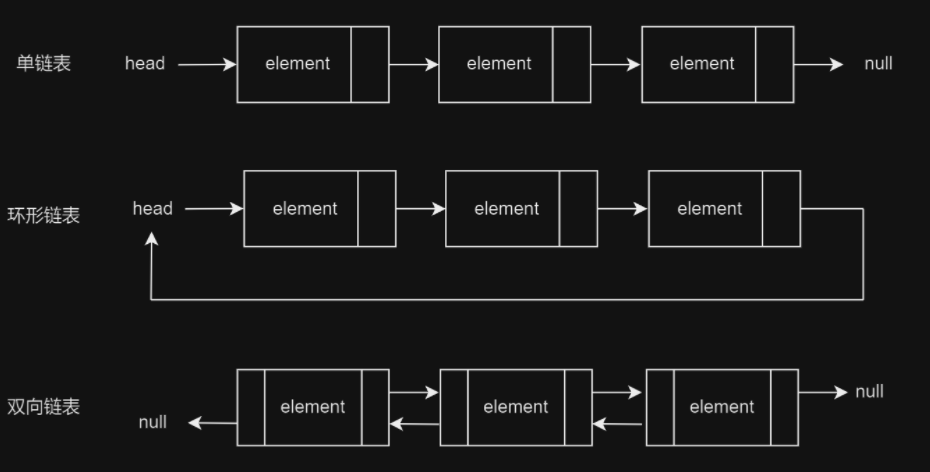

## 链表类型

常见链表类型有三种，分别是单链表，环形链表和双向链表。

对比如下：

| 特性     | 单向链表                                                     | 环形链表                                                     | 双向链表                                                     |
| -------- | ------------------------------------------------------------ | ------------------------------------------------------------ | ------------------------------------------------------------ |
| 简介     | 简称**单链表**，是一种常规链表，其节点包含值和指向下一节点的引用两项数据，头节点指向第一个实际存储数据的节点，尾节点指向`null`。 | 首尾相接，将单链表的尾节点指向头节点就得到了一个**环形链表**。在环形链表中，任意节点都可以视为头节点。 | 与单链表相比，**双向链表**记录了两个方向的引用，也就是前驱结点`prev`和后继节点`next`，因此更加灵活，可以朝两个方向遍历链表。 |
| 节点结构 | 数据 + 下一节点的指针                                        | 数据 + 下一节点的指针                                        | 数据 + 下一节点的指针 + 前一节点的指针                       |
| 遍历特点 | 单向遍历                                                     | 循环遍历                                                     | 双向遍历（前向和后向）                                       |



## 单链表的实现与操作

单链表由一系列的节点组成，每个节点包含一个数据域和一个指向下一个节点的指针。

下面，我们将使用Java来实现一个单链表，并提供一些基本的操作，如添加节点、删除节点、查找节点和获取链表长度。

### 单链表的定义

首先，我们定义一个名为`Node`的内部类，它包含一个整型数据`data`和一个`Node`类型的`next`指针。

```java
static class Node {
	int data;
	Node next;

	Node(int d) {
		data = d;
		next = null;
	}
}
```

然后，我们定义一个名为`SinglyLinkedList`的类，它包含一个`Node`类型的`head`指针，指向链表的头节点。

```java
public class SinglyLinkedList {
	Node head;
}
```

### 添加节点

我们提供一个`append`方法，用于在链表的末尾添加一个新的节点。如果链表为空（即头节点为null），则新节点就是头节点；否则，我们需要遍历链表，找到最后一个节点，然后将其`next`指针指向新节点。

```java
public void append(int data) {
	Node newNode = new Node(data);

	if (head == null) {
		head = newNode;
		return;
	}

	Node last = head;
	while (last.next != null) {
		last = last.next;
	}

	last.next = newNode;
}
```

### 删除节点

我们提供一个`deleteNode`方法，用于删除链表中第一个出现的指定数据的节点。我们需要遍历链表，找到要删除的节点和它的前一个节点，然后将前一个节点的`next`指针指向要删除节点的下一个节点。

```java
public void deleteNode(int key) {
	Node temp = head, prev = null;

	if (temp != null && temp.data == key) {
		head = temp.next;
		return;
	}

	while (temp != null && temp.data != key) {
		prev = temp;
		temp = temp.next;
	}

	if (temp == null)
		return;

	prev.next = temp.next;
}
```

### 查找节点

我们提供一个`search`方法，用于查找链表中是否存在指定的数据。我们需要遍历链表，如果找到一个节点的数据等于指定的数据，就返回true，否则返回false。

```java
public boolean search(int key) {
	Node current = head;
	while (current != null) {
		if (current.data == key) {
			return true;
		}
		current = current.next;
	}
	return false;
}
```

### 获取链表长度

我们提供一个`length`方法，用于获取链表的长度。我们需要遍历链表，每遍历一个节点，长度就加1。

```java
public int length() {
	int length = 0;
	Node current = head;
	while (current != null) {
		length++;
		current = current.next;
	}
	return length;
}
```

### 打印链表

我们提供一个`printList`方法，用于打印链表的所有节点。我们需要遍历链表，打印每个节点的数据。

```java
public void printList() {
	Node node = head;
	while (node != null) {
		System.out.print(node.data + " ");
		node = node.next;
	}
}
```

## 完整代码

```java
/**
 * 单向链表
 */
public class SinglyLinkedList {
	Node head; // 头节点

	// 链表节点的定义
	static class Node {
		int data;
		Node next;

		Node(int d) {
			data = d;
			next = null;
		}
	}

	// 在链表的末尾添加一个新的节点
	public void append(int data) {
		Node newNode = new Node(data);

		if (head == null) {
			head = newNode;
			return;
		}

		Node last = head;
		while (last.next != null) {
			last = last.next;
		}

		last.next = newNode;
	}

	// 删除链表中第一个出现的指定数据的节点
	public void deleteNode(int key) {
		Node temp = head, prev = null;

		if (temp != null && temp.data == key) {
			head = temp.next;
			return;
		}

		while (temp != null && temp.data != key) {
			prev = temp;
			temp = temp.next;
		}

		if (temp == null)
			return;

		prev.next = temp.next;
	}

	// 查找链表中是否存在指定的数据
	public boolean search(int key) {
		Node current = head;
		while (current != null) {
			if (current.data == key) {
				return true;
			}
			current = current.next;
		}
		return false;
	}
	
    // 获取链表的长度
    public int length() {
        int length = 0;
        Node current = head;
        while (current != null) {
            length++;
            current = current.next;
        }
        return length;
    }

	// 打印链表的所有节点
	public void printList() {
		Node node = head;
		while (node != null) {
			System.out.print(node.data + " ");
			node = node.next;
		}
	}

	public static void main(String[] args) {
		SinglyLinkedList list = new SinglyLinkedList();

		list.append(1);
		list.append(2);
		list.append(3);
		list.append(4);

		System.out.println("创建的单链表为: ");
		list.printList();
		System.out.println("\n链表的长度为: " + list.length());

		System.out.println("\n删除节点2后，链表为: ");
		list.deleteNode(2);
		list.printList();

		System.out.println("\n链表中是否存在3: " + list.search(3));
		System.out.println("此时链表的长度为: " + list.length());
	}
}
```

运行结果：

```
创建的单链表为: 
1 2 3 4 
链表的长度为: 4

删除节点2后，链表为: 
1 3 4 
链表中是否存在3: true
此时链表的长度为: 3
```

## LinkedList

下面，我们来看Java提供的链表：

```java
import java.util.LinkedList;
/**
 * 使用Java提供的双向链表（单向链表就足够用了其实）
 */
public class JavaLinkedList {
    // 创建一个LinkedList实例
    private LinkedList<Integer> list = new LinkedList<>();

    // 添加元素到链表尾部
    // 参数value是要添加的元素
    public void add(int value) {
        list.add(value);
    }

    // 在指定位置添加元素
    // 参数index是要添加元素的位置，value是要添加的元素
    public void add(int index, int value) {
        list.add(index, value);
    }

    // 移除链表中的元素
    // 参数value是要移除的元素
    // 如果元素存在并被移除，返回true；否则返回false
    public boolean remove(Integer value) {
        return list.remove(value);
    }

    // 移除指定位置的元素
    // 参数index是要移除元素的位置
    // 返回被移除的元素
    public Integer remove(int index) {
        return list.remove(index);
    }

    // 获取指定位置的元素
    // 参数index是要获取元素的位置
    // 返回指定位置的元素
    public Integer get(int index) {
        return list.get(index);
    }

    // 获取链表的大小
    // 返回链表中元素的数量
    public int size() {
        return list.size();
    }

    // 检查链表是否为空
    // 如果链表为空，返回true；否则返回false
    public boolean isEmpty() {
        return list.isEmpty();
    }

    // 清空链表
    // 移除链表中的所有元素
    public void clear() {
        list.clear();
    }

    // main方法，用于测试
    public static void main(String[] args) {
        JavaLinkedList myList = new JavaLinkedList();
        myList.add(1);
        myList.add(2);
        myList.add(3);
        myList.add(1, 4);
        System.out.println("链表的大小：" + myList.size());
        System.out.println("链表的第2个元素：" + myList.get(1));
        myList.remove(1);
        System.out.println("移除元素后，链表的大小：" + myList.size());
        myList.clear();
        System.out.println("清空链表后，链表是否为空：" + myList.isEmpty());
    }
}
```

