## 树

### 什么是树？

树（tree）是一种抽象数据类型（ADT），或者说是一种用于模拟具有树状结构性质的非线性数据结构。

它是由n（n>0）个有限节点组成一个具有层次关系的集合，之所以称为树，是因为它看起来像“倒挂”的树，根在上，叶子朝下：

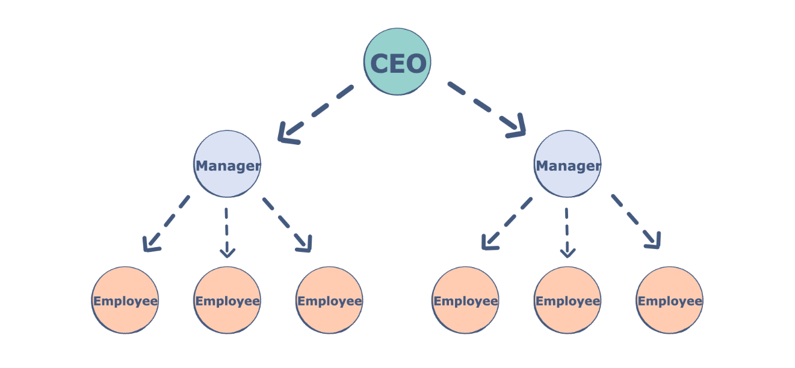

树的特点如下：

- 没有父节点的节点称为根节点（root）；

- 每个节点都含有有限个子节点，或者没有子节点；
- 每一个非根节点有且只有一个父节点；
- 除了根节点外，每个子节点可以分为多个不相交的子树；
- 树里面没有环路(cycle)

### 有关树的术语

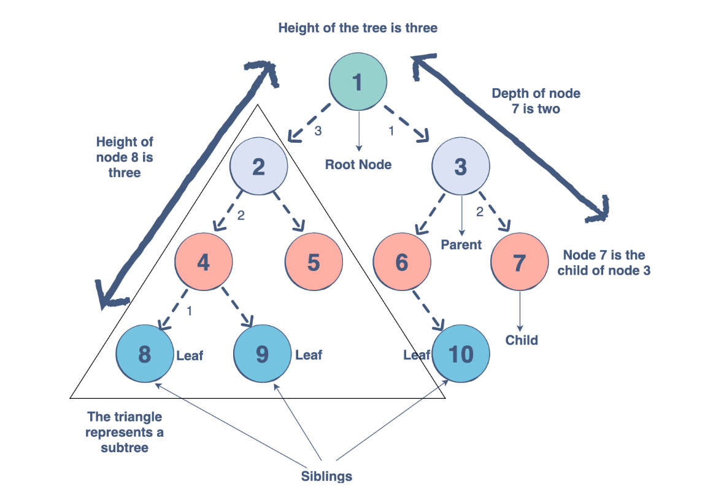


| 术语     | 定义                           |
|--------|------------------------------|
| 节点的度   | 子树的个数                        |
| 树的度    | 所有节点度中的最大值                   |
| 叶子节点   | 度为0的节点                       |
| 分支节点   | 度不为0的节点                      |
| 层次（层数） | 根节点在第 1 层，根节点的子节点在第 2 层，以此类推 |
| 父节点    | 若一个节点含有子节点，则这个节点称为其子节点的父节点   |
| 子节点    | 一个节点含有的子树的根节点，称为该节点的子节点      |
| 兄弟节点   | 具有相同父节点的节点互称为兄弟节点            |
| 节点的深度  | 从根节点到当前节点的唯一路径上的节点总数         |
| 节点的高度  | 从当前节点到最远叶子节点的路径上的节点总数        |
| 树的深度   | 所有节点深度中的最大值                  |
| 树的高度   | 所有节点高度中的最大值                  |
| 堂兄弟节点  | 父节点在同一层的节点互为堂兄弟              |
| 节点的祖先  | 从根到该节点所经分支上的所有节点             |
| 子孙     | 以某节点为根的子树中任一节点都称为该节点的子孙      |
| 森林     | 由m（m>=0）棵互不相交的树的集合称为森林       |

---

### 树有哪些分类

我们可以对树进行不同的分类。以下是一些常见的树的分类：

1. **有序/无序：**
   - 无序树：树中任意节点的子节点之间没有顺序关系，也称为自由树。
   - 有序树/搜索树/查找树：树中任意节点的子节点之间有顺序关系，这种树称为有序树。比如二叉搜索树。

2. **平衡/不平衡：**
   - 平衡树：确保树的高度相对较小，以提高插入、删除和查找的效率。
     - 绝对平衡树：所有叶节点在同一层。
     - 非绝对平衡树。

   - 不平衡树：树的节点分布不均匀，可能导致不同操作的效率下降。

3. **节点的分叉情况：**
   - 等叉树：每个节点的键值个数和子节点个数都相同。
   - 二叉树：每个节点最多含有两个子树。
     - 完全二叉树：除最底层外，其他层的节点数目均达到最大，且最底层从左到右紧密排列。
     - 满二叉树：所有叶节点都在最底层的完全二叉树。
     - 平衡二叉树（AVL树）：任何节点的两棵子树的高度差不大于1的二叉树。
     - 排序二叉树（二叉搜索树）：有序的二叉树，左子树的所有节点值小于根节点，右子树的所有节点值大于根节点。
     - 霍夫曼树：带权路径最短的二叉树，也称为最优二叉树。

   - 多叉树：每个节点可以有多于两个的子节点。
     - 不等叉树：每个节点的键值个数和子节点个数不一定相同。
     - B树：对不等叉树的节点键值数和插入、删除逻辑添加一些特殊的要求，以达到绝对平衡的效果。

## 二叉树

### 概念

什么是二叉树？

如果一棵树，它每个节点最多只有两个分支，那么它就是一颗二叉树。也就是说，二叉树不存在分支度大于2的节点（最多拥有两颗子树）。通常分支被称作 **“左子树”** 或 **“右子树”** 。

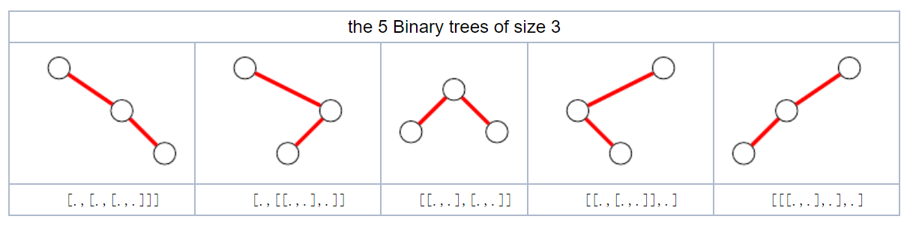

> 二叉树的分支具有左右次序，不能随意颠倒（颠倒后就是另一颗二叉树）。

二叉树的性质如下：

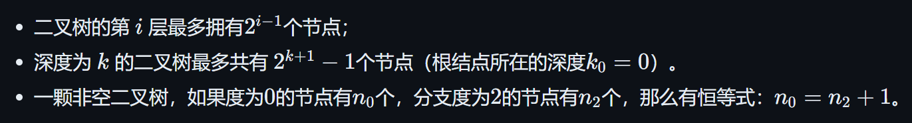

### 真二叉树

如果一颗树，它所有节点的度要么为0，要么为2，那么这棵树就是真二叉树。

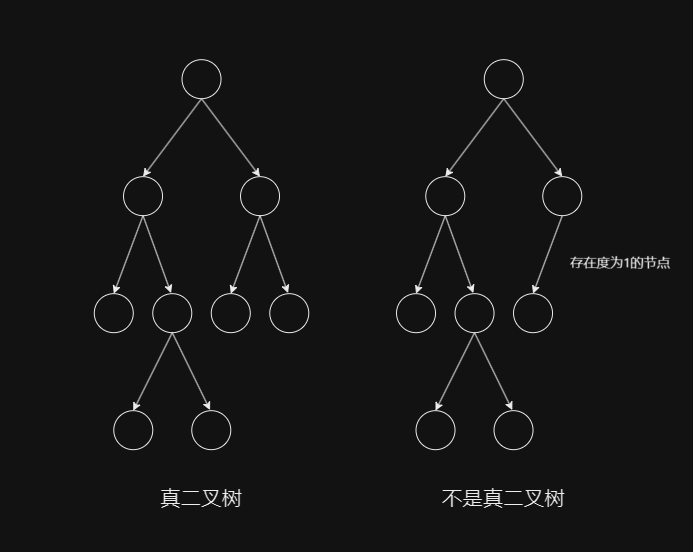


### 满二叉树

二叉树的种类有很多，我们先来看**满二叉树**。

如果一棵二叉树只有度为0的节点和度为2的节点，并且度为0的节点在同一层上，则这棵二叉树为满二叉树。

> **满二叉树：最后一层节点的度都为 0，其他节点的度都为 2**

我们发现，一颗满二叉树，如果它的深度为k，则它有(2^k)-1个节点。

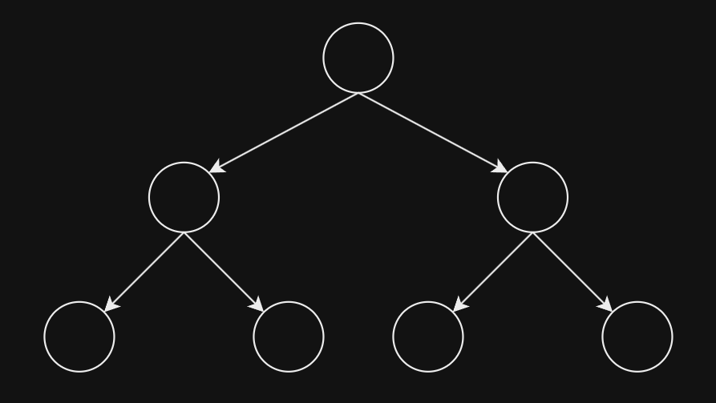

比如上面这个就是一颗满二叉树，它的深度为3，那么它一共有(2^3)-1个节点，也就是7个。

实际上，满二叉树的特点就是，每一层节点数都是满的，每一层上的节点都达到最大节点数。

> 满二叉树，在国外又称之为“完美二叉树”（Perfect Binary Tree）。

满二叉树有什么性质？通过观察我们发现：

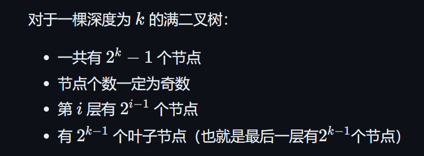

> 在同样高度的二叉树中，满二叉树的叶子节点数量最多、总节点数量最多。这是显而易见的。

### 完全二叉树

那什么是完全二叉树？

实际上，在完全二叉树中，除了最底层节点可能没填满外，其余每层节点数都达到最大值，并且**最下面一层的节点都集中在该层最左边的若干位置**。

> 也就是说，在一棵二叉树中，如果除了最后一层之外，其余层都是满的，并且最后一层要么是满的，要么在右边缺少连续若干节点，则此二叉树就是完全二叉树。

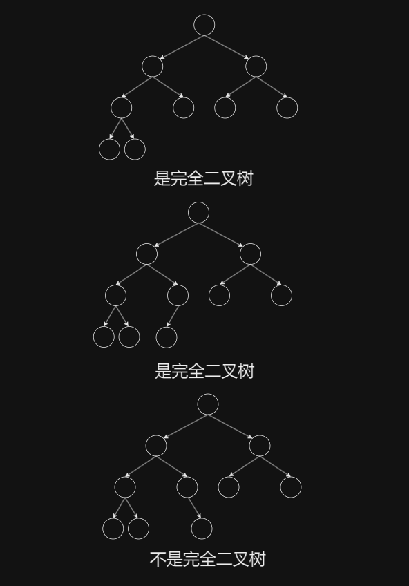

> 堆就是一颗完全二叉树，同时保证父子节点的顺序关系。

深度为k的完全二叉树，至少有 2^{k-1} 个节点，最多有 2^(k)-1 个节点。

若最底层为第 h 层（h从1开始），则该层包含 1 ~ 2^(h-1) 个节点。

> **满二叉树一定是完全二叉树，完全二叉树不一定是满二叉树**。

如果一颗完全二叉树的总节点数量为 `n`，那么它的：

- 高度：`floor(log2n) + 1`
- 叶子节点个数 `n0 = floor( (n+1)/2 )`
- 分支节点个数 `n2+n1 = floor(n/2)`

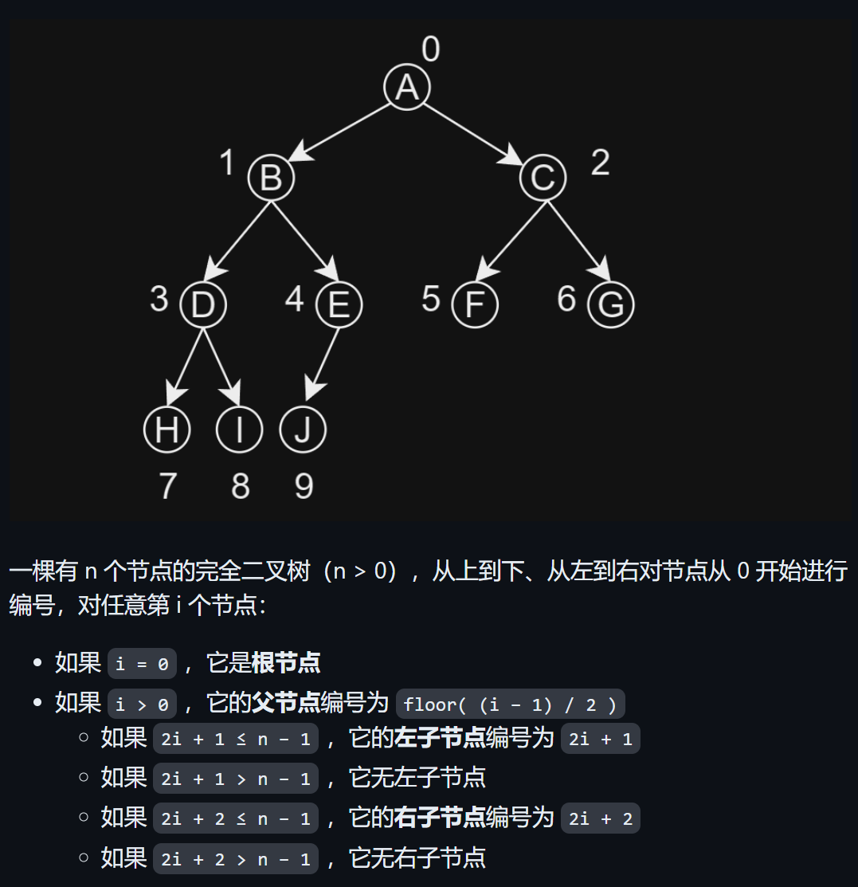

### 二叉搜索树

二叉搜索树（Binary Search Tree，简称BST），是指一棵空树或者具有下列性质的二叉树：

- 若任意节点的左子树不空，则左子树上所有节点的值均小于它的根节点的值；
- 若任意节点的右子树不空，则右子树上所有节点的值均大于它的根节点的值；
- 任意节点的左、右子树也分别为二叉搜索树；

> 二叉搜索树也称为二叉查找树、有序二叉树（ordered binary tree）或排序二叉树（sorted binary tree）

看下图：

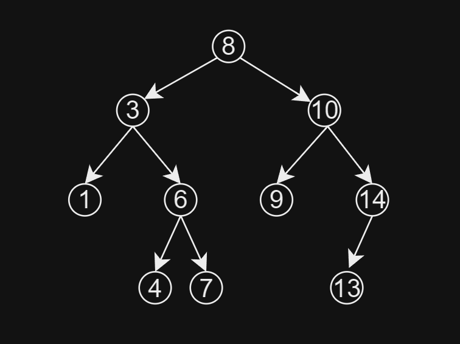

二叉查找树相比于其他二叉树的优势在于查找、插入的时间复杂度较低，为 `O(log n)`。

### 平衡二叉搜索树（AVL树）

平衡二叉搜索树，又称为AVL（Adelson-Velsky and Landis）树，其定义如下：

平衡二叉搜索树是一棵空树或它的左右两个子树的高度差的绝对值不超过1，并且左右两个子树都是一棵平衡二叉树。

> “在AVL树中，任一节点对应的两棵子树的最大高度差为1，因此它也被称为高度平衡树。”

AVL树的查找、插入和删除在平均和最坏情况下的时间复杂度都是 `O(log n)`。增加和删除元素的操作则可能需要借由一次或多次树旋转，以实现树的重新平衡。

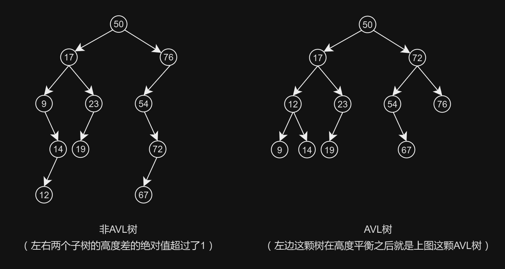

> “节点的平衡因子是它的左子树的高度减去它的右子树的高度（有时相反）。带有平衡因子1、0或 -1的节点被认为是平衡的。带有平衡因子 -2或2的节点被认为是不平衡的，并需要重新平衡这个树。平衡因子可以直接存储在每个节点中，或从可能存储在节点中的子树高度计算出来。”

### 二叉树的存储方式

二叉树可以链式存储，也可以顺序存储。

链式存储，就用对象引用的方式，将各个节点串联起来：

```java
public class TreeNode {
    int val;
    TreeNode left;
    TreeNode right;

    TreeNode() {}
    TreeNode(int val) { this.val = val; }
    TreeNode(int val, TreeNode left, TreeNode right) {
        this.val = val;
        this.left = left;
        this.right = right;
    }
}
```

如图所示：

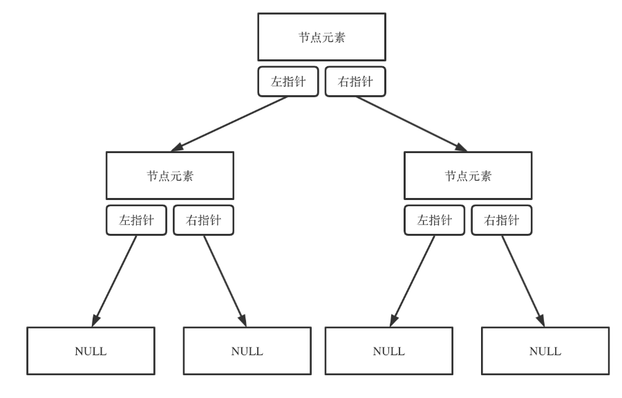

而对于数组存储二叉树，如果父节点的数组下标是 `i`，那么它的左孩子就是 `i * 2 + 1`，右孩子就是 `i * 2 + 2`。

如图所示：

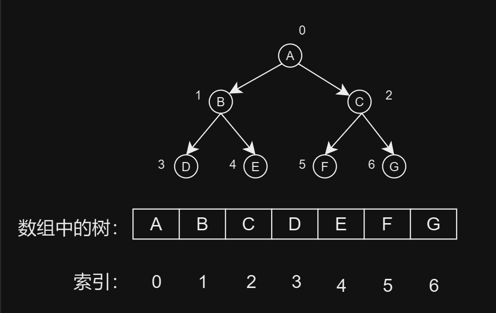

另外，我还写了一个工具类，可方便的打印一颗二叉树：

- [【工具类】编写一个工具类，方便打印二叉树](../03_杂记/02_二叉树的打印.md)

打印效果如下：

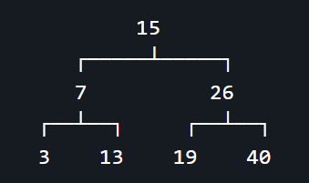

### Java实现

```java
class Node implements PrintableNode {
    int value;
    Node left;
    Node right;

    Node(int value) {
        this.value = value;
        left = null;
        right = null;
    }
    
    @Override
    public PrintableNode getLeft() {
    	return left;
    }

    @Override
    public PrintableNode getRight() {
    	return right;
    }

    @Override
    public String getData() {
    	return String.valueOf(value);
    }
}

public class BinaryTree {
    Node root;

    // 递归遍历
    void printPreorder(Node node) {
        if (node == null)
            return;
        System.out.print(node.value + " ");
        printPreorder(node.left);
        printPreorder(node.right);
    }

    void printInorder(Node node) {
        if (node == null)
            return;
        printInorder(node.left);
        System.out.print(node.value + " ");
        printInorder(node.right);
    }

    void printPostorder(Node node) {
        if (node == null)
            return;
        printPostorder(node.left);
        printPostorder(node.right);
        System.out.print(node.value + " ");
    }

    // 迭代遍历
    void printPreorderIterative(Node node) {
        if (node == null)
            return;

        Stack<Node> nodeStack = new Stack<>();
        nodeStack.push(root);

        while (!nodeStack.isEmpty()) {
            Node mynode = nodeStack.peek();
            System.out.print(mynode.value + " ");
            nodeStack.pop();

            if (mynode.right != null) {
                nodeStack.push(mynode.right);
            }
            if (mynode.left != null) {
                nodeStack.push(mynode.left);
            }
        }
    }

    void printInorderIterative(Node node) {
        Stack<Node> stack = new Stack<>();
        Node curr = node;

        while (curr != null || !stack.isEmpty()) {
            while (curr != null) {
                stack.push(curr);
                curr = curr.left;
            }
            curr = stack.pop();
            System.out.print(curr.value + " ");
            curr = curr.right;
        }
    }

    void printPostorderIterative(Node node) {
        Stack<Node> stack = new Stack<>();
        while (true) {
            while (node != null) {
                stack.push(node);
                stack.push(node);
                node = node.left;
            }

            if (stack.isEmpty())
                return;
            node = stack.pop();

            if (!stack.isEmpty() && stack.peek() == node)
                node = node.right;
            else {
                System.out.print(node.value + " ");
                node = null;
            }
        }
    }
    
    public void printTree() {
		TreePrinter.print(root);
		System.out.println();
	}

    public static void main(String[] args) {
        BinaryTree tree = new BinaryTree();
        tree.root = new Node(1);
        tree.root.left = new Node(2);
        tree.root.right = new Node(3);
        tree.root.left.left = new Node(4);
        tree.root.left.right = new Node(5);
        tree.root.right.left = new Node(6);
        tree.root.right.right = new Node(7);
        
        System.out.println("该二叉树长这样：");
        tree.printTree();

        System.out.print("二叉树的前序遍历是：");
        tree.printPreorder(tree.root);
        System.out.print("\n二叉树的中序遍历是：");
        tree.printInorder(tree.root);
        System.out.print("\n二叉树的后序遍历是：");
        tree.printPostorder(tree.root);
        
        System.out.println();

        System.out.print("\n二叉树的前序遍历（迭代）是：");
        tree.printPreorderIterative(tree.root);
        System.out.print("\n二叉树的中序遍历（迭代）是：");
        tree.printInorderIterative(tree.root);
        System.out.print("\n二叉树的后序遍历（迭代）是：");
        tree.printPostorderIterative(tree.root);
    }
}
```

我这里的节点了实现了 `PrintableNode` 接口，并且二叉树类`TreePrinter`中的打印方法使用了工具类，详情可访问这篇文章查看具体用法：[【工具类】编写一个工具类，方便打印二叉树](../03_杂记/02_二叉树的打印.md)。这里我们主要学习二叉树结构以及三种遍历方式。

运行效果：

```
该二叉树长这样：
            1           
      ┌─────┴─────┐     
      2           3     
   ┌──┴──┐     ┌──┴──┐  
   4     5     6     7  

二叉树的前序遍历是：1 2 4 5 3 6 7 
二叉树的中序遍历是：4 2 5 1 6 3 7 
二叉树的后序遍历是：4 5 2 6 7 3 1 

二叉树的前序遍历（迭代）是：1 2 4 5 3 6 7 
二叉树的中序遍历（迭代）是：4 2 5 1 6 3 7 
二叉树的后序遍历（迭代）是：4 5 2 6 7 3 1 
```


  