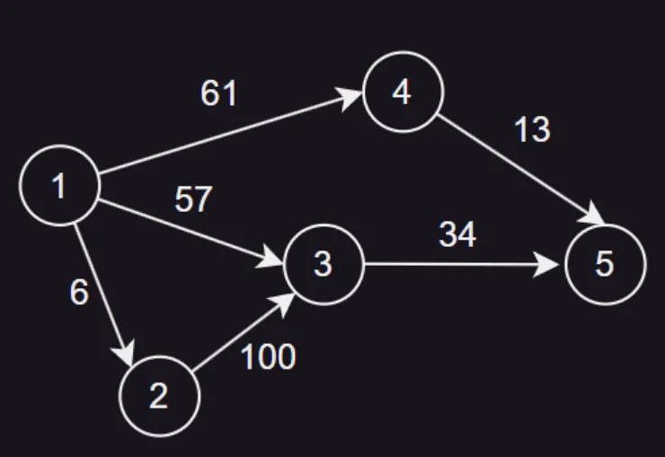
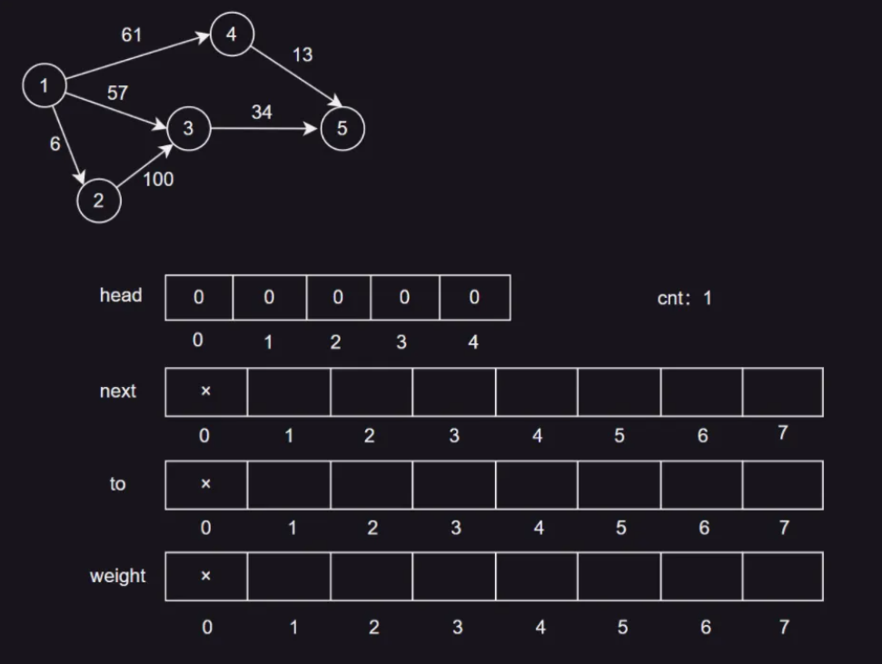
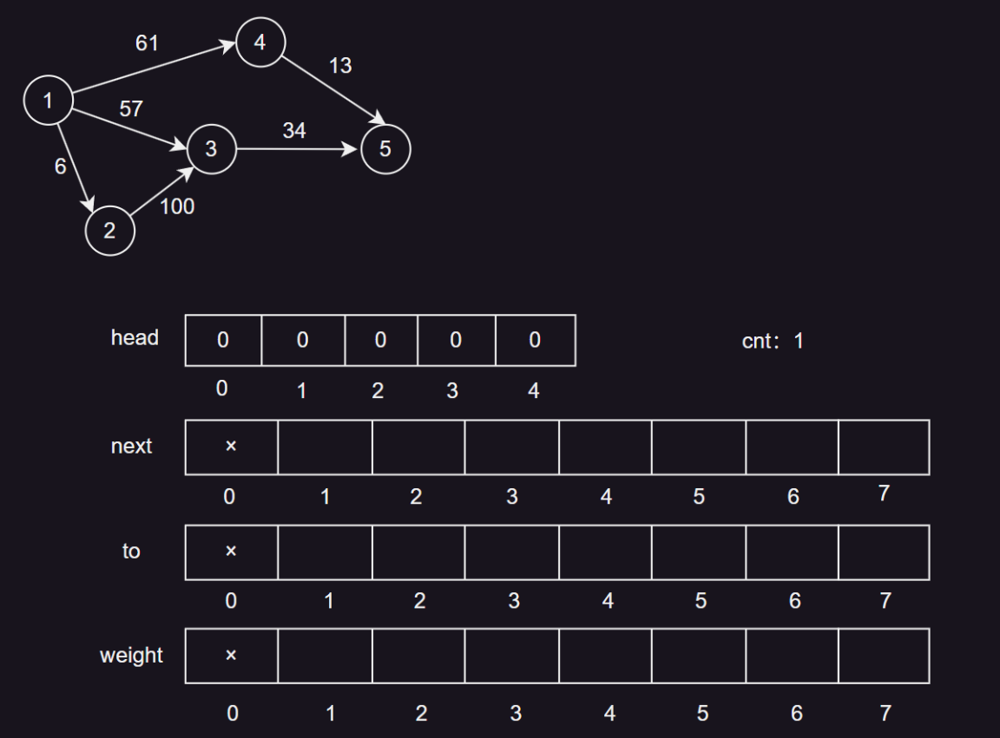
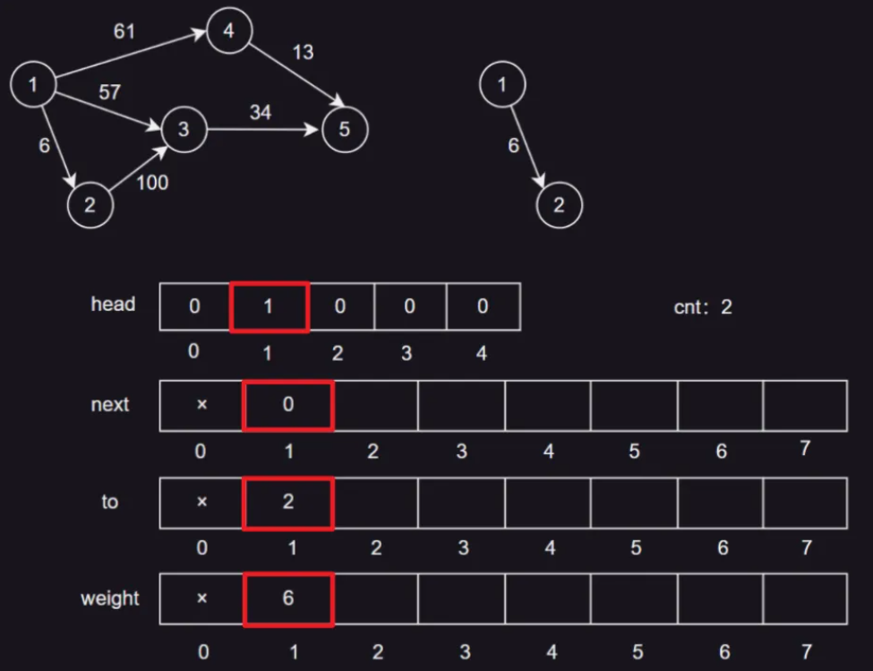
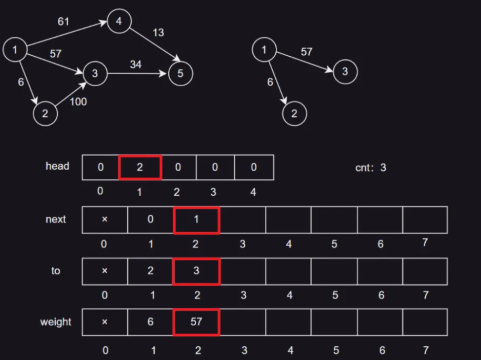
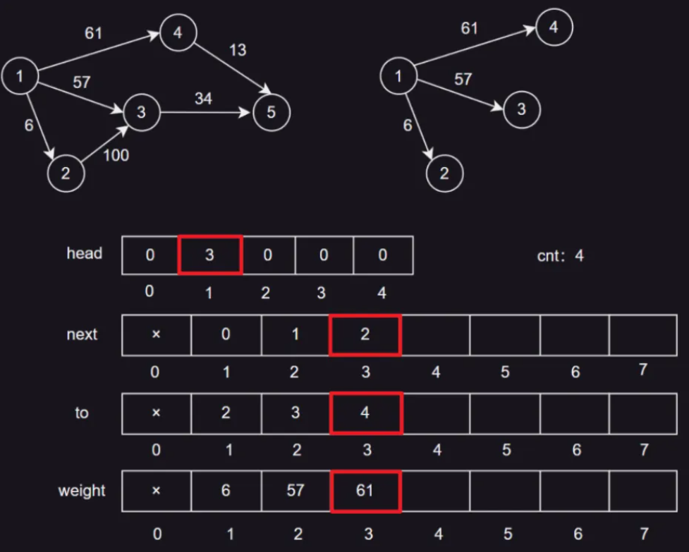
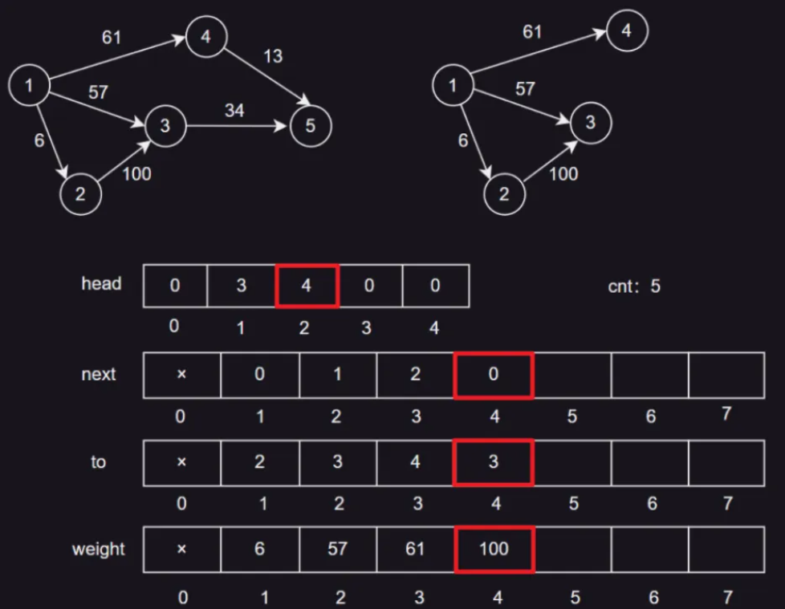
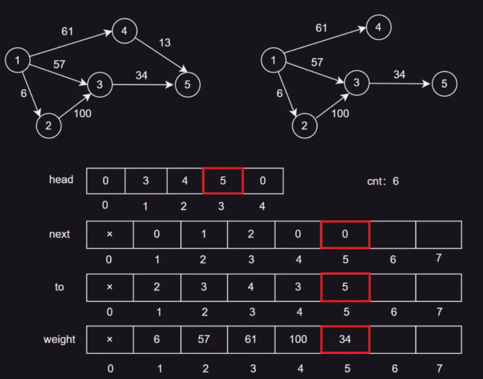
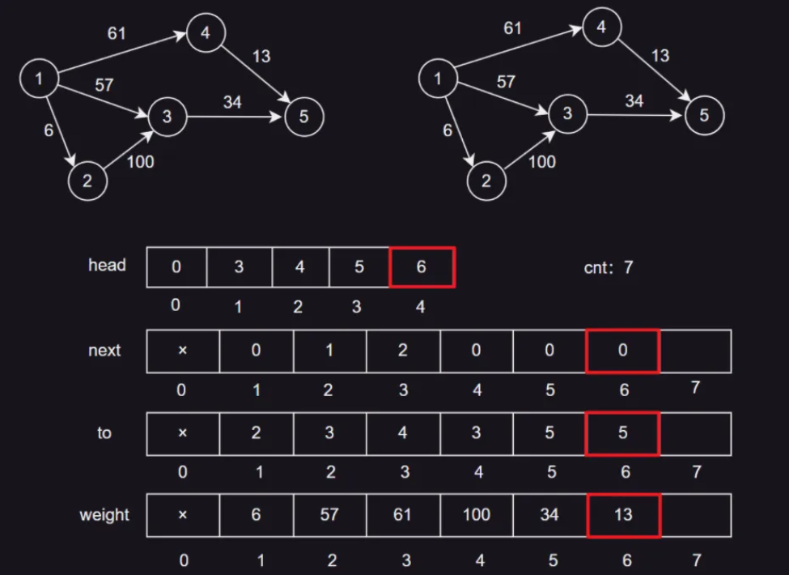

## 一、概述

链式前向星是一种用于**存储图**的数据结构，特别适合于存储稀疏图，它可以有效地存储图的边和节点信息，以及边的权重。

它的主要思想是**将每个节点的所有出边存储在一起，通过数组的方式连接（类似静态数组实现链表）**。这种方法的优点是存储空间小，查询速度快，尤其适合于处理大规模的图数据，**在一些笔试或者竞赛的场景中经常使用**。

下面，我们用这张图来图解一下链式前向星的存储逻辑：




## 二、前置准备

> 注意看这里的设定，以及我**加粗**的提示。

1. `head`数组：`head[i]`存储的是节点`i`的第一条**边的编号**。这样，我们可以通过`head[i]`快速找到从节点`i`出发的所有边。

2. `next`数组：`next[j]`存储的是编号为`j`的边的下一条**边的编号**。这样，我们可以通过`next[j]`快速找到从同一个节点出发的下一条边。

3. `to`数组：`to[j]`存储的是编号为`j`的边的终点**节点编号**。这样，我们可以通过`to[j]`快速找到边`j`的终点，也就是这条边要去往哪里。

4. `weight`数组：`weight[j]`存储的是编号为`j`的**边的权重**。这样，我们可以通过`weight[j]`快速找到边j的权重。

5. `cnt`变量：`cnt`用于存储**边的数量**，也表示**边的编号**。每添加一条边，`cnt`就会增加`1`。这样，我们可以通过`cnt`快速知道当前图中边的数量，同时我们也认为`cnt`是新添加**边的编号**。

## 三、初始化

```java
public static void build(int n) {
	cnt = 1; // 边从1开始编号
	Arrays.fill(head, 1, n + 1, 0); // head[1 ... n] 全设为 0
}
```

在链式前向星中，我们使用`cnt`来作为边的编号，由于边的编号是从1开始的，所以初始化时我们将`cnt`设置为1。同时，将`head`数组的所有元素设置为`0`。因为`head[i]`存储的是节点`i`的第一条边的编号，所以，如果节点`i`没有出度（即没有从节点`i`出发的边），那么`head[i]`就应该为`0`。初始化时所有节点都没有出度，后续在添加边的时候，会更新对应的`head[i]`的值。



## 四、添加边（重点）

在链式前向星中添加边的操作是最核心的，它涉及到`head`、`next`、`to`、`weight`数组的更新，以及边的编号`cnt`的自增。

在看代码之前，我们先回顾一下各个结构的下标以及值的含义：

1. `head`数组：下标`i`表示节点编号，值`head[i]`表示从节点`i`出发的第一条边的编号。

2. `next`数组：下标`j`表示边的编号，值`next[j]`表示编号为`j`的边的下一条边的编号。

3. `to`数组：下标`j`表示边的编号，值`to[j]`表示编号为`j`的边的终点节点编号。

4. `weight`数组：下标`j`表示边的编号，值`weight[j]`表示编号为`j`的边的权重。

结合上述含义，我们来看代码就很清晰了：

```java
// (u, v, w): 有一条边，从u节点指向v节点，权重为w
// 在每一次添加边时，cnt都表示当前未分配的边的编号，添加边后cnt需++
public static void addEdge(int u, int v, int w) {
    next[cnt] = head[u];
    to[cnt] = v;
    weight[cnt] = w;
    head[u] = cnt;
    ++cnt;
}
```

首先，我们需要更新`next`数组。`next[cnt]`存储的是编号为`cnt`的边的下一条边的编号。在添加新边时，我们将新边的`next`置为旧的头边号`head[u]`，这样就可以通过`next[cnt]`快速找到从节点`u`出发的下一条边。

然后，我们需要更新`to`数组，将新边的终点设置为`v`，这样就可以通过`to[cnt]`快速找到边`cnt`的终点。

更新`weight`数组也很自然，就是将新边的权重设置为`w`，最后，我们将节点`u`的头边号修改为当前新边的编号，这样就可以通过`head[u]`快速找到从节点`u`出发的第一条边。

> 备注：记得每添加一条边，边的编号`cnt`就需要增加1

## 五、建图

建图分为有向图与无向图，输入的参数是一个二维数组`edges`作为输入，这个数组的每个元素都是一个长度为3的数组，代表一条边的两个端点和这条边的权重。

```java
// 建有向图
public static void directGraph(int[][] edges) {
	for (int[] edge : edges) {
		addEdge(edge[0], edge[1], edge[2]); // 添加有向边
	}
}

// 建无向图
public static void undirectGraph(int[][] edges) {
	for (int[] edge : edges) {
		addEdge(edge[0], edge[1], edge[2]); // 添加边
		addEdge(edge[1], edge[0], edge[2]); // 添加反向边
	}
}
```


## 六、图解

下面这个数组提供了图的边信息，基本上题目都会给定形式的信息，让你去建图：

```
有一条边(u, v, w)，表示从u节点指向v节点，权重为w
[
	[1, 6, 2],
	[1, 3, 57],
	[1, 4, 61],
	[2, 3, 100],
	[3, 5, 34],
	[4, 5, 13],
]
```

这里 `u,v,w` 的含义以及顺序应根据具体题目具体分析，这里的设定是`(u, v, w)`表示一条边从`u`节点指向`v`节点，权重为`w`。

```java
// 添加边：
public static void addEdge(int u, int v, int w) {
    next[cnt] = head[u];
    to[cnt] = v;
    weight[cnt] = w;
    head[u] = cnt;
    ++cnt;
}
```

下面我们图解一下，在链式前向星中，依次添加6条边到有向图中的逻辑。



> 如果看不懂，建议返回上面去看各个数组的下标以及值的含义。

### 添加边 {1, 6, 2}

- `head[1] = 1`：节点`1`的第一条边的编号是1。
- `next[1] = 0`：边1没有下一条边。
- `to[1] = 2`：边1的终点是节点2。
- `weight[1] = 6`：边1的权重是6。
- `cnt`：2，表示当前边的数量是1，下一条边的编号是2。




### 添加边 {1, 3, 57}

- `head[1] = 2`：节点`1`的第一条边的编号是2。
- `next[2] = 1`：边2的下一条边是边1。
- `to[2] = 3`：边2的终点是节点3。
- `weight[2] = 57`：边2的权重是57。
- `cnt`：3，表示当前边的数量是2，下一条边的编号是3。



### 添加边 {1, 4, 61}

- `head[1] = 3`：节点`1`的第一条边的编号是3。
- `next[3] = 2`：边3的下一条边是边2。
- `to[3] = 4`：边3的终点是节点4。
- `weight[3] = 61`：边3的权重是61。
- `cnt`：4，表示当前边的数量是3，下一条边的编号是4。



### 添加边 {2, 3, 100}

- `head[2] = 4`：节点`2`的第一条边的编号是4。
- `next[4] = 0`：边4没有下一条边。
- `to[4] = 3`：边4的终点是节点3。
- `weight[4] = 100`：边4的权重是100。
- `cnt`：5，表示当前边的数量是4，下一条边的编号是5。





### 添加边 {3, 5, 34}

- `head[3] = 5`：节点`3`的第一条边的编号是5。
- `next[5] = 0`：边5没有下一条边。
- `to[5] = 5`：边5的终点是节点5。
- `weight[5] = 34`：边5的权重是34。
- `cnt`：6，表示当前边的数量是5，下一条边的编号是6。



### 添加边 {4, 5, 13}

- `head[4] = 6`：节点`4`的第一条边的编号是6。
- `next[6] = 0`：边6没有下一条边。
- `to[6] = 5`：边6的终点是节点5。
- `weight[6] = 13`：边6的权重是13。
- `cnt`：7，表示当前边的数量是6，下一条边的编号是7。



## 七、遍历图

遍历图的逻辑也不难理解，就是对于每个节点，遍历其所有的邻居，根据`next`数组不断去拿到和每个节点连接的边的编号，直到没有邻居节点为止，一步步跳着找嘛。

步骤如下：

   - 对于每个节点，通过`head`数组找到该节点的第一条边。
   - 通过`next`数组找到下一条边，直到`next`数组的值为`0`，表示没有更多的边。
   - 在遍历过程中，可以通过`to`和`weight`数组获取边的终点和权重。

我们用打印邻居节点的方式来验证遍历的结果：

```java
public static void traversal(int n) {
	StringBuilder sb = new StringBuilder();
	sb.append("链式前向星遍历，u: (v, w)表示u有一条边前往v，权重为w\n");
	for (int i = 1; i <= n; i++) {
		sb.append("[").append(i).append("]: ");
		for (int ei = head[i]; ei > 0; ei = next[ei]) {
			sb.append("(").append(to[ei]).append(",").append(weight[ei]).append(") "); // 输出边的终点和权重
		}
		sb.append("\n");
	}
	System.out.println(sb.toString()); // 打印结果
}
```

## 八、完整代码

```java
package cn.zhengyiyi;

import java.util.Arrays;

public class Main {

	public static int N = 11;
	public static int M = 21; 
	
	/**
	 * 编号为 i 的节点，其第一条边的编号为 head[i]
	 * 备注：如果 head[i] 为0，说明没有一条边从节点 i 出发
	 */
	public static int[] head = new int[N];
	
	/**
	 * 编号为 i 的边，它的下一条边是 next[i]，
	 */
	public static int[] next = new int[M];
	
	/**
	 * 编号为 i 的边，前往的节点是 to[i]，也就是第 i 条边的终点是 to[i]
	 */
	public static int[] to = new int[M];
	
	/**
	 * 编号为 i 的边，权重是 weight[i]
	 */
	public static int[] weight = new int[M];
	
	/**
	 *  记录边的数量，初始时值为 1
	 */
	public static int cnt;

	// 初始化链式前向星
	public static void build(int n) {
		cnt = 1; // 边从1开始编号
		Arrays.fill(head, 1, n + 1, 0); // head[1 ... n] 全设为 0
	}

	// 添加一条边：(u->v,权重为w)
	public static void addEdge(int u, int v, int w) {
		// 1. 更新next数组，将新边的next置为旧的头边号head[u]，方便后续跳到旧的头边号
		next[cnt] = head[u];
		
		// 2. 更新to数组，设置当前新边的终点为v
		to[cnt] = v; 
		
		// 3. 更新weight数组，设置当前边的权重w
		weight[cnt] = w;
		
		// 4. 更新head数组，将原先的头边号修改为当前新边
		head[u] = cnt;
		
		// 5. 最后边的编号要自增
		++cnt;
	}

	// 建立有向图
	public static void directGraph(int[][] edges) {
		for (int[] edge : edges) {
			addEdge(edge[0], edge[1], edge[2]); // 添加有向边
		}
	}
	
	// 建立无向图
	public static void undirectGraph(int[][] edges) {
		for (int[] edge : edges) {
			addEdge(edge[0], edge[1], edge[2]); // 添加边
			addEdge(edge[1], edge[0], edge[2]); // 无向图需要添加反向边
		}
	}

	// 遍历图
	public static void traversal(int n) {
		StringBuilder sb = new StringBuilder();
		sb.append("链式前向星遍历，u: (v, w)表示u有一条边前往v，权重为w\n");
		for (int i = 1; i <= n; i++) {
			sb.append("[").append(i).append("]: ");
			for (int ei = head[i]; ei > 0; ei = next[ei]) {
				sb.append("(").append(to[ei]).append(",").append(weight[ei]).append(") "); // 输出边的终点和权重
			}
			sb.append("\n");
		}
		System.out.println(sb.toString()); // 打印结果
	}

	public static void main(String[] args) {
	    int n = 5; // 节点数
	    build(n); // 初始化

	    int[][] directEdges = { // 有向图的边
	            { 1, 6, 2 },
	            { 1, 3, 57 },
	            { 1, 4, 61 },
	            { 2, 3, 100 },
	            { 3, 5, 34 },
	            { 4, 5, 13 }
	    };
	    directGraph(directEdges); // 建立有向图
	    traversal(n); // 遍历有向图
	}
}
```


运行结果：

```
链式前向星遍历，u: (v, w)表示u有一条边前往v，权重为w
[1]: (4,61) (3,57) (6,2) 
[2]: (3,100) 
[3]: (5,34) 
[4]: (5,13) 
[5]: 
```