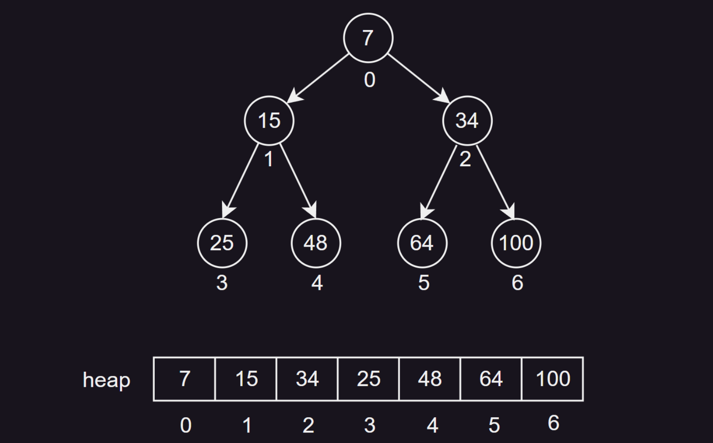

## 1. 前言

### 1.1 什么是堆

堆是一种**特殊的完全二叉树**，它满足任意节点的值都大于等于（或小于等于）其子节点的值。

堆常用于实现优先队列和堆排序等算法。

### 1.2 堆支持的操作

堆是一个完全二叉树，也就是说，除了最后一层，其他层的节点都是满的，并且最后一层的节点尽可能地靠左。

堆支持如下操作：

|     操作      |                   描述                   | 时间复杂度 |
| :-----------: | :--------------------------------------: | :--------: |
|    `build`    |                  建立堆                  |   `O(n)`   |
|    `peek`     |           获取当前堆顶元素的值           |   `O(1)`   |
|   `insert`    |           向堆中插入一个新元素           | `O(log n)` |
|  `heapifyUp`  | 向上调整堆，将新元素提升使其符合堆的性质 | `O(log n)` |
|   `delete`    |               删除堆顶元素               | `O(log n)` |
| `heapifyDown` | 向下调整堆，使删除堆顶元素的堆再次成为堆 | `O(log n)` |

在最大堆中，根节点（堆顶）是所有节点中的最大值；在最小堆中，根节点（堆顶）是所有节点中的最小值。

新元素总是先插入到完全二叉树的最后一位置，然后通过一系列的交换，将其移动到满足堆序性质的位置。

通常删除的是堆顶元素，删除后，将完全二叉树的最后一个元素移动到堆顶，然后通过一系列的交换，将其移动到满足堆序性质的位置。

> 备注：某些堆实现还支持其他的一些操作，如斐波那契堆支持检查一个堆中是否存在某个元素。

### 1.3 堆的分类

堆主要有以下几种分类：

1. **最大堆（大根堆）**：每个节点的值都大于或等于其子节点的值，根节点是最大值。
2. **最小堆（小根堆）**：每个节点的值都小于或等于其子节点的值，根节点是最小值。
3. **反向索引堆**：在堆的基础上增加了反向索引，可以快速找到元素在堆中的位置，主要用于优化堆的删除和修改操作。
4. **二项堆**：是一种特殊的堆，它合并相同大小的二叉树。
5. **斐波那契堆**：是一种优化的堆，在插入和合并操作上比二项堆更高效。
6. **左倾堆（Leftist Heap）**：是一种自我调整的堆，主要用于优先队列。
7. **配对堆（Pairing Heap）**：是一种形式简单，性能出色的堆，主要用于实现优先队列。


### 1.4 PriorityQueue

在Java中，我们可以使用`java.util.PriorityQueue`类来实现堆。`PriorityQueue`是Java标准库中的一个类，它实现了一个优先队列，底层是一个小顶堆。

比如：

1. **创建堆**：我们可以使用`PriorityQueue`的构造函数来创建一个空的堆。

```java
PriorityQueue<Integer> heap = new PriorityQueue<>();
```

2. **插入元素**：我们可以使用`add`方法或者`offer`方法来向堆中插入一个新元素。

```java
heap.add(1);
heap.offer(2);
```

3. **删除元素**：我们可以使用`poll`方法来删除并返回堆顶元素。如果堆为空，`poll`方法会返回`null`。

```java
Integer top = heap.poll();
```

4. **查看堆顶元素**：我们可以使用`peek`方法来获取堆顶元素，但不删除它。如果堆为空，`peek`方法会返回`null`。

```java
Integer top = heap.peek();
```

5. **获取堆的大小**：我们可以使用`size`方法来获取堆的大小。

```java
int size = heap.size();
```

> 备注：`PriorityQueue`默认是一个小顶堆。如果你想实现一个大顶堆，你需要在创建`PriorityQueue`时提供一个自定义的比较器。

## 2. 堆的实现

### 2.1 概述

在Java中，堆可以通过静态数组来实现。堆是一种特殊的树形数据结构，其每个节点都有一个值，通常我们讨论的堆都是二叉堆。在二叉堆中，每个节点的值都必须小于或等于（大于或等于）其子节点的值。这种属性使得堆的最小值（最大值）总是位于根节点。

在Java中，虽然我们会使用 `PriorityQueue`类来实现堆。但是，有时在一些竞赛或者笔试中，我们也会使用静态数组来实现堆。

### 2.2 索引关系（重要）

堆是一种特殊的完全二叉树。在数组中，我们可以将父节点和子节点的关系映射为数组索引的关系，这样就可以方便地在数组中实现堆的操作。

> 这种使用数组实现堆的方式，既简单又高效，时间复杂度为 $O(log n)$ ，空间复杂度为 $O(n)$ 。

在数组中，父节点和子节点的索引关系如下：

- 当父节点的索引为 $i$ 时，其：
  - 左子节点的索引为 $2*i+1$
  - 右子节点的索引为 $2*i+2$
- 当子节点的索引为 $j$ ，其父节点的索引为$(j-1)/2$

通过下图我们也能验证：



比如子节点的索引为 $4$ ，其父节点的索引就是 $(4-1)/2 = 1$。抓住这个核心关系，我们就能实现一个堆，下面我们来看一下代码。


### 2.3 初始化堆

备注：这里我们演示的是小根堆：

```java
class MinHeap {
	// 存储小根堆的数组
    private int[] heap; 

	// 小根堆中元素的个数
    private int size; 
    
    /**
     * 构造一个指定容量的小根堆。
     *
     * @param capacity 小根堆的容量
     */
    public MinHeap(int capacity) {
        heap = new int[capacity];
        size = 0;
    }

    /**
     * 获取当前堆顶元素的值。
     *
     * @return 当前堆顶元素的值
     * @throws NoSuchElementException 如果堆为空
     */
    public int peek() {
        if(size == 0) {
            throw new NoSuchElementException("Heap is empty");
        }
        return heap[0];
    }

    /**
     * 计算指定位置元素的父节点在数组中的索引。
     *
     * @param pos 元素的位置
     * @return 父节点的位置
     */
    private int parent(int pos) {
        return (pos - 1) / 2;
    }

    /**
     * 计算指定位置元素的左子节点在数组中的索引。
     *
     * @param pos 元素的位置
     * @return 左子节点的位置
     */
    private int leftChild(int pos) {
        return 2 * pos + 1;
    }
    
    /**
     * 计算指定位置元素的右子节点在数组中的索引。
     *
     * @param pos 元素的位置
     * @return 右子节点的位置
     */
    private int rightChild(int pos) {
        return 2 * pos + 2;
    }

    /**
     * 交换数组中两个位置的元素。
     *
     * @param first 第一个位置
     * @param second 第二个位置
     */
    private void swap(int first, int second) {
        int temp = heap[first];
        heap[first] = heap[second];
        heap[second] = temp;
    }
	
	// ...
}
```

我们创建一个 `heap` 数组，用于存储小根堆的元素，后续堆中的元素都将存储在这个数组中。变量 `size` 记录着当前堆中元素的个数（初始时，堆为空）。

### 2.4 插入元素

```java
/**
 * 将一个新元素插入小根堆中。
 *
 * @param value 要插入的元素值
 */
public void insert(int value) {
    // 如果小根堆已满，直接返回（也可以动态扩容）
    if(size >= heap.length) {
        return;
    }
    // 将新元素加到数组末尾
    heap[size] = value;
    // 向上调整堆
    heapifyUp(size);
    // 更新 size
    size++;
}

/**
 * 向上调整堆，确保小根堆的性质被维护。
 *
 * @param index 要调整的元素索引
 */
private void heapifyUp(int index) {
    while(index > 0 && heap[index] < heap[parent(index)]) {
        swap(index, parent(index));
        index = parent(index);
    }
}
```

数组的长度和节点有关，当我们向堆中插入一个新元素时，我们首先将新元素添加到数组的末尾，然后进行向上调整（heapify up）。

向上调整的过程是：比较新元素和其父节点的值，如果新元素的值小于父节点的值，那么就交换这两个元素，然后更新当前元素的位置，继续向上调整，直到满足堆的性质。

### 2.5 删除堆顶元素

```java
/**
 * 从小根堆中删除堆顶元素，并返回其值。
 *
 * @return 堆顶元素的值
 */
public int delete() {
    if(size == 0) {
        throw new NoSuchElementException("Heap is empty");
    }
    // 保存堆顶元素的值
    int minValue = heap[0];
    // 将堆尾元素移到堆顶
    heap[0] = heap[size - 1];
    // 减小堆的大小
    size--;
    // 向下调整堆
    heapifyDown(0);
    return minValue;
}

/**
 * 向下调整堆，确保小根堆的性质被维护。
 *
 * @param index 要调整的元素索引
 */
private void heapifyDown(int index) {
    int smallest = index;
    int leftChild = leftChild(index);
    int rightChild = rightChild(index);
    
    // 找到左右子节点中值最小的节点
    if(leftChild < size && heap[leftChild] < heap[smallest]) {
        smallest = leftChild;
    }
    if(rightChild < size && heap[rightChild] < heap[smallest]) {
        smallest = rightChild;
    }
    
    // 如果最小值不是当前节点，则进行交换并递归向下调整
    if(smallest != index) {
        swap(index, smallest);
        heapifyDown(smallest);
    }
}
```


当我们删除堆顶元素时，我们会将堆的最后一个元素移动到堆顶，然后进行向下调整（heapify down）。

向下调整的过程是：比较新的堆顶元素和其子节点的值，如果堆顶元素的值大于其子节点的值，那么就交换这两个元素，然后继续向下调整，直到满足堆的性质。

### 2.6 其他方法

```java
/**
 * 判断指定值是否是小根堆的根节点。
 *
 * @param value 待判断的值
 * @return 如果是根节点返回true，否则返回false
 */
public boolean isRoot(int value) {
    return heap[0] == value;
}


/**
 * 判断两个值在小根堆中是否是兄弟节点。
 *
 * @param x 第一个值
 * @param y 第二个值
 * @return 如果是兄弟节点返回true，否则返回false
 */
public boolean areSiblings(int x, int y) {
	// 首先找到两个值在小根堆中的位置（下标）
    int xIndex = -1, yIndex = -1;
    for (int i = 0; i < size; i++) {
        if (heap[i] == x) {
            xIndex = i;
        }
        if (heap[i] == y) {
            yIndex = i;
        }
    }
    // 看父节点是否一样就行
    return xIndex != -1 && yIndex != -1 && parent(xIndex) == parent(yIndex);
}

/**
 * 判断一个值是否是另一个值的父节点。
 *
 * @param parent 父节点的值
 * @param child 子节点的值
 * @return 如果是父节点返回true，否则返回false
 */
public boolean isParentOf(int parent, int child) {
	// 同样，找到两个值在小根堆中的位置，然后再判断
    int parentIndex = -1, childIndex = -1;
    for (int i = 0; i < size; i++) {
        if (heap[i] == parent) {
            parentIndex = i;
        }
        if (heap[i] == child) {
            childIndex = i;
        }
    }
    return parentIndex != -1 && childIndex != -1 && parentIndex == parent(childIndex);
}

/**
 * 判断一个值是否是另一个值的子节点。
 *
 * @param child 子节点的值
 * @param parent 父节点的值
 * @return 如果是子节点返回true，否则返回false
 */
public boolean isChildOf(int child, int parent) {
    return isParentOf(parent, child);
}
```


## 3. 反向索引堆

反向索引堆，实际上和普通的小根堆类似，只不过添加了一个索引数组`where`，用于记录每个堆元素在堆中的位置，也不难理解。

### 3.1 背景与含义

反向索引堆的主要动机是优化堆的删除和修改操作。通过增加反向索引，我们可以在`O(1)`的时间内找到元素在堆中的位置，大大提高了效率。

简单来说，反向索引堆是一种特殊的堆，它在堆的基础上增加了一个反向索引表（`where`），这个索引表，用于记录每个堆元素在堆（`heap`）中的位置。这样，当需要更新或删除堆中的某个元素时，可以直接通过这个索引表找到元素的位置，并进行相应的操作，从而提高了操作的效率。

### 3.2 用途

反向索引堆的主要用途是实现优先队列。优先队列是一种特殊的队列，每次出队的是优先级最高（或最低）的元素。在很多应用中，我们需要动态地修改队列中元素的优先级，这时候反向索引堆就派上了用场。

比如，在求解单源最短路径问题时，我们常用Dijkstra算法来求解，这个算法中需要我们维护一个优先队列，队列中的每个元素代表一个节点，元素的优先级是从源节点到该节点的距离。

在算法的执行过程中，我们需要不断地从优先队列中取出距离最短的节点，然后更新其邻居节点的距离。这个更新操作就需要修改优先队列中元素的优先级，如果我们使用普通的堆来实现优先队列，那么这个操作的时间复杂度是O(n)的。

然而，如果我们使用反向索引堆来实现优先队列，那么我们可以在O(1)的时间内找到元素在堆中的位置，然后在O(log n)的时间内更新元素的优先级，大大提高了算法的效率。

### 3.3 实现思路

反向索引堆的实现主要包括两部分：堆的实现和反向索引的实现。

堆的实现和传统的堆基本相同，我们需要实现插入、删除、上浮和下沉等操作。

反向索引的实现则需要我们维护一个额外的数组，这个数组的索引是元素的值，数组的值是元素在堆中的位置。每次我们插入、删除或修改堆中的元素时，我们都需要更新这个反向索引数组。

这样，当我们需要找到一个元素在堆中的位置时，我们只需要查找这个反向索引数组即可。

### 3.4 参考代码（Java版）

这里实现的是小根堆：

```java
import java.util.Arrays;

public class Main {
    // 主函数
    public static void main(String[] args) {
        n = 5;
        arr = new int[]{0, 5, 4, 3, 2, 1};
        buildHeap();
        for (int i = 1; i <= n; i++) {
            insert(i);
        }
        while (!isEmpty()) {
            System.out.print(peek() + " ");
            delete();
        }
    }
    
    // 堆的最大容量
    public static int MAXN = 1001;
    
    // 堆的实际大小
    public static int n;
    
    // 堆的元素数组
    public static int[] arr = new int[MAXN];
    
    // 反向索引堆
    public static int[] heap = new int[MAXN];

    // where数组，用于记录节点在堆中的位置
    // -1表示节点未进堆、-2表示节点已经出过堆了，其余表示节点位于堆上的i位置
    public static int[] where = new int[MAXN];

    // 堆的当前大小
    public static int heapSize;
    
    // 构建堆的函数
    public static void buildHeap() {
        heapSize = 0;
        Arrays.fill(where, 1, n + 1, -1);
    }
    
    // 向堆中插入一个新元素
    public static void insert(int val) {
        heap[heapSize++] = val;
        heapifyUp(heapSize - 1);
    }
    
    // 使新元素上浮，使其符合堆的性质（向上调整）
    public static void heapifyUp(int index) {
        while (index > 0 && arr[heap[index]] < arr[heap[(index - 1) / 2]]) {
            swap(index, (index - 1) / 2);
            index = (index - 1) / 2;
        }
    }
    
	// 弹出堆顶元素的函数
    public static int delete() {
        int top = peek();
        swap(0, --heapSize);
        heapifyDown(0);
        where[top] = -2;
        return top;
    }

	// 使删除堆顶元素的堆再次成为堆（向下调整）
	public static void heapifyDown(int index) {
	    int top = index; 
	    int left = 2 * index + 1;
	    while (left < heapSize) {
	        int best = left + 1 < heapSize && arr[heap[left + 1]] < arr[heap[left]] ? left + 1 : left;
	        best = arr[heap[top]] < arr[heap[best]] ? top : best;
	        if (best == top) {
	            break;
	        }
	        swap(best, top);
	        top = best;
	        left = 2 * top + 1;
	    }
	}

    // 获取当前堆顶元素的值
    public static int peek() {
        if (isEmpty()) {
            throw new IllegalStateException("Heap is empty");
        }
        return arr[heap[0]];
    }

    // 判断堆是否为空的函数
    public static boolean isEmpty() {
        return heapSize == 0;
    }

    // 交换堆中两个元素的函数
    public static void swap(int i, int j) {
        int tmp = heap[i];
        heap[i] = heap[j];
        heap[j] = tmp;
        where[heap[i]] = i;
        where[heap[j]] = j;
    }
}
```

### 3.5 where数组

现在，我们来看看和普通堆不同的是，方向索引堆添加了哪些内容？

`where`数组被用于记录每个元素在堆中的位置。

1. 在`buildHeap`函数中，`where`数组被初始化，所有元素的位置被设置为-1，表示节点未进堆。

```java
// 构建堆的函数
public static void buildHeap() {
    heapSize = 0;
    Arrays.fill(where, 1, n + 1, -1);
}
```

2. 在`swap`函数中，每当堆中的两个元素位置发生交换时，`where`数组也会相应地更新。

```java
// 交换堆中两个元素的函数
public static void swap(int i, int j) {
    int tmp = heap[i];
    heap[i] = heap[j];
    heap[j] = tmp;
    where[heap[i]] = i;
    where[heap[j]] = j;
}
```

3. 在`delete`函数中，当堆顶元素被弹出时，`where`数组中对应的位置被设置为-2，表示节点已经出过堆了。

```java
// 弹出堆顶元素的函数
public static int delete() {
    int top = peek();
    swap(0, --heapSize);
    heapifyDown(0);
    where[top] = -2;
    return top;
}
```

可以看到，我们只需在这三个地方添加`where`的相关操作，就可以实现在 $O(1)$ 的时间复杂度内找到任意一个元素在堆中的位置，从而实现了高效的堆操作，这就是反向索引堆。