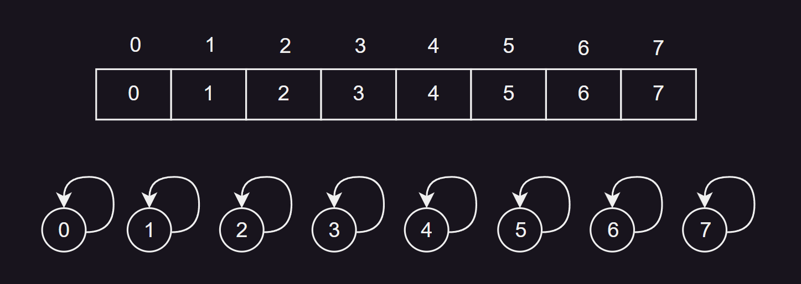

## 概述


并查集（Disjoint Set Union，简称并查集），也叫不相交集合（一系列没有重复元素的集合），是一种用于处理集合的数据结构。

并查集主要专注于两个核心操作：

1. **查找（Find）**： 

  - 查找操作可用于确定一个元素属于哪个子集。
  - 通常返回一个代表该子集的元素，称为代表元素（或者说根元素）。

2. **合并（Union）**：

  -  合并操作用于将两个子集合并成一个。
  -  将两个元素连接到一起，那么这两个元素所在的集合就合并为一个集合，此时的操作是先找到这两个元素的代表元素，再将某个子集的代表元素连接到另一个子集的代表元素上。

## 引入

并查集是为了有效地解决集合合并和查询问题而设计的数据结构。

我们来看这样一个问题，假设现在有`n`个村庄，有些村庄之间有连接的路，有些村庄之间并没有连接的路：


现在需要设计这样一个数据结构，能够快速执行两个操作：

- 查询2个村庄之间是否有连接的路
- 连接两个村庄

此时，我们就可以利用并查集来解决这个问题，两个核心操作如下：

1. **查询操作：** 使用并查集的Find操作，可以迅速确定两个村庄是否属于同一个集合，即它们之间是否有连接的路。如果两个村庄具有相同的代表元素，它们在同一个集合中，表示它们之间有连接的路；如果代表元素不同，则表示它们之间没有连接。

2. **合并操作：** 使用并查集的Union操作，可以将两个村庄所在的集合合并为一个集合，表示它们之间建立了连接的路。通过将一个集合的代表元素链接到另一个集合的代表元素上实现。

> 在这里，每个村庄对应一个并查集的节点，最初每个节点自成一个集合。如果采用数组、链表、平衡二叉树或者集合(Set)来实现，查询和连接的复杂度都是`O(n)`，使用并查集的复杂度是`O(logn)`，可以优化至`O(α(𝑛))（α(𝑛)<5）`。

# 并查集的实现

## 存储方式

我们这里假设并查集处理的数据都是整型，因此用整型数组来存储数据。

> 并差集是用数组实现的树形结构。

在实际编码时，我们通常会用`parents` 数组来表示每个元素的父节点。

`parents`数组中存的数字就代表所属的集合。比如`parents[3]==1`代表元素`3`属于根节点为`1`的集合，如果`parents[9]==1`，那么元素`9`和元素`3`就属于同一集合。


数组的`parents[i]`表示元素`i`在并查集中的父节点为`parents[i]`。

比如上图中，`parents[2] = 4`，表示元素 `2` 的父节点是 `4`。通过不断追溯父节点，就可以找到整个集合的代表元素，比如元素`2`所在的集合，代表元素是`1`。`parents[7] = 7` 表示元素 7 在并查集中的父节点是它自己，也就是说元素 7 是该集合的代表元素（根节点）。

> 数组中的每个元素对应于并查集中的一个元素，其值表示该元素的父节点。随着进行合并操作，两个集合（树）可能会被合并成一个。在这种情况下，其中一个集合的代表元素的父节点会指向另一个集合的代表元素，从而将两个集合合并在一起。

在初始化时，通常每个元素都是其自身的父节点，即 `parents[i] = i`。这样，每个元素都构成一个独立的集合，且该集合的代表元素就是自己。



## Union-Find抽象基类

下面是一个简单的并查集（Union-Find）抽象基类：

```java
/**
 * Union-Find（并查集）的抽象基类。
 */
public abstract class UF {
	
    protected int[] parents; // 存储每个元素的父节点

    /**
     * 构造函数，初始化并查集，每个元素独立成集合。
     *
     * @param capacity 初始化的容量，必须大于等于1。
     * @throws IllegalArgumentException 如果容量小于1，抛出非法参数异常。
     */
    public UF(int capacity) {
        if (capacity < 1) {
            throw new IllegalArgumentException("容量必须大于等于1");
        }

        parents = new int[capacity];

        // 初始化每个元素的父节点为自身
        for (int i = 0; i < parents.length; i++) {
            parents[i] = i;
        }
    }

    /**
     * 查找元素所属的集合的根节点。
     *
     * @param v 要查找的元素。
     * @return 元素所属集合的根节点。
     */
    public abstract int find(int v);

    /**
     * 将两个元素所在的集合合并。
     * 实现方式可以将一个集合的根节点作为另一个集合的子节点。
     *
     * @param v1 要合并的第一个元素。
     * @param v2 要合并的第二个元素。
     */
    public abstract void union(int v1, int v2);

    /**
     * 检查两个元素是否属于同一个集合。
     *
     * @param v1 第一个元素。
     * @param v2 第二个元素。
     * @return 如果两个元素属于同一个集合，返回true；否则返回false。
     */
    public boolean isSame(int v1, int v2) {
        return find(v1) == find(v2);
    }

    /**
     * 检查元素的值是否合理。
     *
     * @param v 要检查的元素
     * @throws IllegalArgumentException 如果元素越界，抛出非法参数异常。
     */
    protected void rangeCheck(int v) {
        if (v < 0 || v >= parents.length)
            throw new IllegalArgumentException("不存在该元素");
    }
}
```

1. **成员变量：**
   - `protected int[] parents`: 存储每个元素的父节点，并且维护元素之间的连接关系。

2. **构造函数：**
   - `public UF(int capacity)`: 构造函数用于初始化并查集。接收一个参数 `capacity`，表示初始化的容量。在构造函数中，首先检查容量是否合法，然后创建 `parents` 数组，并将每个元素的父节点初始化为自身。

3. **抽象方法：**
   - `public abstract int find(int v)`: 抽象方法，用于查找元素所属的集合的根节点。具体的实现由子类提供。
   - `public abstract void union(int v1, int v2)`: 抽象方法，用于将两个元素所在的集合合并。具体的实现方式由子类提供。

4. **其他方法：**
   - `public boolean isSame(int v1, int v2)`: 检查两个元素是否属于同一个集合，调用 `find` 方法并比较它们的根节点。
   - `protected void rangeCheck(int v)`: 检查元素的值是否合理，用于防止数组越界。

该抽象基类提供了并查集的基本结构和操作，子类可以根据具体的实现方式来实现抽象方法。下面我们根据不同的实现思路，来重写基类的`find()`方法以及`union()`方法。

## 两种实现思路

并查集有两种实现思路，分别是`Quick Find`和`Quick Union`：

1. **Quick Find:**

   - 查找（Find）的时间复杂度：`O(1)`。由于每个集合都只有一个代表元素，直接返回元素的父节点即可。
   - 合并（Union）的时间复杂度：`O(n)`。当进行合并操作时，需要遍历所有元素，将属于同一个集合的元素的代表元素设为相同。

   Quick Find在查找上有较好的性能，但在合并操作上的复杂度较高，特别是在有大量元素的情况下。

2. **Quick Union:**

   - 查找（Find）的时间复杂度：`O(logn)`，可以优化至` O(𝛼(𝑛))`，其中 `𝛼(𝑛)` 是 `Ackermann` 函数的反函数，增长极慢，通常小于 `5`。
   - 合并（Union）的时间复杂度：`O(logn)`，同样可以优化至 `O(𝛼(𝑛))`。

   Quick Union在合并操作上有较好的性能，通过树结构的形式进行合并。但是在最坏情况下，树可能变得很深，导致查找和合并的时间复杂度变高（后续通过路径压缩等策略可以提高并查集的性能）。

在实际应用中，一般使用`Quick Union`较多。

## 基本实现

### 基于Quick Find思路

我们知道，在并查集中，每个元素都有一个父节点，初始时每个元素的父节点是它自己。

进行 `union(v1, v2)` 操作时，意思是连接 `v1` 和 `v2`，当两个元素连接到一起时，这两个元素的集合就相当于合并到一起了。

在实际编码时，基于 Quick Find （快速查找）思路，我们会将`v1`所在集合的所有元素的父节点都设为`v2`集合的父节点，以实现两个集合的合并。这样我们会发现，基于Quick Find思路实现的并查集，树的高度不会超过`2`。

我们来举个例子：

1. 初始化一个容量为5的并查集：初始时每个元素的父节点是它自己。

   ```plaintext
   parents = [0, 1, 2, 3, 4]
   ```

2. 执行 `union(1, 0)`：

   将元素 1 所在集合的所有元素的父节点设为元素 0 所在集合的代表元素。

   ```plaintext
   parents = [0, 0, 2, 3, 4]
   ```

3. 执行 `union(1, 2)`：

   将元素 1 所在集合的所有元素的父节点设为元素 2 所在集合的代表元素。

   ```plaintext
   parents = [2, 2, 2, 3, 4]
   ```

4. 执行 `union(3, 4)`：

   将元素 3 所在集合的所有元素的父节点设为元素 4 所在集合的代表元素。

   ```plaintext
   parents = [2, 2, 2, 4, 4]
   ```

5. 执行 `union(3, 0)`：

   将元素 3 所在集合的所有元素的父节点设为元素 0 所在集合的代表元素。

   ```plaintext
   parents = [2, 2, 2, 2, 2]
   ```

示意图如下：


我们发现，此时查找元素所在集合（`find(int v)`）会非常方便，直接返回`parents[v]`即可，复杂度为`O(1)`。

编码如下：

```java
/**
 * 基于Quick Find（快速查找）思路实现的并查集。
 * 在该实现中，每个集合用 parents[v] 表示，所有属于同一个集合的元素都具有相同父节点
 */
public class UnionFind1_QF extends UF {

    public UnionFind1_QF(int capacity) {
        super(capacity);
    }

    @Override
    public int find(int v) {
        rangeCheck(v);
        // 查找操作非常简单，直接返回元素对应位置的父节点即可
        return parents[v];  
    } 

    @Override
    public void union(int v1, int v2) {
        int p1 = find(v1);
        int p2 = find(v2);
        if (p1 == p2)
            return; // 如果两个元素在同一集合，则无需合并

        // 否则遍历整个数组，将两个集合的元素的父节点设为相同的值，从而合并两个集合
        for (int i = 0; i < parents.length; i++) {
            if (parents[i] == p1) {
                parents[i] = p2;
            }
        }
    }
}
```

### 基于 Quick Union 思路

前一种实现中，我们发现每个集合都可以用 `parents[v]` 表示，也就说，所有属于同一集合的元素都具有相同父节点。这种实现对于`find(v)`的复杂度是`O(1)`，`union(v1, v2)`的复杂度是`O(n)`（因为需要遍历整个数组）。对于这种实现的`union()`操作，合并成本过高。

因此，在 `Quick Union` （快速合并）思路下实现的并查集，它的`union(v1, v2)`思路是，**让`v1`的根节点指向`v2`的根节点**。乍一听可能跟Quick Find思路差不多，实际完全不同。

在 `Quick Union` 实现中，每个集合的元素构成了一个树结构，其中树的根节点表示集合的代表元素。通过 `union(v1, v2)` 操作，将元素 `v1` 所在集合的根节点指向元素 `v2` 所在集合的根节点，从而实现两个集合的合并。这与 `Quick Find` 的思路有所不同。

```java
public void union(int v1, int v2) {
    int p1 = find(v1);
    int p2 = find(v2);
    if(p1 == p2) return;

    // 将第一个集合的根节点指向第二个集合的根节点
    parents[p1] = p2;	
}
```

这里首先通过 `find()` 方法找到元素 `v1` 和 `v2` 所在集合的根节点 `p1` 和 `p2`，然后判断这两个根节点是否相同。如果相同，说明两个元素已经属于同一个集合，无需再合并；如果不同，则将第一个集合的根节点指向第二个集合的根节点，实现了两个集合的合并。

那么`find`操作该如何实现？

```java
public int find(int v) {
    rangeCheck(v);

    // 通过parent链条不断向上寻找根节点，找到元素所在集合的标识
    while (v != parents[v]) {	
        v = parents[v];
    }
    return v;
}
```

没错，在 `find` 操作中，通过不断追溯树的父节点，直到找到树的根节点（它本身）。从而确定元素所属集合的代表元素。

因此，基于 `Quick Union` 思路实现的并查集，`find` 的复杂度是 `O(logn)`，而 `union` 的复杂度也是 `O(logn)`。

我们来看一下示意图：


代码如下：

```java
/**
 * Quick Union（快速合并）实现的并查集。
 * 在该实现中，每个集合用一棵树表示，树的根节点表示该集合的标识。
 */
public class UnionFind2_QU extends UF {

	public UnionFind2_QU(int capacity) {
		super(capacity);
	}

	@Override
	public int find(int v) {
		rangeCheck(v);
		
		while (v != parents[v]) {	// 通过parent链条不断向上寻找根节点，找到元素所在集合的标识
			v = parents[v];
		}
		return v;
	}

	@Override
	public void union(int v1, int v2) {
		int p1 = find(v1);
		int p2 = find(v2);
		if(p1 == p2) return;
		
		parents[p1] = p2;	// 将第一个集合的根节点指向第二个集合的根节点
	}
}
```

## 优化

> 备注：这里提到的优化，都是对基于 Quick Union 实现的并查集进行优化。

在实现并查集时，树的深度可能较大。在`Union`的过程中，可能会出现树不平衡的情况，甚至退化成链表，影响了 `find` 操作的性能。


有 2 种常见的优化方案：

- 基于 `size` 的优化：元素少的树 嫁接到 元素多的树
- 基于 `rank` 的优化：矮的树 嫁接到 高的树

> 注意，这两种方案并不一样，因为元素少的树不一定矮，同理，元素多的树不一定高。

### 基于 size 的优化


```java
/**
 * Quick Union（快速合并）实现的并查集
 * 【优化】：基于size的优化
 */
public class UnionFind3_QU_S extends UnionFind2_QU {
	
	int[] sizes;	// size[i]表示以i为根节点的树有size[i]个元素

	public UnionFind3_QU_S(int capacity) {
		super(capacity);
		
		sizes = new int[capacity];
		for (int i = 0; i < capacity; i++) {
			sizes[i] = 1;
		}
	}

	/**
	 * 合并两个集合，并基于size进行优化
	 */
	@Override
	public void union(int v1, int v2) {
		int p1 = find(v1);
		int p2 = find(v2);
		if(p1 == p2) return;
		
		// 将元素数量较少的集合合并到元素数量较多的集合中，以减小树的深度
		if(sizes[p1] < sizes[p2]) {
			parents[p1] = p2;
			sizes[p2] += sizes[p1];
		} else {
			parents[p2] = p1;
			sizes[p1] += sizes[p2];
		}
	}
}
```


### 基于 rank 的优化

基于`size`的优化，也可能会存在树不平衡的问题：


因此可以基于 `rank` 进行优化，`rank`是指树的高度（或者说深度），在合并时考虑树的高度，将较矮的树合并到较高的树上，以避免树的高度过深，降低操作的复杂度。

示意图如下：


```java
package com.zyy.union;

/**
 * Quick Union（快速合并）实现的并查集
 * 【优化】：基于rank的优化
 */
public class UnionFind4_QU_R extends UnionFind2_QU {
	
	private int[] ranks;  // 记录树的高度

	public UnionFind4_QU_R(int capacity) {
		super(capacity);

		ranks = new int[capacity];
		for (int i = 0; i < capacity; i++) {
			ranks[i] = 1; // 初始时，每个树的高度都是 1
		}
	}
	
	public void union(int v1, int v2) {
		int p1 = find(v1);
		int p2 = find(v2);
		if (p1 == p2) return;
		
    // 将较矮的树合并到较高的树上
		if (ranks[p1] < ranks[p2]) {
			parents[p1] = p2; 
		} else if (ranks[p1] > ranks[p2]) {
			parents[p2] = p1;
		} else {
      // 如果两棵树高度相同，将其中一棵树合并到另一棵树上，合并后高度加一
			parents[p1] = p2;
			ranks[p2] += 1; 
		}
	}
}
```

## find优化

即使在使用基于 `rank` 的优化后，树的高度相对较小，但是随着 `Union` 操作次数的增多，树的高度依然会越来越高，这将导致 `find` 操作的性能下降。尤其是底层节点，由于路径变得更长，`find` 操作会变得更慢。

为了进一步优化 `find` 操作，我们可以考虑使用路径压缩来优化`find()`操作。


### 路径压缩

路径压缩（Path Compression）是在执行 `find` 操作时的一种优化策略，旨在降低并查集中树的高度，从而提高 `find` 操作的效率。

路径压缩的思想是在 `find` 操作中，将路径上的所有节点直接连接到根节点，从而降低树的深度。这种方式可以使得树的高度更加平衡，减小了树的深度，到后面，树的形状有点类似之前基于 `Quick Find` 实现的并查集。

代码实现：

```java
public int find(int v) {
    rangeCheck(v);

    if (v != parents[v]) {
        parents[v] = find(parents[v]); // 递归进行路径压缩，将路径上的每个节点都指向根节点
    }
    return parents[v];
}
```

在这个实现中，如果当前节点不是根节点，就递归调用 `find` 方法，然后将当前节点直接指向根节点。这样，即使树的高度较大，经过路径压缩后，后续的 `find` 操作就能较为迅速地找到根节点。

示意图如下：


但是，路径压缩使得路径上的所有节点都指向根节点，这样的实现成本过高。

因此还有`2`种更优的做法，不仅可以降低树的高度，实现成本还比路径压缩低：

- 路径分裂（Path Spliting）
- 路径减半（Path Halving）

### 路径分裂

路径分裂：使路径上的每个节点都指向其祖父节点（也就是parent的parent）。

```java
public int find(int v) { 
    rangeCheck(v);
    while (v != parents[v]) {
        // 先将父节点保存起来
        int parent = parents[v];
        // 路径分裂，使路径上的每个节点都指向其祖父节点
        parents[v] = parents[parent];
        // 继续向上追溯
        v = parent; 
    }
    return v;
}
```

示意图：


### 路径减半


路径减半：使路径上每隔一个节点就指向其祖父节点。

```java
public int find(int v) { 
    rangeCheck(v);
    while (v != parents[v]) {
        // 将当前节点指向其祖父节点
        parents[v] = parents[parents[v]];
        // 继续向上追溯（注意，此时的父节点就已经更改为先前的祖父节点）
        v = parents[v]; 
    }
    return v;
}
```

示意图：


# 整合与应用

在实际应用中，我们可以根据`Quick Union`思路编写并查集类，并且基于`rank`优化`union`操作，利用路径减半策略进行`find()`操作的优化。

> 并查集不适合有向图，它仅适合于无向图。比如求解连通分量的个数，并且不要求给出具体的连通信息，就可以使用并查集来解决。

灵活运用并查集可以方便地处理许多与连通性有关的图论问题。

