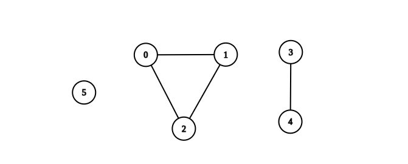
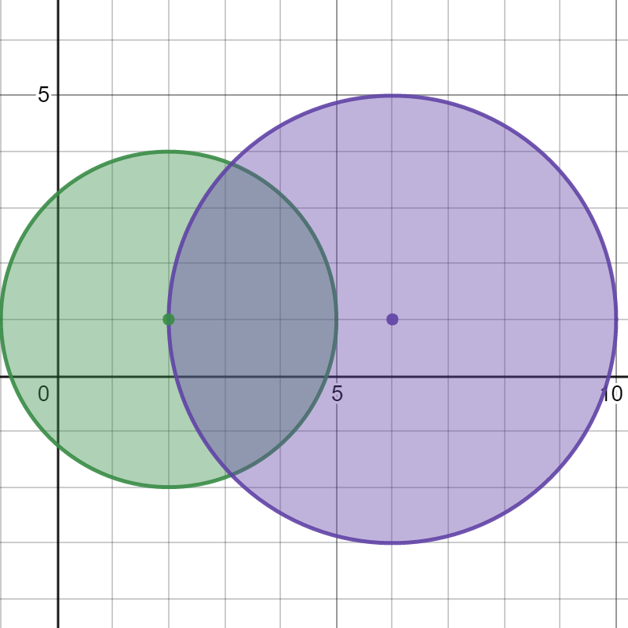
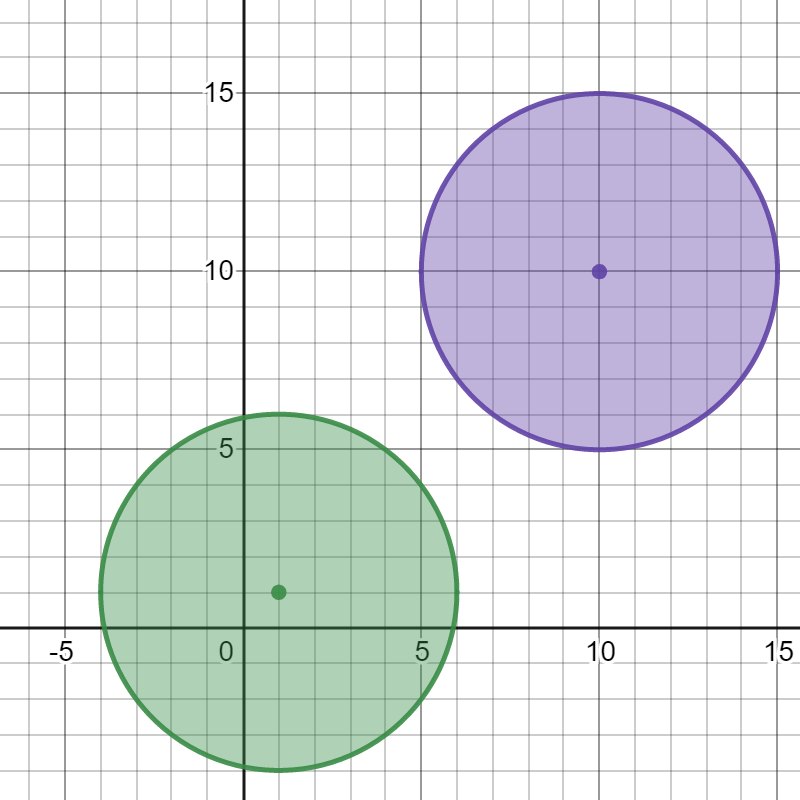
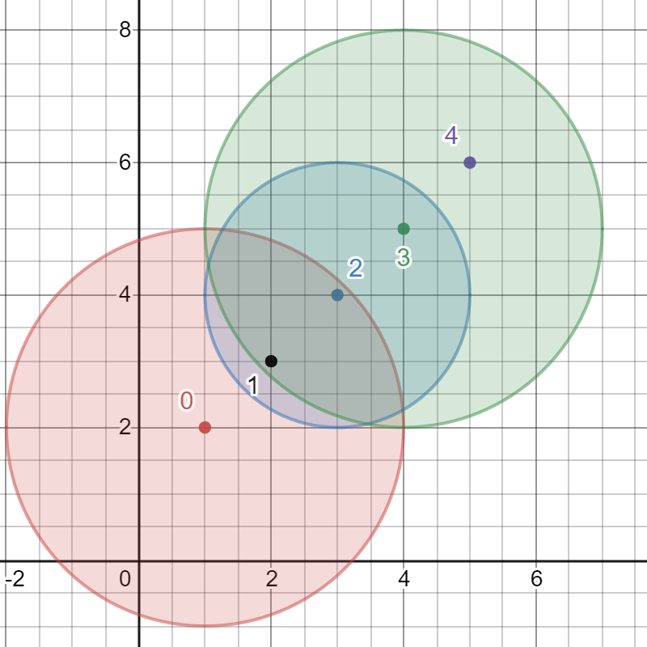

## DFS

深度优先搜索（DFS）是一种用于遍历或搜索树或图的算法。

该算法会尽可能深地搜索树的分支。当节点 $v$ 的所在边都已被探寻过，搜索将回溯到发现节点 $v$ 的那条边的起始节点。这一过程一直进行到已发现从源节点可达的所有节点为止。如果还存在未被发现的节点，则选择其中一个作为源节点并重复以上过程，整个进程反复进行直到所有节点都被访问为止。

一般用递归实现（或者使用栈）。

## [省份数量](https://leetcode.cn/problems/number-of-provinces/)

有 `n` 个城市，其中一些彼此相连，另一些没有相连。如果城市 `a` 与城市 `b` 直接相连，且城市 `b` 与城市 `c` 直接相连，那么城市 `a` 与城市 `c` 间接相连。

**省份** 是一组直接或间接相连的城市，组内不含其他没有相连的城市。

给你一个 `n x n` 的矩阵 `isConnected` ，其中 `isConnected[i][j] = 1` 表示第 `i` 个城市和第 `j` 个城市直接相连，而 `isConnected[i][j] = 0` 表示二者不直接相连。

返回矩阵中 **省份** 的数量。

**示例 1：**


```
输入：isConnected = [[1,1,0],[1,1,0],[0,0,1]]
输出：2
```

**示例 2：**


```
输入：isConnected = [[1,0,0],[0,1,0],[0,0,1]]
输出：3
```

**思路**：

遍历所有城市，对于每个**尚未被访问过的城市**，从它开始进行深度优先搜索，通过 `isConnected` 矩阵找出与它直接相连的所有城市，这些城市都属于同一个连通分量，即一个省份。然后对这些城市继续DFS（递归下去），直到同一个连通分量的所有城市都被访问到。

重复这个过程，直到所有城市都被访问过，最后连通分量的数量就是省份的数量。

```java
public int findCircleNum(int[][] isConnected) {
    int n = isConnected.length;
    boolean[] vis = new boolean[n];
    int ans = 0;
    for (int i = 0; i < n; i++) {
        if (!vis[i]) {
            dfs(isConnected, n, i, vis);
            ans++;
        }
    }
    return ans;
}

public void dfs(int[][] g, int n, int cur, boolean[] vis) {
    // 遍历所有城市
    for(int next = 0; next < n; next++) {
        // 如果当前城市与某个城市next相连，并且next未被访问过，则标记已访问，并递归下去
        if(g[cur][next] == 1 && !vis[next]) {
            vis[next] = true;
            dfs(g, n, next, vis);
        }
    }
}
```

## [寻找图中是否存在路径](https://leetcode.cn/problems/find-if-path-exists-in-graph/)

有一个具有 `n` 个顶点的 **双向** 图，其中每个顶点标记从 `0` 到 `n - 1`（包含 `0` 和 `n - 1`）。图中的边用一个二维整数数组 `edges` 表示，其中 `edges[i] = [ui, vi]` 表示顶点 `ui` 和顶点 `vi` 之间的双向边。 每个顶点对由 **最多一条** 边连接，并且没有顶点存在与自身相连的边。

请你确定是否存在从顶点 `source` 开始，到顶点 `destination` 结束的 **有效路径** 。

给你数组 `edges` 和整数 `n`、`source` 和 `destination`，如果从 `source` 到 `destination` 存在 **有效路径** ，则返回 `true`，否则返回 `false` 。

**示例 1：**


```
输入：n = 3, edges = [[0,1],[1,2],[2,0]], source = 0, destination = 2
输出：true
解释：存在由顶点 0 到顶点 2 的路径:
- 0 → 1 → 2 
- 0 → 2
```

**示例 2：**


```
输入：n = 6, edges = [[0,1],[0,2],[3,5],[5,4],[4,3]], source = 0, destination = 5
输出：false
解释：不存在由顶点 0 到顶点 5 的路径.
```

**参考**：

```java
public boolean validPath(int n, int[][] edges, int source, int destination) {
    List<Integer>[] graph = new List[n];
    for (int i = 0; i < n; i++) {
        graph[i] = new ArrayList<Integer>();
    }
    for (int[] edge : edges) {
        int u = edge[0], v = edge[1];
        graph[u].add(v);
        graph[v].add(u);
    }
    boolean[] vis = new boolean[n];
    return dfs(source, destination, graph, vis);
}

public boolean dfs(int s, int d, List<Integer>[] g, boolean[] vis) {
    // 当前节点就是目标节点，找到一条路径了，返回true
    if (s == d) { 
        return true; 
    }
    // 标记当前节点已访问
    vis[s] = true;
    // 遍历当前节点的所有邻居节点
    for (int next : g[s]) {
        // 如果邻居节点未访问，并且从邻接节点可以到达目标节点，返回true
        if (!vis[next] && dfs(next, d, g, vis)) {
            return true;
        }
    }
    // 如果从当前节点无法到达目标节点，返回false
    return false;
}
```

## [所有可能的路径](https://leetcode.cn/problems/all-paths-from-source-to-target/)

给你一个有 `n` 个节点的 **有向无环图（DAG）**，请你找出所有从节点 `0` 到节点 `n-1` 的路径并输出（**不要求按特定顺序**）

 `graph[i]` 是一个从节点 `i` 可以访问的所有节点的列表（即从节点 `i` 到节点 `graph[i][j]`存在一条有向边）。

**示例 1：**


```
输入：graph = [[1,2],[3],[3],[]]
输出：[[0,1,3],[0,2,3]]
解释：有两条路径 0 -> 1 -> 3 和 0 -> 2 -> 3
```

**示例 2：**


```
输入：graph = [[4,3,1],[3,2,4],[3],[4],[]]
输出：[[0,4],[0,3,4],[0,1,3,4],[0,1,2,3,4],[0,1,4]]
```

 **思路**：

遍历当前节点的所有邻接节点，对于每个邻接节点，将其添加到队列中，然后继续进行深度优先搜索，如果在某个递归过程中遇到目标节点，则收集当前路径。

注意，搜索完毕后，需要回溯，撤销之前的选择，便于搜索其他路径。

> 另外，由于本题是有向无环图（$DAG$），搜索过程中不会反复遍历同一个点，因此我们无需判断当前点是否遍历过，也就不用 `vis[]`。

```java
List<List<Integer>> ans = new ArrayList<>();
Deque<Integer> queue = new ArrayDeque<>();

public List<List<Integer>> allPathsSourceTarget(int[][] graph) {
    int n = graph.length;
    queue.offerLast(0);
    dfs(graph, 0, n-1);
    return ans;
}

public void dfs(int[][] graph, int cur, int end) {
    if (cur == end) {
        ans.add(new ArrayList<>(queue));
        return;
    }
    for (int next : graph[cur]) {
        queue.offerLast(next);
        dfs(graph, next, end);
        queue.pollLast();
    }
}
```

## [钥匙和房间](https://leetcode.cn/problems/keys-and-rooms/)

有 `n` 个房间，房间按从 `0` 到 `n - 1` 编号。最初，除 `0` 号房间外的其余所有房间都被锁住。你的目标是进入所有的房间。然而，你不能在没有获得钥匙的时候进入锁住的房间。

当你进入一个房间，你可能会在里面找到一套不同的钥匙，每把钥匙上都有对应的房间号，即表示钥匙可以打开的房间。你可以拿上所有钥匙去解锁其他房间。

给你一个数组 `rooms` 其中 `rooms[i]` 是你进入 `i` 号房间可以获得的钥匙集合。如果能进入 **所有** 房间返回 `true`，否则返回 `false`。

**示例 1：**

```
输入：rooms = [[1],[2],[3],[]]
输出：true
解释：
我们从 0 号房间开始，拿到钥匙 1。
之后我们去 1 号房间，拿到钥匙 2。
然后我们去 2 号房间，拿到钥匙 3。
最后我们去了 3 号房间。
由于我们能够进入每个房间，我们返回 true。
```

**示例 2：**

```
输入：rooms = [[1,3],[3,0,1],[2],[0]]
输出：false
解释：我们不能进入 2 号房间。
```

**参考**：

```java
boolean[] vis;
int cnt;

public boolean canVisitAllRooms(List<List<Integer>> rooms) {
    int n = rooms.size();
    cnt = 0;
    vis = new boolean[n];
    dfs(rooms, 0);
    return cnt == n;
}

public void dfs(List<List<Integer>> g, int cur) {
    vis[cur] = true;
    cnt++;
    for (int next : g.get(cur)) {
        if (!vis[next]) {
            dfs(g, next);
        }
    }
}
```

## [统计无向图中无法互相到达点对数](https://leetcode.cn/problems/count-unreachable-pairs-of-nodes-in-an-undirected-graph/)

给你一个整数 `n` ，表示一张 **无向图** 中有 `n` 个节点，编号为 `0` 到 `n - 1` 。同时给你一个二维整数数组 `edges` ，其中 `edges[i] = [ai, bi]` 表示节点 `ai` 和 `bi` 之间有一条 **无向** 边。

请你返回 **无法互相到达** 的不同 **点对数目** 。

 

**示例 1：**


```
输入：n = 3, edges = [[0,1],[0,2],[1,2]]
输出：0
解释：所有点都能互相到达，意味着没有点对无法互相到达，所以我们返回 0 。
```

**示例 2：**


```
输入：n = 7, edges = [[0,2],[0,5],[2,4],[1,6],[5,4]]
输出：14
解释：总共有 14 个点对互相无法到达：
[[0,1],[0,3],[0,6],[1,2],[1,3],[1,4],[1,5],[2,3],[2,6],[3,4],[3,5],[3,6],[4,6],[5,6]]
所以我们返回 14 。
```

邻接表建图，用`DFS`求出当前连通块的大小 `size`，那么该连通块中的每个点，与之前的所有连通块的每个点，都是无法互相到达的，因此维护变量 `sum` 表示之前所有连通块的大小总和，然后每轮都累加 `size * total` 到答案中即可。

```java
public long countPairs(int n, int[][] edges) {
    List<Integer>[] g = new ArrayList[n];
    Arrays.setAll(g, a -> new ArrayList<>());
    for (int[] edge : edges) {
        int u = edge[0], v = edge[1];
        g[u].add(v);
        g[v].add(u);
    }

    boolean[] vis = new boolean[n];
    long ans = 0;
    for (int i = 0, sum = 0; i < n; i++) {
        if (!vis[i]) { // 遇到新的连通块
            int size = dfs(i, g, vis);
            ans += (long) size * sum;
            sum += size;
        }
    }
    return ans;
}

private int dfs(int cur, List<Integer>[] g, boolean[] vis) {
    vis[cur] = true; // 标记已访问
    int size = 1;
    for (int next : g[cur]) {
        if (!vis[next]) {
            size += dfs(next, g, vis);
        }
    }
    return size;
}
```

## [连通网络的操作次数](https://leetcode.cn/problems/number-of-operations-to-make-network-connected/)

用以太网线缆将 `n` 台计算机连接成一个网络，计算机的编号从 `0` 到 `n-1`。线缆用 `connections` 表示，其中 `connections[i] = [a, b]` 连接了计算机 `a` 和 `b`。

网络中的任何一台计算机都可以通过网络直接或者间接访问同一个网络中其他任意一台计算机。

给你这个计算机网络的初始布线 `connections`，你可以拔开任意两台直连计算机之间的线缆，并用它连接一对未直连的计算机。请你计算并返回使所有计算机都连通所需的最少操作次数。如果不可能，则返回 -1 。 

 

**示例 1：**

****

```
输入：n = 4, connections = [[0,1],[0,2],[1,2]]
输出：1
解释：拔下计算机 1 和 2 之间的线缆，并将它插到计算机 1 和 3 上。
```

**示例 2：**

****

```
输入：n = 6, connections = [[0,1],[0,2],[0,3],[1,2],[1,3]]
输出：2
```

**示例 3：**

```
输入：n = 6, connections = [[0,1],[0,2],[0,3],[1,2]]
输出：-1
解释：线缆数量不足。
```

**示例 4：**

```
输入：n = 5, connections = [[0,1],[0,2],[3,4],[2,3]]
输出：0
```

**思路**：

首先，如果线缆的数量少于 n - 1，那么无论如何都无法将所有计算机连通，此时返回 -1。

接着，用 DFS 求图中的所有连通分量，若总共有 $k$ 个连通分量，则需要进行 $k - 1$ 次操作才能将所有的子网络连接起来。

```java
List<Integer>[] edges;
boolean[] vis;

public int makeConnected(int n, int[][] connections) {
    if (connections.length < n - 1) {
        return -1;
    }

    edges = new List[n];
    Arrays.setAll(edges, e -> new ArrayList<Integer>());
    for (int[] e : connections) {
        edges[e[0]].add(e[1]);
        edges[e[1]].add(e[0]);
    }

    vis = new boolean[n];
    int ans = 0;
    for (int i = 0; i < n; ++i) {
        if (!vis[i]) {
            dfs(i);
            ans++;
        }
    }

    return ans - 1;
}

public void dfs(int u) {
    vis[u] = true;
    for (int v : edges[u]) {
        if (!vis[v]) {
            dfs(v);
        }
    }
}
```

## [两个城市间路径的最小分数](https://leetcode.cn/problems/minimum-score-of-a-path-between-two-cities/)

给你一个正整数 `n` ，表示总共有 `n` 个城市，城市从 `1` 到 `n` 编号。给你一个二维数组 `roads` ，其中 `roads[i] = [ai, bi, distancei]` 表示城市 `ai` 和 `bi` 之间有一条 **双向** 道路，道路距离为 `distancei` 。城市构成的图不一定是连通的。

两个城市之间一条路径的 **分数** 定义为这条路径中道路的 **最小** 距离。

城市 `1` 和城市 `n` 之间的所有路径的 **最小** 分数。

**注意：**

- 一条路径指的是两个城市之间的道路序列。
  - 一条路径可以 **多次** 包含同一条道路，你也可以沿着路径多次到达城市 `1` 和城市 `n` 。
  - 测试数据保证城市 `1` 和城市`n` 之间 **至少** 有一条路径。

 

**示例 1：**


```
输入：n = 4, roads = [[1,2,9],[2,3,6],[2,4,5],[1,4,7]]
输出：5
解释：城市 1 到城市 4 的路径中，分数最小的一条为：1 -> 2 -> 4 。这条路径的分数是 min(9,5) = 5 。
不存在分数更小的路径。
```

**示例 2：**


```
输入：n = 4, roads = [[1,2,2],[1,3,4],[3,4,7]]
输出：2
解释：城市 1 到城市 4 分数最小的路径是：1 -> 2 -> 1 -> 3 -> 4 。这条路径的分数是 min(2,2,4,7) = 2 。
```

**思路**：

求连通块中哪条边权值最小。

```java
public int minScore(int n, int[][] roads) {
    List<int[]>[] g = new ArrayList[n + 1];
    Arrays.setAll(g, e -> new ArrayList<Integer>());
    for (int[] road : roads) {
        g[road[0]].add(new int[] { road[1], road[2] });
        g[road[1]].add(new int[] { road[0], road[2] });
    }
    boolean[] vis = new boolean[n + 1];
    return dfs(g, 1, vis);
}

private int dfs(List<int[]>[] g, int cur, boolean[] vis) {
    int min = Integer.MAX_VALUE;
    vis[cur] = true;
    for (int[] next : g[cur]) {
        min = Math.min(min, next[1]);
        if (!vis[next[0]]) {
            min = Math.min(min, dfs(g, next[0], vis));
        }
    }
    return min;
}
```

## [统计完全连通分量的数量](https://leetcode.cn/problems/count-the-number-of-complete-components/)

给你一个整数 `n` 。现有一个包含 `n` 个顶点的 **无向** 图，顶点按从 `0` 到 `n - 1` 编号。给你一个二维整数数组 `edges` 其中 `edges[i] = [ai, bi]` 表示顶点 `ai` 和 `bi` 之间存在一条 **无向** 边。

返回图中 **完全连通分量** 的数量。

如果在子图中任意两个顶点之间都存在路径，并且子图中没有任何一个顶点与子图外部的顶点共享边，则称其为 **连通分量** 。

如果连通分量中每对节点之间都存在一条边，则称其为 **完全连通分量** 。

**示例 1：**

****

```
输入：n = 6, edges = [[0,1],[0,2],[1,2],[3,4]]
输出：3
解释：如上图所示，可以看到此图所有分量都是完全连通分量。
```

**示例 2：**

****

```
输入：n = 6, edges = [[0,1],[0,2],[1,2],[3,4],[3,5]]
输出：1
解释：包含节点 0、1 和 2 的分量是完全连通分量，因为每对节点之间都存在一条边。
包含节点 3 、4 和 5 的分量不是完全连通分量，因为节点 4 和 5 之间不存在边。
因此，在图中完全连接分量的数量是 1 。
```

**思路**：

遍历每个连通分量，用DFS来统计每个连通分量的节点数 $v$ 以及从每个节点延伸出去的边数 $e$。如果该连通分量中每对节点之间都存在一条边，那么一定满足 $v \cdot (v-1) = e$。

```java
private List<Integer>[] g;
private boolean vis[];
private int v, e;

public int countCompleteComponents(int n, int[][] edges) {
    g = new ArrayList[n];
    Arrays.setAll(g, e -> new ArrayList<>());
    for (int[] edge : edges) {
        int x = edge[0], y = edge[1];
        g[x].add(y);
        g[y].add(x); // 建图
    }

    int ans = 0;
    vis = new boolean[n];
    for (int i = 0; i < n; i++) {
        if (!vis[i]) {
            v = 0;
            e = 0;
            dfs(i);
            if (e == v * (v - 1)) {
                ans++;
            }   
        }
    }
    return ans;
}

private void dfs(int x) {
    vis[x] = true;
    v++;
    e += g[x].size();
    for (int next : g[x]) {
        if (!vis[next]) {
            dfs(next);
        }
    }
}
```

## [有向无环图中一个节点的所有祖先](https://leetcode.cn/problems/all-ancestors-of-a-node-in-a-directed-acyclic-graph/)

给你一个正整数 `n` ，它表示一个 **有向无环图** 中节点的数目，节点编号为 `0` 到 `n - 1` （包括两者）。

给你一个二维整数数组 `edges` ，其中 `edges[i] = [fromi, toi]` 表示图中一条从 `fromi` 到 `toi` 的单向边。

请你返回一个数组 `answer`，其中 `answer[i]`是第 `i` 个节点的所有 **祖先** ，这些祖先节点 **升序** 排序。

如果 `u` 通过一系列边，能够到达 `v` ，那么我们称节点 `u` 是节点 `v` 的 **祖先** 节点。

**示例 1：**


```
输入：n = 8, edgeList = [[0,3],[0,4],[1,3],[2,4],[2,7],[3,5],[3,6],[3,7],[4,6]]
输出：[[],[],[],[0,1],[0,2],[0,1,3],[0,1,2,3,4],[0,1,2,3]]
解释：
上图为输入所对应的图。
- 节点 0 ，1 和 2 没有任何祖先。
- 节点 3 有 2 个祖先 0 和 1 。
- 节点 4 有 2 个祖先 0 和 2 。
- 节点 5 有 3 个祖先 0 ，1 和 3 。
- 节点 6 有 5 个祖先 0 ，1 ，2 ，3 和 4 。
- 节点 7 有 4 个祖先 0 ，1 ，2 和 3 。
```

**示例 2：**


```
输入：n = 5, edgeList = [[0,1],[0,2],[0,3],[0,4],[1,2],[1,3],[1,4],[2,3],[2,4],[3,4]]
输出：[[],[0],[0,1],[0,1,2],[0,1,2,3]]
解释：
上图为输入所对应的图。
- 节点 0 没有任何祖先。
- 节点 1 有 1 个祖先 0 。
- 节点 2 有 2 个祖先 0 和 1 。
- 节点 3 有 3 个祖先 0 ，1 和 2 。
- 节点 4 有 4 个祖先 0 ，1 ，2 和 3 。
```

**思路**：

反向建图（将边的方向逆过来），可以发现，要求出 $i$ 的所有祖父节点，就相当于在反向图中，从  $i$  节点出发进行DFS，找到所有能访问到的节点，就是它的父节点与祖父节点，见下图：


```java
public List<List<Integer>> getAncestors(int n, int[][] edges) {
    List<Integer>[] g = new ArrayList[n];
    Arrays.setAll(g, i -> new ArrayList<>());
    for (int[] e : edges) {
        g[e[1]].add(e[0]); // 核心：反向建图
    }

    List<Integer>[] ans = new ArrayList[n];
    Arrays.setAll(ans, i -> new ArrayList<>());
    boolean[] vis = new boolean[n];
    for (int i = 0; i < n; i++) {
        Arrays.fill(vis, false);
        // 跑 DFS，看看哪些节点可以访问
        dfs(i, g, vis);
        // 从小到大依次判断该节点是否访问了，收集答案
        vis[i] = false; // ans[i] 不含 i
        for (int j = 0; j < n; j++) {
            if (vis[j]) {
                ans[i].add(j);
            }
        }
    }
    return Arrays.asList(ans);
}

private void dfs(int x, List<Integer>[] g, boolean[] vis) {
    vis[x] = true;
    for (int y : g[x]) {
        if (!vis[y]) {
            dfs(y, g, vis);
        }
    }
}
```

## [尽量减少恶意软件的传播](https://leetcode.cn/problems/minimize-malware-spread/)

给出了一个由 `n` 个节点组成的网络，用 `n × n` 个邻接矩阵图 `graph` 表示。在节点网络中，当 `graph[i][j] = 1` 时，表示节点 `i` 能够直接连接到另一个节点 `j`。 

一些节点 `initial` 最初被恶意软件感染。只要两个节点直接连接，且其中至少一个节点受到恶意软件的感染，那么两个节点都将被恶意软件感染。这种恶意软件的传播将继续，直到没有更多的节点可以被这种方式感染。

假设 `M(initial)` 是在恶意软件停止传播之后，整个网络中感染恶意软件的最终节点数。

如果从 `initial` 中**移除某一节点**能够最小化 `M(initial)`， 返回该节点。如果有多个节点满足条件，就返回**索引最小**的节点。

请注意，如果某个节点已从受感染节点的列表 `initial` 中删除，它以后仍有可能因恶意软件传播而受到感染。

**示例 1：**

```
输入：graph = [[1,1,0],[1,1,0],[0,0,1]], initial = [0,1]
输出：0
```

**示例 2：**

```
输入：graph = [[1,0,0],[0,1,0],[0,0,1]], initial = [0,2]
输出：0
```

**示例 3：**

```
输入：graph = [[1,1,1],[1,1,1],[1,1,1]], initial = [1,2]
输出：1
```

**思路**：

遍历 `initial` 中的节点，跑DFS统计当前连通块的大小 `size` 以及访问到了 `cnt` 个病毒，如果当前连通块中病毒数量多于一个，那么即使移除该病毒也拯救不了该连通块。因此关注`cnt`为`1`的连通块，并且越大越好（对答案贡献越大）。

```java
private int cnt, size;
private boolean[] vis, isFa;

public int minMalwareSpread(int[][] graph, int[] initial) {
    int n = graph.length;
    vis = new boolean[n];
    isFa = new boolean[n];
    int minn = Integer.MAX_VALUE;
    for (int s : initial) {
        isFa[s] = true;
        minn = Math.min(minn, s);
    }

    int ans = minn;
    int maxSize = 0;
    for (int s : initial) {
        if(vis[s]) {
            continue;
        }
        cnt = 0;	// 当前连通块有几个病毒
        size = 0;	// 当前连通块的大小
        dfs(graph, s);
        // 注意更新答案的条件
        if (cnt == 1 && (size > maxSize || (size == maxSize && s < ans))) {
            ans = s;
            maxSize = size;
        }
    }
    return ans;
}

private void dfs(int[][] graph, int cur) {
    vis[cur] = true;
    size++;
    if(isFa[cur]) {
        cnt++;
    }
    for (int next = 0; next < graph[cur].length; next++) {
        if (graph[cur][next] == 1 && !vis[next]) {
            dfs(graph, next);
        }
    }
}
```

## [引爆最多的炸弹](https://leetcode.cn/problems/detonate-the-maximum-bombs/)

给你一个炸弹列表。一个炸弹的 **爆炸范围** 定义为以炸弹为圆心的一个圆。

炸弹用一个下标从 **0** 开始的二维整数数组 `bombs` 表示，其中 `bombs[i] = [xi, yi, ri]` 。`xi` 和 `yi` 表示第 `i` 个炸弹的 X 和 Y 坐标，`ri` 表示爆炸范围的 **半径** 。

你需要选择引爆 **一个** 炸弹。当这个炸弹被引爆时，**所有** 在它爆炸范围内的炸弹都会被引爆，这些炸弹会进一步将它们爆炸范围内的其他炸弹引爆。

给你数组 `bombs` ，请你返回在引爆 **一个** 炸弹的前提下，**最多** 能引爆的炸弹数目。

 

**示例 1：**



```
输入：bombs = [[2,1,3],[6,1,4]]
输出：2
解释：
上图展示了 2 个炸弹的位置和爆炸范围。
如果我们引爆左边的炸弹，右边的炸弹不会被影响。
但如果我们引爆右边的炸弹，两个炸弹都会爆炸。
所以最多能引爆的炸弹数目是 max(1, 2) = 2 。
```

**示例 2：**



```
输入：bombs = [[1,1,5],[10,10,5]]
输出：1
解释：
引爆任意一个炸弹都不会引爆另一个炸弹。所以最多能引爆的炸弹数目为 1 。
```

**示例 3：**



```
输入：bombs = [[1,2,3],[2,3,1],[3,4,2],[4,5,3],[5,6,4]]
输出：5
解释：
最佳引爆炸弹为炸弹 0 ，因为：
- 炸弹 0 引爆炸弹 1 和 2 。红色圆表示炸弹 0 的爆炸范围。
- 炸弹 2 引爆炸弹 3 。蓝色圆表示炸弹 2 的爆炸范围。
- 炸弹 3 引爆炸弹 4 。绿色圆表示炸弹 3 的爆炸范围。
所以总共有 5 个炸弹被引爆。
```

 **思路**：

根据题意，建图，并枚举所有起点，计算连通块的大小：

```java
public int maximumDetonation(int[][] bombs) {
    int n = bombs.length;
    int[][] g = new int[n][n];
    for(int i = 0; i<n; i++) {
        for(int j = 0; j<n; j++) {
            if(i == j) {
                g[i][j] = 0;
            } else {
                double dist = dist(bombs[i][0], bombs[i][1], bombs[j][0], bombs[j][1]);
                int ri = bombs[i][2];
                int rj = bombs[j][2];
                g[i][j] = ri >= dist ? 1 : 0;
                g[j][i] = rj >= dist ? 1 : 0;
            }
        }
    }
    boolean[] vis = new boolean[n];
    int maxCnt = Integer.MIN_VALUE;
    for(int i = 0, cnt; i<n; i++) {
        Arrays.fill(vis, false);
        cnt = dfs(g, vis, i);
        maxCnt = Math.max(maxCnt, cnt);
    }
    return maxCnt;
}

public int dfs(int[][] g, boolean[] vis, int cur) {
    int cnt = 1;
    vis[cur] = true;
    for(int next = 0; next < g.length; next++) {
        if(!vis[next] && g[cur][next] == 1) {
            cnt += dfs(g, vis, next);
        }
    }
    return cnt;
}

public double dist(int x1, int y1, int x2, int y2) {
    return Math.sqrt(Math.pow(x2 - x1, 2) + Math.pow(y2 - y1, 2));
}
```

## [找到最终的安全状态](https://leetcode.cn/problems/find-eventual-safe-states/)

有一个有 `n` 个节点的有向图，节点按 `0` 到 `n - 1` 编号。图由一个 **索引从 0 开始** 的 2D 整数数组 `graph`表示， `graph[i]`是与节点 `i` 相邻的节点的整数数组，这意味着从节点 `i` 到 `graph[i]`中的每个节点都有一条边。

如果一个节点没有连出的有向边，则该节点是 **终端节点** 。如果从该节点开始的所有可能路径都通向 **终端节点** ，则该节点为 **安全节点** 。

返回一个由图中所有 **安全节点** 组成的数组作为答案。答案数组中的元素应当按 **升序** 排列。

 

**示例 1：**


```
输入：graph = [[1,2],[2,3],[5],[0],[5],[],[]]
输出：[2,4,5,6]
解释：示意图如上。
节点 5 和节点 6 是终端节点，因为它们都没有出边。
从节点 2、4、5 和 6 开始的所有路径都指向节点 5 或 6 。
```

**示例 2：**

```
输入：graph = [[1,2,3,4],[1,2],[3,4],[0,4],[]]
输出：[4]
解释:
只有节点 4 是终端节点，从节点 4 开始的所有路径都通向节点 4 。
```

**思路**：

如果起始节点位于环中，或者能到达某个环，则不是安全的。

使用三色标记法跑DFS，其中每个节点的状态：

- 0：未访问的节点
  - 1：正在访问的节点，或者在这个节点上的DFS递归调用栈中的节点
  - 2：已经搜索完成并且是安全的节点

首次访问节点时标记为1，接着搜索邻居节点，如果搜索过程中遇到节点状态为1，则说明找到了一个环，此时 `return false`，否则就栈搜索结束后将节点标记为2，表示它是安全的。

```java
public List<Integer> eventualSafeNodes(int[][] graph) {
    int n = graph.length;
    int[] color = new int[n];
    List<Integer> ans = new ArrayList<>();
    for (int i = 0; i < n; ++i) {
        if (dfs(i, color, graph)) { // 该节点是否安全
            ans.add(i);
        }
    }
    return ans;
}

private boolean dfs(int x, int[] color, int[][] graph) {
    // 如果这个节点已经被访问过了，直接返回它是否是安全的
    if (color[x] > 0) {
        return color[x] == 2;
    }
    // 标记这个节点正在被访问
    color[x] = 1;
    // 遍历这个节点的所有邻居
    for (int y : graph[x]) {
        // 如果有一个邻居是正在访问的，或者是不安全的，那么这个节点也是不安全的
        if (!dfs(y, color, graph)) {
            return false;
        }
    }
    // 如果所有的邻居都是安全的，那么这个节点也是安全的
    color[x] = 2;
    return true;
}
```

## [找出知晓秘密的所有专家](https://leetcode.cn/problems/find-all-people-with-secret/)

给你一个整数 `n` ，表示有 `n` 个专家从 `0` 到 `n - 1` 编号。另外给你一个下标从 0 开始的二维整数数组 `meetings` ，其中 `meetings[i] = [xi, yi, timei]` 表示专家 `xi` 和专家 `yi` 在时间 `timei` 要开一场会。一个专家可以同时参加 **多场会议** 。最后，给你一个整数 `firstPerson` 。

专家 `0` 有一个 **秘密** ，最初，他在时间 `0` 将这个秘密分享给了专家 `firstPerson` 。接着，这个秘密会在每次有知晓这个秘密的专家参加会议时进行传播。更正式的表达是，每次会议，如果专家 `xi` 在时间 `timei` 时知晓这个秘密，那么他将会与专家 `yi` 分享这个秘密，反之亦然。

秘密共享是 **瞬时发生** 的。也就是说，在同一时间，一个专家不光可以接收到秘密，还能在其他会议上与其他专家分享。

在所有会议都结束之后，返回所有知晓这个秘密的专家列表。你可以按 **任何顺序** 返回答案。

**示例 1：**

```
输入：n = 6, meetings = [[1,2,5],[2,3,8],[1,5,10]], firstPerson = 1
输出：[0,1,2,3,5]
解释：
时间 0 ，专家 0 将秘密与专家 1 共享。
时间 5 ，专家 1 将秘密与专家 2 共享。
时间 8 ，专家 2 将秘密与专家 3 共享。
时间 10 ，专家 1 将秘密与专家 5 共享。
因此，在所有会议结束后，专家 0、1、2、3 和 5 都将知晓这个秘密。
```

**示例 2：**

```
输入：n = 4, meetings = [[3,1,3],[1,2,2],[0,3,3]], firstPerson = 3
输出：[0,1,3]
解释：
时间 0 ，专家 0 将秘密与专家 3 共享。
时间 2 ，专家 1 与专家 2 都不知晓这个秘密。
时间 3 ，专家 3 将秘密与专家 0 和专家 1 共享。
因此，在所有会议结束后，专家 0、1 和 3 都将知晓这个秘密。
```

**示例 3：**

```
输入：n = 5, meetings = [[3,4,2],[1,2,1],[2,3,1]], firstPerson = 1
输出：[0,1,2,3,4]
解释：
时间 0 ，专家 0 将秘密与专家 1 共享。
时间 1 ，专家 1 将秘密与专家 2 共享，专家 2 将秘密与专家 3 共享。
注意，专家 2 可以在收到秘密的同一时间分享此秘密。
时间 2 ，专家 3 将秘密与专家 4 共享。
因此，在所有会议结束后，专家 0、1、2、3 和 4 都将知晓这个秘密。
```

**思路：**

将`meetings`按时间排序，然后遍历`meetings`，将时间相同的会议分为一组，然后建图（该图不一定连通），从当前图上知道秘密的专家出发，DFS跑一边，标记所有能访问到的专家，就是知道秘密的了。

```java
// 追踪在会议中通过专家间的互动传播的秘密，返回最终知晓秘密的所有专家列表。
public List<Integer> findAllPeople(int n, int[][] meetings, int firstPerson) {
    Arrays.sort(meetings, Comparator.comparingInt(a -> a[2])); // 按时间排序

    Map<Integer, Boolean> haveSecret = new HashMap<>();
    haveSecret.put(0, true);
    haveSecret.put(firstPerson, true); // 一开始 0 和 firstPerson 都知道秘密

    for (int i = 0, m = meetings.length; i < m; ) {
        Map<Integer, List<Integer>> g = new HashMap<>();
        int time = meetings[i][2];
        while(i < m && meetings[i][2] == time) {  // 遍历时间相同的会议
            int v = meetings[i][0];
            int w = meetings[i][1];
            g.putIfAbsent(v, new ArrayList<>());
            g.putIfAbsent(w, new ArrayList<>());
            g.get(v).add(w); // 建图
            g.get(w).add(v);
            i++;
        }
        Map<Integer, Boolean> vis = new HashMap<>(); // 避免重复访问专家
        f(g, vis, haveSecret);
    }

    return new ArrayList<>(haveSecret.keySet()); // 可以按任何顺序返回答案
}

private void f(Map<Integer, List<Integer>> g, Map<Integer, Boolean> vis, Map<Integer, Boolean> haveSecret) {
    for (Integer v : g.keySet()) {
        // 从【在图上且知道秘密】的专家出发，DFS 标记所有能到达的专家
        if (haveSecret.getOrDefault(v, false) && !vis.getOrDefault(v, false)) {
            dfs(v, g, vis, haveSecret);
        }
    }
}

private void dfs(int v, Map<Integer, List<Integer>> g, Map<Integer, Boolean> vis, Map<Integer, Boolean> haveSecret) {
    vis.put(v, true);
    haveSecret.put(v, true);
    for (Integer w : g.get(v)) {
        if (!vis.getOrDefault(w, false)) {
            dfs(w, g, vis, haveSecret);
        }
    }
}
```
