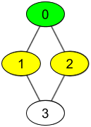

## BFS

广度优先搜索（BFS）也是一种用于遍历或搜索图和树的算法。

它从根（或任意一个节点）开始，然后探索所有相邻的节点，然后对每个相邻节点，再探索它们的未访问过的相邻节点，如此进行下去，直到所有的节点都被访问过。由于它先访问离根节点近的节点，再访问离根节点远的节点，因此称为广度优先搜索。

一般用队列实现。

## [获取你好友已观看的视频](https://leetcode.cn/problems/get-watched-videos-by-your-friends/)

有 `n` 个人，每个人都有一个 `0` 到 `n-1` 的唯一 *id* 。

给你数组 `watchedVideos` 和 `friends` ，其中 `watchedVideos[i]` 和 `friends[i]` 分别表示 `id = i` 的人观看过的视频列表和他的好友列表。

Level **1** 的视频包含所有你好友观看过的视频，level **2** 的视频包含所有你好友的好友观看过的视频，以此类推。一般的，Level 为 **k** 的视频包含所有从你出发，最短距离为 **k** 的好友观看过的视频。

给定你的 `id` 和一个 `level` 值，请你找出所有指定 `level` 的视频，并将它们按观看频率升序返回。如果有频率相同的视频，请将它们按字母顺序从小到大排列。

**示例 1：**

****

```
输入：watchedVideos = [["A","B"],["C"],["B","C"],["D"]], friends = [[1,2],[0,3],[0,3],[1,2]], id = 0, level = 1
输出：["B","C"] 
解释：
你的 id 为 0（绿色），你的朋友包括（黄色）：
id 为 1 -> watchedVideos = ["C"] 
id 为 2 -> watchedVideos = ["B","C"] 
你朋友观看过视频的频率为：
B -> 1 
C -> 2
```

**示例 2：**

****

```
输入：watchedVideos = [["A","B"],["C"],["B","C"],["D"]], friends = [[1,2],[0,3],[0,3],[1,2]], id = 0, level = 2
输出：["D"]
解释：
你的 id 为 0（绿色），你朋友的朋友只有一个人，他的 id 为 3（黄色）。
```

**思路**：

从编号为 `id` 的节点开始跑`BFS`，如果当前遍历轮数 `k` 到达 `level`，则使用 `HashMap` 统计该层好友观看过的视频，其中键是视频名称，值是好友观看次数（对于每个好友 `x`，将 `watchedVideos[x]`中的所有视频添加到 `map` 中），最后排个序即可。

```java
public List<String> watchedVideosByFriends(List<List<String>> watchedVideos, int[][] friends, int id,
        int level) {
    Map<String, Integer> map = new HashMap<>(); // (key: 视频名称, value: 观看次数)
    int n = friends.length;
    boolean[] vis = new boolean[n];
    Deque<Integer> queue = new ArrayDeque<>();
    queue.add(id);
    vis[id] = true;
    int k = 0;
    while (!queue.isEmpty()) {
        k++;
        int size = queue.size();
        for (int i = 0; i < size; i++) {
            int cur = queue.poll();
            for (int next : friends[cur]) {
                if (!vis[next]) {
                    vis[next] = true;
                    queue.add(next);
                    if (k == level) {
                        for (String video : watchedVideos.get(next)) {
                            map.put(video, map.getOrDefault(video, 0) + 1);
                        }
                    }
                }
            }
        }
    }

    return map.entrySet().stream()
            .sorted(Map.Entry.<String, Integer>comparingByValue().thenComparing(Map.Entry.comparingByKey()))
            .map(Map.Entry::getKey).collect(Collectors.toList());
}
```

## [颜色交替的最短路径](https://leetcode.cn/problems/shortest-path-with-alternating-colors/)

给定一个整数 `n`，即有向图中的节点数，其中节点标记为 `0` 到 `n - 1`。图中的每条边为红色或者蓝色，并且可能存在自环或平行边。

给定两个数组 `redEdges` 和 `blueEdges`，其中：

- `redEdges[i] = [ai, bi]` 表示图中存在一条从节点 `ai` 到节点 `bi` 的红色有向边，
  - `blueEdges[j] = [uj, vj]` 表示图中存在一条从节点 `uj` 到节点 `vj` 的蓝色有向边。

返回长度为 `n` 的数组 `answer`，其中 `answer[X]` 是从节点 `0` 到节点 `X` 的红色边和蓝色边交替出现的最短路径的长度。如果不存在这样的路径，那么 `answer[x] = -1`。

**示例 1：**

```
输入：n = 3, red_edges = [[0,1],[1,2]], blue_edges = []
输出：[0,1,-1]
```

**示例 2：**

```
输入：n = 3, red_edges = [[0,1]], blue_edges = [[2,1]]
输出：[0,1,-1]
```

```java
public int[] shortestAlternatingPaths(int n, int[][] redEdges, int[][] blueEdges) {
    List<Integer>[] redLists = new ArrayList[n];
    List<Integer>[] blueLists = new ArrayList[n];
    Arrays.setAll(redLists, e->new ArrayList<>());
    Arrays.setAll(blueLists, e->new ArrayList<>());
    for(int[] red : redEdges) {
        redLists[red[0]].add(red[1]);
    }
    for(int[] blue : blueEdges) {
        blueLists[blue[0]].add(blue[1]);
    }
    int[] ans = new int[n];
    Arrays.fill(ans, -1);
    ans[0] = 0;
    Deque<int[]> queue = new ArrayDeque<>();
    boolean[][] vis = new boolean[n][2];

    queue.add(new int[] {0, 0}); // 0 表示通过red边到达当前节点
    queue.add(new int[] {0, 1}); // 1 表示通过blue边到达当前节点
    int cnt = 0;
    while(!queue.isEmpty()) {
        cnt++;
        int size = queue.size();
        for(int i = 0; i<size; i++) {
            int[] cur = queue.poll();
            if(cur[1] == 0) { // 如果当前节点是通过red边过来的，则需要去blue边
                for(int next : blueLists[cur[0]]) {
                    if(!vis[next][1]) {
                        vis[next][1] = true;
                        queue.add(new int[] {next, 1});
                        if(ans[next] == -1) ans[next] = cnt;
                    }
                }
            } else { // 如果当前节点是通过blue边过来的，则需要去red边
                for(int next : redLists[cur[0]]) {
                    if(!vis[next][0]) {
                        vis[next][0] = true;
                        queue.add(new int[] {next, 0});
                        if(ans[next] == -1) ans[next] = cnt;
                    }
                }
            }
        }
    }
    return ans;        
}
```

## [你能从盒子里获得的最大糖果数](https://leetcode.cn/problems/maximum-candies-you-can-get-from-boxes/)

给你 `n` 个盒子，每个盒子的格式为 `[status, candies, keys, containedBoxes]` ，其中：

- 状态字 `status[i]`：整数，如果 `box[i]` 是开的，那么是 **1** ，否则是 **0** 。
  - 糖果数 `candies[i]`: 整数，表示 `box[i]` 中糖果的数目。
  - 钥匙 `keys[i]`：数组，表示你打开 `box[i]` 后，可以得到一些盒子的钥匙，每个元素分别为该钥匙对应盒子的下标。
  - 内含的盒子 `containedBoxes[i]`：整数，表示放在 `box[i]` 里的盒子所对应的下标。

给你一个 `initialBoxes` 数组，表示你现在得到的盒子，你可以获得里面的糖果，也可以用盒子里的钥匙打开新的盒子，还可以继续探索从这个盒子里找到的其他盒子。

请你按照上述规则，返回可以获得糖果的 **最大数目** 。

 

**示例 1：**

```
输入：status = [1,0,1,0], candies = [7,5,4,100], keys = [[],[],[1],[]], containedBoxes = [[1,2],[3],[],[]], initialBoxes = [0]
输出：16
解释：
一开始你有盒子 0 。你将获得它里面的 7 个糖果和盒子 1 和 2。
盒子 1 目前状态是关闭的，而且你还没有对应它的钥匙。所以你将会打开盒子 2 ，并得到里面的 4 个糖果和盒子 1 的钥匙。
在盒子 1 中，你会获得 5 个糖果和盒子 3 ，但是你没法获得盒子 3 的钥匙所以盒子 3 会保持关闭状态。
你总共可以获得的糖果数目 = 7 + 4 + 5 = 16 个。
```

**示例 2：**

```
输入：status = [1,0,0,0,0,0], candies = [1,1,1,1,1,1], keys = [[1,2,3,4,5],[],[],[],[],[]], containedBoxes = [[1,2,3,4,5],[],[],[],[],[]], initialBoxes = [0]
输出：6
解释：
你一开始拥有盒子 0 。打开它你可以找到盒子 1,2,3,4,5 和它们对应的钥匙。
打开这些盒子，你将获得所有盒子的糖果，所以总糖果数为 6 个。
```

**示例 3：**

```
输入：status = [1,1,1], candies = [100,1,100], keys = [[],[0,2],[]], containedBoxes = [[],[],[]], initialBoxes = [1]
输出：1
```

**示例 4：**

```
输入：status = [1], candies = [100], keys = [[]], containedBoxes = [[]], initialBoxes = []
输出：0
```

**示例 5：**

```
输入：status = [1,1,1], candies = [2,3,2], keys = [[],[],[]], containedBoxes = [[],[],[]], initialBoxes = [2,1,0]
输出：7
```

**思路**：

```java
public int maxCandies(int[] status, int[] candies, int[][] keys, int[][] containedBoxes, int[] initialBoxes) {
    int ans = 0;
    Deque<Integer> queue = new ArrayDeque<>();
    Set<Integer> set = new HashSet<>();
    for(int init : initialBoxes) {
        for(int key : keys[init]) {
            set.add(key);
        }   		
    }
    for(int init : initialBoxes) {
        if(status[init] == 1) {
            queue.add(init);
        } else {
            if(set.contains(init)) {
                queue.add(init);
            }
        }
    }
    
    while(!queue.isEmpty()) {
        int cur = queue.poll();
        ans += candies[cur];
        for(int to : containedBoxes[cur]) {
            for(int key : keys[to]) {
                set.add(key);
            }
        }
        for(int to : containedBoxes[cur]) {
            if(status[to] == 1) { // 如果下一个能去的盒子状态是开着的,直接打开
                queue.add(to);
            } else { // 如果盒子是关闭的,是否有钥匙?
                if(set.contains(to)) {
                    queue.add(to);
                }
            }
        }
    }
    
    return ans;
}
```