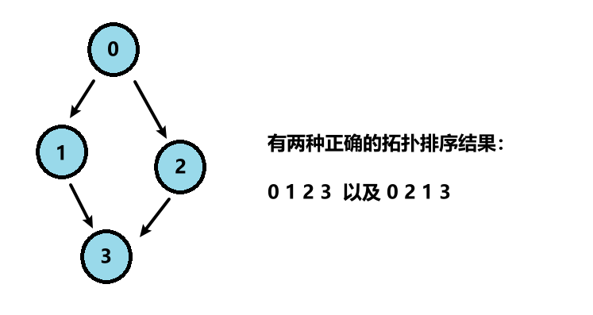

## 概念

拓扑排序主要应用于有向无环图（Directed Acyclic Graph，简称DAG）的排序。它的主要特点是每个节点的前置节点都在这个节点之前，比如：




拓扑排序的结果可能有多种，对于某一批前后顺序无所谓的节点，其处理顺序可以不同，因此会影响最终的排序结果。

## 算法流程

拓扑排序的过程可以用Kahn算法来实现，也称为入度为0法，其基本流程如下：

1. 在图中找到所有入度为0的节点，将它们加入到队列中。
   2. 从队列中取出一个节点，将其从图中删除，同时将其输出到结果序列中。删除节点时，同时也要删除从这个节点出发的所有边，并将这些边的终点的入度减1。
   3. 如果某个节点的入度减1后发现入度为0，则将其加入到队列中。
   4. 重复步骤2和步骤3，直到队列为空。如果此时图中还有节点没有被删除，那么这些节点构成一个环，说明输入的图不是一个有向无环图，无法进行拓扑排序。如果所有的节点都被删除，那么输出的结果序列就是一个合法的拓扑排序。

通过这个过程，我们可以看到，Kahn算法不仅可以用来进行拓扑排序，还可以用来检测图中是否存在环。

## 动态建图

> [课程表 II（leetcode.cn）](https://leetcode.cn/problems/course-schedule-ii/)

现在你总共有 `numCourses` 门课需要选，记为 `0` 到 `numCourses - 1`。给你一个数组 `prerequisites` ，其中 `prerequisites[i] = [ai, bi]` ，表示在选修课程 `ai` 前 **必须** 先选修 `bi` 。

- 例如，想要学习课程 `0` ，你需要先完成课程 `1` ，我们用一个匹配来表示：`[0,1]` 。

返回你为了学完所有课程所安排的学习顺序。可能会有多个正确的顺序，你只要返回 **任意一种** 就可以了。如果不可能完成所有课程，返回 **一个空数组** 。

**示例 1：**

```
输入：numCourses = 2, prerequisites = [[1,0]]
输出：[0,1]
解释：总共有 2 门课程。要学习课程 1，你需要先完成课程 0。因此，正确的课程顺序为 [0,1] 。
```

**示例 2：**

```
输入：numCourses = 4, prerequisites = [[1,0],[2,0],[3,1],[3,2]]
输出：[0,2,1,3]
解释：总共有 4 门课程。要学习课程 3，你应该先完成课程 1 和课程 2。并且课程 1 和课程 2 都应该排在课程 0 之后。
因此，一个正确的课程顺序是 [0,1,2,3] 。另一个正确的排序是 [0,2,1,3] 。
```

**示例 3：**

```
输入：numCourses = 1, prerequisites = []
输出：[0]
```

**参考**：

```java
class Solution {
    public int[] findOrder(int numCourses, int[][] prerequisites) {
        // 建图，并维护一个节点入度表
        List<Integer>[] g = new ArrayList[numCourses];
        Arrays.setAll(g, e->new ArrayList<Integer>());
        int[] in = new int[numCourses];
        for(int[] edge : prerequisites) {
            g[edge[1]].add(edge[0]);
            in[edge[0]]++;
        }
        // 队列始终存放当前入度为0的节点，并遍历邻居节点，更新其入度
        int[] queue = new int[numCourses];
        int l = 0, r = 0;
        for(int i = 0; i<numCourses; i++) {
            if(in[i] == 0) {
                queue[r++] = i;
            }
        }
        int cnt = 0;
        while(l < r) {
            int cur = queue[l++];
            cnt++;
            for(int next : g[cur]) {
                if(--in[next] == 0) {
                    queue[r++] = next;
                }
            }
        }
        // 最后看收集到的节点个数是否对得上
        return cnt == numCourses ? queue : new int[0];
    }
}
```

## 静态建图

> 链接：[【模板】拓扑排序 (nowcoder.com)](https://www.nowcoder.com/practice/88f7e156ca7d43a1a535f619cd3f495c)

**问题描述**

给定一个包含 $n$ 个点 $m$ 条边的有向无环图，求出该图的拓扑序。若图的拓扑序不唯一，输出任意合法的拓扑序即可。若该图不能拓扑排序，输出 $−1$。

**输入描述**

第一行输入两个整数 $m, n$ ($1≤ n,m ≤ 2 \cdot 10^5$)，表示点的个数和边的条数。

接下来的 $m$ 行，每行输入两个整数 $u_i, v_i$( $1≤ u, v ≤ n$)，表示$u_i$到$v_i$之间有一条有向边。

**输出描述**

若图存在拓扑序，输出一行 $n$ 整数，表示拓扑序。否则输出 $-1$。

**参考**：

下面用链式前向星建图，过一遍拓扑排序：

```java
import java.io.BufferedReader;
import java.io.IOException;
import java.io.InputStreamReader;
import java.io.OutputStreamWriter;
import java.io.PrintWriter;
import java.io.StreamTokenizer;
import java.util.Arrays;

public class Main {
    public static int n, m;
    public static int MAXN = 200001;
    public static int MAXM = 200001;
    // 链式前向星,建图
    public static int[] head = new int[MAXN];// 每个点的头边号
    public static int[] next = new int[MAXM];// 每条边的下一条边号
    public static int[] to = new int[MAXM]; // 每条边去往的点
    public static int cnt;
    // 队列,拓扑排序
    public static int[] queue = new int[MAXN];
    public static int l, r;
    // 入度表,拓扑排序
    public static int[] indegree = new int[MAXN];
    // 收集拓扑排序的结果
    public static int[] ans = new int[MAXN];

    public static void build(int n) { // 初始化
        cnt = 1;
        Arrays.fill(head, 0, n + 1, 0);
        Arrays.fill(indegree, 0, n + 1, 0);
    }

    public static void addEdge(int f, int t) { // 用链式前向星建图
        next[cnt] = head[f];
        to[cnt] = t;
        head[f] = cnt++;
    }

    public static void main(String[] args) throws IOException {
        BufferedReader br = new BufferedReader(new InputStreamReader(System.in));
        StreamTokenizer in = new StreamTokenizer(br);
        PrintWriter out = new PrintWriter(new OutputStreamWriter(System.out));
        while (in.nextToken() != StreamTokenizer.TT_EOF) {
            n = (int) in.nval;
            in.nextToken();
            m = (int) in.nval;
            build(n);
            for (int i = 0, from, to; i < m; i++) {
                in.nextToken();
                from = (int) in.nval;
                in.nextToken();
                to = (int) in.nval;
                addEdge(from, to);
                indegree[to]++;
            }
            if (!topoSort()) {
                out.println(-1);
            } else {
                for (int i = 0; i < n - 1; i++) {
                    out.print(ans[i] + " ");
                }
                out.println(ans[n - 1]);
            }
        }
        out.flush();
        out.close();
        br.close();
    }
    
    public static boolean topoSort() {
        l = r = 0;
        for (int i = 1; i <= n; i++) {
            if (indegree[i] == 0) {
                queue[r++] = i;
            }
        }
        int size = 0;
        while (l < r) {
            int cur = queue[l++];
            ans[size++] = cur;
            for (int ei = head[cur]; ei != 0; ei = next[ei]) {
                if (--indegree[to[ei]] == 0) {
                    queue[r++] = to[ei];
                }
            }
        }
        return size == n;
    }
}
```

## [课程表 IV](https://leetcode.cn/problems/course-schedule-iv/)

你总共需要上 `numCourses` 门课，课程编号依次为 `0` 到 `numCourses-1` 。你会得到一个数组 `prerequisite` ，其中 `prerequisites[i] = [ai, bi]` 表示如果你想选 `bi` 课程，你 **必须** 先选 `ai` 课程。

- 有的课会有直接的先修课程，比如如果想上课程 `1` ，你必须先上课程 `0` ，那么会以 `[0,1]` 数对的形式给出先修课程数对。

先决条件也可以是 **间接** 的。如果课程 `a` 是课程 `b` 的先决条件，课程 `b` 是课程 `c` 的先决条件，那么课程 `a` 就是课程 `c` 的先决条件。

你也得到一个数组 `queries` ，其中 `queries[j] = [uj, vj]`。对于第 `j` 个查询，您应该回答课程 `uj` 是否是课程 `vj` 的先决条件。

返回一个布尔数组 `answer` ，其中 `answer[j]` 是第 `j` 个查询的答案。

 

**示例 1：**


```
输入：numCourses = 2, prerequisites = [[1,0]], queries = [[0,1],[1,0]]
输出：[false,true]
解释：课程 0 不是课程 1 的先修课程，但课程 1 是课程 0 的先修课程。
```

**示例 2：**

```
输入：numCourses = 2, prerequisites = [], queries = [[1,0],[0,1]]
输出：[false,false]
解释：没有先修课程对，所以每门课程之间是独立的。
```

**示例 3：**


```
输入：numCourses = 3, prerequisites = [[1,2],[1,0],[2,0]], queries = [[1,0],[1,2]]
输出：[true,true]
```

**参考**：

```java
class Solution {
    public List<Boolean> checkIfPrerequisite(int numCourses, int[][] prerequisites, int[][] queries) {
        List<Integer>[] g = new List[numCourses];
        Arrays.setAll(g, e->new ArrayList<>());
        int[] in = new int[numCourses];
        for (int[] p : prerequisites) {
            ++in[p[1]];
            g[p[0]].add(p[1]);
        }
        Queue<Integer> queue = new ArrayDeque<Integer>();
        for (int i = 0; i < numCourses; ++i) {
            if (in[i] == 0) {
                queue.offer(i);
            }
        }
        boolean[][] isPre = new boolean[numCourses][numCourses];
        while (!queue.isEmpty()) {
            int cur = queue.poll();
            for (int next : g[cur]) {
                // 当前课程cur是下一个课程next的先修课
                isPre[cur][next] = true;
                for (int i = 0; i < numCourses; ++i) {
                    // 遍历所有课程,如果课程i是课程cur的先修课,那么课程i也应该是课程next的先修课
                    isPre[i][next] |= isPre[i][cur];
                }
                --in[next];
                if (in[next] == 0) {
                    queue.offer(next);
                }
            }
        }
        List<Boolean> ans = new ArrayList<Boolean>();
        for (int[] query : queries) {
            ans.add(isPre[query[0]][query[1]]);
        }
        return ans;
    }
}
```

## [从给定原材料中找到所有可以做出的菜](https://leetcode.cn/problems/find-all-possible-recipes-from-given-supplies/)

你有 `n` 道不同菜的信息。给你一个字符串数组 `recipes` 和一个二维字符串数组 `ingredients` 。第 `i` 道菜的名字为 `recipes[i]` ，如果你有它 **所有** 的原材料 `ingredients[i]` ，那么你可以 **做出** 这道菜。一道菜的原材料可能是 **另一道** 菜，也就是说 `ingredients[i]` 可能包含 `recipes` 中另一个字符串。

同时给你一个字符串数组 `supplies` ，它包含你初始时拥有的所有原材料，每一种原材料你都有无限多。

请你返回你可以做出的所有菜。你可以以 **任意顺序** 返回它们。

注意两道菜在它们的原材料中可能互相包含。

**示例 1：**

```
输入：recipes = ["bread"], ingredients = [["yeast","flour"]], supplies = ["yeast","flour","corn"]
输出：["bread"]
解释：
我们可以做出 "bread" ，因为我们有原材料 "yeast" 和 "flour" 。
```

**示例 2：**

```
输入：recipes = ["bread","sandwich"], ingredients = [["yeast","flour"],["bread","meat"]], supplies = ["yeast","flour","meat"]
输出：["bread","sandwich"]
解释：
我们可以做出 "bread" ，因为我们有原材料 "yeast" 和 "flour" 。
我们可以做出 "sandwich" ，因为我们有原材料 "meat" 且可以做出原材料 "bread" 。
```

**示例 3：**

```
输入：recipes = ["bread","sandwich","burger"], ingredients = [["yeast","flour"],["bread","meat"],["sandwich","meat","bread"]], supplies = ["yeast","flour","meat"]
输出：["bread","sandwich","burger"]
解释：
我们可以做出 "bread" ，因为我们有原材料 "yeast" 和 "flour" 。
我们可以做出 "sandwich" ，因为我们有原材料 "meat" 且可以做出原材料 "bread" 。
我们可以做出 "burger" ，因为我们有原材料 "meat" 且可以做出原材料 "bread" 和 "sandwich" 。
```

**示例 4：**

```
输入：recipes = ["bread"], ingredients = [["yeast","flour"]], supplies = ["yeast"]
输出：[]
解释：
我们没法做出任何菜，因为我们只有原材料 "yeast" 。
```

**参考**：

```java
// 从给定的原材料和菜谱中，找出所有能够根据当前供应的原材料无限制制作出的菜。
class Solution {
    // 第 i 道菜的名字为 recipes[i]，第 i 道菜的所有原材料为 ingredients[i]，初始时拥有的所有原材料,无限多
    // 返回可以做出的所有菜（任意顺序）
    public List<String> findAllRecipes(String[] recipes, List<List<String>> ingredients, String[] supplies) {
        Map<String, List<String>> g = new HashMap<>(); // g[原材料s]: {菜品r1, 菜品r2, ...}
        Map<String, Integer> need = new HashMap<>();  // 如果菜品r还需要n种原材料，则need[r]=n
        
        for (int i = 0; i < recipes.length; i++) {
            String r = recipes[i];	// 第 i 道菜品
            for (String s : ingredients.get(i)) {	// 原材料s
                g.putIfAbsent(s, new ArrayList<>());
                g.get(s).add(r);
            }
            // 当前菜品r需要多少份原材料
            need.put(r, ingredients.get(i).size());
        }
        // 存储可以做出的菜品
        List<String> ans = new ArrayList<>();
        // 存储当前可以用来做菜的原材料
        Deque<String> q = new ArrayDeque<>(Arrays.asList(supplies));
        while (!q.isEmpty()) {
            String s = q.poll();
            // 如果原材料s可以用来做菜
            if (g.containsKey(s)) {
                // 遍历所有可以用原材料s做出的菜品
                for (String r : g.get(s)) {
                    // 将菜品r需要的原材料数量减1
                    need.put(r, need.get(r) - 1);
                    // 如果菜品r的所有原材料都已经准备好了
                    if (need.get(r) == 0) {
                        // 将菜品r添加到队列和答案列表中
                        q.addLast(r);
                        ans.add(r);
                    }
                }
            }
        }
        return ans;
    }
}
```

## 更多题目

- [310. 最小高度树](https://leetcode.cn/problems/minimum-height-trees/)
- [802. 找到最终的安全状态](https://leetcode.cn/problems/find-eventual-safe-states/)
- [1203. 项目管理](https://leetcode.cn/problems/sort-items-by-groups-respecting-dependencies/)
- [2603. 收集树中金币](https://leetcode.cn/problems/collect-coins-in-a-tree/)
