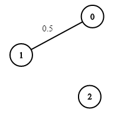

## Dijkstra 算法

::: tip Dijkstra 算法

给定一个源点，求解从源点到每个点的最短路径长度，即单源最短路径算法。

:::

彻底暴力的 $Dijkstra$ 算法，时间复杂度太差 $O(n^2)$，无意义，用优先队列（堆）实现的 $Dijkstra$ 算法最普遍也最常用。

算法核心流程为：

- 节点弹出过，则忽略
- 节点没弹出过，让其他没弹出节点并且能让距离变得更小的记录加入堆。

示例：

```java
// 求解从源点k到所有其他点的最短路径长度
public static int[] dijkstra(int[][] edges, int n, int k) {
    // 1. 建图,g[i]存储了所有从顶点i出发的边
    List<int[]>[] g = new ArrayList[n+1];
    Arrays.setAll(g, e->new ArrayList<>());
    for (int[] edge : edges) {
        //  源节点                  目标节点   权重
        g[edge[0]].add(new int[] {edge[1], edge[2]});
    }
    // 2. 准备dist数组，dist[i]表示从源点k到顶点i的最短路径长度
    int[] dist = new int[n+1];
    Arrays.fill(dist, Integer.MAX_VALUE);
    dist[k] = 0;
    // 3. 准备vis数组和heap堆
    //    vis[i]表示 i 节点是否从小根堆弹出过
    // 	  heap中存放记录: (节点，源点到当前节点的距离)，并按照从源点k到这些顶点的路径长度排序
    boolean[] vis = new boolean[n + 1];
    PriorityQueue<int[]> heap = new PriorityQueue<>((a, b) -> a[1] - b[1]);
    // 4. 将源点k放入堆中
    heap.add(new int[] { k, 0 });
    // 5. 跑 dijkstra 算法
    while (!heap.isEmpty()) {
        int u = heap.poll()[0];
        if (vis[u]) {	// 如果节点u已经弹出过了，忽略它
            continue;
        }
        vis[u] = true;	// 如果未弹出，则标记，并考察u的每一条边
        for (int[] edge : g[u]) {
            // u->v，边权为w
            int v = edge[0];
            int w = edge[1];
            int cost = dist[u] + w;
            // 如果找到了一条更短的路径，更新dist[v]并将顶点v加入heap
            if (!vis[v] && cost < dist[v]) {
                dist[v] = cost;
                heap.add(new int[] { v, cost });
            }
        }
    }
    // 6. 返回结果
    return dist;
}
```

## [网络延迟时间](https://leetcode.cn/problems/network-delay-time/)

有 `n` 个网络节点，标记为 `1` 到 `n`。

给你一个列表 `times`，表示信号经过 **有向** 边的传递时间。 `times[i] = (ui, vi, wi)`，其中 `ui` 是源节点，`vi` 是目标节点， `wi` 是一个信号从源节点传递到目标节点的时间。

现在，从某个节点 `K` 发出一个信号。需要多久才能使所有节点都收到信号？如果不能使所有节点收到信号，返回 `-1` 。

**示例 1：**


```
输入：times = [[2,1,1],[2,3,1],[3,4,1]], n = 4, k = 2
输出：2
```

**示例 2：**

```
输入：times = [[1,2,1]], n = 2, k = 1
输出：1
```

**示例 3：**

```
输入：times = [[1,2,1]], n = 2, k = 2
输出：-1
```

**参考**：

用 $Dijkstra$ 算法求出，从出发节点 $k$ 到其余所有节点的最短路径长度，并取其中最大值，就是答案。

> 如果存在某个点，使得从节点 $k$ 出发无法到达这个点，则返回 $-1$。

```java
class Solution {
    public int networkDelayTime(int[][] times, int n, int k) {
        int[] dist = dijkstra(times, n, k);
        int ans = Integer.MIN_VALUE;
        for (int i = 1; i <= n; i++) {
            if (dist[i] == Integer.MAX_VALUE) {
                return -1;
            }
            ans = Math.max(ans, dist[i]);
        }
        return ans;
    }

    public int[] dijkstra(int[][] edges, int n, int k) {
        List<int[]>[] g = new ArrayList[n+1];
        Arrays.setAll(g, e->new ArrayList<>());
        for (int[] edge : edges) {
            g[edge[0]].add(new int[] {edge[1], edge[2]});
        }
        int[] dist = new int[n+1];
        Arrays.fill(dist, Integer.MAX_VALUE);
        dist[k] = 0;
        boolean[] vis = new boolean[n + 1];
        PriorityQueue<int[]> heap = new PriorityQueue<>((a, b) -> a[1] - b[1]);
        heap.add(new int[] { k, 0 });
        while (!heap.isEmpty()) {
            int u = heap.poll()[0];
            if (vis[u]) {
                continue;
            }
            vis[u] = true;
            for (int[] edge : g[u]) {
                int v = edge[0];
                int w = edge[1];
                int cost = dist[u] + w;
                if (!vis[v] && cost < dist[v]) {
                    dist[v] = cost;
                    heap.add(new int[] { v, cost });
                }
            }
        }
        return dist;
    }
}
```

## [设计可以求最短路径的图类](https://leetcode.cn/problems/design-graph-with-shortest-path-calculator/)

给你一个有 `n` 个节点的 **有向带权** 图，节点编号为 `0` 到 `n - 1` 。图中的初始边用数组 `edges` 表示，其中 `edges[i] = [fromi, toi, edgeCosti]` 表示从 `fromi` 到 `toi` 有一条代价为 `edgeCosti` 的边。

请你实现一个 `Graph` 类：

- `Graph(int n, int[][] edges)` 初始化图有 `n` 个节点，并输入初始边。
- `addEdge(int[] edge)` 向边集中添加一条边，其中 `edge = [from, to, edgeCost]` 。数据保证添加这条边之前对应的两个节点之间没有有向边。
- `int shortestPath(int node1, int node2)` 返回从节点 `node1` 到 `node2` 的路径 **最小** 代价。如果路径不存在，返回 `-1` 。一条路径的代价是路径中所有边代价之和。

**示例 1：**


```
输入：
["Graph", "shortestPath", "shortestPath", "addEdge", "shortestPath"]
[[4, [[0, 2, 5], [0, 1, 2], [1, 2, 1], [3, 0, 3]]], [3, 2], [0, 3], [[1, 3, 4]], [0, 3]]
输出：
[null, 6, -1, null, 6]

解释：
Graph g = new Graph(4, [[0, 2, 5], [0, 1, 2], [1, 2, 1], [3, 0, 3]]);
g.shortestPath(3, 2); // 返回 6 。从 3 到 2 的最短路径如第一幅图所示：3 -> 0 -> 1 -> 2 ，总代价为 3 + 2 + 1 = 6 。
g.shortestPath(0, 3); // 返回 -1 。没有从 0 到 3 的路径。
g.addEdge([1, 3, 4]); // 添加一条节点 1 到节点 3 的边，得到第二幅图。
g.shortestPath(0, 3); // 返回 6 。从 0 到 3 的最短路径为 0 -> 1 -> 3 ，总代价为 2 + 4 = 6 。
```

```java
class Graph {
    List<int[]>[] g;
   
    public Graph(int n, int[][] edges) {
        g = new ArrayList[n];
        Arrays.setAll(g, e->new ArrayList<>());
        for(int[] edge : edges) {
            addEdge(edge);
        }
    }
    
    public void addEdge(int[] edge) {
        int from = edge[0];
        int to = edge[1];
        int cost = edge[2];
        g[from].add(new int[] {to, cost});
    }
    
    public int shortestPath(int u, int v) {
        int n = g.length;
        int[] dist = new int[n];
        Arrays.fill(dist, Integer.MAX_VALUE);
        dist[u] = 0;
        boolean[] vis = new boolean[n];
        PriorityQueue<int[]> heap = new PriorityQueue<int[]>((a, b) -> (a[1] - b[1]));
        heap.add(new int[] {u, 0});

        while(!heap.isEmpty()) {
            int cur = heap.poll()[0];
            if(vis[cur]) {
                continue;
            }
            vis[cur] = true;
            for(int[] next : g[cur]) {
                int to = next[0];
                int cost = dist[cur] + next[1];
                if(!vis[to] && cost < dist[to]) {
                    dist[to] = cost;
                    heap.add(new int[] {to, dist[to]});
                }
            }
        }
        return dist[v] == Integer.MAX_VALUE ? -1 : dist[v];
    }
}
```

## [概率最大的路径](https://leetcode.cn/problems/path-with-maximum-probability/)

给你一个由 `n` 个节点（下标从 0 开始）组成的无向加权图，该图由一个描述边的列表组成，其中 `edges[i] = [a, b]` 表示连接节点 a 和 b 的一条无向边，且该边遍历成功的概率为 `succProb[i]` 。

指定两个节点分别作为起点 `start` 和终点 `end` ，请你找出从起点到终点成功概率最大的路径，并返回其成功概率。

如果不存在从 `start` 到 `end` 的路径，请 **返回 0** 。只要答案与标准答案的误差不超过 **1e-5** ，就会被视作正确答案。

**示例 1：**

****

```
输入：n = 3, edges = [[0,1],[1,2],[0,2]], succProb = [0.5,0.5,0.2], start = 0, end = 2
输出：0.25000
解释：从起点到终点有两条路径，其中一条的成功概率为 0.2 ，而另一条为 0.5 * 0.5 = 0.25
```

**示例 2：**

****

```
输入：n = 3, edges = [[0,1],[1,2],[0,2]], succProb = [0.5,0.5,0.3], start = 0, end = 2
输出：0.30000
```

**示例 3：**

****

```
输入：n = 3, edges = [[0,1]], succProb = [0.5], start = 0, end = 2
输出：0.00000
解释：节点 0 和 节点 2 之间不存在路径
```

**参考**：

边的权值区间为 $[0, 1]$，边数越多，乘积的结果只会变小或不变。因此可用$Dijkstra$ 算法求出源点到每个点的最短路径，其中每一条边计算当前路径长度时，需要以相乘的形式（而不是相加）。在遍历过程中如果遇到目标节点，则直接拿到答案并退出循环，如果始终遇不到，则答案为$0$。

```java
class Solution {
    public double maxProbability(int n, int[][] edges, double[] succProb, int start_node, int end_node) {
        List<double[]>[] g = new ArrayList[n+1];
        Arrays.setAll(g, e->new ArrayList<>());
        int m = edges.length;
        for(int i = 0; i<m; i++) {
            g[edges[i][0]].add(new double[] {edges[i][1], succProb[i]});
            g[edges[i][1]].add(new double[] {edges[i][0], succProb[i]});
        }
        double[] dist = new double[n];
        Arrays.fill(dist, 0);
        dist[start_node] = 1;
        boolean[] vis = new boolean[n];
        PriorityQueue<double[]> heap = new PriorityQueue<>((a, b) -> Double.compare(b[1], a[1]));
        heap.add(new double[] { start_node, 1 });
        double ans = 0;
        while (!heap.isEmpty()) {
            int u = (int)heap.poll()[0];
            if (vis[u]) {
                continue;
            }
            vis[u] = true;
            if(u == end_node) {
                ans = dist[end_node];
                break;
            }
            for (double[] edge : g[u]) {
                int v = (int)edge[0];
                double w = edge[1];
                double cost = dist[u] * w;
                if (!vis[v] && cost > dist[v]) {
                    dist[v] = cost;
                    heap.add(new double[] { v, cost });
                }
            }
        }
        return ans;
    }
}
```

## 更多题目

- [1631. 最小体力消耗路径](https://leetcode.cn/problems/path-with-minimum-effort/)
- [1368. 使网格图至少有一条有效路径的最小代价](https://leetcode.cn/problems/minimum-cost-to-make-at-least-one-valid-path-in-a-grid/)
- [1786. 从第一个节点出发到最后一个节点的受限路径数](https://leetcode.cn/problems/number-of-restricted-paths-from-first-to-last-node/)
- [1976. 到达目的地的方案数](https://leetcode.cn/problems/number-of-ways-to-arrive-at-destination/)
- [2662. 前往目标的最小代价](https://leetcode.cn/problems/minimum-cost-of-a-path-with-special-roads/)
- [2045. 到达目的地的第二短时间](https://leetcode.cn/problems/second-minimum-time-to-reach-destination/)
- [882. 细分图中的可到达节点](https://leetcode.cn/problems/reachable-nodes-in-subdivided-graph/)
- [2203. 得到要求路径的最小带权子图](https://leetcode.cn/problems/minimum-weighted-subgraph-with-the-required-paths/)
- [2577. 在网格图中访问一个格子的最少时间](https://leetcode.cn/problems/minimum-time-to-visit-a-cell-in-a-grid/)
- [2699. 修改图中的边权](https://leetcode.cn/problems/modify-graph-edge-weights/)