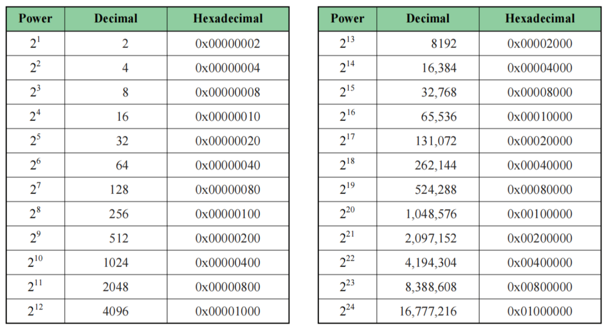
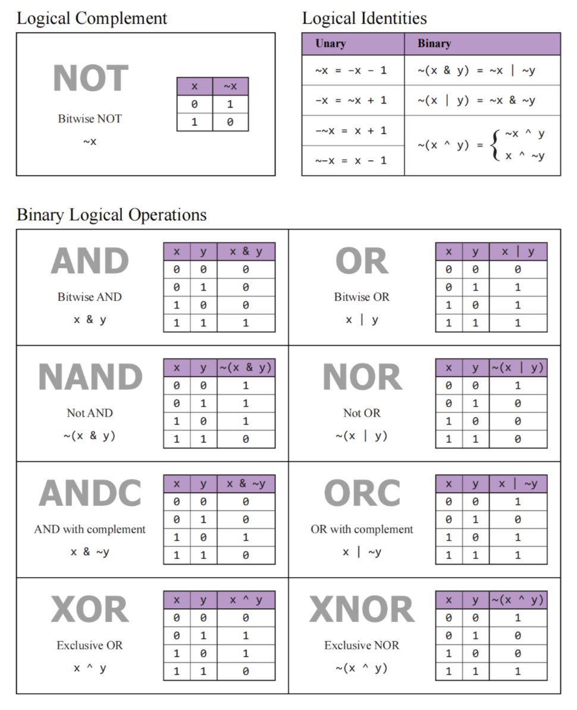
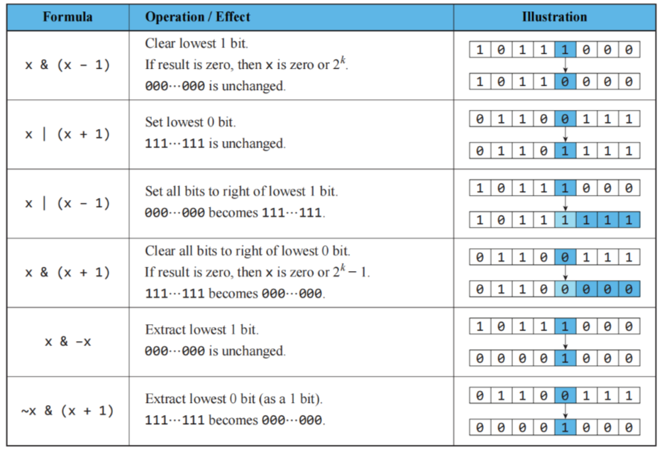
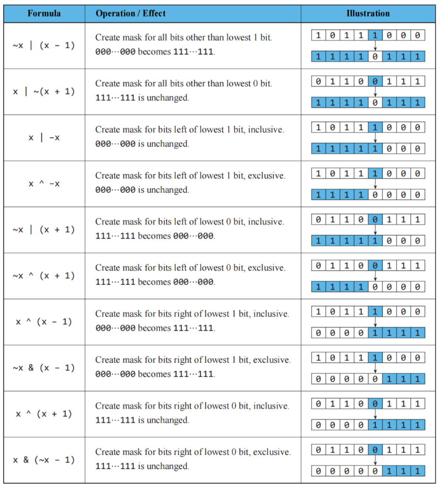
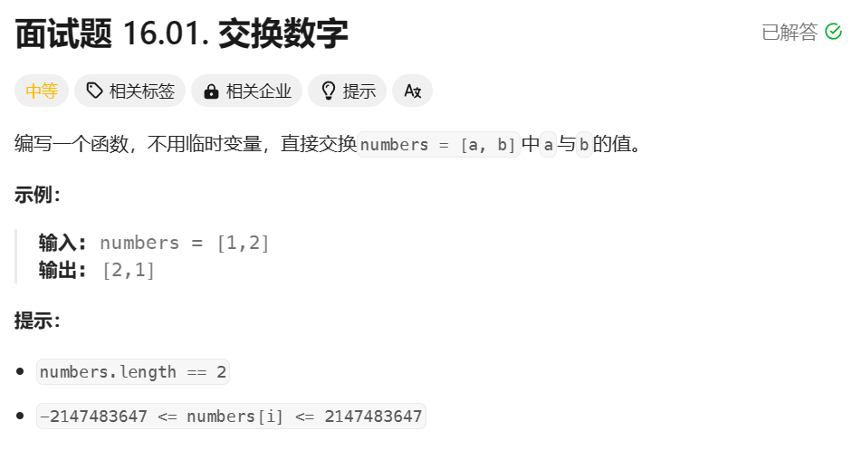

# 前言

> **Powers of Two**



> **Logical**



> **Bit Manipulation**



> **Mask Creation**



## 概述

> “bit是度量信息的单位，包含 0 和 1 两种状态。计算机的各种运算最后无不归结为一个个bit的变化。”

位运算速度更快，更接近系统，有时可以将程序优化到一个很好的水平。

我们约定，在 `m` 位二进制数中，最低位称为第 `0` 位，从右到左依次类推，则最高位是第 `m-1` 位。

## 位运算符

下面，复习一下位运算符：

| 与                                    | 或                                       | 非                                                 | 异或                                   |
| ------------------------------------- | ---------------------------------------- | -------------------------------------------------- | -------------------------------------- |
| `&`                                   | `\|`                                     | `~`                                                | `^`                                    |
| 如果相对应位都是1，则结果为1，否则为0 | 如果相对应位都是 0，则结果为 0，否则为 1 | 按位取反运算符翻转操作数的每一位，即0变成1，1变成0 | 如果相对应位值不同，则结果为1，否则为0 |


## 移位运算

```java
public class PowerFunctions {
    // 计算 n 乘以 2 的 m 次方
    public static int multiplyByPowerOfTwo(int n, int m) {
        return n << m;
    }

    // 计算 n 除以 2 的 m 次方
    public static int divideByPowerOfTwo(int n, int m) {
        return n >> m;
    }

    public static void main(String[] args) {
        // 示例用法
        int resultMultiply = multiplyByPowerOfTwo(5, 3); // 5 * 2^3 = 40
        int resultDivide = divideByPowerOfTwo(32, 3);    // 32 / 2^3 = 4

        System.out.println("5 * 2^3 = " + resultMultiply);
        System.out.println("32 / 2^3 = " + resultDivide);
    }
}
```

运行结果：

```bash
5 * 2^3 = 40
32 / 2^3 = 4
```

> **左移，在二进制表示下把数字同时向左移动，低位用 0 填充，高位越界后舍弃**。

将一个数左移 `n` 位，相当于乘上 `2` 的 `n` 次方。

```java
System.out.println(7<<3);  // 56，即 7 * (2^3)
```

将 `1` 左移 `n` 位后得到的值等于 `2` 的 `n` 次方。

```java
System.out.println(1<<10);  // 1024，即2的10次方
```

> **右移，在二进制表示下把数字同时向右移动，高位以符号位填充，低位越界后舍弃**。

将某个数右移 `1` 位相当于除以 `2` 再向下取整。

比如 `3>>1` 相当于 `3` 除以 `2` 等于 `1.5` 再向下取整得到 `1`。

```java
System.out.println(3>>1); // 1
```

`-3>>1` 相当于 `-3` 除以 `2` 等于 `-1.5` 再向下取整得到 `-2`。

```java
System.out.println(-3>>1); // -2
```

> **值得一提的是，在Java中，“整数/2”会舍弃小数位。比如 `-3/2` 的结果为 -1**。这和右移操作（除以2后向下取整）的结果不一样，存在区别。


将一个数右移 `n` 位，相当于乘以 `2` 的 `n` 次方。

```java
System.out.println(64>>3);  // 8，即 64 / (2^3)
```


# 位运算操作

## 判断给定数 n 是否为 2 的正整数次幂

```java
public static boolean isPowerOfTwo(int n){
    return n > 0 && (n & (n - 1)) == 0;
}
```

如果 `n` 是 `2` 的幂，则 `n & (n-1)` 的结果应为 `0`。

举例：

```
   x  = 4 = (0100)2
  x-1 = 3 = (0011)2

   0 1 0 0      4
&  0 0 1 1      3
-----------
   0 0 0 0      0
```

## 计算给定数字的二进制表示形式中 1 的数量

```java
public static int count_one (int n){
    int count = 0;
    while(n > 0) {
        n = n & (n-1);
        count++;
    }
    return count;
}
```

在循环体内，执行位操作 `n = n & (n-1)`，这会将 `n` 减去其二进制表示中最低位的 `1`。这一步目的是消除`n`最右边的 `1`，并在每次迭代中计算 `1` 的数量。

可以列举后理解。比如要求出`14`（`1110`）的二进制表示形式中 `1` 的数量，那么：

```
14 & 13 = {1 1 1 0} & {1 1 0 1} = {1 1 0 0} = 12

12 & 11 = {1 1 0 0} & {1 0 1 1} = {1 0 0 0} = 8

 8 & 7  = {1 0 0 0} & {0 1 1 1} = {0 0 0 0} = 0
```

一共循环3次，1 的数量为`3`。我们发现，每次执行`n = n & (n-1)`操作后，都会消除其二进制表示中最右边的 `1`。

## 生成一个集合中所有可能的子集

比如有一个集合`A`是`{a, b, c}`。

为了求出所有可能的子集，我们需要`3`位二进制数。并且约定`1`表示对应的元素存在于子集中，`0`表示对应的元素不存在于子集中。所有可能的组合如下：

- `0 = (000) = {}`
- `1 = (001) = {c}`
- `2 = (010) = {b}`
- `3 = (011) = {b, c}`
- `4 = (100) = {a}`
- `5 = (101) = {a, c}`
- `6 = (110) = {a, b}`
- `7 = (111) = {a, b, c}`

代码如下：

```java
public static void possibleSubsets (char arr[]) {
    int n = arr.length;   // 有n个元素
    // set 从 0 遍历到 2^n-1
    for(int set = 0; set < (1<<n); ++set) {
        // 从最低位开始，检查 set 的每一位是否为 1
        for(int j = 0; j<n; ++j) { 
        	// 将比特位为1的对应元素加入子集
            if((set & (1 << j)) > 0) {
                System.out.print(arr[j] + " ");
            }
        }
        System.out.println();
    }
}
```


## 位运算遍历

使用 `n & 1` 可以获取 `n` 在二进制表示下的最低位，而 `n >> 1` 可以舍去最低位，也就是将整数右移一位。结合这两个操作，可以**逐位遍历**整数 `n` 在二进制表示下的所有位，实现位运算遍历。

举个例子：

```java
// 遍历整数 n 的二进制表示
public class BitTraversalExample {
    public static void main(String[] args) {
        int n = 11; // 二进制表示为 1011

        // 从最低位开始遍历
        while (n != 0) {
            int lowestBit = n & 1;
            System.out.print(lowestBit); // 输出当前位的值

            n = n >> 1; // 右移一位，舍去最低位
        }
    }
}
```

在这个例子中，遍历过程输出的结果是 `1101`，即整数`11`在二进制下的各个位的值。

> **注意，由于是从最低位开始遍历，输出的结果是二进制表示的反向**。

如果你想要正向输出，可以将结果保存在数组或其他数据结构中，然后反向输出。

比如：

```java
// 遍历整数 n 的二进制表示
public class BitTraversalExample {
    public static void main(String[] args) {
        int n = 11; // 二进制表示为 1011

        StringBuilder result = new StringBuilder();

        // 从最低位开始遍历
        while (n != 0) {
            int lowestBit = n & 1;
            result.insert(0, lowestBit); // 插入到result的最前面

            n = n >> 1; // 右移一位，舍去最低位（也可以写成 n >>= 1）
        }

        System.out.println("正向输出二进制表示: " + result.toString());
    }
}
// 正向输出二进制表示: 1011
```

## 取出整数 n 在二进制表示下的第 k 位

```java
// 取出整数 n 在二进制表示下的第 k 位的值
public static int getBit(int n, int k) {
    return (n >> k) & 1;
}
```

如果我们要判断某个数`n`某一位是1还是0（二进制表示下），可以将这个数`n`右移 `k` 位再和`1`进行**与**运算即可。


## 将整数 n 在二进制表示下的第 k 位取反

```java
// 把整数 n 在二进制表示下的第 k 位取反
public static int flipBit(int n, int k) {
    return n ^ (1 << k);
}
```

将`1`左移`k`位得到的数值为`2`的`k`次幂，该数值在二进制表示下，只有第`k`位为`1`，其他位都为`0`。因此将这个数和`n`进行异或运算，即可将第 k 位取反。

> `1^1=0，1^0=1`


比如，现在要将`6`（`0 1 1 0`）的第`3`位取反后变为`14`（`1 1 1 0`）。那么只需将`1`左移`3`位得到`8`（`1 0 0 0`），再和`8`和`6`进行异或，就可以得到`14`。

```
 6 = {0 1 1 0}
 8 = {1 0 0 0}
14 = {1 1 1 0}
```

## 获取整数的低位部分

```java
// 取出整数 n 在二进制表示下的第 0 到 k-1 位（后 k 位）
public static int getBits(int n, int k) {
    return n & ((1 << k) - 1);
}
```


比如，现在要拿到`5`的后`2`位。只需将`1`左移`2`位得到`4`，再将`4`减`1`得到`3`，再拿`3`和`5`进行**与运算**即可。


```
 5 = {0 1 0 1}
 3 = {0 0 1 1}
 1 = {0 0 0 1}
```

## 位赋值1操作

```java
// 对整数 n 在二进制表示下表示的第 k 位赋值 1
public static int setBitToOne(int n, int k) {
    return n | (1 << k);
}
```

举例：

```java
public class Main {
    // 对整数 n 在二进制表示下表示的第 k 位赋值 1
	public static int setBitToOne(int n, int k) {
	    return n | (1 << k);
	}
	
    public static void main(String[] args) {
        int n = 8;  // 二进制表示为 1000
        int k = 0;  // 将第0位赋值为1（也就是将"1000"变为"1001"，即9）

        int result = setBitToOne(n, k);
        System.out.println(result);	// 9
    }
}
```

## 位赋值0操作

```java
// 对整数 n 在二进制表示下表示的第 k 位赋值 0
public static int setBitToZero(int n, int k) {
    return n & (~(1 << k));
}
```

举例：

```java
public class Main {
	// 对整数 n 在二进制表示下表示的第 k 位赋值 0
	public static int setBitToZero(int n, int k) {
	    return n & (~(1 << k));
	}
	
    public static void main(String[] args) {
        int n = 10;  // 二进制表示为 1010
        int k = 1;  // 将第1位赋值为0（也就是将"1010"变为"1000"，即8）

        int result = setBitToZero(n, k);
        System.out.println(result);	// 8
    }
}
```

## 成对变换

通过计算可以发现，对于非负整数 `n`：

1. 当 `n` 为**偶数**时：

  - `n ^ 1` 等于 `n + 1`。
  - 比如 `n = 2`，`2 ^ 1` 等于 `3`。

1. 当 `n` 为**奇数**时：

  - `n ^ 1` 等于 `n - 1`。
  - 比如 `n = 3`，`3 ^ 1` 等于 `2`。

因此，`"0与1"`，`"2与3"`，`"4与5"`......关于`^ 1`运算构成 “成对变换”。这种成对的变换性质在涉及到奇偶性质的问题中或者某些特殊情境下会派上用场。

## 返回整数 n 的二进制表示形式中最右边的1

```java
// 返回整数 n 的二进制表示形式中，最右边的1
public static int getRightmostSetBit(int n) {
    return n & (-n);
}
```

> 在补码表示法中，负数的表示是其正数的补码，即取反加一。

我们来举个例子：

```
    n     = {1 0 1 0} =  10
   -n     = {0 1 1 0} = -10
 n & (-n) = {0 0 1 0} =  2
```

# 再谈异或

## 基本运算

> 异或运算，相同位为0，不同位为1。

首先，在异或运算中，对于任意二进制位`x`：

- `x ^ 0 = x`
- `x ^ 1 = ~x`

## 某个数出现奇数次

对于任意整数 `a`，有以下性质：

`a^a=0`

这表示一个数与自身进行异或运算的结果为零。

因此，如果对相同的数进行两次异或运算：

`a^a^a=a^(a^a)=a^0=a`

同样的:

`a^b^b=a^(b^b)=a^0=a`

因此，如果一个集合中某个数出现奇数次，其他数都出现偶数次，那么可以用异或算法，求出这个**出现奇数次**的数字：

> 异或相同的数两次会互相抵消

```java
public static void printOddTimesNum(int[] arr) {
  int eO = 0;
	for (int cur : arr) {
		eO ^= cur;
	}
	System.out.println(eO);
}
```

## 两个数出现奇数次

现在又有一道[题目](https://leetcode.cn/problems/shu-zu-zhong-shu-zi-chu-xian-de-ci-shu-lcof/description/)：

如果一个集合中 `a` 出现了奇数次，`b` 也出现了奇数次，其他数字都出现了偶数次，那么求出 `a` 和 `b` 是多少？

```java
public static void printOddTimesNum2(int[] arr) {
	int eor = 0;
	for (int cur : arr) {
		eor ^= cur;
	}
	// 此时 eor = a ^ b
	// 下面这个 rightOne 代表取出 eor 中最右侧为 1 的数，比如 1011010 取出后就等于 0000010 	
	int rightOne = eor & (~eor + 1);
	int ans = 0;
	// 下面以 rightOne 为分界线，分出哪些是 a 这边区域的，哪些是 b这边区域的
	for (int cur : arr) {
		if ((cur & rightOne) != 0) {
			ans ^= cur;	// 最后异或完的结果 ans 不是 a 就是 b
		}
	}
	int other = eor ^ ans;
	System.out.println(ans + " " + other);
}
```

解题思路：

- 通过异或操作，可以将数组中所有出现偶数次的数互相抵消，最终得到的结果`eor`就是两个出现奇数次的数的异或结果`a^b`。
- 然后，通过找到异或结果`a^b`中的一个为`1`的位，**将数组中的数分为两组，分别包含 `a` 和 `b`**（这一步很关键，就是找到一个分界线，这个分界线可以取 `eor` 上的最右侧位数为 `1` 的数字）。
- 最后再对这两组数分别执行异或运算，得到 `a` 和 `b`。

## 交换两个数

我们再来看异或运算的另一个技巧，**交换两个数**：



```java
class Solution {
    public int[] swapNumbers(int[] A) {

    }
}
```

实际上呢，这道题就是经典的异或运算特性题。解题代码如下：

```java
/**
 * 异或运算：相同为 0，不同为 1。还可以理解为无进位加一，比如1+0=1、1+1=0(注意不进位)
 * 性质：
 * 	0 ^ N = N 
 * 	N ^ N = 0
 * 	a ^ b = b ^ a
 * 	a ^ b ^ c = a ^ (b ^ c)
 * 基于以上性质，我们来理解一下这个swapNumbers函数的运行过程：
 * 	a: 甲
 * 	b: 乙
 * 	a = a ^ b	→	a: 甲 ^ 乙			    b: 乙
 * 	b = a ^ b	→	a: 甲 ^ 乙			    b: 甲 ^ 乙 ^ 乙 = 甲
 * 	a = a ^ b	→	a: 甲 ^ 乙 ^ 甲 = 乙    b: 甲
 * 	a: 乙
 * 	b: 甲
 */
class Solution {
    public int[] swapNumbers(int[] A) {
        A[0] = A[0] ^ A[1];
        A[1] = A[0] ^ A[1];
        A[0] = A[0] ^ A[1];
        return A;
    }
}
```


# 学习资料

灵神：[分享｜从集合论到位运算，常见位运算技巧分类总结！ - 力扣（LeetCode）](https://leetcode.cn/circle/discuss/CaOJ45/)