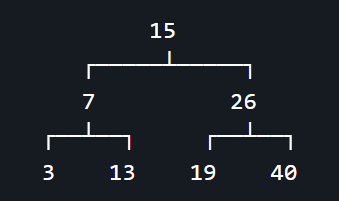

## 介绍

二叉树是一种重要的数据结构，在编写程序时，经常需要以可读性较强的方式打印二叉树结构，以便更好地理解和调试代码。

本节将介绍一个简单而有效的二叉树打印工具，以及如何使用该工具。

## 使用效果

```java
public class Main {
	public static void main(String[] args) {
		BinarySerchTree<Integer> bst = new BinarySerchTree<>(); // 自己写的一个二叉搜索树
		// 添加若干节点
		bst.add(new Integer(15));
		bst.add(new Integer(7));
		bst.add(new Integer(26));
		bst.add(new Integer(13));
		bst.add(new Integer(40));
		bst.add(new Integer(3));
		bst.add(new Integer(19));
		// 调用打印方法
		bst.printTree();
	}
}
```

运行效果：



## 工具代码

这个二叉树打印的工具类有两个，分别是 `PrintableNode` 接口和 `TreePrinter` 工具类。

### PrintableNode 接口

首先，让我们看一下 `PrintableNode` 接口的定义：

```java
public interface PrintableNode {
    PrintableNode getLeft();
    PrintableNode getRight();
    String getData();
}
```

该接口定义了三个方法：

- `getLeft()`: 获取左子节点
- `getRight()`: 获取右子节点
- `getData()`: 获取要打印的节点的值

因此，我们自己的节点类必须`implements`这个`PrintableNode`接口，然后实现这三个方法。

### TreePrinter 工具类

现在，我们来看一下 `TreePrinter` 工具类的代码。

这个工具类提供了一个静态方法 `print`，用于打印二叉树结构。

```java
import java.util.ArrayList;
import java.util.List;

/**
 * 二叉树打印工具类，用于以可读性强的方式打印二叉树结构。
 * 该工具类提供了一个静态方法 `print`，用于打印实现了 `PrintableNode` 接口的树节点。
 * @author 翼同学
 */
public class TreePrinter {

    /**
     * 打印二叉树
     * @param root 二叉树的根节点
     */
    public static void print(PrintableNode root) {
        // 存储每一层的节点值
        List<List<String>> lines = new ArrayList<>();

        // 当前层的节点
        List<PrintableNode> level = new ArrayList<>();
        // 下一层的节点
        List<PrintableNode> next = new ArrayList<>();

        // 将根节点添加到当前层
        level.add(root);
        // 记录当前层的节点数量
        int nn = 1;

        // 记录最宽的节点值的长度
        int widest = 0;

        // 循环遍历树的每一层
        while (nn != 0) {
            // 存储当前层的节点值
            List<String> line = new ArrayList<>();

            // 重置节点数量
            nn = 0;

            // 遍历当前层的每个节点
            for (PrintableNode n : level) {
                if (n == null) {
                    // 节点为空时，添加占位符，并在下一层添加两个null占位符
                    line.add(null);
                    next.add(null);
                    next.add(null);
                } else {
                    // 节点不为空时，获取节点值，并添加到当前层的节点值列表中
                    String aa = n.getData();
                    line.add(aa);
                    
                    // 更新最宽节点值的长度
                    if (aa.length() > widest) widest = aa.length();

                    // 在下一层添加左右子节点，并更新节点数量
                    next.add(n.getLeft());
                    next.add(n.getRight());

                    if (n.getLeft() != null) nn++;
                    if (n.getRight() != null) nn++;
                }
            }

            // 调整最宽节点值长度为偶数
            if (widest % 2 == 1) widest++;

            // 将当前层的节点值列表添加到总的节点值列表中
            lines.add(line);

            // 交换当前层和下一层的节点列表，并清空下一层的列表
            List<PrintableNode> tmp = level;
            level = next;
            next = tmp;
            next.clear();
        }

        // 计算每个节点值的宽度
        int perpiece = lines.get(lines.size() - 1).size() * (widest + 4);

        // 遍历每一层的节点值列表
        for (int i = 0; i < lines.size(); i++) {
            List<String> line = lines.get(i);
            // 计算每个节点值的半宽度
            int hpw = (int) Math.floor(perpiece / 2f) - 1;

            // 非第一层时，处理节点连接线
            if (i > 0) {
                for (int j = 0; j < line.size(); j++) {

                    // 分割节点
                    char c = ' ';
                    if (j % 2 == 1) {
                        if (line.get(j - 1) != null) {
                            c = (line.get(j) != null) ? '┴' : '┘';
                        } else {
                            if (j < line.size() && line.get(j) != null) c = '└';
                        }
                    }
                    System.out.print(c);

                    // 线和空格
                    if (line.get(j) == null) {
                        for (int k = 0; k < perpiece - 1; k++) {
                            System.out.print(" ");
                        }
                    } else {

                        for (int k = 0; k < hpw; k++) {
                            System.out.print(j % 2 == 0 ? " " : "─");
                        }
                        System.out.print(j % 2 == 0 ? "┌" : "┐");
                        for (int k = 0; k < hpw; k++) {
                            System.out.print(j % 2 == 0 ? "─" : " ");
                        }
                    }
                }
                System.out.println();
            }

            // 打印数字行
            for (int j = 0; j < line.size(); j++) {

                String f = line.get(j);
                if (f == null) f = "";
                // 计算节点值两侧的空格数量
                int gap1 = (int) Math.ceil(perpiece / 2f - f.length() / 2f);
                int gap2 = (int) Math.floor(perpiece / 2f - f.length() / 2f);

                // 数字
                for (int k = 0; k < gap1; k++) {
                    System.out.print(" ");
                }
                System.out.print(f);
                for (int k = 0; k < gap2; k++) {
                    System.out.print(" ");
                }
            }
            System.out.println();

            // 每层节点值宽度减半
            perpiece /= 2;
        }
    }
}
```

## 如何使用？

现在，我们将演示如何使用 `TreePrinter` 工具类来打印二叉树。

首先，确保你的二叉树节点实现了 `PrintableNode` 接口。比如：

```java
// 示例二叉树节点实现
public class Node<E> implements PrintableNode {
	E element;
	
	Node<E> left;
	Node<E> right;
	Node<E> parent;
	
	public Node(E element, Node<E> parent) {
		this.element = element;
		this.parent = parent;
	}
	
	@Override
    public PrintableNode getLeft() {
        return left;
    }

    @Override
    public PrintableNode getRight() {
        return right;
    }

    @Override
    public String getData() {
        return element.toString();
    }
}
```

然后，在自己的二叉树类中，声明一个`printTree`方法，调用`TreePrinter`类的静态方法`print`，将根结点`root`传进去即可。

```java
public class BinarySerchTree<E> {
	// 根节点
	private Node<E> root; 

	// 若干二叉树的方法...

	// 打印二叉树
	public void printTree() {
		TreePrinter.print(root);
	}
}
```

