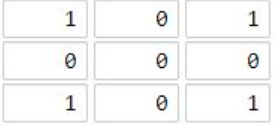
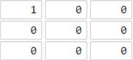
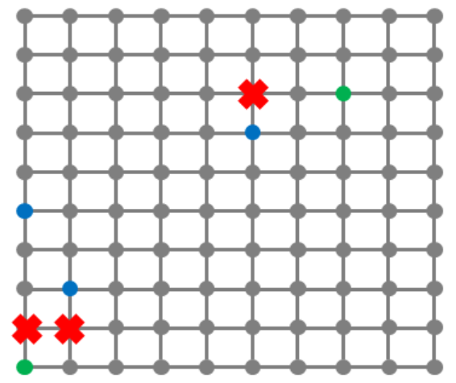

## 1. 前言

本节，我们来看广度优先搜索。在开始记录之前，我们先来看一些小技巧：

### 1.1 四向移动

在一些题目中，我们经常需要在二维网格中进行四向移动（上下左右地走），这四个方向可以用一个二维向量来表示：

- 左：$(-1, 0)$
- 上：$(0, 1)$
- 右：$(1, 0)$
- 下：$(0, -1)$

大部分时候我们会使用一个二维数组来表示这四个向量（或者两个一维数组）。

但其实也可以将这四个二维向量的 $x$ 和 $y$ 坐标连续地放在**一个一维数组**中，形成一个移动向量数组：

```java
static int[] move = new int[]{-1, 0, 1, 0, -1};
```

这样，我们就可以通过一个索引 $i$ 来方便地获取到一个方向的向量。举个栗子，对于当前坐标 $(x, y)$ ，我们可以通过以下方式来进行移动：

```java
// i为0，1，2，3分别表示左、上、右、下四个方向
x = x + move[i];
y = y + move[i+1];
```

这种方法的优点是代码简洁，易于理解，同时也减少了代码的冗余。在处理二维平面的移动问题时非常实用。

### 1.2 数组方式实现队列

广度优先搜索（BFS）是一种常见的图遍历算法，它的特点是按照“先进先出”的原则访问节点，因此我们通常会使用队列来存储待访问的节点。

我们通常会使用如下的队列来存储待访问的节点：

```java
Queue<int[]> queue = new LinkedList<>();
```

然后使用`queue.offer(new int[]{x, y})`来添加新的待访问节点，使用`queue.poll()`来获取并移除下一个待访问的节点。

但在一些笔试或者竞赛中，我们也会选择使用**数组来模拟队列**。具体的，我们可以使用一个二维数组`queue`来存储待访问的节点，使用两个指针`l`和`r`来分别表示队列的头部和尾部。

```java
public static int[][] queue = new int[MAXN * MAXM][2];
public static int l, r;
```


然后可以使用如下的方法来**添加新的待访问节点**：

```java
public static void push(int x, int y) {
    queue[r][0] = x;
    queue[r++][1] = y;
}
```

使用如下的方法来**获取并移除下一个待访问的节点**：

```java
public static int[] poll() {
    return new int[] {queue[l][0], queue[l++][1]};
}
```

> 这里的 `l` 和 `r` 分别代表队列的头部和尾部的索引：
>
> - 当我们向队列中添加一个元素时，我们将元素添加到索引为 `r` 的位置，然后将 `r` 加一，表示队列尾部向后移动了一位。
> - 同理，当我们从队列中取出一个元素时，我们取出索引为 `l` 的元素，然后将 `l` 加一，表示队列头部向后移动了一位。
>
> 因此，这里的 `++` 操作是为了模拟队列的这种行为。

## 2、广度优先搜索

### 2.1 概念

> 广度优先搜索（Breadth-First Search，简称BFS）是一种用于遍历或搜索树或图的算法。这个算法从图的某一节点（或树的根）开始，访问其所有相邻的节点，然后对每个相邻节点，再访问它们的未被访问过的邻节点，以此类推，直到所有节点都被访问过。

广度优先搜索的特点就是“先宽后深”，也就是先访问离起始节点最近的节点，然后再访问离起始节点次近的节点，因此，我们可以用队列来实现这个算法。每次将一个节点的所有邻节点加入队列，然后从队列中取出节点进行访问。


### 2.2 如何理解？

说白了，我们可以将广度优先搜索理解为“水波扩散”，想象一下，你在一个平静的湖面上扔了一块石头，石头落入水面的那一点，就像是广度优先搜索的起始节点。石头落水后，水面会形成一圈圈扩散开去的波纹，每一圈波纹就像是从起始节点开始，经过相同步数可以到达的所有节点。

波纹总是先覆盖离落水点最近的水面，然后再逐渐扩散到更远的地方，这就像广度优先搜索先访问离起始节点最近的节点，再访问离起始节点次近的节点，依次类推。

广度优先搜索在很多问题中都有应用，例如求解最短路径问题、检查图是否连通、求解迷宫问题等，我们在后面的题目会逐渐看到这些例子。

### 2.3 伪代码

广度优先搜索通用的伪代码如下：

1. 创建一个队列 `Q` 和一个集合/哈希表 `visited` 用于记录已访问过的节点
2. 将起始节点 `start` 加入到队列 `Q` 和集合 `visited` 中
3. 当队列 `Q` 不为空时，执行以下操作：
   1. 从队列 `Q` 中取出一个节点，称为当前节点
   2. 检查当前节点是否是目标节点。如果是，我们找到了目标，可以结束搜索
   3. 如果当前节点不是目标节点，那么访问它的所有未访问过的邻居节点，将这些邻居节点加入到队列 `Q` 和集合 `visited` 中
4. 如果队列 `Q` 为空，但我们还没有找到目标节点，那么目标节点不可达

> 记录：
>
> - 在竞赛中，上述的队列以及集合/哈希表基本上都会使用数组来实现。当然也可以使用Java的集合类（偷懒一下）。
> - 哈希表有啥用？在 BFS 进行时，进入队列的节点需要标记状态，防止同一个节点重复进出队列。我们不希望节点在扩展的时候又回到上游，周而复始地扩展，因此需要标记一下访问状态。
> - 难点：虽然 BFS 是一个理解难度很低的算法，但是其难点在于节点如何找到路、路的展开和以及剪枝设计。这些都需要根据具体的问题来进行设计和实现。

---

## 3. 实战

### 3.1 迷宫寻路

> [洛谷链接：迷宫寻路](https://www.luogu.com.cn/problem/B3625)

**题目描述**

机器猫被困在一个矩形迷宫里。

迷宫可以视为一个 $n*m$ 矩阵，每个位置要么是空地，要么是墙。机器猫只能从一个空地走到其上、下、左、右的空地。

机器猫初始时位于 $(1, 1)$ 的位置，问能否走到 $(n, m)$ 位置。

**输入格式**

第一行，两个正整数 $n,m$。  

接下来 $n$ 行，输入这个迷宫。每行输入一个长为 $m$ 的字符串，`#` 表示墙，`.` 表示空地。

**输出格式**

仅一行，一个字符串。如果机器猫能走到 $(n, m)$，则输出 `Yes`；否则输出 `No`。


**样例输入 #1**

```yml
3 5
.##.#
.#...
...#.
```

**样例输出 #1**

```yml
Yes
```

**提示**

路线如下：$(1,1)\to (2,1) \to (3,1) \to (3,2)\to (3,3) \to (2, 3) \to (2, 4) \to (2, 5) \to (3, 5)$

**数据规模与约定**：

对于 $100\%$ 的数据，保证 $1 \leq n, m \leq 100$ ，且 $(1,1)$ 和 $(n, m)$ 均为空地。

**解题思路**：

这道题就是最经典的模板题，也有其他的解法，比如深搜（dfs）。

这节我们来看看用广搜怎么做。


题目要求是，从源点 `(0, 0)` 出发，看是否能够到达 `(n-1, m-1)` 位置。

解题步骤如下：

1. 初始化队列和访问标记数组。队列用于存储待访问的节点，访问标记数组用于记录每个位置是否被访问过。

2. 将起点加入队列，并标记为已访问。

3. 当队列不为空时，从队列中取出一个节点。

4. 如果这个节点是终点，那么输出"Yes"并结束程序。

5. 如果这个节点不是终点，那就扩展，按照四个方向（左、上、右、下）进行扩展，获取邻居节点。

6. 如果某个方向是可行的（即邻居在迷宫内、是空地、并且没有被访问过），那么将其加入队列，并标记为已访问。

7. 如果遍历完所有可达的节点都没有找到终点，那么输出"No"。

```java
import java.util.Scanner;

public class Main {
    static int MAXN = 101, MAXM = 101;
    static int[] move = new int[]{-1, 0, 1, 0, -1};	// 左、上、右、下依次访问
    static int[][] queue = new int[MAXN * MAXM][2];	// 队列，存储待访问的节点
    static int l, r, n, m;

    public static void main(String[] args) {
        Scanner in = new Scanner(System.in);
        n = in.nextInt();
        m = in.nextInt();
        in.nextLine();
        
        // 读取迷宫g的内容
        char[][] g = new char[n][m];
        for (int i = 0; i < n; i++) {
            g[i] = in.nextLine().toCharArray();
        }
        in.close();
        
        boolean[][] visited = new boolean[n][m]; // 每个位置是否被访问过

        push(0, 0); // 将起点加入队列，并标记为已访问
        
        visited[0][0] = true;
        
        // 当队列不为空时，继续搜索
        while (l < r) {
            // 从队列中取出一个节点
            int[] node = poll();
            
            // 如果这个节点是终点，那么输出"Yes"并结束程序
            if (node[0] == n-1 && node[1] == m-1) {
                System.out.println("Yes");
                return;
            }
            
            // 遍历这个节点的四个方向（左、上、右、下）
            for (int i = 0, x, y; i < 4; i++) {
                x = node[0] + move[i];
                y = node[1] + move[i+1];
                
                // 如果这个方向是可行的（即在迷宫内、是空地、并且没有被访问过），那么将其加入队列，并标记为已访问
                if (check(x, y) && g[x][y] == '.' && !visited[x][y]) {
                    push(x, y);
                    visited[x][y] = true;
                }
            }
        }
        
        // 如果遍历完所有可达的节点都没有找到终点，那么输出"No"
        System.out.println("No");
    }

    // 将一个节点加入队列的尾部
    public static void push(int x, int y) {
        queue[r][0] = x;
        queue[r++][1] = y;
    }

    // 从队列的头部取出一个节点
    public static int[] poll() {
        return new int[] {queue[l][0], queue[l++][1]};
    }
    
    public static boolean check(int x, int y) {
    	return x >= 0 && x < n && y >= 0 && y < m;
    }
}
```


### 3.2 01 矩阵

> [AcWing 链接：01 矩阵](https://www.acwing.com/problem/content/description/3086/)

给定一个 $n×m$ 的 $01$ 矩阵：

```yml
a11 a12 ... a1m
...
an1 an2 ... anm
```

定义 $a_{ij}$ 与 $a_{kl}$  之间的距离为 $D(a_{ij},a_{kl})=|i−k|+|j−l|$ 。对于每个元素 $a_{ij}$，请求出与它距离最近且值为 $1$ 的元素 $a_{kl}$ 和它的距离是多少。

另外注意，当元素 $a_{ij}$ 本身就为 $1$ 时，与它距离最近且值为 $1$ 的元素就是它自己，距离为 $0$。

**输入格式**

第一行为两个整数，分别代表 $n$ 和 $m$。接下来的 $n$ 行，第 $i$ 行的第 $j$ 个字符代表 $a_{ij}$。

**输出格式**

共 $n$ 行，第 $i$ 行的第 $j$ 个数字表示 $a_{ij}$ 与其距离最近且值为 $1$ 的元素的距离。

**数据范围**

- $1≤n,m≤1000$


**输入样例：**

```yml
3 4
0001
0011
0110
```

**输出样例：**

```yml
3 2 1 0
2 1 0 0
1 0 0 1
```


**解题思路：**

这道题就是很典型的广度优先搜索模板题。如何求解？

说白了，就是**从值为1的元素开始搜索，然后逐步向外扩展，直到所有元素都被访问过。**

实际编码时：

- 我们准备一个**队列** `queue`，用于存储待访问的元素，准备一个二维数组 `ans`，用于存储每个元素到最近的 $1$ 的距离
- 然后遍历一遍`01矩阵`：
  - 将图中所有值为 $1$ 的元素加入到队列中，这些值为 $1$ 的元素就是搜索的起始点。
  - 同时，在遍历的过程中：
    - 如果元素值为 $1$，就将`ans`数组中对应位置设为 $0$，表示与它距离最近且值为 $1$ 的元素就是它自己，距离为 $0$。
    - 如果元素值为 $0$，就将`ans`数组中对应位置设为 $-1$，表示该位置未设置过。
- 接着初始化一个计数器 `cnt` 为 `0`，用于记录当前的距离。
- 当队列不为空时，执行以下操作：
  - 增加计数器 `cnt`
  - 获取当前队列的大小 `size`
  - 对于队列中的每个元素，执行以下操作：
    - 取出队列中的元素
    - 访问该元素的四个方向的邻居
    - 如果邻居在边界内并且其距离为`-1`，那么更新其距离为 `cnt`，并将其添加到队列中
- 结束

参考代码如下：

```java
import java.io.BufferedReader;
import java.io.IOException;
import java.io.InputStreamReader;
import java.io.PrintWriter;

public class Main {

    static final int MAXN = 1001;
    static int n, m, l, r;
    static int[][] queue = new int[MAXN * MAXN][2]; // 队列
    static int[][] ans;
    static int[] move = new int[]{-1, 0, 1, 0, -1};

    public static void main(String[] args) throws IOException {
        BufferedReader bf = new BufferedReader(new InputStreamReader(System.in));
        PrintWriter out = new PrintWriter(System.out);        
        // 读取输入
        String[] nm = bf.readLine().split(" ");
        n = Integer.parseInt(nm[0]);
        m = Integer.parseInt(nm[1]);
        
        ans = new int[n][m];
        l = r = 0;
        for (int i = 0; i < n; i++) {
            String s = bf.readLine();
            for (int j = 0, cur; j < m; j++) {
                cur = s.charAt(j) - '0';
                // 如果当前位置为 0，则距离为 -1（表示未访问），否则为 0
                ans[i][j] = cur == 0 ? -1 : 0;
                if (cur == 1) {
                    queue[r][0] = i;
                    queue[r++][1] = j;
                }
            }
        }
        int cnt = 0;
        // 广度优先搜索
        while (l < r) {
            cnt++;
            int size = r - l; 
            
            for(int k = 0, curX, curY; k < size; k++) { // 遍历size次，处理这一层的所有节点
                curX = queue[l][0];
                curY = queue[l++][1];
                
                for(int i = 0, nx, ny; i<4; i++) {
                    // 上、右、下、左四个方向
                    nx = curX + move[i];
                    ny = curY + move[i+1];
                    
                    // 如果新位置不越界，并且距离为 -1，则更新距离并入队
                    if(nx >= 0 && nx < n && ny >= 0 && ny < m && ans[nx][ny] == -1) {
                        ans[nx][ny] = cnt;
                        // 将此时访问到的节点加入到队列中
                        queue[r][0] = nx;
                        queue[r++][1] = ny;
                    }
                }
            }
        }
        // 输出结果
        for (int i = 0; i < n; i++) {
            for (int j = 0; j < m; j++) {
                out.print(ans[i][j] + " ");
            }
            out.println();
        }
        out.flush();
        bf.close();
    }
}
```

---

### 3.3 地图分析

我们再来看这道力扣题，也是一道模板题：

> 力扣链接：[1162. 地图分析](https://leetcode.cn/problems/as-far-from-land-as-possible/)

你现在手里有一份大小为 `n x n` 的 网格 `grid`，上面的每个 单元格 都用 `0` 和 `1` 标记好了。其中 `0` 代表海洋，`1` 代表陆地。

请你找出一个海洋单元格，这个海洋单元格到离它最近的陆地单元格的距离是最大的，并返回该距离。如果网格上只有陆地或者海洋，请返回 `-1`。

我们这里说的距离是「曼哈顿距离」（ Manhattan Distance）：`(x0, y0)` 和 `(x1, y1)` 这两个单元格之间的距离是 `|x0 - x1| + |y0 - y1|` 。


**示例 1：**





```yml
输入：grid = [[1,0,1],[0,0,0],[1,0,1]]
输出：2
解释： 
海洋单元格 (1, 1) 和所有陆地单元格之间的距离都达到最大，最大距离为 2。
```

**示例 2：**




```yml
输入：grid = [[1,0,0],[0,0,0],[0,0,0]]
输出：4
解释： 
海洋单元格 (2, 2) 和所有陆地单元格之间的距离都达到最大，最大距离为 4。
```


**示例 1：**


```yml
输入：grid = [[1,0,1],[0,0,0],[1,0,1]]
输出：2
解释： 
海洋单元格 (1, 1) 和所有陆地单元格之间的距离都达到最大，最大距离为 2。
```

**示例 2：**


```yml
输入：grid = [[1,0,0],[0,0,0],[0,0,0]]
输出：4
解释： 
海洋单元格 (2, 2) 和所有陆地单元格之间的距离都达到最大，最大距离为 4。
```

**提示：**

- `n == grid.length`
- `n == grid[i].length`
- `1 <= n <= 100`
- `grid[i][j]` 不是 `0` 就是 `1`

**解题思路**：

很简单，我们首先将所有的陆地单元格加入到队列中，然后**从这些陆地单元格开始，一层一层地向外扩展，直到所有的海洋单元格都被访问到**。在这个过程中，我们可以记录下每个海洋单元格到最近的陆地单元格的距离，最后返回这些距离中的最大值。

**算法步骤**：

1. 初始化一个队列，将所有的陆地单元格加入到队列中。
2. 初始化一个二维数组，用于记录每个海洋单元格到最近的陆地单元格的距离。
3. 进行广度优先搜索，每次从队列中取出一个单元格，然后访问它的上下左右四个相邻的单元格。如果相邻的单元格是海洋，并且还没有被访问过，那么就将它加入到队列中，并更新它到最近的陆地单元格的距离。
4. 最后，遍历所有的海洋单元格，找出距离最大的那个，返回其距离。

**参考代码**：

```java
class Solution {
    public int maxDistance(int[][] grid) {
        int[] dx = {-1, 0, 1, 0};
        int[] dy = {0, 1, 0, -1};
        Queue<int[]> queue = new LinkedList<>();
        int m = grid.length, n = grid[0].length;
        // 将所有的陆地格子加入队列
        for (int i = 0; i < m; i++) {
            for (int j = 0; j < n; j++) {
                if (grid[i][j] == 1) {
                    queue.offer(new int[]{i, j});
                }
            }
        }
        // 如果全是海洋或者全是陆地，则直接返回 -1
        if (queue.isEmpty() || queue.size() == m * n) {
            return -1;
        }
        int distance = -1;
        while (!queue.isEmpty()) {
            distance++;
            int size = queue.size();
            for (int i = 0; i < size; i++) {
                int[] point = queue.poll();
                int x = point[0], y = point[1];
                for (int j = 0; j < 4; j++) {
                    int newX = x + dx[j];
                    int newY = y + dy[j];
                    if (newX < 0 || newX >= m || newY < 0 || newY >= n || grid[newX][newY] == 1) {
                        continue;
                    }
                    queue.offer(new int[]{newX, newY});
                    grid[newX][newY] = 1; // 标记为已访问
                }
            }
        }
        return distance;
    }
}
```

这段代码首先将所有的陆地单元格加入到队列中，然后进行广度优先搜索，每次从队列中取出一个单元格，然后访问它的上下左右四个相邻的单元格。如果相邻的单元格是海洋，并且还没有被访问过，那么就将它加入到队列中，并更新它到最近的陆地单元格的距离。最后，返回最大的距离。

---

### 3.4 最优配餐

> AcWing 链接：[01 矩阵](https://www.acwing.com/problem/content/3208/)


栋栋最近开了一家餐饮连锁店，提供外卖服务。

随着连锁店越来越多，怎么合理的给客户送餐成为了一个急需解决的问题。

栋栋的连锁店所在的区域可以看成是一个 $n×n$ 的方格图（如下图所示），方格的格点上的位置上可能包含栋栋的分店（绿色标注）或者客户（蓝色标注），有一些格点是不能经过的（红色标注）。

方格图中的线表示可以行走的道路，相邻两个格点的距离为 1。

栋栋要送餐必须走可以行走的道路，而且不能经过红色标注的点。



送餐的主要成本体现在路上所花的时间，每一份餐每走一个单位的距离需要花费 $1$ 块钱。

每个客户的需求都可以由栋栋的任意分店配送，每个分店没有配送总量的限制。

现在你得到了栋栋的客户的需求，请问在最优的送餐方式下，送这些餐需要花费多大的成本。

**输入格式**

输入的第一行包含四个整数 $n,m,k,d$，分别表示方格图的大小、栋栋的分店数量、客户的数量，以及不能经过的点的数量。

接下来 $m$ 行，每行两个整数 $x_i$ , $y_i$，表示栋栋的一个分店在方格图中的横坐标和纵坐标。

接下来 $k$ 行，每行三个整数 $x_i$ , $y_i$ , $c_i$，分别表示每个客户在方格图中的横坐标、纵坐标和订餐的量。（注意，可能有多个客户在方格图中的同一个位置）

接下来 $d$ 行，每行两个整数，分别表示每个不能经过的点的横坐标和纵坐标。

**输出格式**

输出一个整数，表示最优送餐方式下所需要花费的成本。

**数据范围**

前 $30\%$ 的评测用例满足：$1≤n≤20$。
前 $60\%$ 的评测用例满足：$1≤n≤100$。
所有评测用例都满足：$1≤n≤1000$，$1≤m,k,d≤n^2$,$1≤x_i,y_i≤n$。
可能有多个客户在同一个格点上。
每个客户的订餐量不超过 10001000，每个客户所需要的餐都能被送到。

**输入样例：**

```yml
10 2 3 3
1 1
8 8
1 5 1
2 3 3
6 7 2
1 2
2 2
6 8
```

**输出样例：**

```yml
29
```

**解题思路**：

这道题也不难，主要思路是==从每个分店出发，通过BFS找到每个客户的最短路径，计算总的配送成本==。

**解题步骤**：

1. 初始化一个二维数组 `dist` 来存储每个位置到分店的最短距离，初始值设为无穷大。同时，初始化一个二维数组 `g` 来表示每个位置是否可以通行，初始值设为 `true`。

2. 读取分店的坐标，将分店的位置加入队列，并将 `dist` 中对应的距离设为 0。

3. 读取客户的信息，包括坐标和订餐量，存入 `consumer` 数组。

4. 读取不能通行的位置，将 `g` 中对应的值设为 `false`。

5. 进行BFS。从队列中取出一个位置，遍历其四个方向的邻居。如果邻居在图中并且可以通行，且从当前位置到邻居的距离小于 `dist` 中存储的距离，就更新 `dist` 中的距离，并将邻居加入队列。

6. BFS结束后，遍历每个客户，将 `dist` 中对应的距离乘以订餐量，累加得到总的配送成本。

**参考代码**：

```java
import java.io.BufferedReader;
import java.io.IOException;
import java.io.InputStreamReader;
import java.io.PrintWriter;
import java.io.StreamTokenizer;
import java.util.Arrays;

public class Main {
    // 定义常量 N
    static final int N = 1010;
    // 定义全局变量
    static boolean[][] g = new boolean[N][N];
    static int[][] dist = new int[N][N];
    static int[][] kehu = new int[N * N][3];
    static int[][] queue = new int[N*N][2];
    static int[] move = new int[]{-1, 0, 1, 0, -1};
    static int n, m, k, d, l, r;

    // 广度优先搜索
    static void bfs() {
        while (l < r) {
            int x = queue[l][0];
            int y = queue[l++][1];
            
            for(int i = 0, nx, ny; i<4; i++) {
            	nx = x + move[i];
            	ny = y + move[i+1];
            	// 如果新位置在矩阵内且可以通行
            	if (nx >= 0 && nx < N && ny >= 0 && ny < N && g[nx][ny]) {
            		// 如果距离变小
                    if (dist[nx][ny] > dist[x][y] + 1) {
                    	// 更新距离
                    	dist[nx][ny] = dist[x][y] + 1;
                        // 将邻居入队
                        offer(nx, ny); 
                    }
                }
            }
        }
    }
    
    // 将位置加入队列
    public static void offer(int x, int y) {
    	queue[r][0] = x;
    	queue[r++][1] = y;    	
    }
    
    // 初始化
    public static void build() {
    	l = r = 0;
    	for (int[] row : dist) {
        	Arrays.fill(row, Integer.MAX_VALUE);
        }
    	for (int i = 1; i <= n; i++) {
    		Arrays.fill(g[i], 1, n + 1, true);
    	}
    }

    public static void main(String[] args) throws IOException {
    	BufferedReader bf = new BufferedReader(new InputStreamReader(System.in));
    	StreamTokenizer in = new StreamTokenizer(bf);
    	PrintWriter out = new PrintWriter(System.out);
        
        while(in.nextToken() != StreamTokenizer.TT_EOF) {
        	n = (int)in.nval;
        	in.nextToken();
            m = (int)in.nval;
            in.nextToken();
            k = (int)in.nval;
            in.nextToken();
            d = (int)in.nval;
            
            build();

            while (m-- > 0) { //分店
            	in.nextToken();
                int x = (int)in.nval;
                in.nextToken();
                int y = (int)in.nval;
                offer(x, y); //分店入队列
                dist[x][y] = 0; //分店的送餐距离为 0
            }

            for (int i = 0; i < k; i++) { //保存客户信息
            	in.nextToken();
                kehu[i][0] = (int)in.nval;
                in.nextToken();
                kehu[i][1] = (int)in.nval;
                in.nextToken();
                kehu[i][2] = (int)in.nval;
            }

            while (d-- > 0) { //不能走的地方为 false
            	in.nextToken();
                int x = (int)in.nval;
                in.nextToken();
                int y = (int)in.nval;
                g[x][y] = false;
            }

            bfs(); //广度优先遍历

            long res = 0;
     
            for(int i = 0, xi, yi, num; i < k; i++) {
            	xi = kehu[i][0];
            	yi = kehu[i][1];
            	num = kehu[i][2];
            	// 计算总花费
            	res += (long)dist[xi][yi] * num;
            }
            
            out.println(res);
        }
        
        out.flush();
        bf.close();
        out.close();
    }
}
```


### 3.5 贴纸拼词

> 力扣链接：[691. 贴纸拼词](https://leetcode.cn/problems/stickers-to-spell-word/)

我们有 `n` 种不同的贴纸。每个贴纸上都有一个小写的英文单词。

您想要拼写出给定的字符串 `target` ，方法是从收集的贴纸中切割单个字母并重新排列它们。如果你愿意，你可以多次使用每个贴纸，每个贴纸的数量是无限的。

返回你需要拼出 `target` 的最小贴纸数量。如果任务不可能，则返回 `-1` 。

**注意：** 在所有的测试用例中，所有的单词都是从 `1000` 个最常见的美国英语单词中随机选择的，并且 `target` 被选择为两个随机单词的连接。

 

**示例 1：**

```yml
输入： stickers = ["with","example","science"], target = "thehat"
输出：3
解释：
我们可以使用 2 个 "with" 贴纸，和 1 个 "example" 贴纸。
把贴纸上的字母剪下来并重新排列后，就可以形成目标 “thehat” 了。
此外，这是形成目标字符串所需的最小贴纸数量。
```

**示例 2:**

```yml
输入：stickers = ["notice","possible"], target = "basicbasic"
输出：-1
解释：我们不能通过剪切给定贴纸的字母来形成目标“basicbasic”。
```

 

**提示:**

- `n == stickers.length`
- `1 <= n <= 50`
- `1 <= stickers[i].length <= 10`
- `1 <= target.length <= 15`
- `stickers[i]` 和 `target` 由小写英文单词组成


**解题思路：**

这道题有很多种解法（比如动态规划，深度优先搜索等）。

现在，我们关注，怎么用BFS来解决这道题。首先，我们可以发现，将字符串（target）排个序，是不会影响最终结果，现在我们只考虑使用哪些贴纸，最终能拼接出target（即使贴纸有剩余的字符也没事），那么思路来了：

我们将target作为搜索的起始点，然后每次都尝试使用一个贴纸去匹配并消除target中的字符，然后得到一个新字符串（逐渐匹配，消除，展开到下一层），将新的字符串作为待访问的元素加入到队列中，然后继续扩展，直到目标字符串target变为空字符串，就意味着我们找到了答案，此时返回展开的层数即可。

步骤如下：

1. 初始化一个队列和一个访问集合。队列用于存储待处理的字符串，访问集合用于记录已经处理过的字符串，避免重复处理。

2. 将所有贴纸和目标字符串按字母排序，并将每个贴纸的首字母对应的贴纸列表存入图中。

3. 将目标字符串加入队列和访问集合，然后开始宽度优先搜索。

4. 在每一轮搜索中，从队列中取出一个字符串，然后遍历与该字符串首字母对应的所有贴纸，尝试使用贴纸消除字符串中的字符。消除字符的方法是，同时遍历字符串和贴纸，如果字符相同，则同时向后移动，否则只移动字符串的指针。

5. 如果消除字符后的字符串为空，说明已经完全匹配，返回当前的贴纸数量。如果字符串不为空且未被访问过，则将其加入队列和访问集合，等待下一轮处理。

6. 如果队列为空，说明无法匹配目标字符串，返回-1。

参考代码：


```java
class Solution {
	public static String[] queue = new String[500];
	public static int l, r;
    public static HashSet<String> visited = new HashSet<>();
	public static ArrayList<ArrayList<String>> graph = new ArrayList<>();
	static {
		for (int i = 0; i < 26; i++) {
			graph.add(new ArrayList<>());
		}
	}

	public static int minStickers(String[] stickers, String target) {
		build();    // 初始化
        
        // graph用于处理target时，能够快速找到可以用来匹配的贴纸
        // 例如，如果target的首字母是'a'，那么就可以直接从graph中取出下标为0的元素，
        // 即所有首字母为'a'的贴纸，然后尝试使用这些贴纸去匹配字符串。
		for (String str : stickers) {
			str = sort(str);    // 将所有贴纸也排个序
			for (int i = 0; i < str.length(); i++) {
				if (i == 0 || str.charAt(i) != str.charAt(i - 1)) {
					graph.get(str.charAt(i) - 'a').add(str);
				}
			}
		}
		
		target = sort(target);  // 将target进行排序

        push(target);   // 将target入队，作为搜索的出发点

		int cnt = 1;	// 当前是第几层
		
		// BFS
		while (l < r) {
		    // 当前这一层有size个节点
		    int size = r - l;
		    
		    // 遍历该层的所有字符串
		    for (int i = 0; i < size; i++) {
		        // 移除并获取队首元素
		        String cur = queue[l++];
		        
		        // 遍历与当前字符串首字母对应的所有贴纸（小贪心，即先处理前缀对应字符）
		        for (String s : graph.get(cur.charAt(0) - 'a')) {
		            // 尝试使用贴纸s消除字符串cur中的字符，生成新的字符串next
		            String next = next(cur, s);
		            
		            // 如果新的字符串为空，说明已经完全匹配，返回使用的贴纸数量
		            if (next.equals("")) {
		                return cnt;
		            } 
		            // 如果新的字符串不为空且未被访问过，则将其加入队列和访问集合，等待下一轮处理
		            else if (!visited.contains(next)) {
		                visited.add(next);
		                queue[r++] = next;
		            }
		        }
		    }
		    // 处理完当前层的所有字符串后，贴纸数量加1，开始处理下一层
		    cnt++;
		}
		// 如果无法匹配目标字符串，直接返回-1
		return -1;
	}

    public static void build() {    // 初始化
		l = r = 0;
		for (int i = 0; i < 26; i++) {
			graph.get(i).clear();
		}
		visited.clear();
	}
	
	public static void push(String string){ // 入队
		visited.add(string);
		queue[r++] = string;
	}

	public static String sort(String str) { // 字符串排序
		char[] s = str.toCharArray();
		Arrays.sort(s);
		return String.valueOf(s);
	}

	// 使用一个贴纸s去匹配并消除目标字符串t中的字符，生成一个新的字符串next
	public static String next(String t, String s) {
	    StringBuilder builder = new StringBuilder();
	    for (int i = 0, j = 0; i < t.length();) {
	        if (j == s.length()) {
	            builder.append(t.charAt(i++));
	        } else {
	            if (t.charAt(i) < s.charAt(j)) {
	                builder.append(t.charAt(i++));
	            } 
	            else if (t.charAt(i) > s.charAt(j)) {
	                j++;
	            } 
	            else {
	                i++;
	                j++;
	            }
	        }
	    }
	    return builder.toString();
	}
}
```

