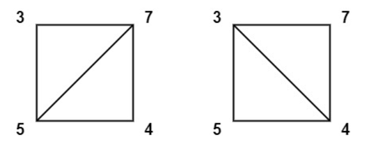
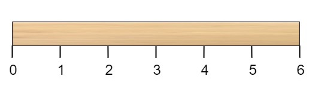
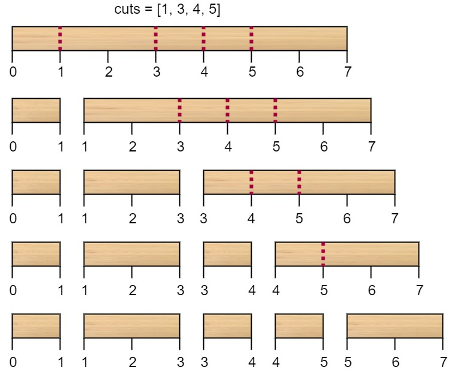

## [让字符串成为回文串的最少插入次数](https://leetcode.cn/problems/minimum-insertion-steps-to-make-a-string-palindrome/)

给定一个字符串 s ，每一次操作你都可以在字符串的任意位置插入任意字符。请返回让 s 成为回文串的 最少操作次数 。

> 「回文串」是正读和反读都相同的字符串。

::: code-tabs

@tab 暴力尝试

```java
public static int minInsertions(String str) {
    char[] s = str.toCharArray();
    int n = s.length;
    return f(s, 0, n - 1);
}

// s[l....r]这个范围上的字符串，整体都变成回文串
// 返回至少插入几个字符
public static int f(char[] s, int l, int r) {
    if (l == r) {
        return 0;
    }
    if (l + 1 == r) {
        return s[l] == s[r] ? 0 : 1;
    }
    // l...r不只两个字符
    if (s[l] == s[r]) {
        return f(s, l + 1, r - 1);
    } else {
        return Math.min(f(s, l, r - 1), f(s, l + 1, r)) + 1;
    }
}
```

@tab 记忆化搜索

```java
public static int minInsertions(String str) {
    char[] s = str.toCharArray();
    int n = s.length;
    int[][] dp = new int[n][n];
    for (int i = 0; i < n; i++) {
        for (int j = i; j < n; j++) {
            dp[i][j] = -1;
        }
    }
    return f(s, 0, n - 1, dp);
}

public static int f(char[] s, int l, int r, int[][] dp) {
    if (dp[l][r] != -1) {
        return dp[l][r];
    }
    int ans;
    if (l == r) {
        ans = 0;
    } else if (l + 1 == r) {
        ans = s[l] == s[l + 1] ? 0 : 1;
    } else {
        if (s[l] == s[r]) {
            ans = f(s, l + 1, r - 1, dp);
        } else {
            ans = Math.min(f(s, l, r - 1, dp), f(s, l + 1, r, dp)) + 1;
        }
    }
    dp[l][r] = ans;
    return ans;
}
```

@tab 动态规划

```java
public static int minInsertions(String str) {
    char[] s = str.toCharArray();
    int n = s.length;
    int[][] dp = new int[n][n];
    // 当 l == r 时，dp[l][r] 初始化为0，由于默认值本身就是0，所以不用显示初始化
    // 当 l+1 == r 时，dp[l][r] 初始化时看对应位置的字符是否相等，填 0 或 1
    for (int l = 0; l < n - 1; l++) {
        dp[l][l + 1] = s[l] == s[l + 1] ? 0 : 1;
    }
    // 接着是严格位置依赖的动态规划
    for (int l = n - 3; l >= 0; l--) {
        for (int r = l + 2; r < n; r++) {
            if (s[l] == s[r]) {
                dp[l][r] = dp[l + 1][r - 1];
            } else {
                dp[l][r] = Math.min(dp[l][r - 1], dp[l + 1][r]) + 1;
            }
        }
    }
    return dp[0][n - 1];
}
```


:::

## [预测赢家](https://leetcode.cn/problems/predict-the-winner/)


给定一个整数数组 nums 。玩家 1 和玩家 2 基于这个数组设计了一个游戏。玩家 1 和玩家 2 轮流进行自己的回合，玩家 1 先手。开始时，两个玩家的初始分值都是 0。

每一回合，玩家从数组的任意一端取一个数字。取到的数字将会从数组中移除，数组长度减1。玩家选中的数字将会加到他的得分上，当数组中没有剩余数字可取时游戏结束，如果玩家 1 能成为赢家，返回 true。

谁获得的分数最多就赢，如果两个玩家得分相等，同样认为玩家 1 是游戏的赢家，也返回 true。你可以假设每个玩家的玩法都会使他的分数最大化。


::: code-tabs

@tab 暴力尝试

```java
public static boolean predictTheWinner(int[] nums) {
    int sum = 0;
    for (int num : nums) {
        sum += num;
    }
    int n = nums.length;
    int first = f(nums, 0, n - 1);
    int second = sum - first;
    return first >= second;
}

// nums[l...r]范围上玩家1做最优决策，返回最佳收益
public static int f(int[] nums, int l, int r) {
    if (l == r) {
        return nums[l];
    }
    if (l == r - 1) {
        return Math.max(nums[l], nums[r]);
    }
    // l....r 不只两个数
    // 可能性1：玩家1拿走nums[l]
    int p1 = nums[l] + Math.min(f(nums, l + 2, r), f(nums, l + 1, r - 1));
    // 可能性2：玩家1拿走nums[r]
    int p2 = nums[r] + Math.min(f(nums, l + 1, r - 1), f(nums, l, r - 2));
    return Math.max(p1, p2);
}
```

@tab 记忆化搜索

```java
public static boolean predictTheWinner(int[] nums) {
    int sum = 0;
    for (int num : nums) {
        sum += num;
    }
    int n = nums.length;
    int[][] dp = new int[n][n];
    for (int i = 0; i < n; i++) {
        for (int j = i; j < n; j++) {
            dp[i][j] = -1;
        }
    }
    int first = f(nums, 0, n - 1, dp);
    int second = sum - first;
    return first >= second;
}

public static int f(int[] nums, int l, int r, int[][] dp) {
    if (dp[l][r] != -1) {
        return dp[l][r];
    }
    int ans;
    if (l == r) {
        ans = nums[l];
    } else if (l == r - 1) {
        ans = Math.max(nums[l], nums[r]);
    } else {
        int p1 = nums[l] + Math.min(f(nums, l + 2, r, dp), f(nums, l + 1, r - 1, dp));
        int p2 = nums[r] + Math.min(f(nums, l + 1, r - 1, dp), f(nums, l, r - 2, dp));
        ans = Math.max(p1, p2);
    }
    dp[l][r] = ans;
    return ans;
}
```

@tab 动态规划

```java
public static boolean predictTheWinner(int[] nums) {
    int sum = 0;
    for (int num : nums) {
        sum += num;
    }
    int n = nums.length;
    int[][] dp = new int[n][n];
    for (int i = 0; i < n - 1; i++) {
        dp[i][i] = nums[i];
        dp[i][i + 1] = Math.max(nums[i], nums[i + 1]);
    }
    dp[n - 1][n - 1] = nums[n - 1];
    for (int l = n - 3; l >= 0; l--) {
        for (int r = l + 2; r < n; r++) {
            dp[l][r] = Math.max(
                    nums[l] + Math.min(dp[l + 2][r], dp[l + 1][r - 1]),
                    nums[r] + Math.min(dp[l + 1][r - 1], dp[l][r - 2]));
        }
    }
    int first = dp[0][n - 1];
    int second = sum - first;
    return first >= second;
}
```


:::

## [多边形三角剖分的最低得分](https://leetcode.cn/problems/minimum-score-triangulation-of-polygon/)

你有一个凸的 `n` 边形，其每个顶点都有一个整数值。给定一个整数数组 `values` ，其中 `values[i]` 是第 `i` 个顶点的值（即 **顺时针顺序** ）。

假设将多边形 **剖分** 为 `n - 2` 个三角形。对于每个三角形，该三角形的值是顶点标记的**乘积**，三角剖分的分数是进行三角剖分后所有 `n - 2` 个三角形的值之和。

返回 *多边形进行三角剖分后可以得到的最低分* 。

比如：

```
输入：values = [3,7,4,5]
输出：144
解释：有两种三角剖分，可能得分分别为：3*7*5 + 4*5*7 = 245，或 3*4*5 + 3*4*7 = 144。最低分数为 144。
```




再比如：

```
输入：values = [1,3,1,4,1,5]
输出：13
解释：最低分数三角剖分的得分情况为 1*1*3 + 1*1*4 + 1*1*5 + 1*1*1 = 13。
```


::: code-tabs

@tab 记忆化搜索

```java
public static int minScoreTriangulation(int[] arr) {
	int n = arr.length;
	int[][] dp = new int[n][n];
	for (int i = 0; i < n; i++) {
		for (int j = 0; j < n; j++) {
			dp[i][j] = -1;
		}
	}
	return f(arr, 0, n - 1, dp);
}

// 计算从顶点l到顶点r的多边形进行三角剖分后可以得到的最低分
public static int f(int[] arr, int l, int r, int[][] dp) {
	if (dp[l][r] != -1) {
		return dp[l][r];
	}
	int ans = Integer.MAX_VALUE;
	if (l == r || l == r - 1) {	// 一个顶点 || 两个顶点
		ans = 0;
	} else {
		// 枚举所有可能的分割点m，将原问题分解为两个更小的子问题
		// 即计算从顶点l到顶点m的多边形的最低分和从顶点m到顶点r的多边形的最低分
		for (int m = l + 1, cur; m < r; m++) {
			cur = (arr[l] * arr[m] * arr[r]) + f(arr, l, m, dp) + f(arr, m, r, dp);
			ans = Math.min(ans, cur);
		}
	}
	dp[l][r] = ans;
	return ans;
}
```

@tab 动态规划

```java
public static int minScoreTriangulation(int[] arr) {
    int n = arr.length;
    int[][] dp = new int[n][n];
    for (int l = n - 3; l >= 0; l--) {
        for (int r = l + 2; r < n; r++) {
            dp[l][r] = Integer.MAX_VALUE;
            for (int m = l + 1, cur; m < r; m++) {
                cur = (arr[l] * arr[m] * arr[r]) + dp[l][m] + dp[m][r];
                dp[l][r] = Math.min(dp[l][r], cur);
            }
        }
    }
    return dp[0][n - 1];
}
```


:::

## [切棍子的最小成本](https://leetcode.cn/problems/minimum-cost-to-cut-a-stick/)

有一根长度为 `n` 个单位的木棍，棍上从 `0` 到 `n` 标记了若干位置。例如，长度为 **6** 的棍子可以标记如下：



给你一个整数数组 `cuts` ，其中 `cuts[i]` 表示你需要将棍子切开的位置。你可以按顺序完成切割，也可以根据需要更改切割的顺序。

每次切割的成本都是当前要切割的棍子的长度，切棍子的总成本是历次切割成本的总和。

对棍子进行切割将会把一根木棍分成两根较小的木棍。这两根木棍的长度和就是切割前木棍的长度。

请返回切棍子的**最小总成本**。

举个例子：

```
输入：n = 7, cuts = [1,3,4,5]
输出：16
```

为什么等于16？

我们看到 `cuts`数组为`[1,3,4,5]`，如果按照 `[1, 3, 4, 5]` 的顺序切割，则情况如下：



第一次切割长度为 7 的棍子，成本为 7 。第二次切割长度为 6 的棍子（即第一次切割得到的第二根棍子），第三次切割为长度 4 的棍子，最后切割长度为 3 的棍子。总成本为 7 + 6 + 4 + 3 = 20 。

如果调整顺序，按照 `[3, 5, 1, 4]` 的顺序切割，则总成本为`16`（7 + 4 + 3 + 2），示例图如下：


::: code-tabs

@tab 记忆化搜索

```java
public static int minCost(int n, int[] cuts) {
	int m = cuts.length;
	Arrays.sort(cuts);
	int[] arr = new int[m + 2];
	arr[0] = 0;
	for (int i = 1; i <= m; ++i) {
		arr[i] = cuts[i - 1];
	}
	arr[m + 1] = n;
	int[][] dp = new int[m + 2][m + 2];
	for (int i = 1; i <= m; i++) {
		for (int j = 1; j <= m; j++) {
			dp[i][j] = -1;
		}
	}
	return f(arr, 1, m, dp);
}

// 在给定的切割位置范围内，让切点都切完，切割棍子的最小总成本
public static int f(int[] arr, int l, int r, int[][] dp) {
	if (l > r) {
		return 0;
	}
	if (l == r) {
		return arr[r + 1] - arr[l - 1];
	}
	if (dp[l][r] != -1) {
		return dp[l][r];
	}
	int ans = Integer.MAX_VALUE;
	// 尝试以每一个切点作为第一次切割（最初的那一刀）
	for (int k = l; k <= r; k++) {
		ans = Math.min(ans, f(arr, l, k - 1, dp) + f(arr, k + 1, r, dp));
	}
	// 在[l......r]范围内每切一刀，所花费的代价是 arr[r+1] - arr[l-1]
	ans += arr[r + 1] - arr[l - 1];
	dp[l][r] = ans;
	return ans;
}
```

@tab 动态规划

```java
// 严格位置依赖的动态规划
public static int minCost(int n, int[] cuts) {
    int m = cuts.length;
    Arrays.sort(cuts); 
    int[] arr = new int[m + 2]; 
    arr[0] = 0; 
    for (int i = 1; i <= m; ++i) { 
        arr[i] = cuts[i - 1];
    }
    arr[m + 1] = n;
    
    // dp[i][j]表示在位置i到j之间切割棍子的最小总成本
    int[][] dp = new int[m + 2][m + 2]; 

    // 初始化动态规划数组的对角线元素（l==r）
    for (int i = 1; i <= m; i++) {
        dp[i][i] = arr[i + 1] - arr[i - 1];
    }

    for (int l = m - 1, next; l >= 1; l--) {  // 从后向前，逐步计算dp数组的值
        // 对于每个l，计算所有大于l的r的dp值
        for (int r = l + 1; r <= m; r++) {  
            next = Integer.MAX_VALUE;
            // 枚举所有可能的切割点k
            for (int k = l; k <= r; k++) {  
                // 计算在k点切割的成本，并更新next
                next = Math.min(next, dp[l][k - 1] + dp[k + 1][r]);
            }
            dp[l][r] = arr[r + 1] - arr[l - 1] + next;
        }
    }
    return dp[1][m];
}
```


:::

## [戳气球](https://leetcode.cn/problems/burst-balloons/)

有 `n` 个气球，编号为`0` 到 `n - 1`，每个气球上都标有一个数字，这些数字存在数组 `nums` 中。

现在要求你戳破所有的气球。戳破第 `i` 个气球，你可以获得 `nums[i - 1] * nums[i] * nums[i + 1]` 枚硬币。 这里的 `i - 1` 和 `i + 1` 代表和 `i` 相邻的两个气球的序号。如果 `i - 1`或 `i + 1` 超出了数组的边界，那么就当它是一个数字为 `1` 的气球。

求所能获得硬币的最大数量。

比如：

```
输入：nums = [3,1,5,8]
输出：167
解释：
nums = [3,1,5,8] --> [3,5,8] --> [3,8] --> [8] --> []
coins =  3*1*5  +  3*5*8  +  1*3*8  +  1*8*1 = 167
```

::: code-tabs

@tab 记忆化搜索

```java
public static int maxCoins(int[] nums) {
    int n = nums.length;
    // a b c d e
    // 1 a b c d e 1
    int[] arr = new int[n + 2];
    arr[0] = 1;
    arr[n + 1] = 1;
    for (int i = 0; i < n; i++) {
        arr[i + 1] = nums[i];
    }
    // 初始化dp表的元素值为-1
    int[][] dp = new int[n + 2][n + 2];
    for (int i = 1; i <= n; i++) {
        for (int j = i; j <= n; j++) {
            dp[i][j] = -1;
        }
    }
    // 跑递归
    return f(arr, 1, n, dp);
}

// 在 l 到 r 范围内戳破所有气球能获得的最大硬币数量
// 严格遵循 arr[l-1] 和 arr[r+1] 位置的气球一定没爆的规则
public static int f(int[] arr, int l, int r, int[][] dp) {
    if(l == r) {
        return arr[l - 1] * arr[l] * arr[r + 1];
    }
    if (dp[l][r] != -1) {
        return dp[l][r];
    }
    // l位置的气球最后打爆
    int p1 = arr[l-1] * arr[l] * arr[r+1] + f(arr, l+1, r, dp);
    // r位置的气球最后打爆
    int p2 = arr[l-1] * arr[r] * arr[r+1] + f(arr, l, r-1, dp);

    int ans = Math.max(p1, p2);
    for (int k = l + 1, p3; k < r; k++) {
        // k位置的气球最后打爆
        p3 = arr[l-1] * arr[k] * arr[r+1] + f(arr, l, k-1, dp) + f(arr, k+1, r, dp);
        ans = Math.max(ans, p3);
    }
    dp[l][r] = ans;
    return ans;
}
```

@tab 动态规划

```java
public static int maxCoins2(int[] nums) {
    int n = nums.length;
    int[] arr = new int[n + 2];
    arr[0] = 1;
    arr[n + 1] = 1;
    for (int i = 0; i < n; i++) {
        arr[i + 1] = nums[i];
    }
    int[][] dp = new int[n + 2][n + 2];
    for (int i = 1; i <= n; i++) {
        dp[i][i] = arr[i - 1] * arr[i] * arr[i + 1];
    }
    for (int l = n, ans, p1, p2, p3; l >= 1; l--) {
        for (int r = l + 1; r <= n; r++) {
            p1 = arr[l - 1] * arr[l] * arr[r + 1] + dp[l + 1][r];
            p2 = arr[l - 1] * arr[r] * arr[r + 1] + dp[l][r - 1];
            ans = Math.max(p1, p2);
            for (int k = l + 1; k < r; k++) {
                p3 = arr[l - 1] * arr[k] * arr[r + 1] + dp[l][k - 1] + dp[k + 1][r];
                ans = Math.max(ans, p3);
            }
            dp[l][r] = ans;
        }
    }
    return dp[1][n];
}
```


:::

## [布尔运算](https://leetcode.cn/problems/boolean-evaluation-lcci/)

给定一个布尔表达式和一个期望的布尔结果 result，布尔表达式由 `0` (false)、`1` (true)、`&` (AND)、 `|` (OR) 和 `^` (XOR) 符号组成。实现一个函数，算出有几种可使该表达式得出 `result` 值的括号方法。

举个例子：

```
输入: s = "1^0|0|1", result = 0

输出: 2
解释: 两种可能的括号方法是
1^(0|(0|1))
1^((0|0)|1)
```

::: code-tabs

@tab 记忆化搜索

```java
public static int countEval(String str, int result) {
    char[] s = str.toCharArray();
    int n = s.length;
    int[][][] dp = new int[n][n][];
    int[] ft = f(s, 0, n - 1, dp);
    // ft[0]: 结果为false的方法数
    // ft[1]: 结果为true的方法数
    return ft[result];
}

// s[l...r]是表达式的一部分，且一定符合以下范式：
// 0/1 逻 0/1 逻 0/1
// l l+1 l+2 l+3....... r
public static int[] f(char[] s, int l, int r, int[][][] dp) {
    if (dp[l][r] != null) {
        return dp[l][r];
    }
    int f = 0;
    int t = 0;
    if (l == r) { // 只有一个布尔值，根据这个布尔值来更新 f 和 t
        f = s[l] == '0' ? 1 : 0;
        t = s[l] == '1' ? 1 : 0;
    } else {
        // 否则遍历所有可能的分割点
        int[] tmp;
        // 枚举每一个逻辑符号k，范围在 [l+1 ... r-1] 且 k+=2
        for (int k = l + 1, a, b, c, d; k < r; k += 2) {
            tmp = f(s, l, k - 1, dp);
            a = tmp[0]; // a：左侧子表达式（从 l 到 k - 1）得到结果 0 的方法数
            b = tmp[1]; // b：左侧子表达式（从 l 到 k - 1）得到结果 1 的方法数
            tmp = f(s, k + 1, r, dp);
            c = tmp[0]; // c：右侧子表达式（从 k + 1 到 r）得到结果 0 的方法数
            d = tmp[1]; // d：右侧子表达式（从 k + 1 到 r）得到结果 1 的方法数

            // 根据分割点两侧子表达式的结果以及当前的运算符来更新 f 和 t
            if (s[k] == '&') {
                f += a * c + a * d + b * c;
                t += b * d;
            } else if (s[k] == '|') {
                f += a * c;
                t += a * d + b * c + b * d;
            } else {
                f += a * c + b * d;
                t += a * d + b * c;
            }
        }
    }
    int[] ft = new int[] { f, t };
    dp[l][r] = ft;
    return ft;
}
```

@tab 动态规划

```java
public static int countEval(String str, int result) {
    int n = str.length();
    // dp[i][j][k] 表示从 i 到 j 的子表达式得到 k 的方法数
    int[][][] dp = new int[n][n][2];
    // 初始化 dp 数组的对角线元素（即表达式的长度为1）
    // 它只能得到一个结果，即它自身的值
    for (int i = 0; i < n; i += 2) {
        dp[i][i][str.charAt(i) - '0'] = 1;
    }
    // 按照子表达式长度从小到大的顺序遍历所有可能的子表达式
    for (int len = 3; len <= n; len += 2) {
        // 遍历所有可能的子表达式起始位置
        for (int i = 0; i <= n - len; i += 2) {
            int j = i + len - 1;
            // 遍历所有可能的分割点
            for (int k = i + 1; k < j; k += 2) {
                char op = str.charAt(k);
                // 根据分割点两侧的子表达式和当前的运算符来更新 dp 数组
                for (int a = 0; a <= 1; a++) {
                    for (int b = 0; b <= 1; b++) {
                        int val = calc(a, b, op);
                        dp[i][j][val] += dp[i][k - 1][a] * dp[k + 1][j][b];
                    }
                }
            }
        }
    }
    // 返回整个表达式得到 result 的方法数
    return dp[0][n - 1][result];
}

// 计算 a op b 的结果
private static int calc(int a, int b, char op) {
    switch (op) {
        case '&':
            return a & b;
        case '|':
            return a | b;
        case '^':
            return a ^ b;
        default:
            return 0;
    }
}
```


:::

## [奇怪的打印机](https://leetcode.cn/problems/strange-printer/)

有台奇怪的打印机有以下两个特殊要求：

- 打印机每次只能打印由 **同一个字符** 组成的序列。
- 每次可以在从起始到结束的任意位置打印新字符，并且会覆盖掉原来已有的字符。

给你一个字符串 `s` ，你的任务是计算这个打印机打印它需要的最少打印次数。

**示例 1：**

```
输入：s = "aaabbb"
输出：2
解释：首先打印 "aaa" 然后打印 "bbb"。
```

**示例 2：**

```
输入：s = "aba"
输出：2
解释：首先打印 "aaa" 然后在第二个位置打印 "b" 覆盖掉原来的字符 'a'。
```

**提示：**

- `1 <= s.length <= 100`
- `s` 由小写英文字母组成

::: code-tabs

@tab 记忆化搜索

```java
class Solution {
    public int strangePrinter(String s) {
        char[] str = s.toCharArray();
        int n = str.length;
        int[][] dp = new int[n][n];
        for(int i = 0; i<n; i++) {
            for(int j = 0; j<n; j++) {
                dp[i][j] = -1;
            }
        }
        return f(str, 0, n-1, dp);
    }

    public static int f(char[] str, int l, int r, int[][] dp) {
        if(dp[l][r] != -1) {
            return dp[l][r];
        }
        if(l == r) {
            return 1;
        }
        if(l + 1 == r) {
            return str[l] == str[r] ? 1 : 2;
        }
        int ans = 0;
        if(str[l] == str[r]) {
            ans = f(str, l+1, r, dp);
        } else {
            ans = Integer.MAX_VALUE;
            for(int m = l; m < r; m++) {
                ans = Math.min(ans, f(str, l, m, dp) + f(str, m+1, r, dp));
            }
        }
        dp[l][r] = ans;
        return ans;
    }
}
```

@tab 动态规划

```java
class Solution2 {
    public int strangePrinter(String str) {
        char[] s = str.toCharArray();
        int n = s.length;
        int[][] dp = new int[n][n];
        dp[n - 1][n - 1] = 1;
        for (int i = 0; i < n - 1; i++) {
            dp[i][i] = 1;
            dp[i][i + 1] = s[i] == s[i + 1] ? 1 : 2;
        }
        for (int l = n - 3, ans; l >= 0; l--) {
            for (int r = l + 2; r < n; r++) {
                if (s[l] == s[r]) {
                    dp[l][r] = dp[l][r - 1]; // 或者：dp[l][r] = dp[l + 1][r];
                } else {
                    ans = Integer.MAX_VALUE;
                    for (int m = l; m < r; m++) {
                        ans = Math.min(ans, dp[l][m] + dp[m + 1][r]);
                    }
                    dp[l][r] = ans;
                }
            }
        }
        return dp[0][n - 1];
    }
}
```


:::

## [合唱队](https://www.luogu.com.cn/problem/P3205)

为了在即将到来的晚会上有更好的演出效果，作为 AAA 合唱队负责人的小 A 需要将合唱队的人根据他们的身高排出一个队形。假定合唱队一共 $n$ 个人，第 $i$ 个人的身高为 $h_i$ 米（$1000 \le h_i \le 2000$），并已知任何两个人的身高都不同。假定最终排出的队形是 $A$ 个人站成一排，为了简化问题，小 A 想出了如下排队的方式：他让所有的人先按任意顺序站成一个初始队形，然后从左到右按以下原则依次将每个人插入最终棑排出的队形中：

- 第一个人直接插入空的当前队形中。

- 对从第二个人开始的每个人，如果他比前面那个人高（$h$ 较大），那么将他插入当前队形的最右边。如果他比前面那个人矮（$h$ 较小），那么将他插入当前队形的最左边。

当 $n$ 个人全部插入当前队形后便获得最终排出的队形。

例如，有 $6$ 个人站成一个初始队形，身高依次为 $1850, 1900, 1700, 1650, 1800, 1750$，  
那么小 A 会按以下步骤获得最终排出的队形：

- $1850$。

- $1850, 1900$，因为 $1900 > 1850$。

- $1700, 1850, 1900$，因为 $1700 < 1900$。

- $1650, 1700, 1850, 1900$，因为 $1650 < 1700$。

- $1650, 1700, 1850, 1900, 1800$，因为 $1800 > 1650$。

- $1750, 1650, 1700, 1850, 1900, 1800$，因为 $1750 < 1800$。

因此，最终排出的队形是 $1750, 1650, 1700, 1850, 1900, 1800$。

小 A 心中有一个理想队形，他想知道多少种初始队形可以获得理想的队形。

请求出答案对 $19650827$ 取模的值。

**输入格式**：

第一行一个整数 $n$。  
第二行 $n$ 个整数，表示小 A 心中的理想队形。

**输出格式**：

输出一行一个整数，表示答案 $\bmod 19650827$ 的值。

**样例输入：**

```
4
1701 1702 1703 1704
```

**样例输出：**

```
8
```

**提示：**

对于 $30\%$ 的数据，$n \le 100$。  
对于 $100\%$ 的数据，$n \le 1000$，$1000 \le h_i \le 2000$。

```java
public class Main {
    public static int MAXN = 1001;
    public static int[] nums = new int[MAXN];
    public static int n;
    public static int MOD = 19650827;

    public static void main(String[] args) throws IOException {
        BufferedReader br = new BufferedReader(new InputStreamReader(System.in));
        StreamTokenizer in = new StreamTokenizer(br);
        PrintWriter out = new PrintWriter(new OutputStreamWriter(System.out));
        while (in.nextToken() != StreamTokenizer.TT_EOF) {
            n = (int) in.nval;
            for (int i = 1; i <= n; i++) {
                in.nextToken();
                nums[i] = (int) in.nval;
            }
            if (n == 1) { // 只有一个人，只有一种队形
                out.println(1);
            } else {
                out.println(compute());
            }
        }
        out.flush();
        out.close();
        br.close();
    }

    public static int compute() {
        // 人的编号范围 : 1...n
        // dp[l][r][0] : 形成l...r的状况的方法数，同时要求l位置的数字是最后出现的
        // dp[l][r][1] : 形成l...r的状况的方法数，同时要求r位置的数字是最后出现的
        int[][][] dp = new int[n + 1][n + 1][2];
        for (int i = 1; i < n; i++) {
            if (nums[i] < nums[i + 1]) {
                dp[i][i + 1][0] = 1;
                dp[i][i + 1][1] = 1;
            }
        }
        for (int l = n - 2; l >= 1; l--) {
            for (int r = l + 2; r <= n; r++) {
                if (nums[l] < nums[l + 1]) {
                    dp[l][r][0] = (dp[l][r][0] + dp[l + 1][r][0]) % MOD;
                }
                if (nums[l] < nums[r]) {
                    dp[l][r][0] = (dp[l][r][0] + dp[l + 1][r][1]) % MOD;
                }
                if (nums[r] > nums[l]) {
                    dp[l][r][1] = (dp[l][r][1] + dp[l][r - 1][0]) % MOD;
                }
                if (nums[r] > nums[r - 1]) {
                    dp[l][r][1] = (dp[l][r][1] + dp[l][r - 1][1]) % MOD;
                }
            }
        }
        return (dp[1][n][0] + dp[1][n][1]) % MOD;
    }
}
```

