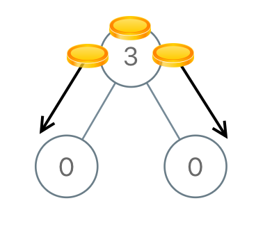
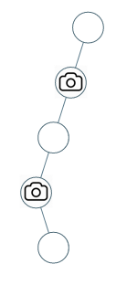
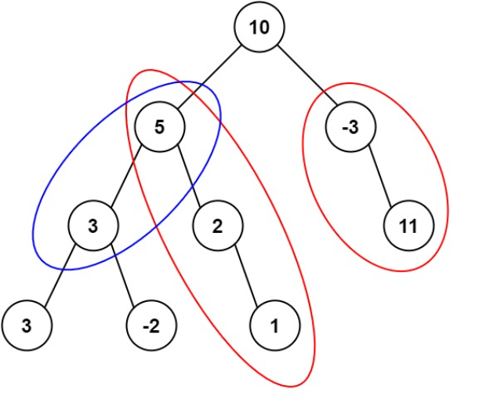

::: tip 树

树是一种数据结构，它的特点是每个节点最多只有一个父节点，但可以有多个子节点。树的顶部节点被称为根节点，没有父节点的节点。在树中，从根节点到任何节点的路径都是唯一的，这是树的一个重要特性。

:::

## 概述

树形动态规划是一种在树形数据结构上进行的动态规划。由于树的特性，树形动态规划的依赖关系通常比一般的动态规划简单，大多数情况下，父节点的状态依赖于其子节点的状态。但这并不意味着树形动态规划的问题就简单，实际上，它们可能涉及到复杂的逻辑和算法，你要想出它是怎么个依赖（依赖什么，如何依赖）。

树形动态规划的一般步骤如下：

1. 分析：分析父节点的状态需要哪些子节点的信息（核心）。

2. 定义返回值：将子节点需要提供的信息定义为递归函数的返回值，此时可通过递归调用来获取这些信息。

3. 递归：通过递归调用，让每个子节点返回其信息（递归函数对所有结点一视同仁）。

4. 整合信息：最后，我们将所有子节点返回的信息整合起来，得到父节点的信息，并返回。

下面，我们来看一些具体的题目。

## [二叉搜索子树的最大键值和](https://leetcode.cn/problems/maximum-sum-bst-in-binary-tree/)

给你一棵以 `root` 为根的 **二叉树** ，请你返回 **任意** 二叉搜索子树的最大键值和。

二叉搜索树的定义如下：

- 任意节点的左子树中的键值都 **小于** 此节点的键值。
- 任意节点的右子树中的键值都 **大于** 此节点的键值。
- 任意节点的左子树和右子树都是二叉搜索树。

**示例 1：**


```
输入：root = [1,4,3,2,4,2,5,null,null,null,null,null,null,4,6]
输出：20
解释：键值为 3 的子树是和最大的二叉搜索树。
```

**示例 2：**


```
输入：root = [4,3,null,1,2]
输出：2
解释：键值为 2 的单节点子树是和最大的二叉搜索树。
```

::: code-tabs

@tab 常规解法

```java
class Solution {
    public int maxSumBST(TreeNode root) {
		return f(root).maxBstSum;
	}

    // 递归函数的返回值，包含当前树的信息
	public class Info {	
		public int max;
		public int min;
		public int sum;
		public boolean isBst;
		public int maxBstSum;

		public Info(int a, int b, int c, boolean d, int e) {
			max = a;
			min = b;
			sum = c;
			isBst = d;
			maxBstSum = e;
		}
	}

	public Info f(TreeNode x) {
		// base case
		if (x == null) {
			return new Info(Integer.MIN_VALUE, Integer.MAX_VALUE, 0, true, 0);
		}

		// 递归计算左右子树的信息
		Info leftInfo = f(x.left);
		Info rightInfo = f(x.right);

		// 根据左右子树的信息，计算当前树的信息

        // 当前树的最大值 = max(当前节点值, 左子树的最大值, 右子树的最大值)
		int max = Math.max(x.val, Math.max(leftInfo.max, rightInfo.max));

        // 当前树的最小值 = min(当前节点值, 左子树的最小值, 右子树的最小值)
		int min = Math.min(x.val, Math.min(leftInfo.min, rightInfo.min));

        // 当前树的节点和 = 左子树的节点和 + 右子树的节点和 + 当前节点值
		int sum = leftInfo.sum + rightInfo.sum + x.val;	

		// 判断当前树是否是二叉搜索树 = 左子树是二叉搜索树 && 右子树是二叉搜索树 && 左子树的最大值 < 当前节点值 < 右子树的最小值
		boolean isBst = leftInfo.isBst && rightInfo.isBst && leftInfo.max < x.val && x.val < rightInfo.min;

		// 当前树的最大二叉搜索子树的节点和 = max(左子树的最大二叉搜索子树的节点和, 右子树的最大二叉搜索子树的节点和, 当前树的节点和)
		int maxBstSum = Math.max(leftInfo.maxBstSum, rightInfo.maxBstSum);
		if (isBst) {
			maxBstSum = Math.max(maxBstSum, sum);
		}

		// 返回当前树的信息
		return new Info(max, min, sum, isBst, maxBstSum);
	}
}
```

@tab 简洁解法

```java
class Solution {
    private int ans;

    public int maxSumBST(TreeNode root) {
        f(root);
        return ans;
    }

    /**
    * 返回一个数组，包含三个元素, 分别是：当前子树的最小值、最大值、节点和
    * @param node	当前子树的根节点
    * @return	当前子树的最小值、最大值、节点和
    */
    private int[] f(TreeNode node) {
        // base case
        if (node == null) {
            return new int[]{Integer.MAX_VALUE, Integer.MIN_VALUE, 0};
        }

        // 递归计算左右子树的信息
        int[] left = f(node.left);
        int[] right = f(node.right);

        // 根据左右子树的信息，计算当前树的信息

        // 如果不是二叉搜索树，返回一个不可能的值
        int cur = node.val;
        if (cur <= left[1] || cur >= right[0]) {
            return new int[]{Integer.MIN_VALUE, Integer.MAX_VALUE, 0};
        }

        // 如果当前子树是二叉搜索树，则尝试更新答案
        int s = left[2] + right[2] + cur;
        ans = Math.max(ans, s);

        // 返回当前子树的最小值、最大值、节点和
        return new int[]{Math.min(left[0], cur), Math.max(right[1], cur), s};
    }
}
```

:::

我们来看一下这道题是如何套模板的：

1. 分析：首先，我们需要知道父节点的状态需要哪些子节点的信息。在这个问题中，我们需要知道子节点的最大值、最小值、节点和、是否是二叉搜索树以及最大二叉搜索子树的节点和。

2. 定义返回值：然后，我们将这些信息定义为递归函数的返回值，汇集为一个`Info`类。它包含了我们需要的所有信息。

3. 递归：接下来，我们通过递归调用，让每个子节点返回其信息。这就是`f`函数的作用。它首先处理基本情况（即节点为空的情况），然后递归地计算左右子树的信息。

4. 整合信息：最后，我们将所有子节点返回的信息整合起来，得到父节点的信息，并返回。这就是`f`函数的最后部分。它首先计算当前树的最大值、最小值和节点和，然后判断当前树是否是二叉搜索树，最后计算最大二叉搜索子树的节点和。

最后，我们通过递归调用这个函数，得到整个二叉树的信息。

## [二叉树的直径](https://leetcode.cn/problems/diameter-of-binary-tree/)

给你一棵二叉树的根节点，返回该树的 **直径** 。

二叉树的 **直径** 是指树中任意两个节点之间最长路径的 **长度** 。这条路径可能经过也可能不经过根节点 `root` 。

两节点之间路径的 **长度** 由它们之间边数表示。

**示例 1：**


```
输入：root = [1,2,3,4,5]
输出：3
解释：3 ，取路径 [4,2,1,3] 或 [5,2,1,3] 的长度。
```

::: code-tabs

@tab 常规解法

```java
class Solution {
	public int diameterOfBinaryTree(TreeNode root) {
		return f(root).diameter;
	}

	public class Info {
		public int diameter;
		public int height;

		public Info(int a, int b) {
			diameter = a;
			height = b;
		}

	}

	public Info f(TreeNode x) {
		if (x == null) {
			return new Info(0, 0);
		}
		Info leftInfo = f(x.left);
		Info rightInfo = f(x.right);
		int height = Math.max(leftInfo.height, rightInfo.height) + 1;
		int diameter = Math.max(leftInfo.diameter, rightInfo.diameter);
		diameter = Math.max(diameter, leftInfo.height + rightInfo.height);
		return new Info(diameter, height);
	}
}
```

@tab 简洁解法

```java
class Solution {
    int ans = 0;

    public int diameterOfBinaryTree(TreeNode root) {
        f(root);
        return ans;
    }

    // 返回节点的最大深度，也就是从该节点到叶子节点的最长路径
    public int f(TreeNode root) {
        if(root == null) {
            return -1;
        }
        int lLen = f(root.left) + 1;
        int rLen = f(root.right) + 1;
        ans = Math.max(ans, lLen+rLen);
        return Math.max(lLen, rLen);
    }
}
```

:::

## [在二叉树中分配硬币](https://leetcode.cn/problems/distribute-coins-in-binary-tree/)

给你一个有 `n` 个结点的二叉树的根结点 `root` ，其中树中每个结点 `node` 都对应有 `node.val` 枚硬币。整棵树上一共有 `n` 枚硬币。

在一次移动中，我们可以选择两个相邻的结点，然后将一枚硬币从其中一个结点移动到另一个结点。移动可以是从父结点到子结点，或者从子结点移动到父结点。

返回使每个结点上 **只有** 一枚硬币所需的 **最少** 移动次数。

**示例 1：**



```
输入：root = [3,0,0]
输出：2
解释：一枚硬币从根结点移动到左子结点，一枚硬币从根结点移动到右子结点。
```

**示例 2：**


```
输入：root = [0,3,0]
输出：3
解释：将两枚硬币从根结点的左子结点移动到根结点（两次移动）。然后，将一枚硬币从根结点移动到右子结点。
```

::: code-tabs

@tab 常规解法

```java
class Solution {
    public int distributeCoins(TreeNode root) {
        return f(root).move;
    }

    public static class Info {
        public int cnt;
        public int sum;
        public int move;

        public Info(int a, int b, int c) {
            cnt = a;
            sum = b;
            move = c;
        }
    }

    public Info f(TreeNode x) {
        // base case
        if (x == null) {
            return new Info(0, 0, 0);
        }

        // 后序遍历, 递归计算左右子树的信息
        Info leftInfo = f(x.left);
        Info rightInfo = f(x.right);

        // 合并左右子树的信息
        // 1. 当前节点的硬币数量 = 左子树硬币数量 + 右子树硬币数量 + 1
        int cnts = leftInfo.cnt + rightInfo.cnt + 1;
        // 2. 当前节点的硬币总数 = 左子树硬币总数 + 右子树硬币总数 + 当前节点硬币数量
        int sums = leftInfo.sum + rightInfo.sum + x.val;
        // 3. 当前节点的移动次数 = 左子树移动次数 + 右子树移动次数 + 左子树硬币数量与硬币总数的差的绝对值 + 右子树硬币数量与硬币总数的差的绝对值
        int moves = leftInfo.move + rightInfo.move + Math.abs(leftInfo.cnt - leftInfo.sum) + Math.abs(rightInfo.cnt - rightInfo.sum);

        // 返回当前节点的信息
        return new Info(cnts, sums, moves);
    }
}
```

@tab 简洁解法

```java
class Solution {
    private int ans;

    public int distributeCoins(TreeNode root) {
        f(root);
        return ans;
    }

    /**
    * 后序遍历，返回子树硬币个数和节点数
    * @param node  当前子树的根节点
    * @return  当前子树的硬币个数和节点数
    */
    private int[] f(TreeNode node) {
        // base case
        if (node == null) {
            return new int[]{0, 0};
        }

        // 递归计算左右子树的信息
        int[] left = f(node.left);
        int[] right = f(node.right);

        // 根据左右子树的信息，计算当前树的信息
        // 子树硬币个数 = 左子树硬币个数 + 右子树硬币个数 + 当前节点硬币个数
        int coins = left[0] + right[0] + node.val;

        // 子树节点数 = 左子树节点数 + 右子树节点数 + 1
        int nodes = left[1] + right[1] + 1;

        // 更新答案
        ans += Math.abs(coins - nodes);

        // 返回当前子树的硬币个数和节点数
        return new int[]{coins, nodes};
    }
}
```

:::

## [没有上司的舞会](https://www.luogu.com.cn/problem/P1352)

**题目描述**

某大学有 $n$ 个职员，编号为 $1\ldots n$。

他们之间有从属关系，也就是说他们的关系就像一棵以校长为根的树，父结点就是子结点的直接上司。

现在有个周年庆宴会，宴会每邀请来一个职员都会增加一定的快乐指数 $r_i$，但是呢，如果某个职员的直接上司来参加舞会了，那么这个职员就无论如何也不肯来参加舞会了。

所以，请你编程计算，邀请哪些职员可以使快乐指数最大，求最大的快乐指数。

**输入格式**

输入的第一行是一个整数 $n$。

第 $2$ 到第 $(n + 1)$ 行，每行一个整数，第 $(i+1)$ 行的整数表示 $i$ 号职员的快乐指数 $r_i$。

第 $(n + 2)$ 到第 $2n$ 行，每行输入一对整数 $l, k$，代表 $k$ 是 $l$ 的直接上司。

**输出格式**

输出一行一个整数代表最大的快乐指数。

**样例输入：**

```
7
1
1
1
1
1
1
1
1 3
2 3
6 4
7 4
4 5
3 5
```

**样例输出**：

```
5
```

**备注**：

对于 $100\%$ 的数据，保证 $1\leq n \leq 6 \times 10^3$，$-128 \leq r_i\leq 127$，$1 \leq l, k \leq n$，且给出的关系一定是一棵树。

**参考代码：**

```java
import java.io.*;
import java.util.Arrays;

public class Main {
	// 基础数据
	public static int MAXN = 6001; // 最大节点数
	public static int n, root;	// 节点数，根节点
	public static int[] happy = new int[MAXN];	// 快乐值
	public static boolean[] isRoot = new boolean[MAXN];	// 是否是根节点
	// 链式前向星建图
	public static int[] head = new int[MAXN];
	public static int[] next = new int[MAXN];
	public static int[] to = new int[MAXN];
	public static int cnt;
	// 动态规划表
	// noCome[i]：i节点不参加宴会时，整棵树能得到的最大快乐值
	public static int[] noCome = new int[MAXN];
	// come[i]：i节点参加宴会时，整棵树能得到的最大快乐值
	public static int[] come = new int[MAXN];

	// 初始化
	public static void build(int n) {
		// 初始时认为所有节点都是根节点，后面在建图的过程中会更新
		Arrays.fill(isRoot, 1, n + 1, true);
		// 初始化链式前向星
		Arrays.fill(head, 1, n + 1, 0);
		cnt = 1;
	}

	// 添加一条u到v的边
	public static void addEdge(int u, int v) {
		next[cnt] = head[u];
		to[cnt] = v;
		head[u] = cnt++;
	}

	public static void main(String[] args) throws IOException {
		BufferedReader br = new BufferedReader(new InputStreamReader(System.in));
		StreamTokenizer in = new StreamTokenizer(br);
		PrintWriter out = new PrintWriter(new OutputStreamWriter(System.out));
		while (in.nextToken() != StreamTokenizer.TT_EOF) {
			n = (int) in.nval;
			build(n);
			for (int i = 1; i <= n; i++) {
				in.nextToken();
				happy[i] = (int) in.nval;
			}
			for (int i = 1, son, father; i < n; i++) {
				in.nextToken();
				son = (int) in.nval;
				in.nextToken();
				father = (int) in.nval;
				addEdge(father, son);
				isRoot[son] = false;
			}
			for (int i = 1; i <= n; i++) {
				if (isRoot[i]) {
					root = i;
					break;
				}
			}
			f(root);
			// 整棵树的最大快乐值 = max(根节点参加宴会时的最大快乐值, 根节点不参加宴会时的最大快乐值)
			out.println(Math.max(noCome[root], come[root]));
		}
		out.flush();
		out.close();
		br.close();
	}

	/**
	 * 从根节点开始递归，对于每个节点，分别计算该节点参加宴会和不参加宴会时的最大快乐值
	 * @param u	当前节点
	 */
	public static void f(int u) {
		// base case
		noCome[u] = 0;	// 不参加宴会时，快乐值为0
		come[u] = happy[u];	// 参加宴会时，快乐值为节点的快乐值
		// 遍历u的所有子节点
		for (int ei = head[u], v; ei > 0; ei = next[ei]) {
			v = to[ei];	
			f(v);
			// 当前节点不参加宴会时，将所有子节点的参加或不参加的最大快乐值累加进来（取最大值）
			noCome[u] += Math.max(noCome[v], come[v]);
			// 当前节点参加宴会时，快乐值为所有子节点不参加宴会时的快乐值之和
			come[u] += noCome[v];
		}
	}
}
```

## [监控二叉树](https://leetcode.cn/problems/binary-tree-cameras/)

给定一个二叉树，我们在树的节点上安装摄像头。

节点上的每个摄影头都可以监视**其父对象、自身及其直接子对象。**

计算监控树的所有节点所需的最小摄像头数量。

**示例 1：**


```
输入：[0,0,null,0,0]
输出：1
解释：如图所示，一台摄像头足以监控所有节点。
```

**示例 2：**



```
输入：[0,0,null,0,null,0,null,null,0]
输出：2
解释：需要至少两个摄像头来监视树的所有节点。 上图显示了摄像头放置的有效位置之一。
```

**提示：**

1. 给定树的节点数的范围是 `[1, 1000]`。
2. 每个节点的值都是 0。

参考代码：

```java
class Solution {
    public int minCameraCover(TreeNode root) {
		ans = 0;
		if (f(root) == 0) {
			// 如果根节点未被覆盖，那么根节点需要安装摄像头
			ans++;
		}
		return ans;
	}

	public static int ans;

	/**
	 * 假设x上方一定有父亲的情况下，f函数的返回值代表了当前节点的状态，
	 * 有三种可能的值：
	 * 0：当前节点未被覆盖，需要父节点安装摄像头。
	 * 1：当前节点被覆盖，但没有安装摄像头，可以被父节点或子节点覆盖。
	 * 2：当前节点安装了摄像头。
	 */
	private int f(TreeNode x) {
		if (x == null) {	// 空节点不需要被覆盖。可视为1状态
			return 1;
		}
		// 左右子树的状态
		int left = f(x.left);
		int right = f(x.right);
		// 只要有一个子节点未被覆盖，当前节点就需要安装摄像头
		// 此时更新全局变量ans，并返回2状态
		if (left == 0 || right == 0) {
			ans++;
			return 2;
		}
		// 如果左右子节点都被覆盖，则当前节点不用安装摄像头
		// 直接返回0状态，让父节点安装摄像头即可
		if (left == 1 && right == 1) {
			return 0;
		}
		// 12 || 21 || 22
		// 如果左右子节点有一个安装了摄像头，另一个被覆盖但没安装摄像头，又或者两个都安装了摄像头
		// 那么当前节点就被覆盖，但不安装摄像头，返回1状态
		return 1;
	}
}
```

## [路径总和 III](https://leetcode.cn/problems/path-sum-iii/)

给定一个二叉树的根节点 `root` ，和一个整数 `targetSum` ，求该二叉树里节点值之和等于 `targetSum` 的 **路径** 的数目。

**路径** 不需要从根节点开始，也不需要在叶子节点结束，但是路径方向必须是向下的（只能从父节点到子节点）。

**示例 1：**



```
输入：root = [10,5,-3,3,2,null,11,3,-2,null,1], targetSum = 8
输出：3
解释：和等于 8 的路径有 3 条，如图所示。
```

参考：

```java
class Solution {
    private int ans;

    public int pathSum(TreeNode root, int sum) {
        // 前缀和映射(key: 前缀和, value: 该前缀和出现的次数)
        HashMap<Long, Integer> preSum = new HashMap<>();
        // 这一步也很重要，要记得加上，即前缀和为0的路径出现1次
        preSum.put(0L, 1);
        ans = 0;
        f(root, sum, 0, preSum);
        return ans;
    }

    /**
    * 路径必须以x作为结尾，路径累加和是target的路径数量，将答案累加到全局变量ans上
    * @param cur       当前节点
    * @param target    目标值
    * @param sum       从头节点出发，来到x的时候，上方累加和是多少
    * @param preSum    前缀和映射
    */
    public void f(TreeNode cur, int target, long sum, HashMap<Long, Integer> preSum) {
        if (cur != null) {
            // 更新当前路径和
            sum += cur.val;
            // 如果当前路径和减去目标值的路径存在于前缀和映射中
            // 说明存在路径的和等于目标值
            // 将出现频次累加到ans中去
            ans += preSum.getOrDefault(sum-target, 0);
            // 更新当前路径和的数量
            preSum.put(sum, preSum.getOrDefault(sum, 0) + 1);
            // 递归左右子树
            f(cur.left, target, sum, preSum);
            f(cur.right, target, sum, preSum);
            // 回溯，恢复当前路径和的数量，因为接下来要遍历其他路径
            preSum.put(sum, preSum.get(sum) - 1);
        }
    }
}
```

