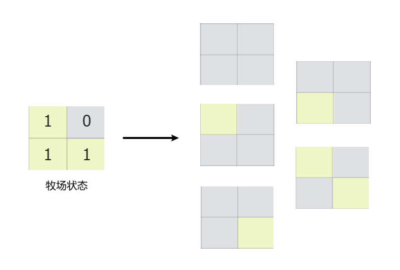

## 概述

状态压缩是动态规划的一个小技巧，一般应用在集合问题中。当DP的状态是一个集合时，把集合的组合或排列用一个二进制来表示，也就是用某个数的二进制位（0/1组合）来表示集合的一个子集，从而用二进制的位操作来处理DP状态。

具体的，在状态压缩DP中，我们会设计一个整型可变参数比如`status`，此时`status`的位信息就是用来表示某个样本是否还能使用。然后，我们可以利用这个信息来尝试写出递归函数，进行记忆化搜索或者严格位置依赖的动态规划。对于这个 `status`，我们并不只是关注它的值，而是重点关注这个值在二进制表示下各个位上的01状态，来组成当前的DP状态。

假设，现在有$k$个样本数据，那么表示这些样本状态的数量就有$2^k$。因此，可变参数`status`的范围是$0$ ~ $2^k-1$。

> 注意，每增加一个样本，状态的数量就会指数级增长。因此状态压缩DP能解决的问题往往样本数据量都不大。

对于位运算不熟悉的朋友，可以看看这篇文档：[常见位运算操作](../03_杂记/01_位运算.md)


## 旅行商问题（TSP）

旅行商问题（Travelling Salesman Problem，TSP）是状态压缩动态规划（State Compression DP）的经典应用之一，常常作为引子。

::: tip 旅行商问题

给定一组城市和每对城市之间的距离，找出一条路径，使得旅行商访问每个城市一次并返回原城市的总距离最短。

:::

简而言之，旅行商问题就是给定一个有权图（可以是有向图或无向图），包括 $n$ 个点以及连接 $n$ 个点的边，最终求出从起点到终点的最短路径，要求必须经过所有点，而且只能经过一次。

如果尝试暴力解法，枚举 $n$ 个点的全排列。则有 $n!$ 个全排列，一个全排列就是一条路径，计算每个全排列的路径长度，需要做$n$次加法。在所有路径中找最短的路径，总复杂度为 $O(n \times n!)$。

如果用状态压缩 DP 求解，能把复杂度降低到 $O(n^2 \times 2^n)$。当 $n=20$ 时， $O(n^2 \times 2^n) \approx 4\text{亿}$，比暴力法好很多。

首先定义dp状态，设$S$是图的一个子集，用 $dp[S][i]$ 表示集合 $S$ 内的最短路径，也就是从起点到终点经过所有点，到达终点`i`的最短路径，则按照动态规划的思路，让$S$ 从最小的子集出发（只包含起点），逐步扩展到整个图，转移方程为：

- $dp[S][i] = min\{dp[S-i][k] + dist(k, i)\}, ~~ k\in S-i$

直到集合 $S$ 包含所有点，最终得到的 $dp[N][n-1]$ 就是答案，此时 $N$ 表示包含图中所有点的集合。

## [星球](https://www.lanqiao.cn/problems/17136/learning/)

下面我们来看这道旅行商问题（[十四届蓝桥杯 Java 国赛真题](https://www.lanqiao.cn/problems/17136/learning/)）。

**题目描述**：

小明驾驶飞船对某星系发起攻击。星系中有 $n$ 颗星球，编号依次是 $1,2,…,n$。第$i$颗星球的坐标为 $(x_i,y_i,z_i)$，且其防御强度为$w_i$。小明需要规划出进攻这 $n$ 颗星球的顺序使得其进攻所需能量最少。

对于一个遍历顺序 $p_1,p_2,...,p_n$来说，小明进攻需要的能量为 $E=\sum_{i=2}^{n} \times d(p_{i−1},p_i) \times wi$，其中 $d(p_{i−1},p_i)$ 表示 $p_{i-1}$，$p_i$两颗星球之间的直线距离。小明想知道进攻所需最少能量是多少。

**输入描述**：

输入共 $n+1$ 行。第一行为一个正整数 $n$。后面 $n$ 行，每行四个整数 $x_i,y_i,z_i,w_i$。

**输出描述**：

输出共 $1$ 行，一个浮点数（保留两位小数）。

**样例输入**：

```
3
4 3 3 5
2 2 3 5
3 1 1 3
```

**样例输出**：

```
18.53
```

**样例说明**：

当进攻顺序为 ${1,2,3}$ 时，所需能量最小，为 $5+3+6$。

**评测用例规模**：

- 对于 $20\%$ 的数据，保证 $n≤8$。 
- 对于 $100\%$ 的数据，保证 $n≤18$，$0≤x_i,y_i,z_i,w_i≤100$。

**参考**：

```java
import java.io.BufferedReader;
import java.io.IOException;
import java.io.InputStreamReader;
import java.io.StreamTokenizer;

public class Main {
    static BufferedReader bf = new BufferedReader(new InputStreamReader(System.in));
    static StreamTokenizer in = new StreamTokenizer(bf);
    static int n;
    static int MAXN = 18;
    static int x[] = new int[MAXN];
    static int y[] = new int[MAXN];
    static int z[] = new int[MAXN];
    static int w[] = new int[MAXN];
    static double dp[][] = new double[1 << MAXN][MAXN];

    public static void main(String[] args) throws IOException {
        // 输入数据
        n = nextInt();
        for (int i = 0; i < n; i++) {
            x[i] = nextInt();
            y[i] = nextInt();
            z[i] = nextInt();
            w[i] = nextInt();
        }
        // 初始化缓存表（用于记忆化搜索）
        for (int s = 0; s < (1 << n); s++) {
            for (int i = 0; i < n; i++) {
                dp[s][i] = -1;
            }
        }
        // 开始计算
        int end = (1 << n) - 1; // 进攻所有星球的最终集合状态，即全是1的状态（每个星球都进攻过了）
        double ans = Double.MAX_VALUE;
        for (int i = 0; i < n; i++) {
            // 尝试从每个星球出发，进攻所有星球所需的最少能量是多少？
            ans = Math.min(ans, f(1 << i, i, end));
        }
        System.out.printf("%.2f", ans);
    }

    /**
     * 记忆化搜索，也可以改为严格位置依赖的动态规划
     * @param status 整型变量表示访问状态，关注其二进制位：1表示已经进攻过该星球，0表示未进攻过。
     * @param idx    表示当前所在的星球的位置（范围从 0 到 n-1 ）。
     * @param end    终止状态，即表示所有星球都被访问过的状态（所有比特位都为1）。
     * @return 返回从当前idx星球出发，进攻所有未访问过的星球，所需的最少能量。
     */
    public static double f(int status, int idx, int end) {
        if (status == end) { // 已经访问了所有星球，到达终止状态
            return 0; 
        }
        if (dp[status][idx] != -1) { // 缓存命中，直接返回
            return dp[status][idx];
        }
        double ans = Double.MAX_VALUE;
        for (int i = 0; i < n; i++) {
            // 如果 i 星球还没有被访问过，则尝试访问，并更新所需的最少能量
            if ((status & (1 << i)) == 0) {
                // status | (1 << i)：将i星球添加到集合 status 中
                // dist(idx, i)：从当前 idx 星球进攻 i 星球所需的能量
                ans = Math.min(ans, f(status | (1 << i), i, end) + dist(idx, i));
            }
        }
        // 加缓存
        dp[status][idx] = ans;
        return ans;
    }

    public static double dist(int v1, int v2) {
        double dx = Math.abs(x[v1] - x[v2]);
        double dy = Math.abs(y[v1] - y[v2]);
        double dz = Math.abs(z[v1] - z[v2]);
        return Math.sqrt(dx * dx + dy * dy + dz * dz) * w[v2];
    }

    public static int nextInt() throws IOException {
        in.nextToken();
        return (int) in.nval;
    }
}
```

## [种草的方法数](https://www.luogu.com.cn/problem/P1879)

农场主 $\rm John$ 新买了一块长方形的新牧场，这块牧场被划分成 $M$ 行 $N$ 列 $(1 \le M \le 12, 1 \le  N \le 12)$，每一格都是一块正方形的土地。 $\rm John$ 打算在牧场上的某几格里种上美味的草，供他的奶牛们享用。

遗憾的是，有些土地相当贫瘠，不能用来种草。并且，奶牛们喜欢独占一块草地的感觉，于是 $\rm John$ 不会选择两块相邻的土地，也就是说，没有哪两块草地有公共边。

$\rm John$ 想知道，如果不考虑草地的总块数，那么，一共有多少种种植方案可供他选择？（**当然，把新牧场完全荒废也是一种方案**）

**输入格式**

第一行：两个整数 $M$ 和 $N$，用空格隔开。

第 $2$ 到第 $M+1$ 行：每行包含 $N$ 个用空格隔开的整数，描述了每块土地的状态。第 $i+1$ 行描述了第 $i$ 行的土地，所有整数均为 $0$ 或 $1$ ，是 $1$ 的话，表示这块土地足够肥沃，$0$ 则表示这块土地不适合种草。

**输出格式**

一个整数，即牧场分配总方案数除以 $100,000,000$ 的余数。

**样例输入 #1**

```
2 3
1 1 1
0 1 0
```

**样例输出 #1**

```
9
```

举个例子，比如下面的牧场状态，可以有 $5$ 种种植方案：



**参考**：

```java
import java.io.BufferedReader;
import java.io.IOException;
import java.io.InputStreamReader;
import java.io.OutputStreamWriter;
import java.io.PrintWriter;
import java.io.StreamTokenizer;

public class Main {
    public static int MAXN = 12;
    public static int MAXM = 12;
    public static int MOD = 100000000;
    public static int[][] grid = new int[MAXN][MAXM];
    public static int[][] dp = new int[MAXN][1 << MAXM];
    public static int n, m;

    public static void build() {
        for (int i = 0; i < n; i++) {
            for (int s = 0; s < (1 << m); s++) {
                dp[i][s] = -1;
            }
        }
    }

    public static void main(String[] args) throws IOException {
        BufferedReader br = new BufferedReader(new InputStreamReader(System.in));
        StreamTokenizer in = new StreamTokenizer(br);
        PrintWriter out = new PrintWriter(new OutputStreamWriter(System.out));
        in.nextToken();
        n = (int) in.nval;
        in.nextToken();
        m = (int) in.nval;
        for (int i = 0; i < n; i++) {
            for (int j = 0; j < m; j++) {
                in.nextToken();
                grid[i][j] = (int) in.nval;
            }
        }
        build();
        out.println(f(0, 0));
        out.flush();
        out.close();
        br.close();
    }

    // 在给定上一行种草状态s的情况下，返回从第i行开始，有多少种种草的方法
    public static int f(int i, int s) {
        if (i == n) {
            return 1;
        }
        if (dp[i][s] != -1) {
            return dp[i][s];
        }
        int ans = dfs(i, 0, s, 0);
        dp[i][s] = ans;
        return ans;
    }

    // 在给定上一行种草状态s和当前行种草状态ss的情况下，返回从第i行第j列开始，有多少种种草的方法
    public static int dfs(int i, int j, int s, int ss) {
        if (j == m) {
            return f(i + 1, ss);
        }
        // 先尝试不在当前位置种草
        int ans = dfs(i, j + 1, s, ss);
        // 如果当前位置可以种草，并且左边和上面没有种草，那么尝试在当前位置种草
        if (grid[i][j] == 1 && (j == 0 || get(ss, j - 1) == 0) && get(s, j) == 0) {
            ans = (ans + dfs(i, j + 1, s, set(ss, j, 1))) % MOD;
        }
        // 最后返回这两种情况的种草方法数之和
        return ans;
    }

    public static int get(int s, int j) { // 获取状态s中第j位的状态
        return (s >> j) & 1;
    }

    public static int set(int s, int j, int v) { // 将状态s中第j位的状态设置为v，并返回新的状态
        return v == 0 ? (s & (~(1 << j))) : (s | (1 << j));
    }
}
```

在这个问题中，我们将**每一行的种草状态**压缩为一个整数，其中第 $j$ 位为 $1$ 表示第 $j$ 列种了草，为 $0$ 表示没有种草。这样，我们就可以用一个整数来表示一行的种草状态。

然后，我们用 $dp[i][s]$ 表示在给定第 $i$ 行种草状态为 $s$ 的情况下，从第 $i$ 行开始，有多少种种草的方法。通过枚举第 $i+1$ 行的种草状态，来更新 $dp[i+1][s']$。

具体的转移方程为：

- $dp[i][s] = sum(dp[i+1][s'])$(对所有合法的 $s'$)

其中，$s'$ 是第 $i+1$ 行的种草状态，它必须满足以下条件：

1. $s'$ 与 $s$ 不冲突，即没有同时在同一列种草。
2. $s'$ 与 $grid[i+1]$ 不冲突，即没有在贫瘠的土地上种草。
3. $s'$ 中没有相邻的 $1$ ，即没有在相邻的土地上种草。

最后，答案就是 $dp[0][0]$ 。

这个问题的时间复杂度是 $O(n \cdot 2^m \cdot 2^m)$，其中 $n$ 是行数，$m$ 是列数。因为对于每一行，我们都需要枚举它的种草状态和下一行的种草状态，每种状态有 $2^m$ 种可能。
