**注意！推荐优先按照官方文档来操作，本页面内容仅供参考**。

官方文档：[适用于 Linux 的 Windows 子系统文档 | Microsoft Learn](https://learn.microsoft.com/zh-cn/windows/wsl/)

::: tip

`WSL` 是一个在 `Windows 10` 中运行 `Linux` 二进制可执行文件的兼容层。通过 `WSL`，你可以在 `Windows` 中运行 `Linux` 环境，而无需虚拟机。

:::

## 1. 启动子系统

以管理员身份打开 `PowerShell`，输入以下命令，启用适用于 `Linux` 的 `Windows` 子系统：

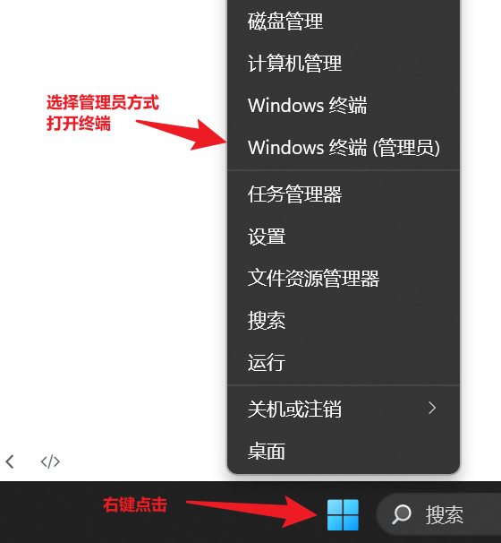

输入以下命令：

```shell
dism.exe /online /enable-feature /featurename:Microsoft-Windows-Subsystem-Linux /all /norestart
```

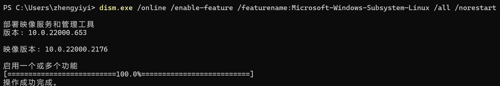

## 2. 启动虚拟机平台

安装 `WSL2` 之前，必须启用“虚拟机平台”可选功能。 计算机需要**虚拟化**功能才能使用此功能。

以管理员身份打开 `PowerShell` 并运行以下命令：

```shell
dism.exe /online /enable-feature /featurename:VirtualMachinePlatform /all /norestart
```

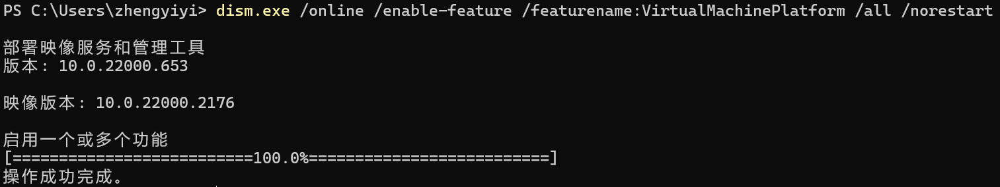

## 3. 下载 WSL2更新包

下载适用于 `x64` 计算机的 `WSL2 Linux` 内核更新包并安装：

```sh
https://wslstorestorage.blob.core.windows.net/wslblob/wsl_update_x64.msi
```

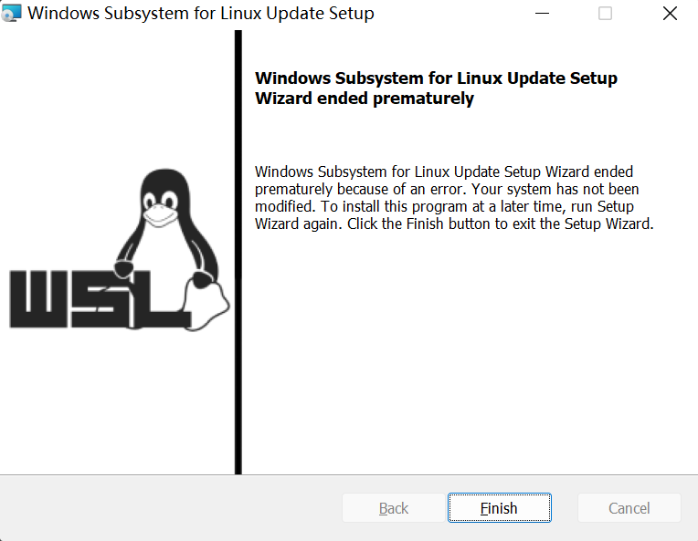

**Finish之后，重启电脑**。

## 4. 将 WSL 2 设置为默认版本

```sh
wsl --set-default-version 2
```

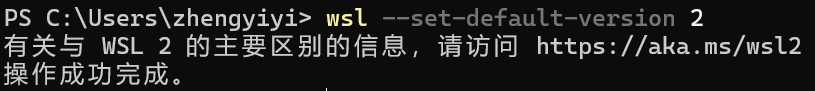

## 5. 安装 Linux 分发

安装所选的【Linux 分发】并解压至指定盘，也可以通过商店下载。

下载地址为：https://aka.ms/wsl-ubuntu-160。下载之后，会得到一个类似这样的安装包：

```sh
Ubuntu_1604.2019.523.0_x64.appx
```

双击安装包。

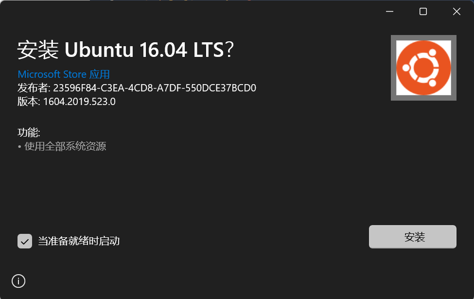

接着点击**安装**。

然后会让你输入用户名，输入两次密码，安装就完成了。

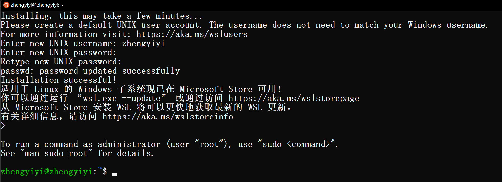

## 6. 迁移WSL到非系统盘

### 6.1 检查wsl相关信息

首先查看`wsl`下的`Linux`是否为关闭状态，当`wsl`为`Stopped`才能进行下一步。

```sh
wsl -l -v
```

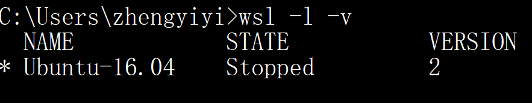

可以看到，上面我安装的WSL发行版的名称是`Ubuntu-16.04`，并且它当前处于停止状态，使用的是WSL 2版本。

### 6.2 以压缩包的形式导出到D盘

首先，在D盘下新建一个 `UbuntuWSL` 目录，接着运行以下命令：

```sh
# wsl --export WSL发行版名称 指定位置
wsl --export Ubuntu-16.04 D:\UbuntuWSL\ubuntu1604.tar
```

### 6.3 注销原有的 linux 系统

```sh
wsl --unregister Ubuntu-16.04
```


可再次运行 `wsl -l -v` 命令查看是否注销成功：

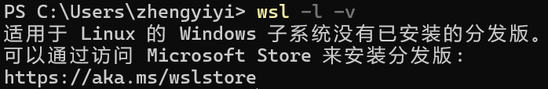

### 6.4 重新导入

执行`import`命令，将之前导出的`tar`文件导入到`WSL`作为一个新的`Linux`发行版。

```powershell
# wsl --import 发行版的名称 安装位置 tar文件的路径
wsl --import Ubuntu-16.04 D:\UbuntuWSL\ D:\UbuntuWSL\ubuntu1604.tar --version 2
```

上述命令将从 `D:\UbuntuWSL\ubuntu1604.tar` 导入一个名为 `Ubuntu-16.04` 的 Linux 发行版到 `D:\UbuntuWSL\`，并使用 WSL 2 版本。

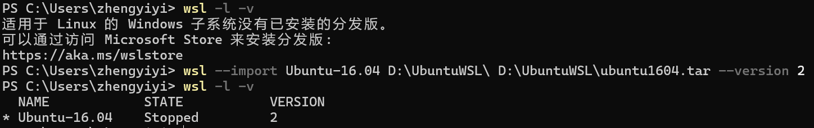

### 6.5 完成&启动

至此，WSL2已经下载安装成功。

启动方式如下：

1. **命令行方式**：在Windows的命令提示符或PowerShell中，你可以直接输入 `wsl` 命令来启动默认的Linux发行版。如果你安装了多个Linux发行版并想启动特定的发行版，你可以使用 `wsl -d 发行版名称` 命令。
2. **开始菜单方式**：在Windows的开始菜单中，输入Linux发行版（如Ubuntu...）应该能看到你安装的Linux发行版的图标，点击这个图标也可以启动对应的Linux发行版。
3. **VS Code方式**：如果你安装了VS Code的Remote - WSL扩展，你可以在VS Code中直接启动WSL。只需打开VS Code，然后在左侧的活动栏中点击Remote Explorer图标，然后在WSL TARGETS部分点击你的Linux发行版即可。

## 7. 关闭 WSL

关闭WSL可以在`cmd`或`powershell`中输入命令：

```bash
wsl --shutdown
```

## 8. 解决WSL中Vmmem占用大量内存的问题

### 1. 问题描述

在使用 `WSL` 一段时间后，可能会发现电脑运行变得卡顿。

打开`Windows`的任务管理器，会发现有一个名为`Vmmem`的进程占用了大量的内存。这是因为`Vmmem`进程是WSL的虚拟机，它会根据`WSL`的使用情况**动态分配内存**。

### 2. 解决方案：设置配置文件，限制WSL的内存使用

通过在**WSL配置文件中**设置一个内存上限来限制`WSL`的内存使用。

首先，需要在 `C:\Users\{你的用户名}\` 目录下创建一个名为`.wslconfig`的文件，并在其中添加以下内容：

```ini
[wsl2]
memory=4GB # 限制WSL2使用4GB内存
swap=4GB   # 设置SWAP大小为4GB
localhostForwarding=true	# 允许WSL2实例接收从localhost发出的网络请求
```

然后，关闭WSL：

```bash
wsl --shutdown
```

重启之后，WSL的内存使用就被限制在了4GB以内。

> 当然，你需要根据自己的内存大小来设置这个限制。
>
> 1. 按下 `Win + R` 键打开"运行"对话框。
> 2. 在"运行"对话框中输入 `msinfo32`，然后按下回车键。
> 3. 这将打开"系统信息"窗口。在"系统摘要"部分，你可以看到"已安装的物理内存 (RAM)"，这就是你的系统总内存。

## 9. 查看WSL文件系统

使用 `Win + R`，可打开运行对话框：

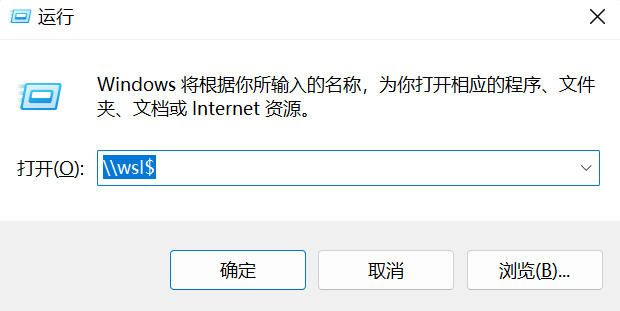

接着输入 `\\wsl$` 并按下回车后，会打开一个文件浏览器窗口，显示你所有的 WSL 发行版及其文件系统。

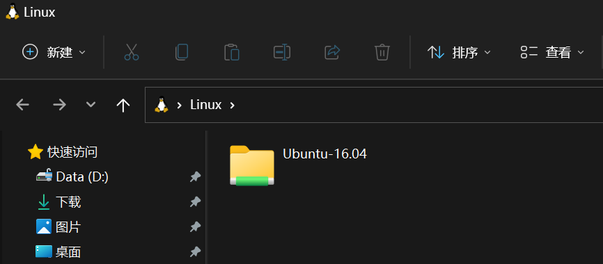

你可以直接在 Windows 中编辑 WSL 的文件（使用记事本可直接打开编辑）。

## 10. WSL中安装Redis

在 Ubuntu 系统安装 Redis 可以使用以下命令:

```shell
# 可以先更新一下：
# sudo apt update

# 然后开始安装：
sudo apt install redis-server
```

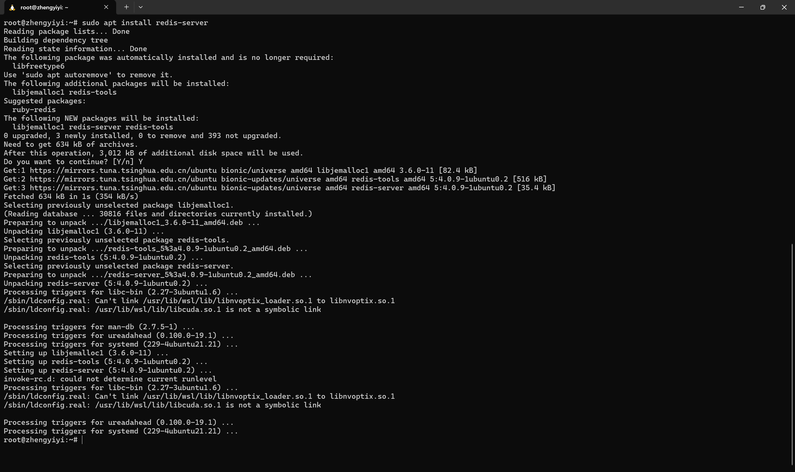

**启动 Redis**：

```shell
redis-server
```

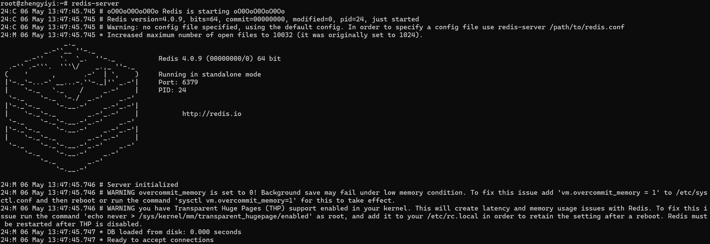

可以看到，此时WSL环境中成功启动了 Redis 服务器，且正在运行在独立模式下，端口号为 6379，进程 ID 为 7609。

如果想让 Redis 在后台运行，你可以使用 `--daemonize yes` 参数来启动 Redis。这样，Redis 会作为一个守护进程在后台运行，即使你关闭了终端，Redis 也会继续运行。

以下是启动 Redis 的命令：

```bash
redis-server --daemonize yes
```

如果你想停止运行在后台的 Redis，你可以使用以下命令：

```bash
redis-cli shutdown
```

这个命令会发送一个 SHUTDOWN 命令到 Redis，让其安全地关闭。

**查看 redis 是否启动**：

```
redis-cli
```

以上命令将打开以下终端：

```
redis 127.0.0.1:6379>
```

127.0.0.1 是本机 IP ，6379 是 redis 服务端口。现在我们输入 PING 命令。

```
redis 127.0.0.1:6379> ping
PONG
```

## 11. WSL中安装 Docker

**下载公钥**：

```bash
curl -fsSL https://download.docker.com/linux/ubuntu/gpg | sudo apt-key add -
```

这个命令从Docker的官方网站下载公钥，并使用`apt-key add -`命令添加到APT的密钥库中。这样APT在安装Docker时就能验证下载的包是否是Docker官方发布的。

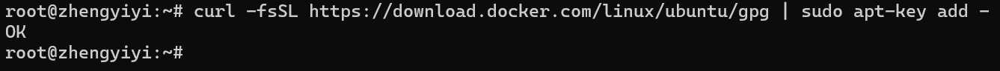

**添加软件源**：

```bash
sudo add-apt-repository \
"deb [arch=amd64] https://mirrors.tuna.tsinghua.edu.cn/docker-ce/linux/ubuntu
\
$(lsb_release -cs) \
stable"
```

这个软件源的URL是清华大学的Docker镜像站，这样在安装Docker时可以从这个镜像站下载，速度会更快。`$(lsb_release -cs)`是一个命令替换，它会被替换为当前Ubuntu系统的代号，比如`bionic`或`focal`。

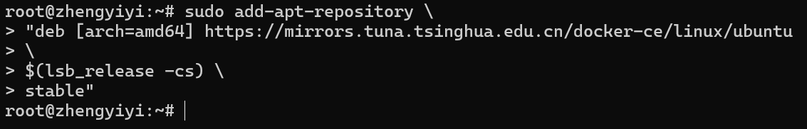

**更新软件包索引**：

```bash
sudo apt update
```

这样APT就能知道新添加的软件源中有哪些软件包可以安装。

**安装Docker**：

```bash
sudo apt install -y docker-ce
```

这个命令安装Docker。`-y`选项表示在询问是否安装时自动回答"yes"。

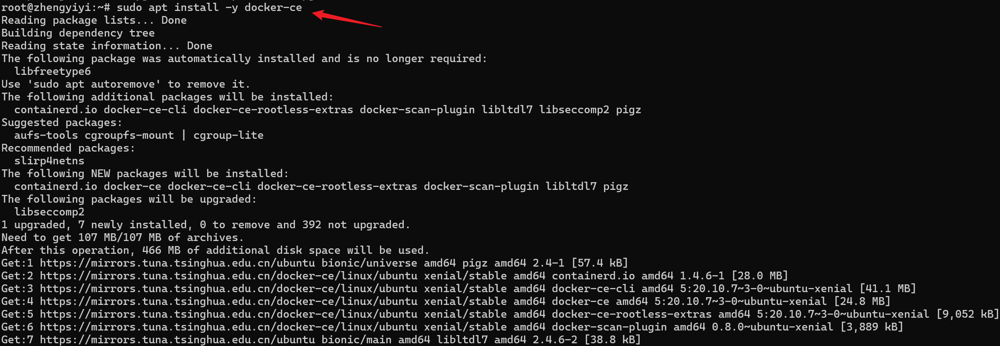

**启动Docker**：

```bash
sudo service docker start
```

这个命令启动Docker服务。

**关闭Docker**：

```bash
sudo service docker stop
```

这个命令会停止Docker服务。