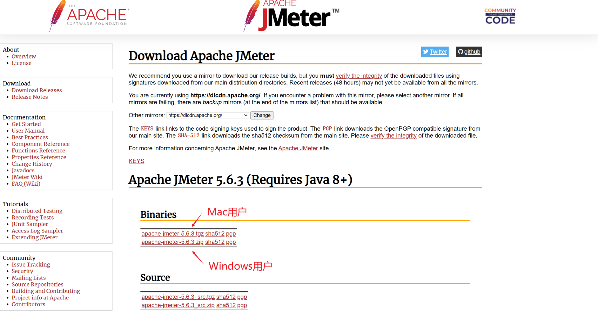
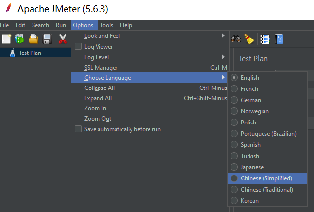
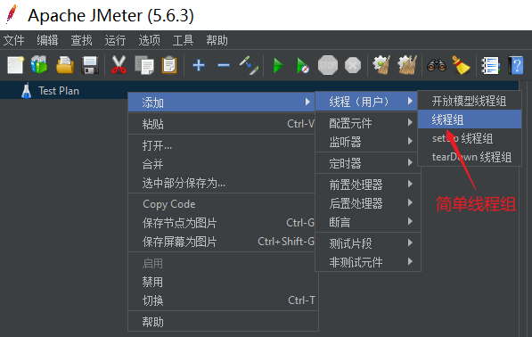
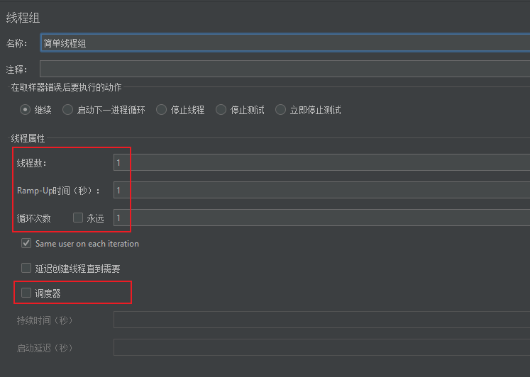
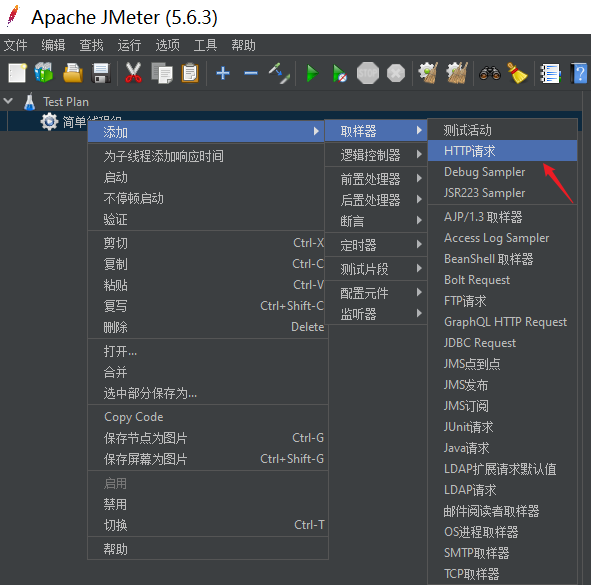
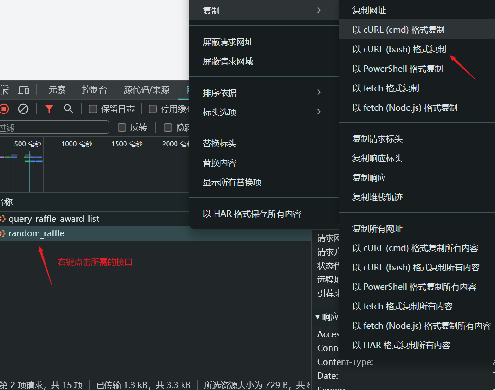
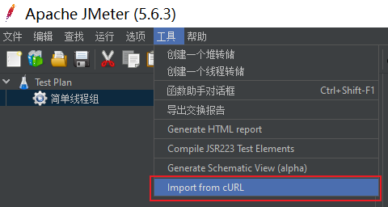
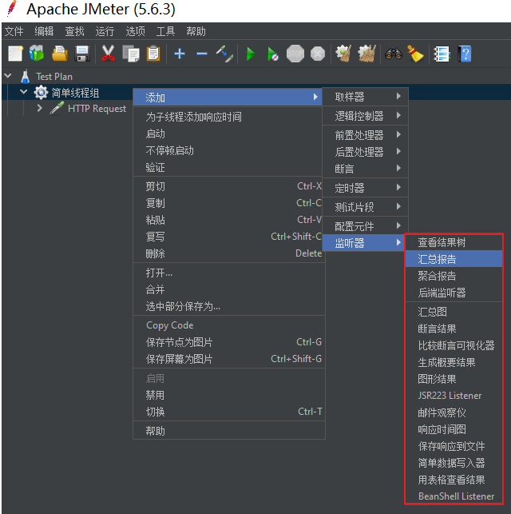
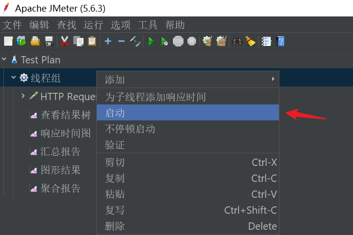

## JMeter

### 什么是 JMeter？

JMeter是一个基于Java的开源压力测试工具，由Apache组织开发，用于对软件应用进行负载测试和性能测量。

官网：[Apache JMeter - Apache JMeter™](https://jmeter.apache.org/)

### 为什么需要压测？

> “压测的主要目的是确定系统在高负载或大量用户同时访问的情况下的性能表现。通过压测，我们可以了解系统的最大承载量，找出系统的性能瓶颈，以及预测系统在实际运行中可能出现的问题。”

在了解了系统的最大承载量后，我们就可以设置熔断、限流和降级的指标，以保证系统在高负载情况下的稳定运行。

- **熔断**：当系统负载达到一定阈值时，自动停止接收新的请求。
- **限流**：限制系统的输入请求速率。
- **降级**：在系统负载过高时，暂时关闭一些非核心功能，以保证核心功能的正常运行。

### 有哪些性能指标？

性能测试指标，是对性能测试结果进行量化衡量的一组数据。

常见的指标如下所示：

1. **吞吐量（Throughput）**：在特定时间内系统能处理的请求数量。
2. **响应时间（Response Time）**：从发送请求到接收到响应所花费的时间。
3. **并发用户数（Concurrent Users）**：在同一时间内，系统能够处理的用户数量。
4. **错误率（Error Rate）**：在所有请求中，错误请求的比例。
5. **资源利用率（Resource Utilization）**：系统在处理请求时，CPU、内存、磁盘和网络等资源的使用情况。

### 吞吐量的技术指标

1. **TPS（Transactions Per Second）**：每秒事务数。它表示系统在每秒钟内处理的事务数量。比如数据库中一个事务可能包括一系列的操作（如插入、更新、删除等）。
2. **QPS（Queries Per Second）**：每秒查询率。它表示系统在每秒钟内接收的查询请求的数量。
3. **RPS（Requests Per Second）**：每秒请求率。它表示系统在每秒钟内接收的请求的数量。

## 如何配置？

### 安装

首先需要从Apache官网下载JMeter，并解压到你的本地目录。请确保系统已经安装了Java。

官网：[Apache JMeter - Download Apache JMeter](https://jmeter.apache.org/download_jmeter.cgi)

> 官网有对应的文档，使用方法介绍的很清晰。

### 启动

进入到 `apache-jmeter-x.x/bin` 目录下。

- 对于`Mac`用户，找到 `jmeter` 文件，右键选择在**终端**中打开。
- 对于`Windows`用户，直接双击 `jmeter.bat` 文件启动 JMeter。

**启动后可修改语言为中文**：

## 常见概念

使用JMeter进行压测的常见概念有：

1. **测试计划**：一组压测，就叫做一个测试计划；
2. **线程组**：线程组用于模拟用户请求，它负责执行测试计划中的压测任务。它可以模拟多个用户同时发送HTTP请求，以进行压力测试。线程组可以配置为发送固定数量的请求、逐步增加请求量等多种模式，以满足不同的测试需求。
3. **取样器**：取样器定义了具体的压测任务，例如HTTP请求。你可以在线程组下添加取样器来定义你的压测任务。
4. **压测结果**：你可以添加不同的监听器来展示和分析压测结果，例如结果树、响应时间图等。

## 具体使用

### 线程组

右键点击“测试计划”（Test Plan），选择“添加”，然后选择“线程组”。线程组是模拟用户请求的线程数量。在线程组中，你可以设置线程数量、循环次数等参数。

- **线程数**：每个用户相当于一个线程，就是模拟同时有多少个用户发请求。
- **Ramp-Up**：预期线程组的所有线程从启动到运行再到释放的总时间。如果Ramp-Up为0，表示瞬时加压，启动线程的时间无限趋近于0。在进行负载测试时，建议将Ramp-Up设置得大一些，这样可以使性能曲线更为平缓，更容易找到性能瓶颈。
- **循环次数**：线程组的循环次数。如果不设置，表示在调度时间范围内一直循环（即JMeter会不停地发送请求）。
- **调度器**：用于设置执行的时间。

### 取样器

JMeter 把对压测的内容，抽象为取样器。包括HTTP接口、FTP服务等。

我们可以**右键点击线程组**，选择“添加” -> “取样器” -> “HTTP请求”。

在HTTP请求中，你需要设置服务器名称或IP，以及端口号，也可以设置HTTP请求类型（GET、POST等）和路径。

这样可以在创建好的线程组下创建一个取样器（HTTP压测接口）。

另外，我们也可以通过导入 `cURL` 的方式进行创建。

比如在浏览器中按 F12，访问所需的接口，通过cURL复制：

接着在 JMeter 中右键点击线程组，点击上方导航栏中的“工具”，选择 `import from cURL`导入，将 cURL 粘贴进去，再点击 `Create Test Plan` 创建即可：

### 监听器

监听器的作用就是查看线程组对取样器HTTP的压测结果，收集并展示。

比如：

- **查看结果树（View Results Tree）**：展示了每个取样器的详细结果，包括请求参数、响应数据等，也就是明细结果。

- **响应时间图（Response Time Graph）**：以图形形式展示了每个取样器的响应时间。
- **汇总报告（Summary Report）**：提供了一个表格，展示了所有取样器的总体结果。

- **吞吐量图（Throughput Graph）**：以图形形式展示了测试过程中的吞吐量。

为了查看测试结果，我们需要添加监听器，右键点击线程组，选择“添加” -> “监听器” -> “查看结果树 / 汇总报告 / 响应时间图...”。

### 运行

当上述内容配置好后，我们就可以启动压测了。

右键点击我们配置的线程组，选择”启动“，开始压测。

在运行期间，你可以查看结果树，看到实时的测试结果。

> 测试完成后，你就可以分析测试结果，以确定你的应用是否能够承受预期的负载，以及找出可能的性能瓶颈。