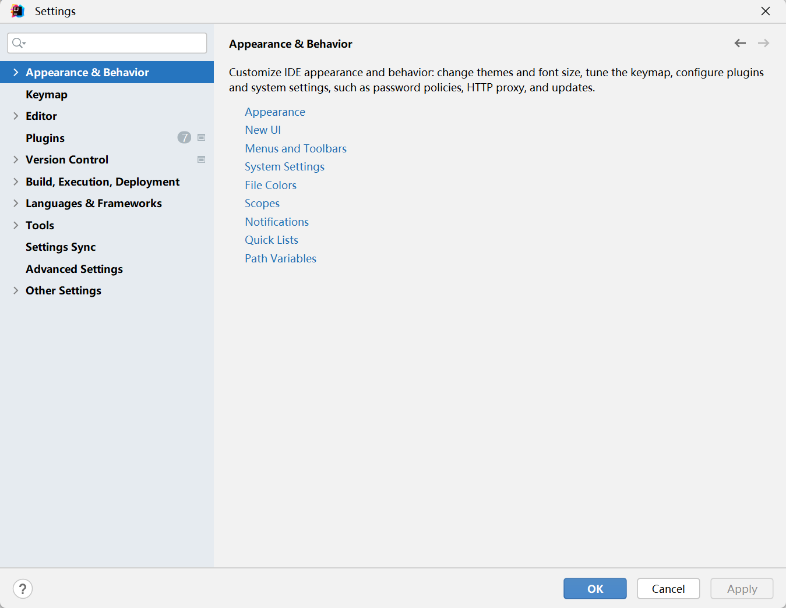

::: tip

我目前使用的是版本是 IntelliJ IDEA 2023.1.1 (Ultimate Edition) 。

:::

## 后缀补全（Postfix Completion）

查看和编辑**后缀补全**（Postfix Completion）模板：

1. 在菜单栏中，选择 "File" -> "Settings..."。
2. 在打开的窗口中，选择左侧的 "Editor" -> "General" -> "Postfix Completion"。

在这个界面中，你可以查看所有的后缀补全模板。每个模板都有一个简短的描述，说明了它的功能和使用场景。


你也可以添加新的模板，或者编辑现有的模板。只需要选择一个模板，然后点击右侧的 "Edit" 按钮就可以进行编辑。

## 实时补全（Live Templates）

使用实时补全（Live Templates）功能来快速插入常用的代码片段。

1. 在菜单栏中，选择 "File" -> "Settings..."。
2. 在打开的窗口中，选择左侧的 "Editor" -> "Live Templates"。

在这个界面中，你可以查看所有的实时补全模板。每个模板都有一个简短的描述，说明了它的功能和使用场景。


你也可以添加新的模板，或者编辑现有的模板。只需要选择一个模板，然后点击右侧的 "Edit" 按钮就可以进行编辑。

在编写代码时，只需要输入模板的缩写，然后按下 Tab 键，就可以插入对应的代码片段。

## 常用的代码模板

### 非空判断

是否为 `null`：


是否不为 `null`：


### 遍历集合或数组

正向遍历：


增强型遍历：


反向遍历：


### 类型强转


### 输出语句

```java
// 使用 "sout" 模板
System.out.println();

// 使用 "soutm" 模板（打印方法名称））
System.out.println("类名.方法名");

// 使用 "soutp" 模板（打印方法形参以及对应实参值）
System.out.println("参数1 = " + param1 + ", 参数2 = " + param2);

// 使用 "soutv" 模板（打印方法中声明最近的变量的值）
int value = 10;
System.out.println("value = " + value);

// 使用 "变量.sout" 模板
int variable = 20;
System.out.println(variable);

// 使用 "变量.soutv" 模板
int variable2 = 30;
System.out.println("variable2 = " + variable2);
```

### 静态常量声明

```java
// 使用 "psf" 模板
public static final 

// 使用 "psfi" 模板
public static final int 

// 使用 "psfs" 模板
public static final String 

// 使用 "prsf" 模板
private static final 
```

## 项目JDK设置

1. 在菜单栏中，选择 "File" -> "Project Structure..."。
2. 在打开的窗口中，选择左侧的 "Platform Settings" -> "SDKs"。
3. 在右侧的窗口中，你可以添加、删除或编辑 JDK。要添加新的 JDK，点击 "+" 按钮，然后选择你的 JDK 的安装路径。
4. 确保你的项目正在使用正确的 JDK，你需要在 "Project Settings" -> "Project" 中设置 "Project SDK"。

> 备注：
>
> `SDKs` 全称是 `Software Development Kit` ，这里一定是选择 `JDK` 的安装根目录，不是 `JRE` 的目录。 可从本地添加多个JDK，使用“+”添加。

## out目录和编译版本

1. 在菜单栏中，选择 "File" -> "Project Structure..."。
2. 在打开的窗口中，选择左侧的 "Project Settings" -> "Project"。
3. 在右侧的窗口中，你可以设置 "Project compiler output"，这是你的 out 目录，所有编译后的类文件和资源文件都会放在这里。
4. 在同一个窗口中，你还可以设置 "Project language level"，这是你的编译版本，它决定了你可以使用哪些 Java 语言特性。

## Settings详细设置菜单

### 介绍

在 IntelliJ IDEA 中，"Settings" 菜单提供了许多选项来定制你的开发环境。

以下是一些主要的设置类别：

- **Appearance & Behavior**：这里可以设置 IDE 的外观和行为，如主题、系统设置等。

- **Keymap**：这里可以设置和修改快捷键。
- **Editor**：这里包含了与代码编辑器相关的设置，如字体、颜色方案、代码风格、拼写检查等。

- **Plugins**：这里可以管理 IntelliJ IDEA 的插件。

- **Version Control**：这里可以设置与版本控制系统（如 Git、SVN）相关的选项。

- **Build, Execution, Deployment**：这里可以设置编译、运行和部署的选项，如编译器设置、构建工具设置（如 Maven、Gradle）等。

- **Languages & Frameworks**：这里可以设置各种编程语言和框架的选项，如 Java、Python、Node.js、Spring、Hibernate 等。

- **Tools**：这里包含了一些额外的工具设置，如数据库、Docker、HTTP Client 等。

- **Settings Sync**：这里可以设置 IntelliJ IDEA 的设置同步，使得你在不同的设备上使用相同的设置。

- **Advanced Settings**：这里包含了一些高级设置，如系统性能、内存使用等。

- **Other Settings**：这里包含了一些其他的设置，这些设置可能是由你安装的插件提供的。

要访问 "Settings" 菜单，你可以在菜单栏中选择 "File" -> "Settings..."，或者使用快捷键 `Ctrl+Alt+S`。

> 请注意，这些设置可能会因 IntelliJ IDEA 的版本和你的操作系统而略有不同。



### 默认启动项目

设置**是否在启动时自动打开上次开发的项目**。

1. 在菜单栏中，选择 "File" -> "Settings..."。
2. 在打开的窗口中，选择左侧的 "Appearance & Behavior" -> "System Settings"。
3. 在右侧的窗口中，找到 "Reopen last project on startup" 选项。

如果**打勾**，则**每次启动 IntelliJ IDEA 时自动打开上次开发的项目**。


### 取消自动更新

1. 在菜单栏中，选择 "File" -> "Settings..."。
2. 在打开的窗口中，选择左侧的 "Appearance & Behavior" -> "System Settings" -> "Updates"。
3. 在右侧的窗口中，你可以看到两个选项："Check for updates in background" 和 "Automatically check updates for plugins"。

默认都打勾了，可以去掉。


### 项目文件编码

1. 在菜单栏中，选择 "File" -> "Settings..."。
2. 在打开的窗口中，选择左侧的 "Editor" -> "File Encodings"。

在这个界面中，你可以进行以下设置：

- **项目文件编码**：在 "Project Encoding" 下拉菜单中，你可以选择你希望的编码，比如 UTF-8。
- **Transparent native-to-ascii conversion**：这个选项主要用于转换 ASCII，显示原生内容，一般会选上。


### 设置外观

可定制 IDE 的外观，包括主题、菜单和窗口的字体及大小，甚至设置背景图。

1. 在菜单栏中，选择 "File" -> "Settings..."。
2. 在打开的窗口中，选择左侧的 "Appearance & Behavior" -> "Appearance"。

在这个界面中，你可以进行以下设置：

- **主题**：在 "Theme" 下拉菜单中，你可以选择你喜欢的主题。IntelliJ IDEA 提供了多种内置主题，如 Light、Darcula、High contrast 等。
- **字体**：在 "UI Options" 部分，你可以设置 "Menu font" 和 "Window headers font"，包括字体类型和大小。
- **背景图**：在 "Background Image" 部分，你可以为你的 IDE 设置一个背景图。点击 "Add" 按钮，然后选择你想要的图片文件。

### 编辑器的样式

定制编辑器的颜色方案，包括代码、注释等的颜色。

1. 在菜单栏中，选择 "File" -> "Settings..."。
2. 在打开的窗口中，选择左侧的 "Editor" -> "Color Scheme"。

在这个界面中，你可以进行以下设置：

- **编辑器样式**：在 "Scheme" 下拉菜单中，你可以选择你喜欢的颜色方案。IntelliJ IDEA 提供了多种内置的颜色方案，你也可以自定义颜色方案。

- **注释的颜色**：在 "Color Scheme" -> "Java"（或你正在使用的其他语言）-> "Comments" 中，你可以设置不同类型注释的颜色：

  - **Block comment**：修改多行注释的字体颜色。
  - **Doc Comment –> Text**：修改文档注释的字体颜色。
  - **Line comment**：修改单行注释的字体颜色。

### 显示行号与方法分隔符

1. 在菜单栏中，选择 "File" -> "Settings..."。
2. 在打开的窗口中，选择左侧的 "Editor" -> "General" -> "Appearance"。

在这个界面中，你可以进行以下设置：

- **显示行号**：打勾 "Show line numbers" ，可在**编辑器的左侧显示行号**。
- **显示方法分隔符**：打勾 "Show method separators" ，可在编辑器中**显示方法分隔符**，使得不同的方法之间更加清晰。

### 自动导包

1. 在菜单栏中，选择 "File" -> "Settings..."。
2. 在打开的窗口中，选择左侧的 "Editor" -> "General" -> "Auto Import"。

在这个界面中，你可以进行以下设置：

- **动态导入明确的包**：打勾 "Add unambiguous imports on the fly"。这个设置具有全局性，会影响所有的项目。
- **优化动态导入的包**：打勾 "Optimize imports on the fly" （自动移除未使用的导入），这个设置只对当前项目有效。

### 修改类头的文档注释信息

1. 在菜单栏中，选择 "File" -> "Settings..."。
2. 在打开的窗口中，选择左侧的 "Editor" -> "File and Code Templates"。
3. 在右侧的窗口中，选择 "Includes" 标签，然后选择 "File Header"。

在这个界面中，你可以编辑类头的文档注释信息。

例如，你可以将其修改为以下内容：

```java
/**
 * @Author 翼
 * @Create ${DATE} ${TIME} 
 * Description: 
 * @Version 1.0   
*/
```

在这个模板中，`${NAME}`、`${PACKAGE_NAME}`、`${DATE}` 和 `${TIME}` 是变量，它们在创建新的类文件时会被自动替换为实际的值。

下面给出官网提供的预设变量：

```ini
${PACKAGE_NAME} - 新创建的类或接口所在的目标包的名称。
${PROJECT_NAME} - 当前项目的名称。
${FILE_NAME} - 将要创建的 PHP 文件的名称。
${NAME} - 在创建文件时在新文件对话框中指定的新文件的名称。
${USER} - 当前用户的登录名。
${DATE} - 当前系统日期。
${TIME} - 当前系统时间。
${YEAR} - 当前年份。
${MONTH} - 当前月份。
${DAY} - 当前月份的日期。
${HOUR} - 当前小时。
${MINUTE} - 当前分钟。
${PRODUCT_NAME} - 将要创建文件的 IDE 的名称。
${MONTH_NAME_SHORT} - 月份名称的前三个字母。例如：Jan, Feb 等。
${MONTH_NAME_FULL} - 月份的全名。例如：January, February 等。
```

### 取消双击shift搜索

> 平时切换中英文时按Shift，常常打开搜索框，较为麻烦。

1. 在菜单栏中，选择 "File" -> "Settings..."。
2. 在打开的窗口中，选择左侧的 "Advanced Settings" 窗口，然后搜索 "double"。
3. 找到 "Disable double modifier key shortcuts" 选项，并勾选它。

完成以上步骤后，双击 Shift 键就不会再打开搜索框了，此时打开搜索框可以使用快捷键 `Ctrl + Shift + A`