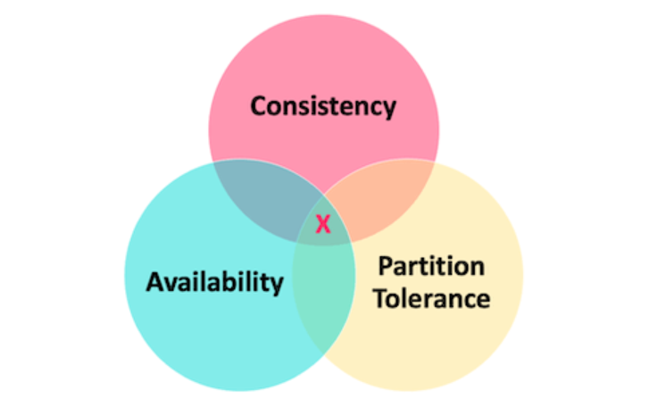

## CAP定理

### 定义

CAP定理，也被称为布鲁尔定理，是由加州大学伯克利分校的Eric Brewer教授在2000年的分布式计算原理研讨会（PODC）上提出的。CAP是Consistency（一致性）、Availability（可用性）和Partition tolerance（分区容错性）的首字母缩写。

CAP定理的核心是，**一个分布式系统不可能同时满足C、A、P三个属性。最多只能同时满足两个**。

| CAP属性                           | 定义                                                         |
| --------------------------------- | ------------------------------------------------------------ |
| 一致性（Consistency）             | 一致性是指在分布式系统中的所有数据备份，在同一时刻是否同样的值。简单的说就是**所有节点访问同一份最新的数据副本**。 |
| 可用性（Availability）            | 可用性是指在集群中一部分节点故障后，系统是否还能响应客户端的读写请求。可用性是对服务能力的一种保证，**每次请求都能获取到非错的响应**（但是不保证获取的数据为最新数据） |
| 分区容错性（Partition tolerance） | 分区容错性是指系统在网络分区后，是否还能保持系统的一致性和可用性。简单来说就是**系统能够在网络分区的情况下继续运行**。 |

::: tip  什么是网络分区？

在分布式系统中，网络分区是指网络中的一部分节点（计算机或服务器）由于网络故障而无法与系统中的其他节点通信，这导致了系统被划分为两个或更多的孤立区域。这种情况可能是由于网络硬件故障，如路由器或交换机故障，或者是由于网络连接故障，如物理线路断裂或网络拥塞导致的。在网络分区的情况下，分布式系统需要做出决策，以在一致性和可用性之间做出权衡，这就是CAP定理所描述的情况。

:::

### 分析

事实上，对于分布式系统来说，在发生“分区”的情况下，CAP 理论只能满足 CP 或者 AP。因此，我们必须选择牺牲一致性以保证可用性，或者牺牲可用性以保证一致性：

- **CP架构**：保证分区容忍性和一致性，但可能会牺牲一部分可用性。例如，`ZooKeeper`、`HBase`等。
- **AP架构**：保证分区容忍性和可用性，但可能会牺牲一部分一致性。例如，`Cassandra`、`Eureka`等。

如果系统没有发生“分区”的话（节点间的网络连接通信正常），那也就不存在 P 了。这个时候，我们就可以同时保证 C 和 A 了。

## BASE理论

### 定义

BASE理论是由eBay的架构师Dan Pritchett在2008年的ACM上提出的。BASE是Basically Available（基本可用）、Soft state（软状态）和Eventually consistent（最终一致性）的首字母缩写。

| 组件                                | 描述                                                         |
| ----------------------------------- | ------------------------------------------------------------ |
| 基本可用（Basically Available）     | 系统总体上是可用的，即使部分功能可能无法使用或响应时间可能会变慢。 |
| 软状态（Soft state）                | 系统的状态可以有一段时间的不一致，或者系统可以处于中间状态，并且这个中间状态可以持续一段时间。 |
| 最终一致性（Eventually consistent） | 在没有新的更新操作的情况下，经过一段时间的数据同步后，所有的副本数据最终将达到一致的状态。 |

BASE理论是对CAP理论的一种补充和延伸，它强调的是在现实的分布式系统中，一致性（C）可能会受到一些因素的影响，导致无法立即达到，但是最终一致性是可以达到的。因此，BASE理论更加符合现实中的分布式系统的实际情况。

### 分析

BASE理论是对传统ACID事务特性的一种妥协和补充，它强调的是大规模分布式系统的可用性和一致性的平衡。在现实的分布式系统中，由于网络延迟、故障等问题，强一致性往往很难做到。因此，BASE理论提出了“基本可用，软状态，最终一致性”的设计原则，允许系统在一段时间内处于不一致的状态，但最终会达到一致性。

这种理论对于构建高可用的分布式系统是非常有价值的。例如，许多大型互联网公司的服务，如Amazon的Dynamo，Google的BigTable，都采用了BASE理论的设计原则。

然而，BASE理论并不适用于所有场景。对于需要强一致性的系统，如银行转账等，还需要采用传统的ACID事务模型。因此，选择使用BASE还是ACID，需要根据具体的业务需求和场景来决定。

