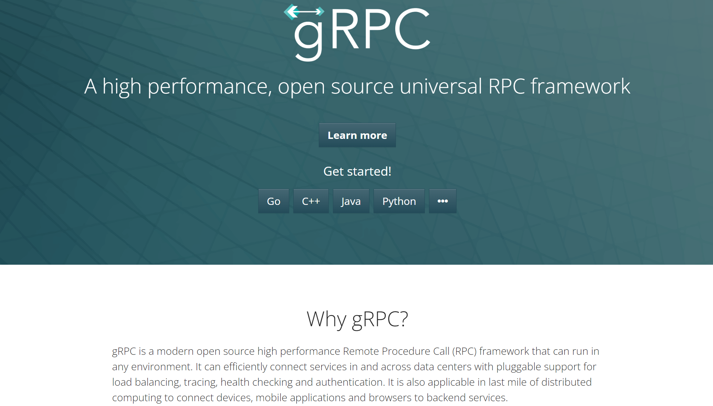
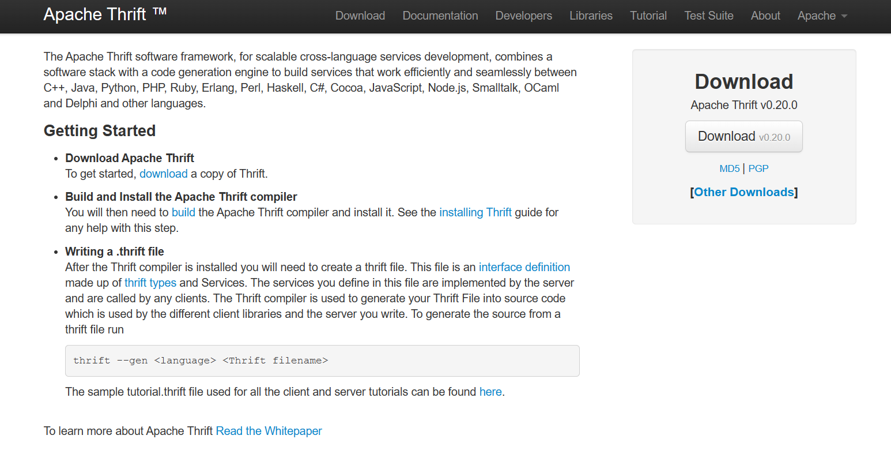
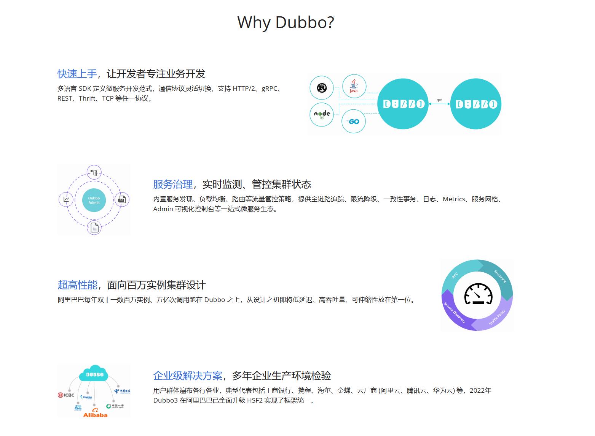

## 基本概念

### 什么是RPC？

RPC，全称为Remote Procedure Call，即远程过程调用。它是一种计算机通信协议，允许一个程序（通常称为客户端或服务消费者）通过网络向另一个程序（通常称为服务器或服务提供者）请求服务，而无需了解底层网络技术细节，让分布式系统中的网络通信变得更加简单和透明。

说白了，RPC允许在在一台计算机上运行的程序调用另一台计算机上的子程序，就像调用本地程序一样，无需为此交互编写额外的代码，这样，我们就可以专注于实现业务逻辑。比如有两个不同的服务分别部署在两台机器上，此时服务A要想调用服务B的某个方法，就可以通过RPC来做，**RPC 的出现就是为了让你调用远程方法像调用本地方法一样简单**。

### RPC工作原理

RPC基于客户端-服务器模式，客户端发送请求，服务器接收请求并返回响应。这种模式使得RPC可以很好地适应各种网络环境，包括单机多进程和跨网络的多机环境。

> RPC的一个重要特性是它的透明性。对于调用者来说，远程过程调用和本地过程调用在语义上是一致的。这使得开发人员可以像设计单机程序一样来设计分布式程序。

一般步骤为：

1. **客户端调用**：客户端调用一个本地的stub（存根），传入需要远程处理的参数。

2. **参数传递**：客户端的调用通过网络发送给远程服务器。

3. **服务器接收**：服务器接收到请求后，会调用对应的服务端的存根（skeleton），执行实际的业务逻辑。

4. **结果返回**：服务器处理完毕后，将结果返回给客户端。

5. **客户端接收结果**：客户端接收到服务器返回的结果，完成远程过程调用。

## RPC框架

RPC（Remote Procedure Call）框架是一种支持网络远程过程调用的软件开发框架。它允许开发者像调用本地函数一样调用远程服务器上的函数或方法，隐藏了底层的网络通信和数据传输的复杂性。

常见的RPC框架有`gRPC`、`Thrift`、`Dubbo`等。

RPC框架通常提供以下功能：

1. **通信**：RPC框架提供了客户端和服务器之间的通信机制。它封装了底层的网络协议（如TCP/IP或HTTP），使开发者无需关心网络编程的细节。
2. **序列化**：RPC框架提供了数据的序列化和反序列化机制。当客户端向服务器发送请求时，需要将请求数据（如方法名、参数等）序列化为字节流；服务器接收到请求后，需要将字节流反序列化为原始数据。
3. **服务注册与发现**：在分布式环境中，RPC框架通常提供了服务注册与发现的功能。服务提供者将自己的服务注册到注册中心，服务消费者可以从注册中心发现并调用这些服务。
4. **负载均衡**：在有多个服务提供者的情况下，RPC框架可以提供负载均衡功能，将请求均匀地分配给各个服务提供者。
5. **容错**：RPC框架通常提供了容错机制，如重试、超时控制等，以增强系统的可用性和稳定性。

## 常见RPC框架

### gRPC

gRPC是一个高性能、开源的通用RPC框架，由Google主导开发，支持多种语言。gRPC基于HTTP/2协议，使用Protocol Buffers（protobuf）作为接口描述语言和消息交换格式，提供了一种定义服务的方法，指定了可以使用哪些参数和返回类型进行RPC。

- 官网：[gRPC | A high performance, open source universal RPC framework](https://grpc.io/)

### Thrift

Thrift是由Facebook开发并开源的一种高效的、支持多种编程语言的远程服务调用的框架。它被设计为用于创建可扩展且跨语言的服务开发。在使用Thrift时，通常的步骤是首先定义IDL文件，然后使用Thrift编译器生成对应语言的代码，接着实现服务端的业务逻辑，最后在客户端调用服务。

- 官网：[Apache Thrift - Home](https://thrift.apache.org/)

### Dubbo

Dubbo是一款由阿里巴巴开源的高性能、轻量级的Java RPC框架。Dubbo 是由阿里开源，后来加入了 Apache，它提供了三个关键功能：接口级的远程方法调用，容错和负载均衡，以及自动服务注册和发现。

> Apache Dubbo 是一款易用、高性能的 WEB 和 RPC 框架，同时为构建企业级微服务提供服务发现、流量治理、可观测、认证鉴权等能力、工具与最佳实践。
>
> "Dubbo3 已在阿里巴巴内部微服务集群全面落地，用于升级运行多年的 HSF2 框架。"

- 官网：[Dubbo | 为构建企业级微服务提供框架、通信、服务治理能力](https://dubbo.apache.org/zh/)