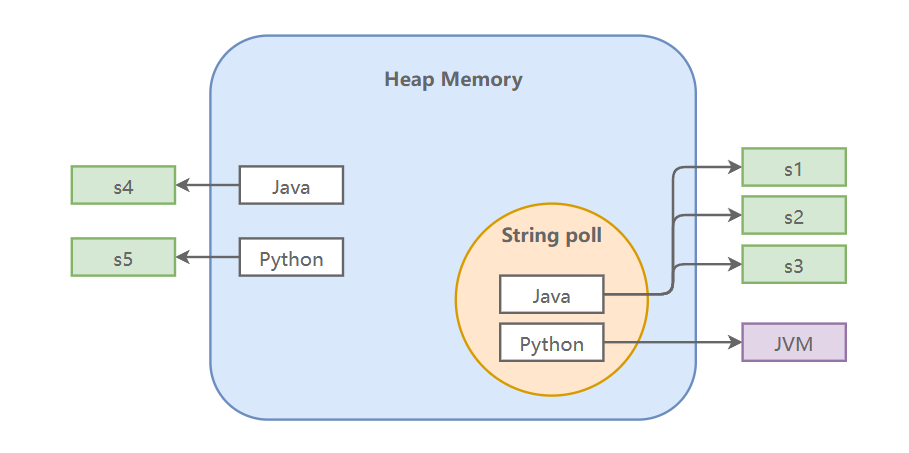

## 1. 不可变性

在Java中，`String`是一个引用类型，其内部是通过一个 `char[]` 数组来存储字符串的。

```java
public final class String
    implements java.io.Serializable, Comparable<String>, CharSequence {

    private final char value[];
    
    // ...
}
```

但从`Java 9`开始，为了优化内存使用，`String` 类的内部实现改为使用一个 `byte[]` 数组和一个编码标志字段来存储字符串。

```java
public final class String
    implements java.io.Serializable, Comparable<String>, CharSequence,
               Constable, ConstantDesc {

    @Stable
    private final byte[] value;

    private final byte coder;      
    
    // ...          
}
```

::: tip

任何看似改变 `String` 值的操作，如 `substring`, `concat`, `replace` 等，都会返回一个新的 `String` 对象，原始的 `String` 对象的值不会改变。

:::

String类之所以可不变，是因为：

- `String`类被 `final` 修饰，因此String类不能被继承（是最终的），这避免了子类破坏 `String` 的不可变性。
- `String`类中保存字符串内容的`value`数组被 `final` 修饰且为私有的，这就确保了`value`数组的内容一旦被初始化，就不能被改变。

## 2. 字符串池

Java中的字符串池（String Pool）是Java堆内存中用于存储字符串字面量的地方。

::: tip

字面量（String Literal）是指直接，例如 `"Hello, World!"` 。

:::

字符串分配在内存中是一项耗时且占用内存的操作。说白了，字符串常量池就是 JVM 为了提升性能以及减少内存消耗，针对 String 类专门开辟的一块区域，维护了一个字符串池。我们知道，字符串对象的创建方式常见的有以下两种。

首先是使用字符串字面量（使用双引号`"`括起来的字符序列）：

```java
String s1 = "java";
```

上面的语句首先会在字符串池中搜索字符串 `"java"`，如果找到了就直接返回引用，否则就创建一个字符串对下那个并将其放在字符串池中，再返回引用。

> 这种情况下只会创建一个对象（在字符串池中）。

那另一种就是使用 `new` 关键字来创建`String`对象：

```java
String s2 = new String(“java”);
```

该语句会在堆（`heap memory`）中创建一个字符串对象，同时会检查池中是否存在内容相同的字符串对象，如果不存在，则会在池中创建一个对象，否则就跳过。

> 在这种情况下，可能会创建两个对象，也可能仅创建一个对象。

::: code-tabs

@tab 示例

```java
public class StringDemo {
    public static void main(String[] args) {
        // 在字符串池中创建字符串对象
        String s1 = "Java";

        // 不会在字符串池中创建新的字符串对象，因为"Java"已经存在
        String s2 = "Java";

        // s3和s1指向同一个字符串字面量"Java"
        String s3 = s1;

        // 在堆内存中创建新对象，并且不会在字符串池中创建新对象（因为它已经存在）
        String s4 = new String("Java");

        // 创建两个对象：一个在堆内存中，另一个在字符串池中
        String s5 = new String("Python");

        System.out.println(s1 == s2); // true
        System.out.println(s1 == s3); // true
        System.out.println(s2 == s3); // true

        System.out.println(s1 == s4); // false
        System.out.println(s4 == s5); // false

    }
}
```

:::

内存分配图如下：



## 3. 字符串操作

### 3.1 比较

判断两个字符串是否相等，我们会用`equals()` 方法，而不是 `==`。

```java
String s1 = "Hello";
String s2 = new String(s1);
System.out.println(s1.equals(s2));  // true
System.out.println(s1 == s2);  // false
```

> `==` 比较的是两个引用是否指向同一个对象，`equals()` 方法比较两个字符串的内容是否相同。

### 3.2 搜索

在字符串中搜索子串的方法有很多，例如：

| 方法                                       | 描述                      |
|------------------------------------------|-------------------------|
| `indexOf(String str)`                    | 返回子串首次出现的位置             |
| `indexOf(String str, int fromIndex)`     | 从指定位置开始，返回子串首次出现的位置     |
| `lastIndexOf(String str)`                | 返回子串最后出现的位置             |
| `lastIndexOf(String str, int fromIndex)` | 从指定位置开始反向搜索，返回子串最后出现的位置 |
| `contains(CharSequence s)`               | 字符串中是否包含子串              |

```java
String str = "Hello, welcome to the world of Java";

int firstIndex = str.indexOf("o"); // 4
int firstIndexFromPos = str.indexOf("o", 5); // 11

int lastIndex = str.lastIndexOf("o"); // 28
int lastIndexFromPos = str.lastIndexOf("o", 15); // 11

boolean contains = str.contains("Java"); // true
```

### 3.3 提取

提取子串可以用 `substring(int beginIndex)` 方法，此时子串会开始于指定的 `beginIndex` 并扩展到此字符串的末尾。

```java
String str = "Hello, welcome to the world of Java";
String subStr = str.substring(7);
System.out.println(subStr); // welcome to the world of Java
```

如果要截取某个部分的子串，可以使用`substring(int beginIndex, int endIndex)`，此时子串会从指定的 `beginIndex` 开始，直到索引 `endIndex - 1` 结束（左闭右开区间）。

```java
String str = "Hello, welcome to the world of Java";
String subStr = str.substring(7, 14);
System.out.println(subStr); // welcome
```

### 3.4 替换

想用某个子串去替换字符串中所有匹配的子串，可以使用 `replace()` 方法。

```java
String str = "Hello, welcome to the world of Java";
String replacedStr = str.replace("Java", "Python");
System.out.println(replacedStr); // Hello, welcome to the world of Python
```

还可以利用正则表达式去匹配，进行子串替换，使用方法 `replaceAll(String regex, String replacement)`，比如：

```java
String str = "Hello";
// 用 "Java" 替换所有字母
String replacedString = str.replaceAll("[a-zA-Z]", "Java");
System.out.println(replacedString); // JavaJavaJavaJavaJava
```

使用 `replaceFirst()`方法，可以替换第一个匹配给定正则表达式的子串：

```java
String str = "Hello World";
// 用 "Java" 替换第一个单词
String replacedString = str.replaceFirst("\\b\\w+\\b", "Java");
System.out.println(replacedString);
```

### 3.5 分割

如果你想将字符串拆为多个子串，可以使用 `split(String regex)` 方法，其中`regex`是正则表达式：

```java
String str = "Hello, welcome to the world of Java";
String[] splitStr = str.split(" ");	// 使用空格作为分隔符
for (String s : splitStr) {
    System.out.println(s);
}
```

同时，还可以指定分割次数限制，用`split(String regex, int limit)`方法，其中：

- 如果 `limit` 小于等于0，那么将尽可能多地分割字符串。
- 如果 `limit` 大于0，那么最多分割  `limit-1` 次。

### 3.6 拼接

符串拼接方式有如下几种：

1. 使用 `+` 或 `+=` 运算符
2. 使用 `String.concat()` 方法
3. 使用 `String.format()` 方法
4. 使用 `StringBuilder` 或 `StringBuffer`

```java
String str1 = "Hello";
String str2 = "World";

String result = str1 + " " + str2;
System.out.println(result); // Hello World

result = str1.concat(" ").concat(str2);
System.out.println(result); // Hello World

result = String.format("%s %s", str1, str2);
System.out.println(result); // Hello World

StringBuilder sb = new StringBuilder();
sb.append(str1);
sb.append(" ");
sb.append(str2);
result = sb.toString();
System.out.println(result); // Hello World
```

### 3.7 格式化

上面我们使用了 `format()` 方法，该方法是返回一个格式化字符串，我们会使用指定的格式字符串和参数。

参数如下：

- `%s`：用于字符串。
- `%d`：用于十进制整数。
- `%f`：用于浮点数。
- `%b`：用于布尔值。
- `%c`：用于字符。
- `%e`：用于科学记数法表示的浮点数。
- `%t`：用于时间和日期。
- `%x`：用于十六进制整数。
- `%n`：用于平台特定的行分隔符。

每个占位符都可以与一组可选的标志和宽度一起使用，以控制格式化的输出。例如，`%10s` 将字符串格式化为至少10个字符宽，`%-10s` 将字符串格式化为至少10个字符宽，并左对齐文本。

```java
public class Main {
    public static void main(String[] args) {
        String name = "Alice";
        int age = 20;
        float score = 96.5f;
        boolean isFemale = true;
        char initial = 'A';
        double scientific = 1.23e-4;
        String hex = String.format("%x", 255);
        String formatted = String.format("Name: %10s%nAge: %d%nScore: %.2f%nIs Female: %b%nInitial: %c%nScientific: %e%nHex: %s",
                name, age, score, isFemale, initial, scientific, hex);
        System.out.println(formatted);
    }
}
```

运行结果：

```
Name:      Alice
Age: 20
Score: 96.50
Is Female: true
Initial: A
Scientific: 1.230000e-04
Hex: ff
```

### 3.8 其他

`trim()`: 返回字符串的副本，忽略前导空白和尾部空白。

`isEmpty()`: 当且仅当 `length()` 为 0 时返回 true。

`isBlank()`: 如果字符串为空或仅包含空白字符，则返回 true。

## 4. 类型转换

### 4.1 基本数据类型转为String类型

`String.valueOf(dataType data)`是一个静态方法，可以接受所有基本数据类型，并将其转换为字符串。

### 4.2 String类型转为基本数据类型

每个包装类都有一个 `parseXXX(String s)` 方法可以将字符串转换为相应的基本数据类型：

1. `Integer.parseInt(String s)`
2. `Long.parseLong(String s)`
3. `Double.parseDouble(String s)`
4. `Float.parseFloat(String s)`
5. `Boolean.parseBoolean(String s)`
6. `Byte.parseByte(String s)`
7. `Short.parseShort(String s)`

### 4.3 String类型转换为char数组

`toCharArray()`方法可以将字符串转换为一个新的字符数组。

