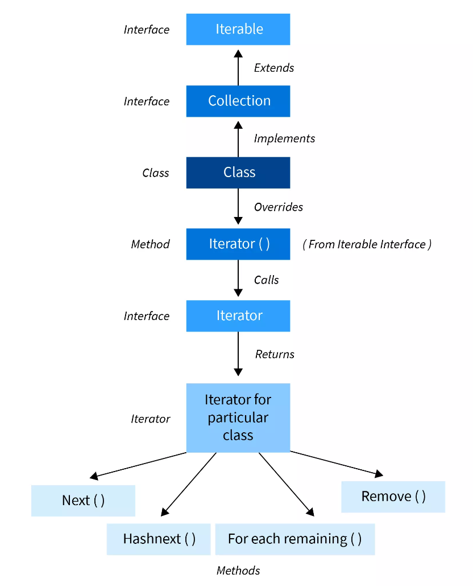
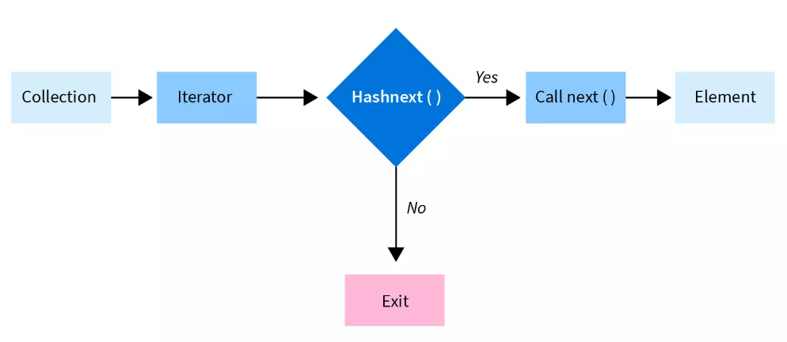

本节，我们来学习Iterable 接口和Iterator接口。

# Iterable 接口

## 概述

`Iterable` 接口属于 `java.lang`包（ JDK 1.5 中引入），用于提供一种迭代对象集合的标准方法，实现 `Iterable` 接口的类对象允许被迭代。

> "The Iterable interface in Java is used to allow an object to be the target of the ‘for-each loop’ statement. Once the class interface is defined, you can create a new instance with the syntax, and use it in a loop with the line, . It provides a way to iterate over a collection of items."

实现了*Iterable*接口的类对象可以使用增强型 *for* 循环（也称为“*for-each*”循环）迭代集合内的元素。

举个例子：

```java
List<Integer> numbers = getNumbers();
for (Integer number : numbers) {
    System.out.println(number);
}
```

`Collection` 接口继承自 `Iterable` 接口，因此所有实现 `Collection` 接口的类都是可迭代的。

## 接口定义

`Iterable`接口提供逐个访问集合元素的功能，`ArrayList`、`ArrayDeque`、`LinkedList`等集合实现类都可以通过实现 `Iterable` 接口，从而轻松遍历（迭代）其存放的元素。

我们来看`Iterable`接口的内容：

```java
package java.lang;

import java.util.Iterator;
import java.util.Objects;
import java.util.Spliterator;
import java.util.Spliterators;
import java.util.function.Consumer;

/**
 * Iterable提供一种迭代对象集合的标准方法，按顺序迭代集合中的对象。
 * 实现该接口需要提供一个迭代器Iterator，该迭代器用于遍历集合中的元素。
 *
 * @param <T> 迭代器返回的元素类型
 */
public interface Iterable<T> {

    /**
     * 返回一个用于迭代集合中元素的迭代器。
     *
     * @return 集合的迭代器
     */
    Iterator<T> iterator();

    /**
     * 对集合中的每个元素执行给定的操作。
     *
     * @param action 对每个元素执行的操作
     * @throws NullPointerException 如果操作为空
     */
    default void forEach(Consumer<? super T> action) {
        Objects.requireNonNull(action);
        for (T t : this) {
            action.accept(t);
        }
    }

    /**
     * 返回一个不确定大小的 Spliterator，用于遍历集合中的元素。
     *
     * @return 集合的 Spliterator
     */
    default Spliterator<T> spliterator() {
        return Spliterators.spliteratorUnknownSize(iterator(), 0);
    }
}
```


# 三种迭代方式

对于一个实现了 `Iterable` 接口的集合类，我们可以如何对该集合中存放的对象进行迭代（遍历）呢？

## （1）通过 Iterator 接口

### 概述

任何实现 `Iterable` 接口的类，都会重写 `Iterable` 接口中的 `iterator()` 方法。`iterator()`方法会返回一个`Iterator`对象，该对象实际上就是真正用于迭代集合元素的工具。

每个集合类都会**提供**实现`Iterator`接口的内部类，在重写 `Iterable` 接口中的 `iterator()` 方法时，**返回这个内部类的实例，用于迭代当前集合中的元素**。

### 接口定义

`Iterator` 接口中定义了四个方法：`next()`、`hasNext()`、`remove()`和`forEachRemaining()`，记录如下：

```java
package java.util;

import java.util.function.Consumer;

/**
 * Iterator接口，用于迭代集合元素
 * Iterator允许按顺序访问集合中的元素，而无需暴露集合的内部表示。
 *
 * @param <E> 迭代器返回的元素类型
 */
public interface Iterator<E> {

    /**
     * 判断集合中是否还有下一个元素。
     *
     * @return 如果集合中还有下一个元素，则返回 true；否则返回 false
     */
    boolean hasNext();

    /**
     * 返回集合中的下一个元素。
     *
     * @return 集合中的下一个元素
     * @throws NoSuchElementException 如果没有更多的元素可供返回
     */
    E next();

    /**
     * 从集合中移除当前迭代器位置的元素（可选操作）。
     *
     * @throws UnsupportedOperationException 如果不支持移除操作
     * @throws IllegalStateException      如果在迭代器的当前位置不允许移除元素
     */
    default void remove() {
        throw new UnsupportedOperationException("remove");
    }

    /**
     * 对剩余的所有元素执行给定的操作，按顺序进行。
     *
     * @param action 对每个剩余元素执行的操作
     * @throws NullPointerException 如果操作为空
     */
    default void forEachRemaining(Consumer<? super E> action) {
        Objects.requireNonNull(action);
        while (hasNext()) {
            action.accept(next());
        }
    }
}
```

示意图：



### 迭代的工作流程

当我们需要遍历集合中的对象时就会调用 `iterator()`方法，该方法返回指定类型的`Iterator`实例，我们通过调用该实例两个方法来遍历集合：

1. `hasNext()`方法：检查是否有任何元素，如果它返回 true，我们
2. `next()`方法：如果`hasNext()`方法返回true，我们就调用`next()`方法来检索下一个元素（否则终止循环）。

具体的，使用迭代器遍历集合对象的工作流程如下：

1. **获取迭代器对象：** 使用集合类的 `iterator()` 方法获取迭代器对象。迭代器对象是实现了 `Iterator` 接口的类的实例（比如`ArrayList`类中的内部类`Itr`）。

    ```java
    Iterator<T> iterator = collection.iterator();
    ```

2. **检查是否有下一个元素：** 使用迭代器的 `hasNext()` 方法检查集合中是否还有下一个元素。

    ```java
    while (iterator.hasNext()) {
        // 有下一个元素
    }
    ```

3. **获取下一个元素：** 使用迭代器的 `next()` 方法获取集合中的下一个元素。

    ```java
    T element = iterator.next();
    // 处理当前元素
    ```

4. **可选的移除操作（如果需要）：** 如果需要从集合中移除当前迭代器位置的元素，可以使用迭代器的 `remove()` 方法。注意，这是一个可选操作，不是所有的集合都支持。

    ```java
    iterator.remove();
    ```

5. **重复步骤2-4：** 重复执行步骤2到步骤4，直到集合中没有更多的元素。

完整的遍历过程可能如下所示：

```java
Iterator<T> iterator = collection.iterator();
while (iterator.hasNext()) {
    T element = iterator.next();
    // 处理当前元素
}
```

这种方式的优势在于它提供了一种通用的遍历集合的方法，对于调用者来说，无需知道集合的底层实现，通过迭代器对象来遍历集合元素，这适用于不同类型的集合类。

以 `ArrayList`为例，这是 Java 中的动态数组实现：

```java
import java.util.ArrayList;
import java.util.Iterator;

public class Main {
    public static void main(String[] args) {
        // 创建一个ArrayList并添加一些元素
        ArrayList<String> list = new ArrayList<>();
        list.add("Apple");
        list.add("Banana");
        list.add("Orange");

        // 获取集合的迭代器
        Iterator<String> iterator = list.iterator();

        // 使用迭代器遍历集合
        while (iterator.hasNext()) {
            String fruit = iterator.next();
            System.out.println(fruit);
        }
    }
}
```

运行结果：

```
Apple
Banana
Orange
```

示意图如下：



## （2）通过增强型for循环

### 概述

增强型for循环（也称为`for-each循环`）用于迭代数组或者Collection实现类（例如ArrayLis）。

语法也不难。以关键字for开头，就像普通for循环一样，但无需声明计数器变量（比如`i`），而是声明一个与数组元素类型一致的变量，后跟一个冒号 `:` ，然后是数组名称。在循环体中，我们就可以对声明的循环变量进行一些操作。

```java
for(数组元素的类型 循环变量 : 数组) {
    // 对循环变量进行某些操作
    // ...
}
```

举个简单的例子：

```java
int arr[] = { 10, 20, 30, 40, 50 }; 
for (int element : arr)
    System.out.print(element + " ");
```

运行结果：

```
10 20 30 40 50 
```

使用for-each循环的局限性主要有三点：

- 无法修改数组元素
- 无法获取当前循环变量的索引（下标）
- 只能单步向前迭代

### 使用增强型for循环，迭代Iterable对象

实现 `Collection` 接口的类的对象可以使用增强型for循环（`for-each`）进行遍历。因为 `Collection` 接口继承了 `Iterable` 接口。

> 增强型 for 循环在内部使用迭代器来迭代集合，所以只要类实现了 Iterable 接口，就可以使用这种简便的语法。

举例：

```java
import java.util.ArrayList;
import java.util.List;

public class Main {
    public static void main(String[] args) {
    	// create a list 
        List<String> list = new ArrayList<String>(); 
    
        // add elements 
        list.add("Java"); 
        list.add("Python"); 
        list.add("Go");
        list.add("Rust");
        list.add("C++");
    
        // Iterate through the list 
        for( String element : list ){ 
            System.out.println( element ); 
        } 
    }
}
```

## （3）通过forEach方法

### 概述

Java 8版本对现有的API进行了改进，并且添加了一些新功能，比如`java.lang.Iterable`接口中的 `forEach` 方法。

> 在我们需要遍历集合时，通常需要创建一个迭代器来遍历集合，然后可以在循环中对集合中的每个元素执行业务逻辑。如果没有正确实现，可能会导致`ConcurrentModificationException`异常。而`forEach()`方法采用了`Lambda表达式`作为参数。集合中的每个元素都会调用此 `Lambda` 表达式。

举个例子：

```java
import java.util.ArrayList;
import java.util.List;

public class Main {
    public static void main(String[] args) {
    	// create a list 
        List<String> list = new ArrayList<String>(); 
    
        // add elements 
        list.add("Java"); 
        list.add("Python"); 
        list.add("Go");
        list.add("Rust");
        list.add("C++");
    
        // Iterate through the list 
        list.forEach((element) -> { System.out.println(element); });
    }
}
```

### forEach()

我们来看一下`Iterable`接口中`forEach`方法的实现如下：

```java
/**
 * 对集合中的每个元素执行指定的操作。
 * 这是一个默认方法，允许通过传递一个实现了 Consumer 接口的操作来迭代集合元素。
 *
 * @param action 对每个元素执行的操作
 * @throws NullPointerException 如果操作为空
 */
default void forEach(Consumer<? super T> action) {
    // 确保操作不为空
    Objects.requireNonNull(action);

    // 遍历集合中的每个元素，对其执行指定的操作
    for (T t : this) {
        action.accept(t);
    }
}
```

`forEach()`方法是`Iterable`接口中的默认方法，允许使用更简洁的语法（Lambda表达式）对集合中的每个元素执行操作。它遍历集合并对每个元素调用指定的操作。

**使用示例**：

```java
List<String> cities = Arrays.asList("Beijing", "Tokyo", "New York");

// 使用Lambda表达式打印每个城市
cities.forEach(city -> System.out.println(city));

// 或者使用方法引用
cities.forEach(System.out::println);
```


### Lambda表达式

我们知道，集合实现类实现了`Iterable`接口，该接口内部的`forEach()`方法接受一个函数式接口`Consumer<T>`作为参数，源码如下：

```java
// Iterable接口中的forEach()方法
default void forEach(Consumer<? super T> action) {
    Objects.requireNonNull(action);
    for (T t : this) {
        action.accept(t);
    }
}
```

`Consumer`接口只包含一个抽象方法`accept(T t)`，当我们使用`Lambda`表达式作为 `Consumer<T>` 的实例时，它实际上是在为 `accept` 方法提供具体的实现。

比如：

```java
import java.util.ArrayList;
import java.util.List;
import java.util.function.Consumer;

public class Main {
    public static void main(String[] args) {
        List<String> myList = new ArrayList<>();
        myList.add("Apple");
        myList.add("Banana");
        myList.add("Orange");

        // 将 lambda 表达式存储在变量中
        Consumer<String> method = (element) -> { System.out.println(element); };
        // 使用Lambda表达式作为Consumer<T>的实例
        myList.forEach(method);

        // 上述语句等价于：
        // myList.forEach(element -> System.out.println(element));
    }
}
// Apple
// Banana
// Orange
```

在这里，我们使用了Lambda表达式 `element -> System.out.println(element)` 来创建一个匿名的 `Consumer<T>` 实例，该实例定义了具体的操作，即打印集合中的每个元素。Lambda表达式的简洁性使得我们能够以更紧凑的方式传递行为。

> 小结：通过Lambda表达式，我们可以创建不属于任何类的匿名方法，Lambda表达式可以像对象一样传递并根据需要执行。