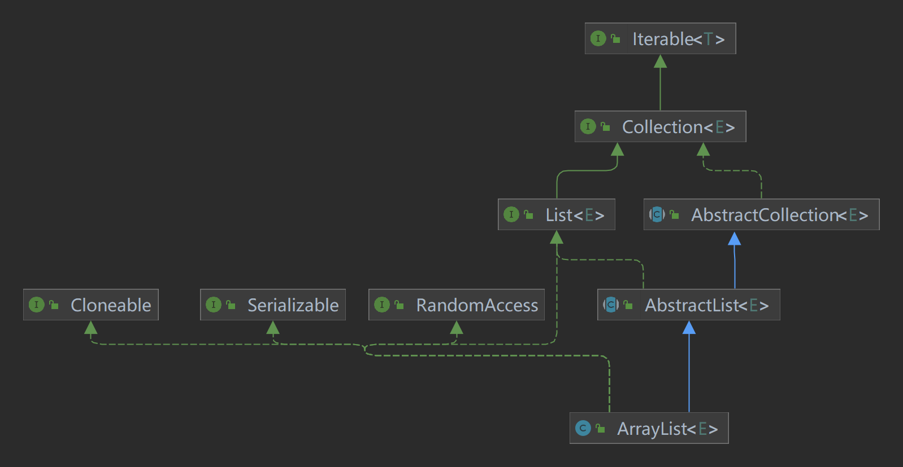
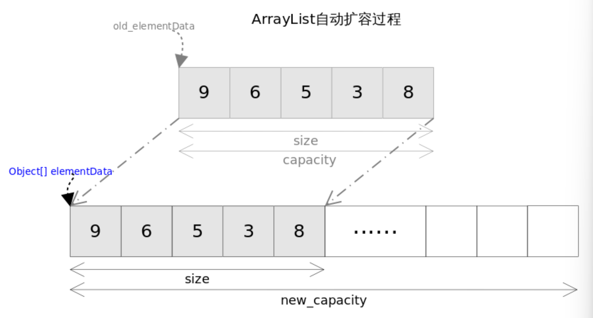

## ArrayList 总览



ArrayList是一个动态数组实现的类，它实现了List接口，表现为一个可变大小的数组。该容器以顺序方式存储元素，保持插入顺序不变。与Vector类似，ArrayList允许存放null元素。

```java
public class ArrayList<E> extends AbstractList<E>
        implements List<E>, RandomAccess, Cloneable, java.io.Serializable
{
    // ...

    /**
     * The array buffer into which the elements of the ArrayList are stored.
     * The capacity of the ArrayList is the length of this array buffer. Any
     * empty ArrayList with elementData == DEFAULTCAPACITY_EMPTY_ELEMENTDATA
     * will be expanded to DEFAULT_CAPACITY when the first element is added.
     */
    transient Object[] elementData; // non-private to simplify nested class access

    // ...
}
```

如上所示，`ArrayList`底层实现是通过一个`Object`数组`elementData`，由于`Java`泛型的实现方式，该数组可以容纳任何类型的对象。这意味着在`ArrayList`中可以存储各种数据类型。

每个`ArrayList`都有一个容量（`capacity`），这表示底层数组的大小。容器内存储的元素个数不能超过当前容量。当向容器中添加元素时，如果容量不足，ArrayList会自动增加底层数组的大小，以适应更多的元素。

> `size` 字段表示 ArrayList 对象中当前存储的元素数量。`size()`，`isEmpty()`，`get()`，`set()`方法均能在常数时间内完成，`add()`方法的时间开销跟插入位置有关，`addAll()`方法的时间开销跟添加元素的个数成正比。其余方法大都是线性时间。

为追求效率，`ArrayList`没有实现同步（`synchronized`），如果需要多个线程并发访问，可以手动同步，也可使用`Vector`替代。


# 几个常用方法

## set()

```java
/**
 * 将列表中指定位置的元素替换为指定的元素。
 *
 * @param index 要替换的元素的索引
 * @param element 要存储在指定位置的元素
 * @return 先前位于指定位置的元素
 * @throws IndexOutOfBoundsException 如果索引超出范围
 */
public E set(int index, E element) {
    rangeCheck(index); // 检查索引是否越界

    E oldValue = elementData(index); // 获取原始位置的元素
    elementData[index] = element; // 将指定位置的元素替换为新的元素
    return oldValue; // 返回先前位于指定位置的元素
}
```

备注：

> `elementData`方法用于返回`Arraylist`中指定位置的元素：
>
> ```java
> /**
>  * 返回列表中指定位置的元素。
>  * 
>  * @param index 元素索引
>  * @return 列表中指定位置的元素
>  */
> @SuppressWarnings("unchecked")
> E elementData(int index) {
>     return (E) elementData[index]; // 通过强制类型转换为泛型类型E
> }
> ```
>
> `rangeCheck`方法用于检查索引是否越界：
>
> ```java
> /**
>  * 检查给定的索引是否在有效范围内，如果不在范围内，则抛出适当的运行时异常。
>  *
>  * @param index 要检查的索引
>  * @throws IndexOutOfBoundsException 如果索引超出范围
>  */
> private void rangeCheck(int index) {
>     if (index >= size)
>         throw new IndexOutOfBoundsException(outOfBoundsMsg(index));
> }
> ```

## get()

```java
/**
 * 返回列表中指定位置的元素。
 *
 * @param  index 要返回元素的索引
 * @return 列表中指定位置的元素
 * @throws IndexOutOfBoundsException 如果索引超出范围
 */
public E get(int index) {
    rangeCheck(index); // 检查索引是否越界

    return elementData(index); // 返回指定位置的元素
}
```

## indexOf()

```java
/**
 * 返回指定元素在列表中首次出现的索引，如果列表不包含该元素，则返回 -1。
 *
 * @param o 要查找的元素
 * @return 元素在列表中首次出现的索引，如果未找到则返回 -1
 */
public int indexOf(Object o) {
    if (o == null) {
        // 如果要查找的元素为null，遍历列表查找第一个为null的元素并返回其索引
        for (int i = 0; i < size; i++)
            if (elementData[i] == null)
                return i;
    } else {
        // 如果要查找的元素不为null，遍历列表查找第一个与指定元素相等的元素并返回其索引
        for (int i = 0; i < size; i++)
            if (o.equals(elementData[i]))
                return i;
    }
    // 如果未找到指定元素，则返回 -1
    return -1;
}
```

该方法的主要作用是返回列表中指定元素的第一次出现的索引。在循环中通过对元素的比较实现，时间复杂度与列表大小成正比，即为线性时间。

## contains()

```java
/**
 * 判断列表是否包含指定的元素。
 *
 * @param o 要检查是否包含的元素
 * @return 如果列表包含指定的元素，则返回 true；否则返回 false
 */
public boolean contains(Object o) {
    return indexOf(o) >= 0;
}
```

该方法的实现基于`indexOf`方法的结果，通过判断元素是否在列表中找到来决定返回`true`或`false`。

## lastIndexOf()

```java
/**
 * 返回指定元素在列表中最后一次出现的索引，如果列表不包含该元素，则返回 -1。
 *
 * @param o 要查找的元素
 * @return 元素在列表中最后一次出现的索引，如果未找到则返回 -1
 */
public int lastIndexOf(Object o) {
    if (o == null) {
        // 如果要查找的元素为null，从列表末尾向前遍历，找到最后一个为null的元素并返回其索引
        for (int i = size-1; i >= 0; i--)
            if (elementData[i] == null)
                return i;
    } else {
        // 如果要查找的元素不为null，从列表末尾向前遍历，找到最后一个与指定元素相等的元素并返回其索引
        for (int i = size-1; i >= 0; i--)
            if (o.equals(elementData[i]))
                return i;
    }
    // 如果未找到指定元素，则返回 -1
    return -1;
}
```

该方法用于查找指定元素在列表中最后一次出现的索引，从列表末尾向前遍历逐一比较元素，找到匹配的则返回相应的索引。

## add()

跟C++ 的`vector`不同，`ArrayList`没有`push_back()`方法，对应的方法是`add(E e)`，`ArrayList`也没有`insert()`方法，对应的方法是`add(int index, E e)`。这两个方法都是向容器中添加新元素，这可能会导致`capacity`不足，因此在添加元素之前，都需要进行剩余空间检查，如果需要则自动扩容。扩容操作最终是通过`grow()`方法完成的。

我们后面再讲`ArrayList`的扩容机制。先看`add()`方法：

```java
/**
 * 将指定元素添加到ArrayList的末尾。
 *
 * @param e 要添加的元素
 * @return 如果成功添加元素，则返回 true
 */
public boolean add(E e) {
    ensureCapacityInternal(size + 1); // 确保容量足够，增加修改次数（modCount）

    elementData[size++] = e; // 在列表末尾添加元素
    return true; // 添加成功，返回 true
}
```

> `ensureCapacityInternal(int minCapacity)`确保了底层数组容量的足够，并通过增加`modCount`来记录修改次数。

```java
/**
 * 在指定位置插入指定元素。
 *
 * @param index 要插入的位置的索引
 * @param element 要插入的元素
 * @throws IndexOutOfBoundsException 如果索引超出范围
 */
public void add(int index, E element) {
    rangeCheckForAdd(index); // 检查插入位置的合法性

    ensureCapacityInternal(size + 1); // 确保容量足够，增加修改次数（modCount）

    // 使用 System.arraycopy 移动元素，从插入位置开始，将后续的元素向后移动，为新元素腾出位置
    System.arraycopy(elementData, index, elementData, index + 1, size - index);

    elementData[index] = element; // 在指定位置插入新元素
    size++; // 增加列表的大小
}
```

## remove()

`remove()`方法也有两个版本，一个是`remove(int index)`，用于删除指定位置的元素，另一个是`remove(Object o)`删除第一个满足`o.equals(elementData[index])`的元素。删除操作是`add()`操作的逆过程，需要将删除元素之后的元素向前移动一个位置。

> 需要注意的是为了让`GC`起作用，必须显式的为最后一个位置赋`null`值。对象能否被GC的依据是是否还有引用指向它。

```java
/**
 * 移除列表中指定位置的元素。
 *
 * @param index 要移除的元素的索引
 * @return 被移除的元素
 * @throws IndexOutOfBoundsException 如果索引超出范围
 */
public E remove(int index) {
    rangeCheck(index); // 检查索引是否越界

    modCount++; // 修改次数加1，用于迭代器检测并发修改

    E oldValue = elementData(index); // 获取要移除的元素

    int numMoved = size - index - 1;
    if (numMoved > 0)
        // 使用 System.arraycopy 移动元素，覆盖要移除的元素
        System.arraycopy(elementData, index + 1, elementData, index, numMoved);

    elementData[--size] = null; // 将最后一个元素置为null，协助垃圾回收

    return oldValue; // 返回被移除的元素
}
```

该方法实现了移除列表中指定位置元素的功能，通过修改数组并调整元素位置，保持了列表的有效性。

```java
/**
 * 移除列表中首次出现的指定元素。
 *
 * @param o 要移除的元素
 * @return 如果成功移除元素，则返回 true；否则返回 false
 */
public boolean remove(Object o) {
    if (o == null) {
        // 如果要移除的元素为null，遍历列表查找第一个为null的元素并进行快速移除
        for (int index = 0; index < size; index++)
            if (elementData[index] == null) {
                fastRemove(index);
                return true;
            }
    } else {
        // 如果要移除的元素不为null，遍历列表查找第一个与指定元素相等的元素并进行快速移除
        for (int index = 0; index < size; index++)
            if (o.equals(elementData[index])) {
                fastRemove(index);
                return true;
            }
    }
    return false; // 未找到指定元素，返回 false
}
```

该方法用于移除列表中首次出现的指定元素，通过遍历列表查找匹配的元素，然后调用`fastRemove`方法进行快速移除。

> `fastRemove`方法如下：
>
> ```java
> /**
>  * 在不进行边界检查的情况下，快速移除列表中指定位置的元素。
>  *
>  * @param index 要移除的元素的索引
>  */
> private void fastRemove(int index) {
>     modCount++; // 修改次数加1，用于迭代器检测并发修改
> 
>     int numMoved = size - index - 1;
>     if (numMoved > 0)
>         // 使用 System.arraycopy 移动元素，覆盖要移除的元素
>         System.arraycopy(elementData, index + 1, elementData, index, numMoved);
> 
>     elementData[--size] = null; // 将最后一个元素置为null，协助垃圾回收
> }
> ```

## toArray()

```java
/**
 * 返回包含列表所有元素的数组。
 *
 * @return 包含列表所有元素的数组
 */
public Object[] toArray() {
    return Arrays.copyOf(elementData, size);
}
```

该方法的目的是将列表中的元素转换为一个数组，并返回该数组。通过使用`Arrays.copyOf`，可以轻松地创建一个与列表大小相匹配的新数组，其中包含列表中的所有元素。

# 底层扩容机制

## ensureCapacityInternal()

我们知道，在`add()`方法中添加元素之前，会先调用`ensureCapacityInternal`方法，用于**确保内部数组`elementData`的容量是否足够**。

我们先来看一下`ensureCapacityInternal`方法做了什么：

```java
/**
 * 确保底层数组的容量能够满足指定的最小容量需求。
 *
 * @param minCapacity 指定的最小容量需求
 */
private void ensureCapacityInternal(int minCapacity) {
    // 如果底层数组是默认的空数组，则使用默认容量和指定的最小容量需求中的较大值
    if (elementData == DEFAULTCAPACITY_EMPTY_ELEMENTDATA) {
        minCapacity = Math.max(DEFAULT_CAPACITY, minCapacity);
    }

    // 调用 ensureExplicitCapacity 方法确保底层数组的容量足够
    ensureExplicitCapacity(minCapacity);
}
```

实际上，这里是做了一层封装，用于处理特殊情况（**判断底层数组是否为空数组**）。

> ```java
> private static final Object[] DEFAULTCAPACITY_EMPTY_ELEMENTDATA = {};
> ```
>
> `DEFAULTCAPACITY_EMPTY_ELEMENTDATA`是一个静态常量（空的`Object`数组）。

底层数组`elementData`会是空数组？答案在无参构造器中：

```java
public ArrayList() {
    this.elementData = DEFAULTCAPACITY_EMPTY_ELEMENTDATA;
}
```

可以看到，在创建`ArrayList`实例时，如果未指定初始容量，那么`ArrayList`的底层数组就使用默认空数组。

> ```java
> /**
>  * 构造一个具有指定初始容量的空ArrayList。
>  *
>  * @param initialCapacity 初始容量
>  * @throws IllegalArgumentException 如果初始容量为负数
>  */
> public ArrayList(int initialCapacity) {
>     if (initialCapacity > 0) {
>         // 如果初始容量大于0，创建一个具有指定容量的Object数组
>         this.elementData = new Object[initialCapacity];
>     } else if (initialCapacity == 0) {
>         // 如果初始容量为0，使用空数组作为底层实现
>         this.elementData = EMPTY_ELEMENTDATA;
>     } else {
>         // 如果初始容量为负数，抛出IllegalArgumentException异常
>         throw new IllegalArgumentException("Illegal Capacity: " + initialCapacity);
>     }
> }
> ```

因此，`ensureCapacityInternal`方法内部逻辑是判断底层数组是否为空数组，如果是，则更新最少容量`minCapacity`，初始化容量为`10`。

```java
minCapacity = Math.max(DEFAULT_CAPACITY, minCapacity);
```

> ```java
> /**
> * Default initial capacity.
> */
> private static final int DEFAULT_CAPACITY = 10;
> ```

好，现在，我们再来看`ensureCapacityInternal`方法内部调用的`ensureExplicitCapacity()`方法。

## ensureExplicitCapacity()

我们直接看源码：

```java
/**
 * 确保底层数组的容量（elementData.length）至少能容纳指定的最小容量（minCapacity）。
 *
 * @param minCapacity 指定的最小容量
 */
private void ensureExplicitCapacity(int minCapacity) {
    modCount++; // 修改次数加1，用于迭代器检测并发修改

    // 检查是否需要扩容，防止溢出
    if (minCapacity - elementData.length > 0)
        grow(minCapacity); // 调用 grow 方法进行扩容
}
```

如果传入的最小容量（`minCapacity`）大于当前底层数组的长度（`elementData.length`），则说明需要进行扩容，此时会调用`grow(minCapacity)`进行扩容。

扩容后，底层数组的容量至少能容纳指定的最小容量。

## grow()

从上面的分析，我们知道扩容操作最终是通过`grow()`方法完成的。

源码如下：

```java
/**
 * 扩展底层数组的容量，确保能容纳指定的最小容量。
 *
 * @param minCapacity 指定的最小容量
 */
private void grow(int minCapacity) {
    // 计算新容量
    int oldCapacity = elementData.length;
    int newCapacity = oldCapacity + (oldCapacity >> 1);	//原来的1.5倍

    // 特殊情况，处理elementData可能是空数组的情况，此时传入的minCapacity一定是10，或者更大
    // 如果这里不懂，返回去看 ensureCapacityInternal() 方法细节
    if (newCapacity - minCapacity < 0)
        newCapacity = minCapacity;

    // 检查是否超出数组最大容量限制，如果超出则调用 hugeCapacity 方法
    if (newCapacity - MAX_ARRAY_SIZE > 0)
        newCapacity = hugeCapacity(minCapacity);

    // 使用 Arrays.copyOf 方法将底层数组扩展到新容量
    elementData = Arrays.copyOf(elementData, newCapacity);	//扩展空间并拷贝旧值
}
```

由于`Java GC`自动管理了内存，这里就不需要考虑源数组释放的问题。

**这里使用位运算（右移一位，相当于除以2）来计算新的容量。新容量等于旧容量加上旧容量的一半，因此扩容后容量是原先的1.5倍**。



## 扩容机制总结

如果使用的是**无参构造器**来创建`ArrayList`对象`list`，那么该`list`对象的内部数组`elementData`会**初始化为空数组**。当`list`第一次添加元素时，`elementData`的容量**会默认扩容至`10`**。之后每次扩容，新容量都将旧容量的`1.5`倍。

如果使用了有参构造方法来创建`ArrayList`对象`list`，那么该`list`内部的数组`elementData`容量就**初始化为指定大小**。第一次扩容时就会按照`elementData`容量的`1.5`倍进行扩容。
