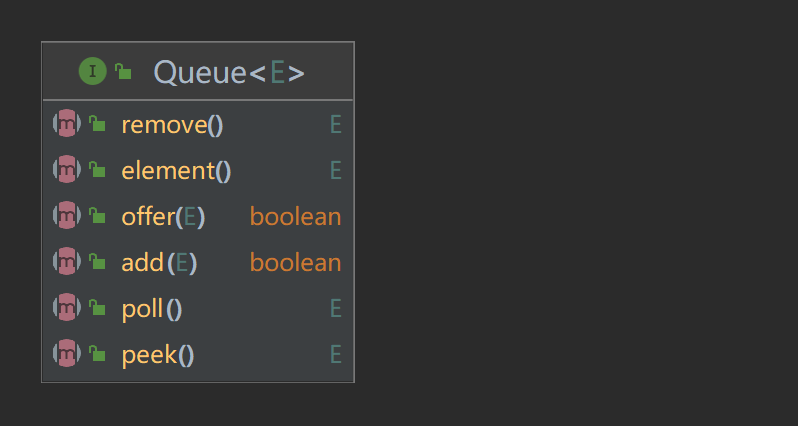

# LinkedList 总览


*LinkedList*同时实现了*List*接口和*Deque*接口，因此，我们既可以将`LinkedList`看作一个顺序容器，也可以将其看作队列（*Queue*）或者栈（*Stack*）。

> 注意，当需要使用栈时，Java已不推荐使用*Stack*，而是推荐使用更高效的*ArrayDeque*；既然*Queue*只是一个接口，当需要使用队列时也就首选*ArrayDeque*了（次选是*LinkedList*）。


*LinkedList*底层**通过双向链表实现**：

```java
public class LinkedList<E>
    extends AbstractSequentialList<E>
    implements List<E>, Deque<E>, Cloneable, java.io.Serializable
{
    transient int size = 0;

    transient Node<E> first;

    transient Node<E> last;

    private static class Node<E> {
        E item;
        Node<E> next;
        Node<E> prev;

        Node(Node<E> prev, E element, Node<E> next) {
            this.item = element;
            this.next = next;
            this.prev = prev;
        }
    }

    // ...
}
```

可以看到，`LinkedList`类包含了一个**内部私有静态类**`Node`，用于表示链表中的节点。每个节点包含一个元素（`item`），以及指向下一个节点和上一个节点的引用（`next`和`prev`）。


`LinkedList`通过字段`first`和`last`，分别指向链表的第一个和最后一个元素。


> `LinkedList`的实现方式决定了所有跟下标相关的操作都是线性时间，而在头部或者末尾删除元素只需要常数时间。为追求效率，`LinkedList`没有实现同步（`synchronized`），如果需要多个线程并发访问，可以先采用`Collections.synchronizedList()`方法对其进行包装。


# Queue接口

Queue接口提供了一套用于操作队列的方法，继承自`List`接口，适用于各种不同的队列实现。



该接口包括6个方法，分为两种形式：一种在操作失败时抛出异常，另一种在操作失败时返回特殊值（如`null`或`false`）。

| 方法                 | 含义                                                                                                          |
| -------------------- | ------------------------------------------------------------------------------------------------------------- |
| `boolean add(E e)`   | 将指定元素插入队列，成功后返回`true`，如果当前没有可用空间，则抛出`IllegalStateException`。                   |
| `boolean offer(E e)` | 将指定元素插入队列，成功后返回`true`，与`add`方法不同的是，`offer`方法在插入失败时不会抛出异常，而是返回false |
| `E remove()`         | 查看并删除队列的头部元素，如果队列为空，则抛出`NoSuchElementException`。                                      |
| `E poll()`           | 查看并删除队列的头部元素，如果队列为空，则返回`null`。                                                        |
| `E element()`        | 查看但不删除队列的头部元素，如果队列为空，则抛出`NoSuchElementException`。                                    |
| `E peek()`           | 查看队列的头部元素（但不删除），如果队列为空，则返回`null`。                                                  |

队列的常见方法包括插入元素的`add`和`offer`，移除并返回头部元素的`remove`和`poll`，以及查看头部元素的`element`和`peek`。在容量受限的队列中，通常推荐使用`offer`而不是`add`，因为`offer`在插入失败时返回false，而不是抛出异常。

> 注意，队列一般不允许插入`null`元素，虽然某些实现（如`LinkedList`）允许插入`null`。

# Deque 接口

`Deque`是"double-ended queue"的缩写，表示双端队列，继承自`Queue`。它是一个线性集合，支持在两端插入和移除元素。


`Deque`接口提供了多个方法，包括在队列的头部和尾部插入、移除和检查元素的操作。它还扩展了`Queue`接口，可以用作先进先出（FIFO）的队列，或者作为后进先出（LIFO）的栈。同时，它还提供了一些方法用于在队列中查找和移除指定的元素。

方法如下：

**在首尾添加（Add at the beginning and end）:**

1. `addFirst(E): void` - 在列表的开头添加指定元素。
2. `addLast(E): void` - 在列表的末尾添加指定元素。
3. `offerFirst(E): boolean` - 在列表的开头添加指定元素，如果成功则返回 `true`。
4. `offerLast(E): boolean` - 在列表的末尾添加指定元素，如果成功则返回 `true`。

**删除首尾元素（Remove first and last element）:**

1. `removeFirst(): E` - 删除并返回列表的第一个元素。
2. `removeLast(): E` - 删除并返回列表的最后一个元素。
3. `pollFirst(): E` - 检索并移除列表的第一个元素，如果列表为空，则返回 `null`。
4. `pollLast(): E` - 检索并移除列表的最后一个元素，如果列表为空，则返回 `null`。

**获取首尾元素（Get first and last element）:**

1. `getFirst(): E` - 返回列表的第一个元素。
2. `getLast(): E` - 返回列表的最后一个元素。
3. `peekFirst(): E` - 检索但不移除列表的第一个元素，如果列表为空，则返回 `null`。
4. `peekLast(): E` - 检索但不移除列表的最后一个元素，如果列表为空，则返回 `null`。

下表列出了*Deque*与*Queue*相对应的接口：

| Queue Method | Equivalent Deque Method | 说明                                   |
| ------------ | ----------------------- | -------------------------------------- |
| `add(e)`     | `addLast(e)`            | 向队尾插入元素，失败则抛出异常         |
| `offer(e)`   | `offerLast(e)`          | 向队尾插入元素，失败则返回`false`      |
| `remove()`   | `removeFirst()`         | 获取并删除队首元素，失败则抛出异常     |
| `poll()`     | `pollFirst()`           | 获取并删除队首元素，失败则返回`null`   |
| `element()`  | `getFirst()`            | 获取但不删除队首元素，失败则抛出异常   |
| `peek()`     | `peekFirst()`           | 获取但不删除队首元素，失败则返回`null` |

在使用`Deque`时，你可以将其视为一个队列，并使用`Queue`接口定义的方法进行操作，使得`Deque`可以用队列作（先进先出，FIFO）。

下表列出了*Deque*与*Stack*对应的接口：

| Stack Method | Equivalent Deque Method | 说明                                   |
| ------------ | ----------------------- | -------------------------------------- |
| `push(e)`    | `addFirst(e)`           | 向栈顶插入元素，失败则抛出异常         |
|              | `offerFirst(e)`         | 向栈顶插入元素，失败则返回`false`      |
| `pop()`      | `removeFirst()`         | 获取并删除栈顶元素，失败则抛出异常     |
|              | `pollFirst()`           | 获取并删除栈顶元素，失败则返回`null`   |
| `peek()`     | `getFirst()`            | 获取但不删除栈顶元素，失败则抛出异常   |
|              | `peekFirst()`           | 获取但不删除栈顶元素，失败则返回`null` |

> “上面两个表共定义了*Deque*的12个接口。添加，删除，取值都有两套接口，它们功能相同，区别是对失败情况的处理不同。**一套接口遇到失败就会抛出异常，另一套遇到失败会返回特殊值（`false`或`null`）**。除非某种实现对容量有限制，大多数情况下，添加操作是不会失败的。**虽然Deque的接口有12个之多，但无非就是对容器的两端进行操作，或添加，或删除，或查看**。”

此外，还有一些方法用于在队列中查找和移除特定元素，如`removeFirstOccurrence`和`removeLastOccurrence`。

# 操作

## 增

### add(E e)

我们先来看`add(E e)`方法。

由于`LinkedList`类有一个`last`字段，表示指向底层链表的末尾，因此在`LinkedList`末尾插入元素的花费是常数时间（调用了`linkLast(E e)`方法）。很简单，只需要修改几个相关引用即可。

```java
/**
 * 将指定的元素追加到列表的末尾。
 * @param e 要追加到列表末尾的元素
 * @return 如果成功添加元素，则返回true
 */
public boolean add(E e) {
    linkLast(e);
    return true;
}

void linkLast(E e) {
    final Node<E> l = last;
    final Node<E> newNode = new Node<>(l, e, null);
    last = newNode;
    if (l == null)
        first = newNode; // 原链表为空，即 newNode 是第一个元素
    else
        l.next = newNode;
    size++; // 链表的大小加一
    modCount++; // 用于记录结构修改次数的计数器（可用于在迭代中检测并发修改）
}
```

我们来看`linkLast(E e)`方法的实现步骤：

1. `final Node<E> l = last;`: 首先，创建一个**指向当前链表尾部**的节点引用 `l`。

2. `final Node<E> newNode = new Node<>(l, e, null);`: 创建一个新的节点 `newNode`（也就是即将插入的新节点元素），该节点的**前一个节点**是当前链表尾部的节点 `l`，元素值是 `e`，后一个节点为 `null`。

3. `last = newNode;`: 将链表的 `last` 指针更新为新创建的节点 `newNode`，表示该节点成为新的尾部。

4. `if (l == null) first = newNode; else l.next = newNode;`: 如果当前链表尾部的节点引用`l`为空，表示原来的链表是空的。因此将 `first` 指针也指向新节点 `newNode`（说白了，到这一层逻辑就表明当前这个新插入的节点`newNode`是第一个节点），否则将原尾部节点 `l` 的 `next` 指针指向新节点。


示意图如下：


与`add(E e)`相关的方法如下。

### offer(E e)

`offer(E e)`表示将指定的元素`e`添加到链表（视作队列）的末尾（即作为最后一个元素），在 Java 1.5 版本中引入。

```java
/**
 * Adds the specified element as the tail (last element) of this list.
 *
 * @param e the element to add
 * @return {@code true} (as specified by {@link Queue#offer})
 * @since 1.5
 */
public boolean offer(E e) {
    return add(e);  // offer(E e)方法实际上就是调用了 add(E e) 方法
}
```

### add(int index, E element)

要在`LinkedList`中的指定位置`index`处插入指定的元素`element`，必须分为两步走：

1. 首先获取指定索引`index`处的节点`succ`
2. 其次，根据元素`element`来生成一个待插入的节点`newNode`，然后修改引用，将`newNode`插入到`succ`的前面，说白了就是`succ`被挤到后面（`index+1`）去了。

好，下面我们来看具体的实现。

首先是获取指定索引`index`处的节点，这里定义了一个`node(index)`方法：

```java
Node<E> node(int index) {
    if (index < (size >> 1)) {  // (size >> 1)操作，将链表的大小右移一位，相当于除以 2
        Node<E> x = first;
        for (int i = 0; i < index; i++)
            x = x.next;
        return x;
    } else {
        Node<E> x = last;
        for (int i = size - 1; i > index; i--)
            x = x.prev;
        return x;
    }
}
```

这里的`if-else`判断实际上就是：

```java
如果(index小于size的一半) {    // 表示index在链表的前半部分
    从链表头部first开始遍历，找到指定索引index处的节点x
    返回x
} 否则 {
    从链表尾部last开始遍历，找到指定索引index处的节点x
    返回x
}
```

通过判断索引`index`的位置在链表前半部分还是后半部分，选择从头部或尾部开始遍历，以提高效率。

好，通过上述使用`node()`方法，我们已经获取到了指定索引`index`处的节点`succ`，现在，我们可以根据元素`element`来生成一个待插入的节点`newNode`，然后修改引用，将`newNode`插入到`succ`的前面，并且让`succ`的前一个节点的`next`指向`newNode`，实现插入：

```java
void linkBefore(E e, Node<E> succ) {
    // assert succ != null;
    final Node<E> pred = succ.prev;
    final Node<E> newNode = new Node<>(pred, e, succ);
    succ.prev = newNode;
    if (pred == null)
        first = newNode;
    else
        pred.next = newNode;
    size++;
    modCount++;
}
```

`linkBefore(E e, Node<E> succ)`方法在指定节点 `succ` 的前面插入一个新节点，新节点的元素值是 `e`。

我们来看代码，并不复杂：


1. `final Node<E> pred = succ.prev;`: 创建一个指向 `succ` 前驱节点的引用 `pred`。

2. `final Node<E> newNode = new Node<>(pred, e, succ);`: 创建一个新的节点 `newNode`，`newNode`的前驱节点是 `pred`，元素值是 `e`，后继节点是 `succ`。

3. `succ.prev = newNode;`: 将 `succ` 节点的前驱节点更新为新创建的节点 `newNode`。

4. `if (pred == null) first = newNode; else pred.next = newNode;`: 如果 `pred` 为 `null`，表示 `succ` 节点原本是链表的头部，将 `first` 指针指向新节点 `newNode`；否则，将 `pred` 节点的 `next` 指针指向新节点。

示意图如下：


---

## 删

### remove(int index)


> `remove()`方法也有两个版本，一个是删除跟指定元素相等的第一个元素`remove(Object o)`，另一个是删除指定下标处的元素`remove(int index)`。

首先看`remove(Object o)`方法：

```java
/**
 * 从列表中移除指定元素。
 * @param o 要从列表中移除的元素
 * @return 如果成功移除元素则返回true，否则返回false
 */
public boolean remove(Object o) {
    // 如果要移除的元素是null，遍历列表找到第一个值为null的节点并移除
    if (o == null) {
        for (Node<E> x = first; x != null; x = x.next) {
            if (x.item == null) {
                unlink(x);
                return true;
            }
        }
    } else {
        // 否则，遍历列表找到第一个与指定元素相等的节点并移除
        for (Node<E> x = first; x != null; x = x.next) {
            if (o.equals(x.item)) {
                unlink(x);
                return true;
            }
        }
    }
    // 如果未找到匹配的节点，返回false
    return false;
}

/**
 * 解除非null的节点x的链接。
 * @param x 要解除链接的节点
 * @return 节点中包含的元素
 */
E unlink(Node<E> x) {
    // 获取节点中的元素
    final E element = x.item;
    // 获取节点的下一个和前一个节点
    final Node<E> next = x.next;
    final Node<E> prev = x.prev;

    // 如果前一个节点为null，说明x是第一个节点，更新列表的第一个节点为x的下一个节点
    if (prev == null) {
        first = next;
    } else {
        // 否则，将前一个节点的下一个节点更新为x的下一个节点，断开x与前一个节点的链接
        prev.next = next;
        x.prev = null;
    }

    // 如果下一个节点为null，说明x是最后一个节点，更新列表的最后一个节点为x的前一个节点
    if (next == null) {
        last = prev;
    } else {
        // 否则，将下一个节点的前一个节点更新为x的前一个节点，断开x与下一个节点的链接
        next.prev = prev;
        x.next = null;
    }

    // 清空x节点的元素（let GC work），减少列表大小，修改计数器
    x.item = null;
    size--;
    modCount++;
    return element;
}
```

- `remove(int index)`方法就很简单了：

```java
/**
 * 移除列表中指定位置的元素。
 * @param index 要移除的元素的索引
 * @return 被移除的元素
 * @throws IndexOutOfBoundsException 如果索引越界抛出异常
 */
public E remove(int index) {
    // 检查索引是否在有效范围内
    checkElementIndex(index);
    // 获取指定索引处的节点，并调用unlink方法移除该节点
    return unlink(node(index));
}
```

可以看到，两个删除操作就是先找到要删除元素的引用，再修改相关引用，完成删除操作。

## 改

### set()

```java
/**
 * 将列表中指定位置的元素设置为新元素。
 * @param index 要设置的元素的索引
 * @param element 要设置的新元素
 * @return 被替换的旧元素
 * @throws IndexOutOfBoundsException 如果索引越界抛出异常
 */
public E set(int index, E element) {
    // 检查索引是否在有效范围内
    checkElementIndex(index);
    // 获取指定索引处的节点
    Node<E> x = node(index);
    // 获取节点中的旧元素
    E oldVal = x.item;
    // 将节点中的元素替换为新元素
    x.item = element;
    return oldVal;
}
```

## 查


### get()

```java
/**
 * 获取列表中指定位置的元素。
 * @param index 要获取的元素的索引
 * @return 指定索引处的元素
 * @throws IndexOutOfBoundsException 如果索引越界抛出异常
 */
public E get(int index) {
    // 检查索引是否在有效范围内
    checkElementIndex(index);
    // 返回指定索引处节点的元素
    return node(index).item;
}
```