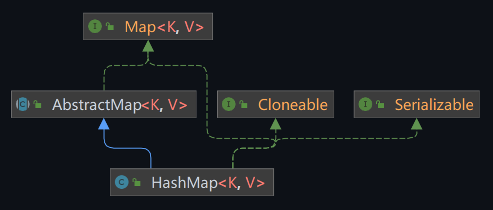
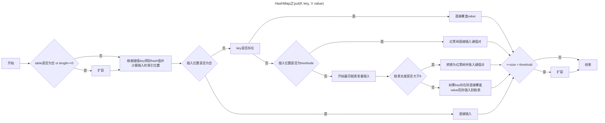

## HashMap

### 概述

`HashMap`基于哈希表的`Map`接口实现，是以`key-value`存储形式存在，即主要用来存放键值对。`HashMap` 的实现不是同步的，这意味着它不是线程安全的。它的`key`、`value`都可以为`null`。此外，`HashMap`中的映射不是有序的。



> - `Cloneable`：这是一个标记接口，表示实现类对象可以被克隆，即创建并返回该对象的一个副本。
> - `Serializable`：这也是一个标记接口，表示实现类对象可以被序列化和反序列化，即可以将对象转换为字节流以进行存储和传输，然后再从字节流中恢复对象。
> - `AbstractMap`：这是一个抽象类，它实现了`Map`接口并提供了部分方法的实现，以减少子类实现`Map`接口所需的工作。

示例代码：

```java
import java.util.HashMap;

public class Main {
    public static void main(String[] args) {
        // 创建一个新的HashMap
        HashMap<String, Integer> map = new HashMap<>();

        // 添加键值对
        map.put("Apple", 10);
        map.put("Banana", 20);
        map.put("Cherry", 30);

        // 获取并打印值
        System.out.println("Apple的数量: " + map.get("Apple"));
        System.out.println("Banana的数量: " + map.get("Banana"));
        System.out.println("Cherry的数量: " + map.get("Cherry"));

        // 检查键是否存在
        if (map.containsKey("Apple")) {
            System.out.println("Apple存在");
        }

        // 删除键值对
        map.remove("Apple");

        // 检查键是否存在
        if (!map.containsKey("Apple")) {
            System.out.println("Apple已被删除");
        }
    }
}
```

### 要点

- 存取是无序的
- 键和值都可以是`null`，但键只能有一个是`null`
- 键的位置是唯一的
- `JDK1.8` 之前为【数组+链表】，`JDK1.8` 之后为【数组+链表+红黑树】
- 阈值(边界值)$>8$ 并且数组长度 $>64$ ，就将链表转换为红黑树，以提高查询效率

### 演变

| 版本        | 数据结构      | 哈希冲突解决                                     | 链表转红黑树条件       | 原因                                                                               |
|-----------|-----------|--------------------------------------------|----------------|----------------------------------------------------------------------------------|
| JDK1.8之前  | 数组+链表     | 使用链表解决哈希冲突                                 | 不适用            | N/A                                                                              |
| JDK1.8及之后 | 数组+链表/红黑树 | 使用链表解决哈希冲突，链表长度大于阈值（默认8）且数组长度大于64时，链表转为红黑树 | 链表长度>8且数组长度>64 | 当数组长度较小，避免使用红黑树结构，因为红黑树需要进行左旋、右旋、变色等操作来保持平衡，这可能会降低效率。当数组长度大于64时，链表转为红黑树可以提高搜索效率。 |

### 为什么要引入红黑树？

在**JDK1.8之前**，`HashMap`是由【数组+链表】组成的，**数组是 `HashMap` 的主体**，链表则是主要为了解决哈希冲突而存在的（“拉链法”）。

> **哈希冲突：两个对象调用的`hashCode`方法计算的哈希码值一致导致计算的数组索引值相同，成为哈希冲突。**

这种结构的优点是简单且在哈希冲突较少的情况下，具有较高的查找效率。然而，即使哈希函数设计得再好，也无法保证所有的元素都能均匀地分布在各个桶中。当大量元素哈希到同一个桶中时，该桶下的链表长度会变得很长，此时HashMap的结构就退化为了单链表。在这种情况下，如果单链表有n个元素，遍历的时间复杂度就会上升到O(n)，这使得HashMap的查找效率大大降低。

在**JDK1.8之后**，在解决哈希冲突方面做了改进，如果链表的长度超过一定的阈值（默认为8），并且数组长度大于64，则**将链表变为红黑树**。

红黑树是一种自平衡的二叉查找树，其查找时间复杂度为O(logn)，这使得即使在最坏的情况下，HashMap的查找效率也能得到保证。当链表长度超过一定阈值（默认为8）时，链表就会转化为红黑树。这样，即使在元素分布极不均匀的情况下，HashMap的查找效率也能得到有效的保证。

> 注意，如果阈值大于8，但是数组长度小于64，此时会选择扩容数组。因为数组较小时，转变为红黑树结构反而会降低效率，因为红黑树需要进行左旋，右旋，变色这些操作来保持平衡 。

## put操作

当创建一个`HashMap`对象之后，底层构造器调用时会创建长度为16的一维数组`Entry[] table`（JDK1.8之后并不是在创建对象时创建底层数组结构，而是在首次调用 `put` 方法时创建长度为16的`Node[] table`数组）。

当使用`put`操作向`HashMap`中添加元素时，首先会根据元素的`hashCode()`方法计算出哈希码值。然后，这个哈希码值会经过特定的算法计算，得出元素在底层数组中的存储位置（索引值）。

在得到存储位置后，会进行以下判断：

- 如果该位置上的数据为空，那么元素添加成功。
- 如果该位置上的数据不为空，那么会比较新元素和已存在元素的哈希码值：
  - 如果哈希码值不同，新元素会以链表的形式添加到该位置。
  - 如果哈希码值相同，那么还需要进一步比较键是否相等。如果键相等，新元素会覆盖旧元素；如果键不相等，新元素会以链表或红黑树（取决于链表长度是否超过阈值）的形式添加到该位置。

>- Q：当两个对象的 `hashCode` 值相等时，会怎么样？
>
>- A：会发生哈希碰撞，此时需通过`equals`比较`key`值是否相同。如果内容相同则新的`value`替换旧的`value`，否则就连接到链表后面。链表长度如果超过阈值 8 且当前数组的长度 > 64时就会转为红黑树存储。
>
>---
>
>- Q：`HashMap`中`hash`函数是怎么实现的？
>- A：首先检查键是否为`null`，如果是，返回`0`。如果不是，先获取键的`hashCode()`，然后将`hashCode`与其自身无符号右移`16`位后的结果进行异或操作。
>
>---
>
>- Q：还有哪些`hash`函数的实现方式？
>- A：还有平方取中法，伪随机数法和取余数法。这三种效率都比较低，无符号右移16位异或运算效率是最高的。

在不断的添加数据的过程中，会涉及到扩容问题，当超出临界值(且要存放的位置非空)时，扩容。默认的扩容方式：扩容为原来容量的2倍，并将原有的数据复制过来。

put操作的流程图如下：



> - Q：**`threshold`是什么？**
> - A：临界值（`threshold`）是由容量（`capacity`）和加载因子（`loadFactor`）的乘积得出的。这个值代表了`HashMap`在触发扩容操作前，可以容纳的最大元素数量。当`HashMap`中的元素数量（`size`）超过这个临界值时，`HashMap`会进行扩容操作。**扩容后的`HashMap`容量将是扩容前容量的两倍**。
> - Q：**加载因子是什么？**
> - A：加载因子（Load Factor）是一个浮点数，它决定了HashMap的数据密度，即键值对的数量与哈希表数组长度的比值。**默认的加载因子是0.75**。较高的加载因子会减少空间开销，但增加了查询数据的时间开销（增加了冲突的可能性）。反之，较低的加载因子会增加空间开销，但可以提高查询效率。
