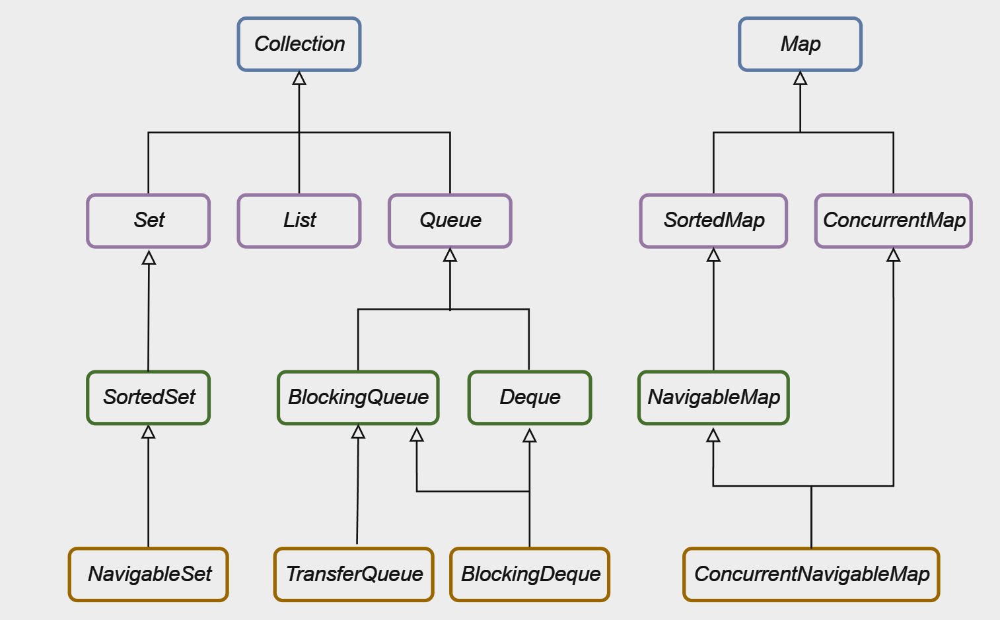

## 概述

Java集合框架（*Java collections framework*）是包含一系列实现可重复使用集合的数据结构的类别和接口集合。

实际上就是`Java`提供了一个强大的集合框架，用于处理一系列对象。也就是说，集合是一种通用的容器，是对象的组合，集合框架提供了一种统一的方式来表示和操作各种集合，无需重复造轮子，减少了编程工作。提供了高性能的数据结构和算法实现，只需学习一组通用的集合API，减低学习难度。

> 集合框架的设计旨在使开发人员能够更轻松地管理和操作数据，同时提供了高性能和可扩展性。

## 接口

**`Java`集合框架**定义了一系列**容器接口**，**主要分为两个层次，分别是`Collection`接口和`Map`接口**。

> 集合接口用于规范容器的行为以及提供统一的设计。



记录：

- `Collection` ：`Collection`接口是线性结构集合的根接口，表示一组对象。它定义了基本的集合操作，如添加、删除、遍历等。
    - `Set`：继承自`Collection`，表示不包含重复元素的集合。它没有提供额外的方法，只是保证不包含重复元素。
        - `SortedSet`：继承自Set，对元素进行排序存储。提供了一些按比较器排序或自然排序的方法。
            - `NavigableSet`：继承自`SortedSet`，定义了一些导航方法，如获取最小、最大元素等。
    - `List`：继承自`Collection`，表示有序的集合，允许包含重复元素。提供了根据索引访问元素的方法。
    - `Queue`：继承自`Collection`，表示队列数据结构，按照先进先出（FIFO）的原则处理元素。
        - `BlockingQueue`：继承自`Queue`，增加了支持阻塞操作的方法，用于多线程环境中的生产者-消费者模型。
            - `TransferQueue`：基础自`BlockingQueue`，它提供了更强大的元素传输机制。
        - `Deque`：继承自`Queue`，表示双端队列，可以在两端插入和删除元素。
            - `BlockingDeque`：继承自`Deque`和`BlockingQueue`，支持阻塞操作的双端队列。
- `Map`：表示键值对的集合，每个键关联一个值。`Map`不是`Collection`的子接口。
    - `SortedMap`：继承自`Map`，按照比较器或键的自然顺序对键进行排序。
        - `NavigableMap`：继承自`SortedMap`，提供了导航方法，如获取比指定键大或小的键。
    - `ConcurrentMap`：继承自`Map`，支持并发访问，定义了一些原子性的操作。
        - `ConcurrentNavigableMap`：继承自`ConcurrentMap`和`NavigableMap`，表示支持并发访问和导航操作的映射。

> 这里没有写`Stack`，是因为`Stack`的功能已被JDK 1.6引入的`Deque`取代。

## 实现类

上述接口的常见实现类见下表，后续我们会逐一学习这些实现类的基本用法和底层实现。

| Interface |                          Hash Table<br />（哈希表）                           |                          Resizable Array<br />（可变数组）                          |                         Balanced Tree<br />（平衡树）                         |                              Linked List<br />（链表）                              |                                 Hash Table + Linked List                                  |
| :-------: | :---------------------------------------------------------------------------: | :---------------------------------------------------------------------------------: | :---------------------------------------------------------------------------: | :---------------------------------------------------------------------------------: | :---------------------------------------------------------------------------------------: |
|   `Set`   | [`HashSet`](https://docs.oracle.com/javase/8/docs/api/java/util/HashSet.html) |                                                                                     | [`TreeSet`](https://docs.oracle.com/javase/8/docs/api/java/util/TreeSet.html) |                                                                                     | [`LinkedHashSet`](https://docs.oracle.com/javase/8/docs/api/java/util/LinkedHashSet.html) |
|  `List`   |                                                                               |  [`ArrayList`](https://docs.oracle.com/javase/8/docs/api/java/util/ArrayList.html)  |                                                                               | [`LinkedList`](https://docs.oracle.com/javase/8/docs/api/java/util/LinkedList.html) |                                                                                           |
|  `Deque`  |                                                                               | [`ArrayDeque`](https://docs.oracle.com/javase/8/docs/api/java/util/ArrayDeque.html) |                                                                               | [`LinkedList`](https://docs.oracle.com/javase/8/docs/api/java/util/LinkedList.html) |                                                                                           |
|   `Map`   | [`HashMap`](https://docs.oracle.com/javase/8/docs/api/java/util/HashMap.html) |                                                                                     | [`TreeMap`](https://docs.oracle.com/javase/8/docs/api/java/util/TreeMap.html) |                                                                                     | [`LinkedHashMap`](https://docs.oracle.com/javase/8/docs/api/java/util/LinkedHashMap.html) |

## 并发集合

在多线程编程中，对集合进行操作需要特别小心以避免并发问题。

Java提供了丰富的并发编程支持，其中包括了许多**并发友好的集合接口和实现**。

- `BlockingQueue`：
    - 扩展了普通队列的功能，提供了在多线程环境下进行元素传输的能力。它包含了一些阻塞操作，如`put`和`take`，用于在队列为空或已满时进行等待。
    - 实现：
        -  `LinkedBlockingQueue`：基于链表实现，支持有界和无界的队列。
        - `ArrayBlockingQueue`：基于数组实现，支持有界的队列。
        - `PriorityBlockingQueue`：无界队列，按照元素的优先级进行排序。
        - `DelayQueue`：用于按照元素的延迟时间进行排序的无界队列。
        - `SynchronousQueue`：一个不存储元素的队列，每个插入操作必须等待一个相应的删除操作，反之亦然。
- `TransferQueue`：
    - 是`BlockingQueue`的子接口，引入了更高级别的元素传输机制。它提供了`transfer`方法，可以立即传输元素给等待的消费者。
    - 实现：
        -  `LinkedTransferQueue`：`TransferQueue`的一个实现，提供了更高级别的元素传输机制。
- `BlockingDeque`：
    - 双端队列的接口，它扩展了`BlockingQueue`和`Deque`的功能，提供了在两端插入和删除元素的能力。
    - 实现：
        -  `LinkedBlockingDeque`：基于链表实现，支持有界和无界的双端队列。
- `ConcurrentMap`：
    - 扩展了普通的`Map`接口，提供了对并发访问的支持。它定义了一些原子性的操作，如`putIfAbsent`和`replace`。
    - 实现：
        -  `ConcurrentHashMap`：采用分段锁的机制，提高并发性能。
- `ConcurrentNavigableMap`：
    - `ConcurrentMap`的子接口，它扩展了`NavigableMap`接口，提供了对并发访问的支持以及导航特性。
    - 实现：
        -  `ConcurrentSkipListMap`：基于跳表（`SkipList`）实现，并支持并发访问和导航特性。

## 泛型

Java的泛型是一种方便的语法糖，通过在编译阶段进行字符串替换来实现。在JDK 1.5及以后的版本中引入了泛型机制，使得容器可以容纳任何类型的对象。

泛型的优势在于在编译时捕获类型错误，避免了在运行时发生的类型转换错误。相比于JDK 1.4及之前的显式类型转换，使用泛型可以使代码更简洁、可读性更高，并提高了代码的安全性。

```java
// JDK 1.4 or before
ArrayList list = new ArrayList();
list.add(new String("Monday"));
list.add(new String("Tuesday"));
list.add(new String("Wednesday"));
for(int i = 0; i < list.size(); i++){
    String weekday = (String)list.get(i); // 显式类型转换
    System.out.println(weekday.toUpperCase());
}

// JDK 1.5 or later
ArrayList<String> list = new ArrayList<String>(); // 参数化类型
list.add(new String("Monday"));
list.add(new String("Tuesday"));
list.add(new String("Wednesday"));
for(int i = 0; i < list.size(); i++){
    String weekday = list.get(i); // 隐式类型转换，编译器自动完成
    System.out.println(weekday.toUpperCase());
}
```
