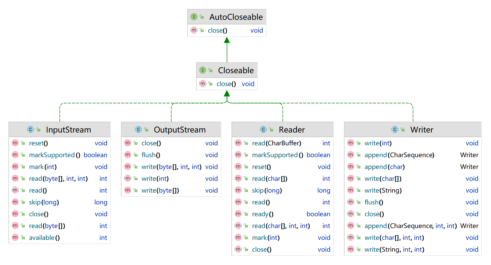
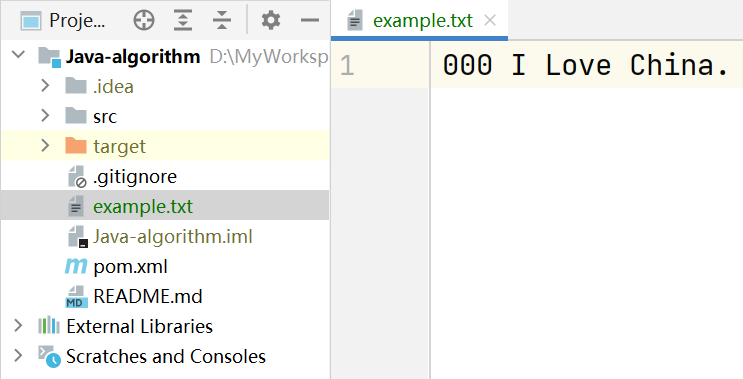

## 概述

IO，即Input/Output，指的是输入和输出。在计算机中，输入是指数据从外部源（如键盘、网络）输入到内存的过程，输出则是指数据从内存输出到外部目的地（如显示器、文件、网络）的过程。由于数据传输过程类似于水流，因此被称为IO流。

在Java中，IO流分为输入流和输出流，根据处理的数据类型，又可以分为字节流和字符流。字节流主要用于处理二进制数据，如图片、音频、视频等，字符流主要用于处理文本数据。

Java IO流的众多类都是从以下四个抽象基类派生出来的：

1. **`InputStream`**：所有字节输入流的基类，用于读取字节数据。
2. **`OutputStream`**：所有字节输出流的基类，用于写入字节数据。
3. **`Reader`**：所有字符输入流的基类，用于读取字符数据。
4. **`Writer`**：所有字符输出流的基类，用于写入字符数据。

这四个基类定义了IO操作的基本方法，具体的子类则提供了更多的功能和优化。



## 字节流

### 如何理解字节流？

字节流是处理IO操作的基础工具，它提供了一种低级的、与平台无关的方式来处理二进制数据。

在计算机中，字节是数据的基本单位。字节流能够直接操作这些基本单位，这使得字节流可以处理任何类型的数据，包括文本、图片、音频、视频等。

> 字节流提供了一种直接读写二进制数据的方式，因此适用于处理需要直接操作二进制数据的场景，例如网络通信、文件操作等。

### InputStream与OutputStream

InputStream和OutputStream是所有字节流类的基类，掌握这两个类是学习IO的基础。

#### 字节输入流

`InputStream`是Java中所有字节输入流的基类，它定义了读取字节和字节数组的基本方法。`InputStream`主要用于从数据源（如文件、网络连接、内存缓冲区等）读取字节数据。

在实际使用中，我们会使用它的某个具体子类，如`FileInputStream`、`BufferedInputStream`等。

下面是`InputStream`的一些常见方法：

1. **`int read()`**：从输入流中读取一个字节的数据（介于 0 到 255 之间），返回的是读取的字节，如果已经到达流的末尾，则返回-1。

2. **`int read(byte[] b)`**：从输入流中读取一些字节数组。返回的是实际读取的字节数，如果已经到达流的末尾，则返回-1。

3. **`int read(byte[] b, int off, int len)`**：从输入流中读取一些字节数组，将其存储在数组的`off`位置开始的`len`长度的区域。返回的是实际读取的字节数，如果已经到达流的末尾，则返回-1。

4. **`long skip(long n)`**：跳过并丢弃输入流中的`n`个字节的数据。返回的是实际跳过的字节数。

5. **`int available()`**：返回可以从输入流中无阻塞地读取（或跳过）的预计字节数。

6. **`void close()`**：关闭输入流并释放与之关联的所有系统资源。

从Java 9开始，`InputStream`增加了一些新的实用方法，主要包括以下几个：

1. **`readNBytes(int len)`**：从输入流中读取指定长度的字节数组。如果流结束前未能读取足够的字节，将返回实际读取的字节。如果`len`为0，将返回一个长度为0的数组。

2. **`readAllBytes()`**：从输入流中读取所有字节，直到达到流的末尾，然后返回一个字节数组。

3. **`transferTo(OutputStream out`)**：将输入流中的所有字节直接传输到指定的输出流，可方便实现流的复制。

`FileInputStream`是`InputStream`的一个实现类，它用于从文件系统中的某个文件读取数据。

我们来看一下示例代码：

```java
import java.io.FileInputStream;
import java.io.IOException;
import java.io.InputStream;

public class FileInputStreamExample {
    public static void main(String[] args) {
        try (InputStream fis = new FileInputStream("example.txt")) {
            System.out.println("剩余可读字节数：" + fis.available());
            long skip = fis.skip(4);
            System.out.println("实际跳过的字节数：" + skip);
            System.out.print("从文件读取的内容：");
            int content;
            while ((content = fis.read()) != -1) {
                System.out.print((char)content);
            }
        } catch (IOException e) {
            System.out.println("处理文件时发生错误：");
            e.printStackTrace();
        }
    }
}
```

文件内容如下：



运行结果为：

```
剩余可读字节数：17
实际跳过的字节数：4
从文件读取的内容：I Love China.
```


1. **学习字节流的基类**：InputStream和OutputStream是所有字节流类的基类，理解这两个类的方法和用法是学习字节流的基础。

2. **掌握常用的字节流类**：如FileInputStream、FileOutputStream、BufferedInputStream、BufferedOutputStream等，了解它们的特性和使用场景。

3. **学习字节流的操作**：如读取、写入、复制文件等，通过实践操作来加深理解。

4. **理解字节流的错误处理**：了解如何处理字节流操作中可能出现的错误，如IO异常等。

5. **了解字节流在实际开发中的应用**：字节流通常用于处理二进制数据，如图片、音频、视频等，了解这些应用场景可以帮助你更好地理解和使用字节流。

6. **学习字节流的性能优化**：如使用缓冲流来提高IO操作的效率。

以上就是学习Java IO字节流的一些主要方向，希望对你有所帮助。
