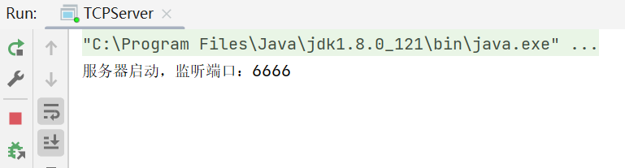
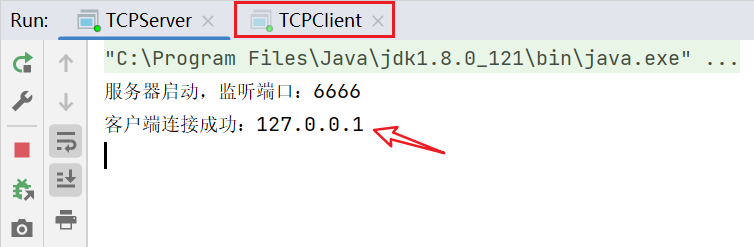
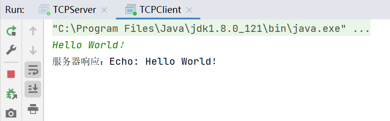
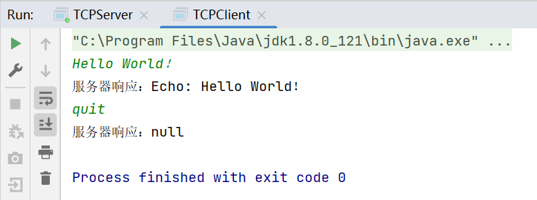
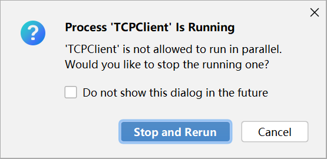
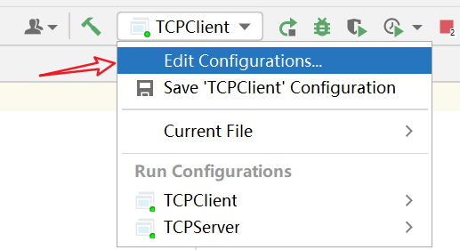
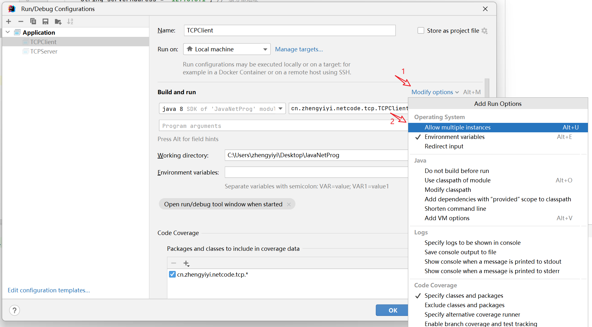

::: tip

网络编程本质上是两个进程之间的通信，其中一个进程充当服务器端，另一个进程充当客户端。服务器端监听指定端口，客户端连接服务器的IP地址和端口，建立TCP连接后，双方可以随时发送和接收数据。

:::

## 1. TCP简介

TCP（传输控制协议）是一种面向连接的、可靠的、基于字节流的传输层通信协议。在TCP/IP协议族中，TCP负责在两个应用程序之间建立一个可靠的通信连接，以保证数据包的顺序传输和数据的完整性。

## 2. Socket流

在Java中，Socket连接建立成功后，数据的发送和接收是通过流（Stream）来进行的。Java为Socket提供了两种基本的流类型：`InputStream`和`OutputStream`。这两种流分别用于处理入站数据（接收）和出站数据（发送）。

- **InputStream**：`InputStream`是用于从Socket中读取数据的流。当你从Socket的输入流中读取数据时，你实际上是在读取从另一端发送过来的数据。这个过程是阻塞的，如果没有数据可读，读取操作会等待直到有数据为止。

- **OutputStream**：`OutputStream`是用于向Socket写入数据的流。当你向Socket的输出流中写入数据时，数据会被发送到另一端的Socket。也就是说，你可以通过这个流来发送数据给对方。

使用这两种流的基本步骤是：

1. 从`Socket`对象获取输入流和输出流。
2. 使用得到的流进行数据读取或写入操作。
3. 完成操作后，关闭流。

## 3. TCP编程

Java通过`java.net.Socket`类和`java.net.ServerSocket`类提供了TCP连接的客户端和服务器端实现。

### 3.1 创建TCP服务器

1. **创建`ServerSocket`实例**：指定监听的端口号。
2. **等待客户端连接**：使用`accept`方法等待客户端连接。该方法会阻塞，直到一个连接建立。
3. **处理客户端数据**：通过返回的`Socket`对象与客户端通信。

```java
public class TCPServer {
    public static void main(String[] args) {
        int port = 6666; // 服务器监听端口
        ServerSocket serverSocket = null;
        try {
            serverSocket = new ServerSocket(port);
            System.out.println("服务器启动，监听端口：" + port);
            while (true) {
                Socket clientSocket = serverSocket.accept();
                System.out.println("客户端连接成功：" + clientSocket.getInetAddress().getHostAddress());
                // 使用线程处理每个客户端的请求
                new Thread(new ClientHandler(clientSocket)).start();
            }
        } catch (IOException e) {
            e.printStackTrace();
        } finally {
            if (serverSocket != null) {
                try {
                    serverSocket.close();
                } catch (IOException e) {
                    e.printStackTrace();
                }
            }
        }
    }

    private static class ClientHandler implements Runnable {
        private final Socket clientSocket;

        public ClientHandler(Socket socket) {
            this.clientSocket = socket;
        }

        @Override
        public void run() {
            try {
                BufferedReader in = new BufferedReader(new InputStreamReader(clientSocket.getInputStream()));
                PrintWriter out = new PrintWriter(clientSocket.getOutputStream(), true);

                String request, response;
                while ((request = in.readLine()) != null) {
                    if ("quit".equalsIgnoreCase(request)) {
                        break;
                    }
                    response = "Echo: " + request;
                    out.println(response);
                }
            } catch (IOException e) {
                e.printStackTrace();
            } finally {
                try {
                    clientSocket.close();
                } catch (IOException e) {
                    e.printStackTrace();
                }
            }
        }
    }
}
```

### 3.2 创建TCP客户端

1. **创建`Socket`实例**：指定服务器的IP地址和端口号。
2. **发送和接收数据**：通过`Socket`的输入输出流与服务器通信。
3. **关闭连接**：完成通信后关闭Socket。

```java
public class TCPClient {
    public static void main(String[] args) {
        String serverAddress = "127.0.0.1"; // 服务器地址
        int serverPort = 6666; // 服务器端口

        // 使用try-with-resources确保资源被自动关闭
        try (Socket socket = new Socket(serverAddress, serverPort);
             BufferedReader in = new BufferedReader(new InputStreamReader(socket.getInputStream()));
             PrintWriter out = new PrintWriter(socket.getOutputStream(), true);
             BufferedReader stdIn = new BufferedReader(new InputStreamReader(System.in))) {

            String userInput;
            while ((userInput = stdIn.readLine()) != null) {
                out.println(userInput);
                System.out.println("服务器响应：" + in.readLine());
                if ("quit".equalsIgnoreCase(userInput)) {
                    break;
                }
            }
        } catch (IOException e) {
            System.err.println("发生IO异常：" + e.getMessage());
        }
    }
}
```

### 3.3 运行

首先运行服务端，此时服务器启动并在端口6666上监听客户端的连接请求：



然后，开启客户端代码，开启一个客户端实例。当客户端连接时，服务器会打印客户端的IP地址，并为每个连接的客户端创建一个新的线程来处理通信：



客户端通过标准输入（控制台）接收用户输入，并将输入的消息发送给服务器。服务器端接收到客户端发送的消息后，会将消息前加上"Echo: "后缀并回送给客户端。当服务器响应时，客户端将服务器的响应打印到控制台上，显示为"服务器响应：Echo: 用户输入的消息"：



如果用户输入"quit"，客户端会结束通信并关闭Socket连接，服务器端会结束与该客户端的通信并关闭对应的Socket连接：



服务器实例在运行期间是一直执行的，除非被显式地停止或关闭。

## 4. flush()方法

在使用`OutputStream`或其任何子类（如`PrintWriter`）写入数据时，`flush()`方法的调用是非常重要的。这是因为写入到流中的数据首先不是直接发送到网络，而是被存储在内存中的一个缓冲区里。这样做可以提高写操作的效率，因为它减少了实际进行物理写操作的次数。然而，这也意味着如果缓冲区没有被填满，数据可能不会立即发送出去。

调用`flush()`方法会强制将缓冲区中的所有未发送数据发送到网络上。这确保了数据的及时传输，特别是在发送数据量小或不足以填满缓冲区的情况下。如果不调用`flush()`，数据可能会在缓冲区中滞留，导致接收方长时间收不到数据，从而影响应用程序的响应性和性能。

在实际编程中，特别是在网络通信过程中，及时调用`flush()`方法可以避免不必要的延迟和通信死锁。因此，每次写操作后，特别是在写入重要的数据或需要立即由对方处理的数据后，都应该调用`flush()`方法。

## 5. 多实例

当我们再次运行`TCPClient`程序时，IDEA检测到之前的`TCPClient`实例仍在运行，由于为了避免端口冲突、资源争用等问题，IDEA的默认配置就是不允许同一个程序的多个实例同时运行。



当然，我们可以修改IDEA的配置，允许同一个程序的多个实例同时运行，这样就可以有多个客户端程序运行，具体方法如下。

首先打开`Run`菜单，选择`Edit Configurations...`。




在打开的配置窗口中，找到`TCPClient`配置，在更多选项中找到`Allow multiple instances`选项（或类似名称的选项，可能因IDEA版本不同而有所差异）并勾选即可，最后点击OK并关闭配置窗口。




