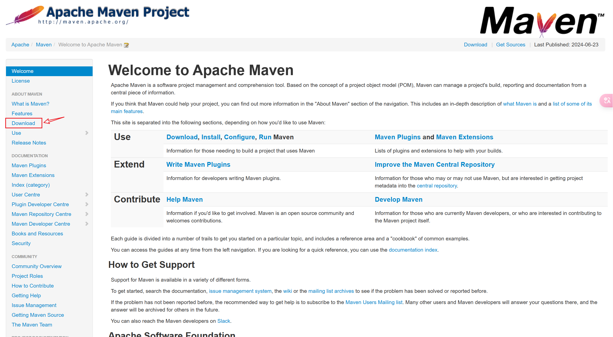
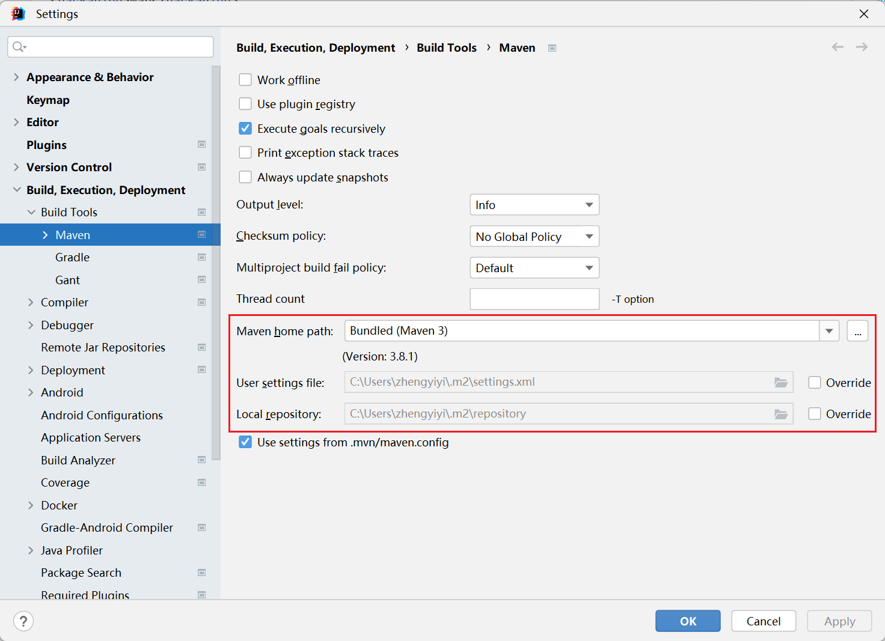

## 1. 依赖管理

Java项目的依赖包管理指的是在Java项目开发过程中，对项目所需的第三方库（即依赖）的引入、版本控制、更新和移除的过程。这个过程可以通过专门的**依赖管理工具**来实现，以简化和自动化依赖的处理。主要目的是确保项目能够轻松、一致地引入所需的第三方库，同时管理这些库的版本，避免版本冲突和依赖地狱问题。

常见的Java依赖管理工具包括：

- **Maven**：通过`pom.xml`文件管理依赖，可以自动下载依赖包，管理项目的构建、报告和文档等。
- **Gradle**：基于Groovy的构建工具，使用`build.gradle`文件管理依赖，支持多种语言和平台，性能优于Maven。
- **Ant + Ivy**：Ant是较早的构建工具，通过编写`build.xml`文件来管理项目构建过程，而Ivy则是一个依赖管理插件，可以与Ant结合使用，提供依赖管理功能。

依赖管理的关键功能包括：

- **依赖声明**：在项目的配置文件中声明所需的第三方库及其版本。
- **依赖解析**：自动解析并下载声明的依赖，包括这些依赖自己的依赖（即传递依赖）。
- **版本管理**：管理依赖的版本，包括版本升级、版本冲突解决等。
- **仓库管理**：依赖包通常存储在中央仓库或私有仓库中，依赖管理工具需要能够从这些仓库中检索和下载依赖包。
- **构建与打包**：除了管理依赖外，这些工具通常还负责项目的构建和打包过程。

通过使用依赖管理工具，开发者可以更加专注于项目的开发，而不是手动管理各种库和版本，大大提高了开发效率和项目的可维护性。

## 2. Maven

### 2.1 Maven是什么？

Maven是一个为Java项目提供自动化构建过程的工具，它通过简化和标准化项目构建过程，使得项目管理和构建变得更加高效和简单。Maven的核心特点包括：

1. **标准化项目结构**：Maven提供了一套默认的目录结构，帮助开发者组织代码、资源、测试等。

2. **依赖管理**：Maven允许开发者在`pom.xml`文件中声明项目依赖，自动管理和下载所需的依赖包，解决了手动管理依赖的复杂性。

3. **构建生命周期**：Maven定义了一套标准化的构建生命周期，包括编译、测试、打包、部署等阶段，使得构建过程清晰、可预测。

4. **插件生态**：Maven有丰富的插件生态，支持各种自定义构建和部署任务，提高了工具的灵活性和扩展性。

5. **项目模板**：Maven提供了项目原型（Archetypes），帮助快速生成符合特定需求的项目结构。

通过使用Maven，Java项目可以实现自动化构建和依赖管理，提高开发效率，确保项目的一致性和可维护性。

### 2.2 安装Maven

官网：[Maven – Welcome to Apache Maven](https://maven.apache.org/)



要安装Maven，可以先访问Maven官网下载最新的Maven版本，然后将下载的压缩包解压到本地的一个目录中，设置一下环境变量，最后在在命令行中运行`mvn -v`来验证Maven是否正确安装。如果安装正确，它会显示Maven的版本信息、Java版本以及操作系统信息。

> 以Windows系统为例，在设置环境变量时，可将`MAVEN_HOME`设置为Maven解压后的目录路径，然后在现有的`PATH`环境变量中添加Maven的`bin`目录路径（`%MAVEN_HOME%\bin`），这样可以在命令行中直接运行Maven命令。

另外，IntelliJ IDEA 工具提供对 Maven 的良好支持，其内置了 Maven 核心功能，并提供一个捆绑的 Maven 版本供开发者使用，无需下载即可使用Maven：



### 2.3 项目结构

Maven 项目结构遵循约定优于配置的原则，下面是一个典型的 Maven 项目结构：

```plaintext
my-app
├── pom.xml
├── src
│   ├── main
│   │   ├── java
│   │   │   └── com
│   │   │       └── mycompany
│   │   │           └── app
│   │   │               └── App.java
│   │   ├── resources
│   │   │   └── application.properties
│   │   └── webapp
│   │       ├── WEB-INF
│   │       └── index.jsp
│   └── test
│       ├── java
│       │   └── com
│       │       └── mycompany
│       │           └── app
│       │               └── AppTest.java
│       └── resources
│           └── test-application.properties
└── target
    ├── classes
    ├── test-classes
    └── my-app-1.0-SNAPSHOT.jar

```

其中，**pom.xml**是 `Maven` 项目的核心配置文件，包含项目的基本信息（如名称、版本等）、依赖管理、构建配置和插件配置等。

**src/main/java** 是主要的 `Java` 源码目录，存放项目的主要业务逻辑代码。**src/main/resources** 目录则用于存放项目的资源文件，如配置文件、属性文件等，这些文件会在编译时被打包到 `classpath` 中。

如果是一个 Web 应用项目，那么在 **src/main/webapp** 目录下可以存放 Web 相关的资源，如 JSP 文件、HTML 文件、CSS、JavaScript 和 WEB-INF 目录（包含 web.xml 等配置文件）。

**src/test/java** 则存放测试代码的目录，组织和 `src/main/java` 相似，用于编写单元测试、集成测试等。同样的，**src/test/resources** 则存放测试资源文件，如测试配置文件，供测试运行时使用。

最后，Maven 默认的输出目录**target**，包含编译后的字节码文件、打包后的 jar 文件、生成的文档和临时文件等。

### 2.4 pom.xml文件

`pom.xml` 是 Maven 项目的核心配置文件，包含项目的基本信息、依赖管理、构建配置和插件配置等内容。下面是一个常见的 `pom.xml` 文件示例：

```xml
<project xmlns="http://maven.apache.org/POM/4.0.0"
         xmlns:xsi="http://www.w3.org/2001/XMLSchema-instance"
         xsi:schemaLocation="http://maven.apache.org/POM/4.0.0 http://maven.apache.org/xsd/maven-4.0.0.xsd">
    
    <!-- POM模型版本 -->
    <modelVersion>4.0.0</modelVersion>

    <!-- 基本项目信息 -->
    <groupId>com.mycompany.app</groupId> <!-- 组织ID -->
    <artifactId>my-app</artifactId> <!-- 项目ID -->
    <version>1.0-SNAPSHOT</version> <!-- 版本号 -->

    <!-- 项目元数据 -->
    <name>My App</name> <!-- 项目名称 -->
    <description>A simple Maven project example.</description> <!-- 项目描述 -->
    <url>http://www.mycompany.com/my-app</url> <!-- 项目URL -->

    <!-- 属性配置 -->
    <properties>
        <maven.compiler.source>1.8</maven.compiler.source> <!-- 源代码Java版本 -->
        <maven.compiler.target>1.8</maven.compiler.target> <!-- 目标Java版本 -->
        <project.build.sourceEncoding>UTF-8</project.build.sourceEncoding> <!-- 编码格式 -->
    </properties>

    <!-- 依赖配置 -->
    <dependencies>
        <dependency>
            <groupId>junit</groupId> <!-- 依赖的组织ID -->
            <artifactId>junit</artifactId> <!-- 依赖的项目ID -->
            <version>4.13.2</version> <!-- 依赖版本 -->
            <scope>test</scope> <!-- 依赖范围 -->
        </dependency>
        <!-- 在此添加其他依赖 -->
    </dependencies>

    <!-- 构建配置 -->
    <build>
        <plugins>
            <!-- 编译插件 -->
            <plugin>
                <groupId>org.apache.maven.plugins</groupId>
                <artifactId>maven-compiler-plugin</artifactId>
                <version>3.8.1</version>
                <configuration>
                    <source>${maven.compiler.source}</source> <!-- 使用的Java源码版本 -->
                    <target>${maven.compiler.target}</target> <!-- 目标Java版本 -->
                </configuration>
            </plugin>

            <!-- 单元测试插件 -->
            <plugin>
                <groupId>org.apache.maven.plugins</groupId>
                <artifactId>maven-surefire-plugin</artifactId>
                <version>2.22.2</version>
            </plugin>

            <!-- 在此配置其他插件 -->
        </plugins>
    </build>

    <!-- 仓库配置 -->
    <repositories>
        <repository>
            <id>central</id>
            <url>https://repo.maven.apache.org/maven2</url>
        </repository>
    </repositories>

    <!-- 插件仓库 -->
    <pluginRepositories>
        <pluginRepository>
            <id>central</id>
            <url>https://repo.maven.apache.org/maven2</url>
        </pluginRepository>
    </pluginRepositories>

    <!-- 构建配置文件（用于不同的构建配置） -->
    <profiles>
        <profile>
            <id>dev</id>
            <properties>
                <!-- 开发环境特定属性 -->
            </properties>
        </profile>
        <profile>
            <id>prod</id>
            <properties>
                <!-- 生产环境特定属性 -->
            </properties>
        </profile>
    </profiles>

    <!-- 在此添加其他配置 -->
</project>

```

主要部分解释：

- **`modelVersion`**: 指定 POM 模型的版本，通常是 4.0.0。
- **`groupId`**: 项目的组 ID，通常是组织的域名倒序。
- **`artifactId`**: 项目的工件 ID，标识项目名称。
- **`version`**: 项目的版本号。
- **`name`** 和 **`description`**: 项目的名称和描述。
- **`properties`**: 定义项目属性，如 Java 编译版本和编码。
- **`dependencies`**: 项目的**依赖列表**。
- **`build`**: 构建配置，包括插件配置。
- **`repositories`** 和 **`pluginRepositories`**: Maven 仓库配置。
- **`profiles`**: 配置不同的构建环境，如开发和生产环境。

其中，`dependencies`（依赖）指定了项目需要的外部库或模块，这些外部库或模块提供了项目运行所需的额外功能或服务。每个依赖项都被定义在一个`<dependency>`标签内，包含以下主要信息：

- **groupId**：依赖所属的组或项目的唯一标识符。
- **artifactId**：依赖项目的唯一标识符。
- **version**：依赖的版本号。
- **scope**：依赖的范围（例如，compile, runtime, test等），指定了依赖在项目的不同阶段的可见性。

比如：

下面导入了Spring的核心模块：

```xml
<dependencies>
    <dependency>
        <groupId>org.springframework</groupId>
        <artifactId>spring-core</artifactId>
        <version>5.2.3.RELEASE</version>
    </dependency>
    <!-- 更多依赖 -->
</dependencies>
```

通过这种方式，Maven能够自动管理项目的依赖项，包括下载依赖的正确版本和将它们添加到项目的类路径中。这极大地简化了构建和维护Java项目的过程。
