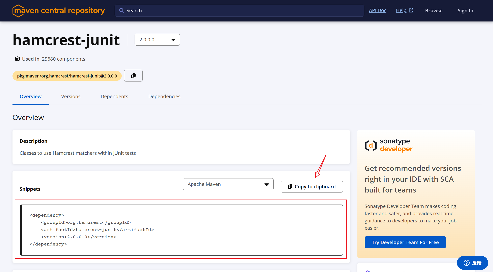

## 1. 引言

在Java开发过程中，项目通常需要依赖多个第三方库，如Commons Logging、JUnit、Log4j等。手动下载这些依赖并添加到项目中既繁琐又容易出错。Maven通过其强大的依赖管理功能，为我们简化了这一过程。

## 2. 基本原理

当我们的项目依赖于某个库时，例如`abc.jar`，而`abc`又依赖于`xyz.jar`，Maven能够自动处理这种传递依赖关系。

```
┌──────────────┐
│Sample Project│
└──────────────┘
        │
        ▼
┌──────────────┐
│     abc      │
└──────────────┘
        │
        ▼
┌──────────────┐
│     xyz      │
└──────────────┘
```

声明了`abc`的依赖后，Maven会自动将`abc`及其依赖的`xyz`都加入到项目中，无需手动管理这些复杂的依赖关系。

比如，项目依赖于Spring Boot的Web Starter：

```xml
<dependency>
    <groupId>org.springframework.boot</groupId>
    <artifactId>spring-boot-starter-web</artifactId>
    <version>1.4.2.RELEASE</version>
</dependency>
```

Maven会自动解析并下载其所有传递依赖，如`spring-core`、`spring-webmvc`、`tomcat-embed-core`、`logback`等，以提供完整的Web开发功能。这样，开发者就无需关心这些底层依赖的具体版本和配置，可以专注于使用Spring Boot提供的高级Web开发特性。

另外，Maven会通过中央仓库（[repo1.maven.org](https://repo1.maven.org/)）下载所有的依赖。每次下载的依赖都会缓存在本地的`.m2`目录中，避免重复下载，提高效率。

## 3. 依赖范围

### 3.1 Scope

Maven定义了几种依赖范围（Scope），分别是`compile`、`test`、`runtime`和`provided`。

| Scope      | 说明                           | 示例                   |
| ---------- | ------------------------------ | ---------------------- |
| `compile`  | 编译时需要用到的依赖（默认）   | `commons-logging`      |
| `test`     | 编译和运行测试代码时需要的依赖 | `junit`                |
| `runtime`  | 运行时需要的依赖               | `mysql-connector-java` |
| `provided` | 编译时需要，但运行时由容器提供 | `javax.servlet-api`    |

以下是Maven依赖范围的示例配置及其使用场景说明：

### 3.2 compile

`compile`（编译时依赖）是默认的依赖范围，表示依赖在编译时和运行时都是必需的。这类依赖会被包含在最终打包的应用中。

```xml
<dependency>
    <groupId>commons-logging</groupId>
    <artifactId>commons-logging</artifactId>
    <version>1.2</version>
    <scope>compile</scope> <!-- 可以省略，因为compile是默认值 -->
</dependency>
```

比如`commons-logging`提供了日志记录的功能，在应用的编译和运行时都需要使用到日志记录功能，因此将其设置为`compile`范围。

### 3.3 test

`test`范围的依赖只在编译和运行测试代码时需要。这类依赖不会被包含在最终打包的应用中。

```xml
<dependency>
    <groupId>junit</groupId>
    <artifactId>junit</artifactId>
    <version>4.12</version>
    <scope>test</scope>
</dependency>
```

比如`junit`是一个广泛使用的Java测试框架，仅在开发阶段进行单元测试时需要，不应该被包含在生产环境的应用中。

### 3.4 runtime

`runtime`范围的依赖在编译时不需要，但在运行时必需。这类依赖在编译测试代码时也是可用的。

```xml
<dependency>
    <groupId>mysql</groupId>
    <artifactId>mysql-connector-java</artifactId>
    <version>8.0.19</version>
    <scope>runtime</scope>
</dependency>
```

比如`mysql-connector-java`是MySQL数据库的JDBC驱动，通常在编译时不直接使用，但在运行时需要它来连接数据库。

### 3.5 provided

`provided`（容器提供的依赖）在编译和测试时需要，但在运行时不包含，因为运行环境（如Web服务器或Java EE容器）已提供这些依赖。

```xml
<dependency>
    <groupId>javax.servlet</groupId>
    <artifactId>javax.servlet-api</artifactId>
    <version>4.0.1</version>
    <scope>provided</scope>
</dependency>
```

比如`javax.servlet-api`提供了Servlet开发的标准API，通常在开发Web应用时需要用到。但在运行时，Servlet容器（如Tomcat）已经提供了这个API的实现，因此无需将其打包进应用中。

## 4. Maven坐标

Maven通过`groupId`、`artifactId`和`version`唯一标识一个依赖包：

- **groupId**：组织名称，如`org.springframework.boot`
- **artifactId**：项目名称，如`spring-boot-starter-web`
- **version**：版本号，如`1.4.2.RELEASE`

## 5. 使用镜像仓库

访问中央仓库可能会比较慢，我们可以通过配置镜像仓库来加快下载速度，如阿里云提供的Maven镜像：[Maven 仓库服务 (aliyun.com)](https://developer.aliyun.com/mvn/guide)。

配置如下：

打开 `maven` 的配置文件（ `windows` 系统一般在 `maven` 安装目录的 **conf/settings.xml** ），在`<mirrors></mirrors>`标签中添加 `mirror` 子节点:

```xml
<mirror>
  <id>aliyunmaven</id>
  <mirrorOf>*</mirrorOf>
  <name>阿里云公共仓库</name>
  <url>https://maven.aliyun.com/repository/public</url>
</mirror>
```

## 6. 搜索依赖的坐标

可以通过 [Maven Central](https://central.sonatype.com/) 搜索所需的第三方组件，获取其`groupId`、`artifactId`和`version`，然后添加到`pom.xml`中。



