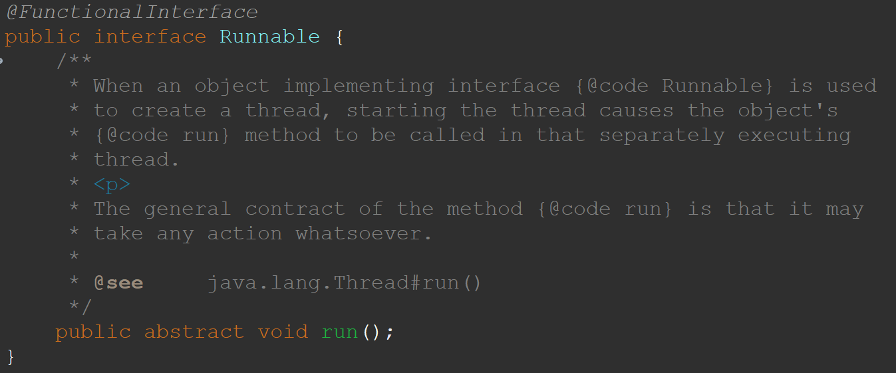

## 如何理解函数式接口

函数式接口是`Java 8`为了支持函数式编程引入的一个新概念。函数式接口是只有一个抽象方法的接口，这个抽象方法的签名定义了`Lambda`表达式的参数类型和返回类型。虽然函数式接口只能有一个抽象方法，但是可以有多个默认方法和静态方法。

比如 `Runnable` 就是一个函数式接口：



> `@FunctionalInterface`是Java 8引入的一个注解，用于指示一个接口是一个函数式接口。这样做可以检查它是否是一个函数式接口，同时`javadoc`也会包含这条声明。

在`Java`中，`Lambda`表达式是对象，而不是函数，它们必须依附于一类特别的对象类型——函数式接口。简单的说，在`Java`中，`Lambda`表达式就是一个函数式接口的实例。这就是`Lambda`表达式和函数式接口的关系。

也就是说，只要一个对象是函数式接口的实例，那么该对象就可以用`Lambda`表达式来表示。

例如，我们有一个函数式接口：

```java
@FunctionalInterface
public interface MyFunction {
    void apply(String s);
}
```

然后我们使用一个Lambda表达式作为这个接口的实现：

```java
MyFunction func = s -> System.out.println(s);
```

在这个例子中，`Lambda`表达式`s -> System.out.println(s)`就是`MyFunction`接口的一个实例。

所以，函数式接口是`Lambda`表达式在`Java`中的“载体”，它使得Java能够将函数作为一等公民对待，从而支持函数式编程。

## 作为参数传递Lambda 表达式

在Java中，Lambda表达式本质上是一个函数式接口的实例。因此，当我们将Lambda表达式作为参数传递时，接收Lambda表达式的参数类型必须是与该Lambda表达式兼容的函数式接口的类型。

例如，假设我们有一个函数式接口：

```java
@FunctionalInterface
public interface MyFunction {
    void apply(String s);
}
```

然后我们有一个方法，它接受一个`MyFunction`类型的参数：

```java
public void process(MyFunction func) {
    func.apply("Hello, World!");
}
```

那么我们就可以将一个Lambda表达式作为参数传递给这个方法：

```java
process(s -> System.out.println(s));
```

在这个例子中，Lambda表达式`s -> System.out.println(s)`是`MyFunction`接口的一个实例，因此它可以作为参数传递给`process`方法。

## Java 内置四大核心函数式接口

Java 8在`java.util.function`包中内置了四大核心的函数式接口，它们分别是：

1. `Function<T, R>`：函数型接口，接收一个输入参数，返回一个结果。这是一个功能性接口，因此可以用作Lambda表达式的赋值目标。主要方法是`R apply(T t)`。

   ```java
   Function<String, Integer> func = s -> s.length();
   Integer length = func.apply("Hello");  // 返回5
   ```

2. `Predicate<T>`：断言型接口，接收一个输入参数，返回一个布尔值结果。这个接口包含多种默认方法来组合`Predicate`，如：`and`、`or`、`negate`。主要方法是`boolean test(T t)`。

   ```java
   Predicate<String> pred = s -> s.isEmpty();
   boolean isEmpty = pred.test("");  // 返回true
   ```

3. `Consumer<T>`：消费型接口，接收一个输入参数并进行操作，没有返回结果。主要方法是`void accept(T t)`。

   ```java
   Consumer<String> consumer = s -> System.out.println(s);
   consumer.accept("Hello");  // 输出"Hello"
   ```

4. `Supplier<T>`：供给型接口，不接收输入参数，返回一个结果。主要方法是`T get()`。

   ```java
   Supplier<String> supplier = () -> "Hello, World!";
   String str = supplier.get();  // 返回"Hello, World!"
   ```

这四个接口是最基本的函数式接口。

另外，Java 8还提供了其他的函数式接口，如：

| 接口名称                  | 描述                        | 主要方法                     |
|-----------------------|---------------------------|--------------------------|
| `BiFunction<T, U, R>` | 接收两个输入参数，返回一个结果           | `R apply(T t, U u)`      |
| `BiPredicate<T, U>`   | 接收两个输入参数，返回一个布尔值结果        | `boolean test(T t, U u)` |
| `BiConsumer<T, U>`    | 接收两个输入参数并进行操作，没有返回结果      | `void accept(T t, U u)`  |
| `UnaryOperator<T>`    | 接收一个输入参数，返回一个与输入参数类型相同的结果 | `T apply(T t)`           |
| `BinaryOperator<T>`   | 接收两个输入参数，返回一个与输入参数类型相同的结果 | `T apply(T t1, T t2)`    |
