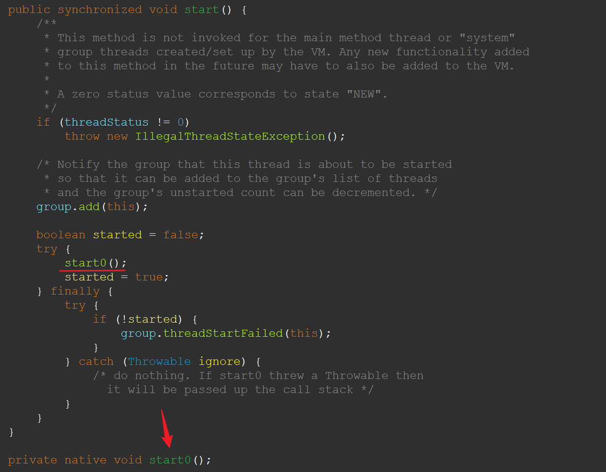

## 概述

在Java中，创建和启动一个新的线程通常有两种方式：

1. 继承`Thread`类：你可以创建一个新的类，让它继承自`Thread`类，然后重写`run`方法来定义线程的行为。然后创建这个类的实例，并调用其`start`方法来启动线程。

```java
class MyThread extends Thread {
    @Override
    public void run() {
        System.out.println("thread run...");
    }
}

public class Main {
    public static void main(String[] args) {
        MyThread myThread = new MyThread();
        myThread.start();  // 启动线程
    }
}
```

2. 实现`Runnable`接口：你也可以创建一个新的类，让它实现`Runnable`接口，然后重写`run`方法。然后创建`Thread`类的实例，将你的`Runnable`对象作为参数传递给`Thread`的构造函数，最后调用`Thread`对象的`start`方法来启动线程。

```java
class MyRunnable implements Runnable {
    @Override
    public void run() {
        System.out.println("thread run...");
    }
}

public class Main {
    public static void main(String[] args) {
        MyRunnable myRunnable = new MyRunnable();
        Thread thread = new Thread(myRunnable);
        thread.start();  // 启动线程
    }
}
```

在这两种方式中，推荐使用第二种，因为Java不支持多重继承，如果你的类已经继承了其他类，那么你只能选择实现`Runnable`接口。

> 当然，我们还可以使用Java 8引入的Lambda表达式来简化创建和启动线程的代码。具体来说，你可以将`Runnable`对象的创建过程替换为一个 `Lambda` 表达式，如下所示：
>
> ```java
> public class Main {
>     public static void main(String[] args) {
>         Thread thread = new Thread(() -> {
>             System.out.println("thread run...");
>         });
>         thread.start();  // 启动线程
>     }
> }
> ```
>
> 这里的 `() -> { ... }` 就是一个Lambda表达式，它实现了`Runnable`接口的`run`方法。


## 使用线程执行的打印语句，和直接在main()方法执行有区别吗？

有区别。一旦新线程开始运行，主线程和新线程就会并发执行，它们之间的执行顺序是不确定的，取决于操作系统的调度。如果你在 `main()` 方法中直接执行打印语句，它将总是在同一线程（主线程）中执行，并且按照代码的顺序执行。但开启了新线程后，新线程中的打印语句可能会与 main() 方法中的其他代码并发执行，这可能会导致并发问题，执行顺序是不确定的。

## 直接调用 run() 方法是无效的

直接调用 `Thread` 实例的 `run()` 方法并不会启动新的线程。这只会在当前线程（调用 `run()` 方法的线程）中执行 `run()` 方法的代码。这就像调用普通的 Java 方法一样，没有任何多线程的效果。

如果你想启动一个新的线程，你应该调用 `Thread` 实例的 `start()` 方法。`start()` 方法会启动一个新的线程，并在这个新线程中执行 `run()` 方法的代码。

举个例子：

```java
Thread thread = new Thread(() -> {
    System.out.println("thread run...");
});

// 错误的方式：这只会在当前线程中执行 run() 方法的代码，不会启动新线程
thread.run();

// 正确的方式：这会启动一个新线程，并在新线程中执行 run() 方法的代码
thread.start();
```

## start0 方法

如果我们观察`Thread`类的源码，可以发现 `start()` 方法内部调用了一个本地方法 `start0()`。

> `native` 关键字表示这个方法是由本地语言（如 C 或 C++）实现的，而不是由 Java 实现的。

这是因为线程的创建和管理是操作系统级别的功能，Java 本身无法直接进行这些操作。因此，Java 通过 JNI（Java Native Interface）调用本地方法来实现这些功能。



`start0()` 方法会做一些底层的工作，包括创建一个新的操作系统级别的线程，然后在新线程中调用 `run()` 方法。这就是为什么调用 `start()` 方法可以启动一个新线程，而直接调用 `run()` 方法只会在当前线程中执行 `run()` 方法的代码。

## 线程优先级

Java 提供了一种机制来设定线程的优先级。你可以使用 `Thread` 类的 `setPriority(int newPriority)` 方法来设定线程的优先级。这个 `newPriority` 参数应该是一个介于 `Thread.MIN_PRIORITY`（1）和 `Thread.MAX_PRIORITY`（10）之间的整数。

线程的优先级是一个提示给线程调度器的，它告诉线程调度器这个线程应该被赋予多少执行时间。优先级高的线程通常会获得更多的执行时间，但这并不是一个保证，具体还取决于操作系统的线程调度策略。

举个例子：

```java
Thread thread = new Thread(() -> {
    System.out.println("thread run...");
});

// 设置线程的优先级为最高
thread.setPriority(Thread.MAX_PRIORITY);  // 1~10, 默认值5

thread.start();
```

在这个例子中，新线程的优先级被设定为最高（10）。这意味着这个线程应该获得更多的执行时间，但具体还取决于操作系统的线程调度策略。

> **“我们决不能通过设置优先级来确保高优先级的线程一定会先执行”**。