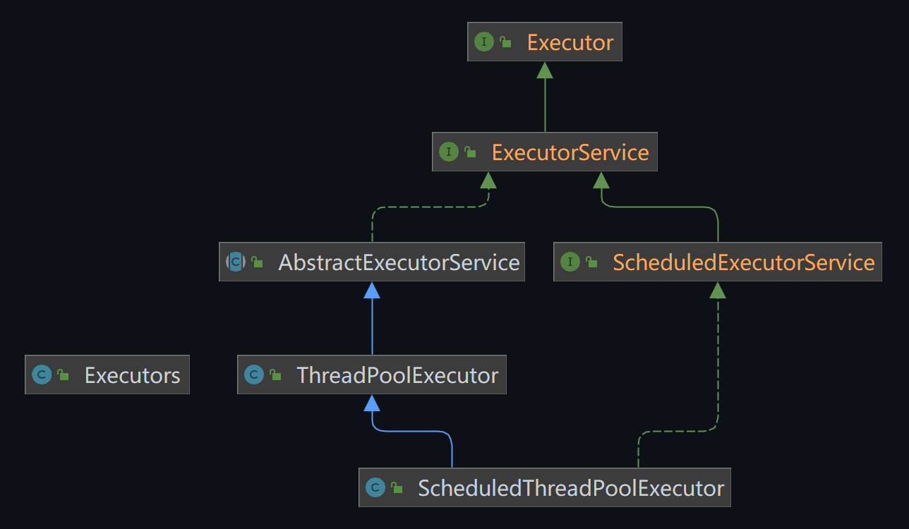
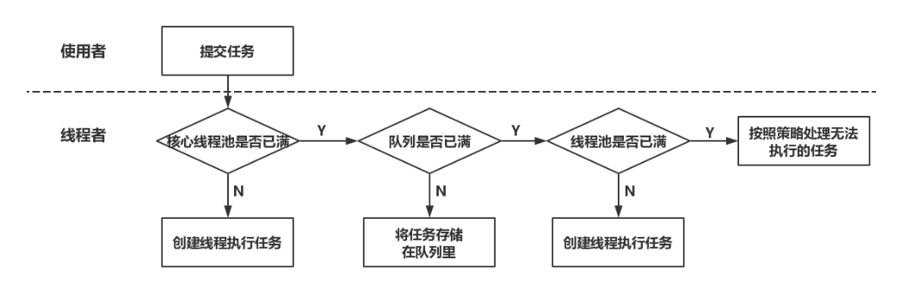

## 前言

> “Java语言虽然内置了多线程支持，启动一个新线程非常方便，但是，创建线程需要操作系统资源（线程资源，栈空间等），频繁创建和销毁大量线程需要消耗大量时间。如果可以复用一组线程，那么我们就可以把很多小任务让一组线程来执行，而不是一个任务对应一个新线程。这种能接收大量小任务并进行分发处理的就是线程池。”

Java线程池是一种基于池化概念的线程使用方式，它可以在需要时创建新线程，但在预先创建的线程空闲时会重用这些线程。这种方式可以减少在创建和销毁线程时所花费的时间，提高响应速度。

## 创建线程的四种方式

我们来回顾一下，在Java中，创建线程主要有四种方式。

首先是继承`Thread`类，然后重写 `run` 方法：

```java
class MyThread extends Thread {
    @Override
    public void run() {
        // 代码
    }
}

MyThread thread = new MyThread();
thread.start();
```

另一种方式是实现Runnable接口，实现其中的 `run` 方法：

```java
class MyRunnable implements Runnable {
    @Override
    public void run() {
        // 代码
    }
}

Thread thread = new Thread(new MyRunnable());
thread.start();
```

我们发现，上述两种方式实现的 `run` 方法，是没有返回值的。如果我们需要有返回值，可以使用下面这种方式：

```java
class MyCallable implements Callable<Integer> {
    @Override
    public Integer call() throws Exception {
        // 代码
        int result = 0;
        // 计算结果
        return result;
    }
}

FutureTask<Integer> futureTask = new FutureTask<>(new MyCallable());
new Thread(futureTask, "A").start();

try {
    // 获取线程执行结果
    Integer result = futureTask.get();
} catch (InterruptedException | ExecutionException e) {
    e.printStackTrace();
}
```

通过实现 `Callable` 接口，可以让线程执行完成之后返回结果。注意，`futureTask.get()`方法是阻塞的，它会等待线程执行完毕并返回结果。如果线程还没有执行完，`get`方法会一直等待。

以上三种方式，都是常规的创建线程方式。最后一种方式，当然就是线程池（Thread Pool）。

线程池解决的核心问题，就是资源管理问题。简单来说，在并发场景下，系统不能确定在任意时刻有多少任务需要执行，有多少资源需要投入。这种不确定性导致系统无法合理管理内部的资源分布，如果频繁申请销毁资源和调度资源，将带来额外的巨大消耗。

因此，线程池采用“池化”思想，将资源统一在一起进行管理，有效解决资源分配问题。

## 线程池的优势

简单来说，线程池主要就是负责控制运行的线程数量，将任务放入队列，并在创建线程后启动这些任务。如果线程数量超过最大数量，超出的线程将在队列中等待，直到其他线程执行完毕，然后从队列中取出任务来执行。

线程池会复用已创建的线程，减少线程创建和销毁的开销。因此，可以控制系统的最大并发数，防止大量的线程同时运行导致系统崩溃。也就是说，线程池可以统一管理和调度线程，提高系统稳定性。

总结如下：

| 优点               | 描述                                                         |
| ------------------ | ------------------------------------------------------------ |
| 降低资源消耗       | 通过复用已创建的线程，降低线程创建和销毁造成的资源消耗       |
| 提高响应速度       | 当任务到达时，任务可以立即由线程池中的一个线程执行，而不需要等待线程创建 |
| 提高线程的可管理性 | 线程是稀缺资源，如果无限制地创建，不仅会消耗系统资源，还会降低系统的稳定性。使用线程池可以进行统一的线程分配，调优和监控，提高系统的稳定性 |

## Executor框架

Java中的线程池是通过Executor框架实现的，该框架主要包括`Executor`，`Executors`，`ExecutorService`，`ThreadPoolExecutor`：



这里面我们需要核心掌握的，就是 `ThreadPoolExecutor` 类。

- **Executor和ExecutorService**：
  - `Executor`接口是表示执行提供的任务的对象。这是一个基本的接口，提供了一种将任务提交到线程池的方法。
  - `ExecutorService`是一个更完整的线程池接口，它继承自`Executor`接口。除了提供任务提交的方法外，它还提供了管理和控制线程池的方法，例如关闭线程池。
- **Executors工具类**:
  - `Executors`是一个工具类，提供了一系列工厂方法用于创建线程池实例。

- **ThreadPoolExecutor**：
  - `ThreadPoolExecutor`是`ExecutorService`接口的实现类，它提供了线程池的核心实现，也是我们需要了解的重点知识。

## 线程池的五种创建方式

`Executors`是一个工具类，提供了一系列工厂方法用于创建线程池实例。

### 单线程的线程池

- `Executors.newSingleThreadExecutor()`：
  - 创建一个单线程的线程池。
  - 这个线程池只有一个线程在工作，也就是相当于单线程串行执行所有任务。如果这个唯一的线程因为异常结束，那么会有一个新的线程来替代它。

```java
ExecutorService executor = Executors.newSingleThreadExecutor();
```

`newSingleThreadExecutor`将`corePoolSize`和`maximumPoolSize`都设置为1，使用的是`LinkedBlockingQueue`。

### 固定大小的线程池

- `Executors.newFixedThreadPool(5)`：
  - 创建固定大小的线程池。
  - 每次提交一个任务就创建一个线程，直到线程达到线程池的最大大小。线程池的大小一旦达到最大值就会保持不变。

```java
ExecutorService executor = Executors.newFixedThreadPool(5);
```

`newFixedThreadPool`创建的线程池`corePoolSize`和`maximumPoolSize`值是相等的，它使用的`LinkedBlockingQueue`。

### 可缓存的线程池

- `Executors.newCachedThreadPool()`:
  - 创建一个可缓存的线程池。
  - 如果线程池的大小超过了处理任务所需要的线程，那么就会回收部分空闲（60秒不执行任务）的线程，当任务数增加时，此线程池又可以智能的添加新线程来处理任务。

```java
ExecutorService executor = Executors.newCachedThreadPool();
```

`newCachedThreadPool`将`corePoolSize`设置为`0`，将`maximumPoolSize`设置为`Integer.MAX_VALUE`，使用的`SynchronousQueue`，也就是说来了任务就创建线程运行，当线程空闲超过`60`秒，就销毁线程。

### 大小无限的线程池

- `Executors.newScheduledThreadPool()`：
  - 创建一个大小无限的线程池。
  - 此线程池支持定时以及周期性执行任务的需求。

```java
ScheduledExecutorService executor = Executors.newScheduledThreadPool(5);
```

### 持有足够线程的线程池

- `Executors.newWorkStealingPool(int)`：
  - Java8新增，创建持有足够线程的线程池来支持给定的并行级别，并通过使用多个队列，减少竞争。
  - 它需要穿一个并行级别的参数，如果不传，则被设定为默认的CPU数量。

```java
ExecutorService executor = Executors.newWorkStealingPool();
```

### 注意事项

实际上在开发中，我们也不会使用 `Executors` 去创建线程池，而是通过 `ThreadPoolExecutor` 的方式，这样会使得线程池的运行规则更加明确，规避资源耗尽的风险。

> **Executors 返回的线程池对象的弊端如下：**
>
> 1. `FixedThreadPool` 和 `SingleThreadPool`：允许的请求队列长度为 `Integer.MAX_VALUE`，可能会堆积大量的请求，从而导致 `OOM`。
> 2. `CachedThreadPool`：允许的创建线程数量为 `Integer.MAX_VALUE`，可能会创建大量的线程，从而导致 `OOM`。
> 3. `ScheduledThreadPool`：允许的请求队列长度为 `Integer.MAX_VALUE`，可能会堆积大量的请求，从而导致 `OOM`。
>
> 摘抄自**《阿里巴巴Java开发手册》**

## 线程池7大参数

```java
public ThreadPoolExecutor(int corePoolSize,
                          int maximumPoolSize,
                          long keepAliveTime,
                          TimeUnit unit,
                          BlockingQueue<Runnable> workQueue,
                          ThreadFactory threadFactory,
                          RejectedExecutionHandler handler) {
    // ...
}
```

1. **corePoolSize**：
   - 线程池的核心线程数。在创建了线程池后，当有请求任务来了，就会安排池中的核心线程去执行请求任务。

   - 一旦线程池中的线程数目达到了`corePoolSize`，则会将到达的后续任务放到阻塞队列`BlockingQueue`中。

   - 即使线程处于空闲状态，除非设置了`allowCoreThreadTimeOut`，否则也会一直在线程池中。

2. **maximumPoolSize**：
   - 线程池所能容纳的最大线程数。

   - 这个参数会根据你的任务数量和类型来进行配置，必须大于等于1。

3. **keepAliveTime**：
   - 非核心线程的空闲超时时间，超过这个时间就会被回收。

   - 当前线程池数量超过`corePoolSize`时，如果空闲时间达到`keepAliveTime`值时，多余空闲线程会被销毁直到只剩下`corePoolSize`个线程为止。

4. **unit**：`keepAliveTime`的单位，可以是秒、毫秒等。

5. **workQueue**：用于存放待执行的任务的阻塞队列，可以选择以下几个阻塞队列：
   - `ArrayBlockingQueue`：基于数组的先进先出队列
   - `LinkedBlockingQueue`：基于链表的先进先出队列
   - `SynchronousQueue`：一个不存储元素的阻塞队列
   - `PriorityBlockingQueue`：具有优先级的无限阻塞队列

6. **threadFactory**：线程工厂，用来创建新的线程并设置其属性，一般使用默认的即可。

7. **handler**：饱和策略，当阻塞队列和最大线程池（`maximumPoolSize`）都满了之后的处理策略。主要有以下四种：
   - `AbortPolicy`：直接抛出异常
   - `CallerRunsPolicy`：只用调用者所在的线程来运行任务
   - `DiscardOldestPolicy`：丢弃队列里最早的未处理任务，然后尝试重新提交当前任务
   - `DiscardPolicy`：直接丢弃任务，但是不抛出异常

## 线程池的工作原理

在创建线程池之后，会等待提交过来的任务请求：

 

线程池内部维护了若干个线程，当一个任务被提交给线程池时，线程池会进行以下处理：

1. 如果正在运行的线程数量小于`corePoolSize`（核心线程池未满），那么马上创建线程运行这个任务。
2. 如果正在运行的线程数量大于或等于`corePoolSize`（核心线程池满了），那么将这个任务放入阻塞队列。
3. 如果这个时候，阻塞队列也满了，并且正在运行的线程数量小于`maximumPoolSize`（线程池所能容纳的最大线程数），那么此时创建非核心线程，立即运行这个任务。
4. 如果阻塞队列满了且正在运行的线程数量也达到了最大线程数，那么线程池会启动饱和拒绝策略（`RejectedExecutionHandler`）来处理无法执行的任务。

注意：

- 当一个线程完成任务后，会从阻塞队列中取下一个任务来执行。
- 当一个线程无事可做，并且已经超过一定时间（`keepAliveTime`），那么此时线程池会判断，如果当前运行的线程数大于`corePoolSize`，那么这个线程就被停掉。也就是说，线程池的所有任务完成后最终会收缩到`corePoolSize`的大小。

## 4种拒绝策略

上面讲了，如果等待队列已经满了，并且线程池中的线程数量也达到了最大，此时无法继续处理新任务，这时就需要拒绝策略机制来合理的处理这个问题。

我们来看一下Java提供的这四种拒绝策略：

1. **`AbortPolicy`**：直接抛出`RejectedExecutionException`异常，这是默认的拒绝策略，阻止系统正常运行。

2. **`CallerRunsPolicy`**：只用调用者所在的线程来运行任务。该策略既不会抛弃任务，也不会抛出异常，如果执行环境的线程资源已经饱和，此策略会使得提交任务的上游直接参与任务的执行，也就是将某些任务回退到调用者。

3. **`DiscardOldestPolicy`**：丢弃队列里最早的未处理任务，然后尝试重新提交当前任务。

4. **`DiscardPolicy`**：直接丢弃任务，但是不抛出异常。如果线程队列已满，则后续提交的任务都会被丢弃，且是静默丢弃。如果允许任务丢失，这是最好的一种方案。

上述这四种内置拒绝策略都实现了`RejectedExecutionHandler`接口。

## 手写线程池

简单示例：

```java
public class ThreadPoolExample {
    public static void main(String[] args) {
        // 创建线程工厂（这里只是演示，一般都用默认自带的）
        ThreadFactory threadFactory = new ThreadFactory() {
            private final AtomicInteger threadNumber = new AtomicInteger(1);

            @Override
            public Thread newThread(Runnable r) {
                Thread thread = new Thread(r);
                thread.setName("my-thread-" + threadNumber.getAndIncrement());
                return thread;
            }
        };

        // 创建拒绝策略
        RejectedExecutionHandler handler = new ThreadPoolExecutor.CallerRunsPolicy();

        // 创建线程池
        ThreadPoolExecutor executor = new ThreadPoolExecutor(
            5, // 核心线程数
            10, // 最大线程数
            60, // 空闲线程存活时间
            TimeUnit.SECONDS, // 时间单位
            new LinkedBlockingQueue<>(100), // 任务队列
            threadFactory, // 线程工厂
            handler // 拒绝策略
        );

        // 提交任务
        for (int i = 0; i < 20; i++) {
            executor.execute(() -> {
                System.out.println(Thread.currentThread().getName() + " is running");
            });
        }

        // 关闭线程池
        executor.shutdown();
    }
}
```

这里我们创建了一个线程池，核心线程数为5，最大线程数为10，空闲线程存活时间为60秒，任务队列的大小为100。我们使用自定义的线程工厂来创建线程，并且使用`CallerRunsPolicy`作为拒绝策略。然后我们提交了20个任务到线程池，每个任务就是打印当前线程的名字。最后，我们调用`shutdown`方法来关闭线程池。