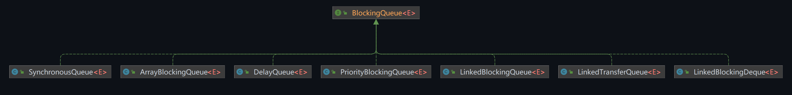

## 阻塞队列

### 概念

阻塞队列（BlockingQueue）就是一种特殊的队列，它在数据结构的操作上添加了阻塞的功能。

主要特性是：

1. 当队列为空时，从队列中获取元素的操作会被阻塞，直到队列中有新的元素加入；
2. 当队列已满时，往队列中添加元素的操作会被阻塞，直到队列中有空位。

> 阻塞队列常用于生产者-消费者的场景：
>
> - 生产者生产数据插入队列
> - 消费者从队列中取数据消费。
>
> 如果队列已满，生产者线程会被阻塞，等待消费者线程从队列中取出数据；反之，如果队列为空，消费者线程会被阻塞，等待生产者线程向队列中插入数据。

### 好处

为什么有阻塞队列？有什么好处？

实际上，在多线程领域，经常会在某些情况下挂起线程（即阻塞），一旦满足某个条件，被挂起的线程又会被通知唤醒。

在Concurrent包发布以前，我们在多线程环境下必须去控制这些细节，尤其还要兼顾效率和线程安全。那现在，使用阻塞队列，其内部通常已经实现了线程安全的数据操作，我们不需要关心什么时候需要阻塞线程，什么时候需要唤醒线程，因为这一切`BlockingQueue`都给你一手包办了。

另外，阻塞队列还可以设定最大容量，防止因生产速度远大于消费速度时，资源过度消耗。

## BlockingQueue

### 实现类

我们来了解一下`BlockingQueue`接口：



Java的`java.util.concurrent`包中提供了多种阻塞队列的实现，具体如下：

| 阻塞队列                | 描述                                                         |
| ----------------------- | ------------------------------------------------------------ |
| `ArrayBlockingQueue`    | 由数组结构组成的有界阻塞队列。队列的容量在初始化时设定，不能改变。按照FIFO（先进先出）的原则对元素进行排序。 |
| `LinkedBlockingQueue`   | 由链表结构组成的有界阻塞队列，但默认最大容量是`Integer.MAX_VALUE`，实际上可以看作是无界的。也按照FIFO的原则对元素进行排序。 |
| `SynchronousQueue`      | 不存储元素的阻塞队列。每个插入操作必须等待另一个线程的相应移除操作，反之亦然。常用于传递事件或任务。 |
| `PriorityBlockingQueue` | 支持优先级排序的无界阻塞队列。队列中的元素按照它们的自然排序（通过实现`Comparable`接口）或者通过构造函数提供的`Comparator`进行排序。 |
| `DelayQueue`            | 使用优先级队列实现的延迟无界阻塞队列。只有在延迟期满时才能从队列中取元素。常用于实现定时任务。 |
| `LinkedTransferQueue`   | 由链表结构组成的无界阻塞队列。比其他队列多了一个`transfer`方法，可以直接将元素传递给消费者，如果没有等待的消费者，`transfer`方法会阻塞。 |
| `LinkedBlockingDeque`   | 由链表结构组成的双向阻塞队列。元素可以从队列的两端插入，也可以从两端移除。既可以作为标准的FIFO队列，也可以作为LIFO（后进先出）的栈。 |

用的较多的是前三个实现类。

### 核心方法

| 方法类型 | 抛出异常    | 特殊值     | 阻塞     | 超时                 |
| -------- | ----------- | ---------- | -------- | -------------------- |
| 插入     | `add(e)`    | `offer(e)` | `put(e)` | `offer(e,time,unit)` |
| 移除     | `remove()`  | `poll()`   | `take()` | `poll(time,unit)`    |
| 检查     | `element()` | `peek()`   |          |                      |

1. **插入方法**：
   - `add(e)`: 插入一个元素，如果队列已满，则抛出`IllegalStateException`异常。
   - `offer(e)`: 插入一个元素，如果队列已满，则返回`false`。
   - `put(e)`: 插入一个元素，如果队列已满，则阻塞。
   - `offer(e, time, unit)`: 插入一个元素，如果队列已满，则阻塞一段时间，如果还是无法插入，则返回`false`。

2. **移除方法**：
   - `remove()`: 移除并返回队列头部的元素，如果队列为空，则抛出`NoSuchElementException`异常。
   - `poll()`: 移除并返回队列头部的元素，如果队列为空，则返回`null`。
   - `take()`: 移除并返回队列头部的元素，如果队列为空，则阻塞。
   - `poll(time, unit)`: 移除并返回队列头部的元素，如果队列为空，则阻塞一段时间，如果还是无法移除，则返回`null`。

3. **检查方法**（返回队列头部的元素但不移除）：
   - `element()`: 返回队列头部的元素，如果队列为空，则抛出`NoSuchElementException`异常。
   - `peek()`: 返回队列头部的元素，如果队列为空，则返回`null`。

注意，阻塞方法`put(e)`和`take()`在队列已满或为空时，会使当前线程进入等待状态，直到队列不满或不空。而超时方法`offer(e, time, unit)`和`poll(time, unit)`则会在等待一定的时间后，如果还不能插入或移除元素，就会返回。

### 示例代码

以 `ArrayBlockingQueue` 为例，展示阻塞队列的常用方法。

#### 阻塞队列API之抛出异常

```java
import java.util.concurrent.BlockingQueue;
import java.util.concurrent.ArrayBlockingQueue;

public class Test {
    public static void main(String[] args) {
        BlockingQueue<String> queue = new ArrayBlockingQueue<>(3);
        // 插入元素
        System.out.println(queue.add("a"));
        System.out.println(queue.add("b"));
        System.out.println(queue.add("c"));
        // 当队列满时，再次插入会抛出java.lang.IllegalStateException: Queue full
        // System.out.println(queue.add("d"));

        // 检查元素
        System.out.println(queue.element());

        // 移除元素
        System.out.println(queue.remove());
        System.out.println(queue.remove());
        System.out.println(queue.remove());
        // 当队列空时，再次移除会抛出java.util.NoSuchElementException
        // System.out.println(queue.remove());
    }
}
```

#### 阻塞队列API之返回布尔值

```java
import java.util.concurrent.BlockingQueue;
import java.util.concurrent.ArrayBlockingQueue;

public class Test {
    public static void main(String[] args) {
        BlockingQueue<String> queue = new ArrayBlockingQueue<>(3);
        
        // 插入元素
        System.out.println(queue.offer("a"));  // true
        System.out.println(queue.offer("b"));  // true
        System.out.println(queue.offer("c"));  // true
        // 当队列满时，再次插入会返回false
        System.out.println(queue.offer("d"));  // false

        // 检查元素
        System.out.println(queue.peek());  // a

        // 移除元素
        System.out.println(queue.poll());  // a
        System.out.println(queue.poll());  // b
        System.out.println(queue.poll());  // c
        // 当队列空时，再次移除会返回null
        System.out.println(queue.poll());  // null
    }
}
```

#### 阻塞队列API之阻塞

```java
import java.util.concurrent.BlockingQueue;
import java.util.concurrent.ArrayBlockingQueue;

public class Test {
    public static void main(String[] args) throws InterruptedException {
        BlockingQueue<String> queue = new ArrayBlockingQueue<>(3);

        // 插入元素
        queue.put("a");
        queue.put("b");
        queue.put("c");
        // 当队列满时，再次插入会阻塞
        // queue.put("d"); 

        // 检查元素
        System.out.println(queue.peek());  // a

        // 移除元素
        System.out.println(queue.take());  // a
        System.out.println(queue.take());  // b
        System.out.println(queue.take());  // c
        // 当队列空时，再次移除会阻塞
        // System.out.println(queue.take()); 
    }
}
```

#### 阻塞队列API之超时控制

```java
import java.util.concurrent.BlockingQueue;
import java.util.concurrent.ArrayBlockingQueue;
import java.util.concurrent.TimeUnit;

public class Test {
    public static void main(String[] args) throws InterruptedException {
        BlockingQueue<String> queue = new ArrayBlockingQueue<>(3);

        // 插入元素
        queue.offer("a", 2, TimeUnit.SECONDS);
        queue.offer("b", 2, TimeUnit.SECONDS);
        queue.offer("c", 2, TimeUnit.SECONDS);
        // 当队列满时，再次插入会阻塞一段时间，如果还是无法插入，则返回false
        System.out.println(queue.offer("d", 2, TimeUnit.SECONDS));  // false

        // 检查元素
        System.out.println(queue.peek());  // a

        // 移除元素
        System.out.println(queue.poll(2, TimeUnit.SECONDS));  // a
        System.out.println(queue.poll(2, TimeUnit.SECONDS));  // b
        System.out.println(queue.poll(2, TimeUnit.SECONDS));  // c
        // 当队列空时，再次移除会阻塞一段时间，如果还是无法移除，则返回null
        System.out.println(queue.poll(2, TimeUnit.SECONDS));  // null
    }
}
```

### SynchronousQueue

`SynchronousQueue`是一个特殊的`BlockingQueue`，它没有任何内部容量，甚至连一个队列的容量都没有。你不能在队列中插入一个元素，除非这个元素在添加的时候就有其他线程在等待接收它；反过来，你也不能从队列中移除一个元素，除非有一个元素在等待被移除。这是一个真正的阻塞队列，对于每一个`put`操作都需要一个`take`操作，否则不能继续添加元素，反之亦然。

`SynchronousQueue`可以看作是一个传球手，负责把生产者线程处理的数据直接传递给消费者线程。"公平模式"的队列中，线程是按照他们请求访问的顺序，即FIFO的顺序来访问队列的。而"非公平模式"中则允许争夺，当一个新的元素插入或者一个空闲线程可用，多个线程有可能会同时尝试去插入或取出，谁能成功由运行时的情况决定。

以下是一个简单的示例：

```java
import java.util.concurrent.BlockingQueue;
import java.util.concurrent.SynchronousQueue;
import java.util.concurrent.TimeUnit;

public class Test {
    public static void main(String[] args) {
        BlockingQueue<String> queue = new SynchronousQueue<>();

        new Thread(() -> {
            try {
                System.out.println(Thread.currentThread().getName() + " put 1");
                queue.put("1");
                System.out.println(Thread.currentThread().getName() + " put 2");
                queue.put("2");
                System.out.println(Thread.currentThread().getName() + " put 3");
                queue.put("3");
            } catch (InterruptedException e) {
                e.printStackTrace();
            }
        }, "T1").start();

        new Thread(() -> {
            try {
                TimeUnit.SECONDS.sleep(3);
                System.out.println(Thread.currentThread().getName() + " take " + queue.take());
                TimeUnit.SECONDS.sleep(3);
                System.out.println(Thread.currentThread().getName() + " take " + queue.take());
                TimeUnit.SECONDS.sleep(3);
                System.out.println(Thread.currentThread().getName() + " take " + queue.take());
            } catch (InterruptedException e) {
                e.printStackTrace();
            }
        }, "T2").start();
    }
}
```

在这个例子中，生产者线程"T1"和消费者线程"T2"通过`SynchronousQueue`进行交互。每次"T1"线程调用`put`方法插入元素时，都会等待"T2"线程调用`take`方法取出元素，反之亦然。

在创建`SynchronousQueue`的时候，可以通过构造函数的参数来指定是公平模式还是非公平模式：

```java
// 创建一个公平模式的SynchronousQueue
BlockingQueue<String> fairQueue = new SynchronousQueue<>(true);

// 创建一个非公平模式的SynchronousQueue
BlockingQueue<String> nonFairQueue = new SynchronousQueue<>();
// 或者
BlockingQueue<String> nonFairQueue = new SynchronousQueue<>(false);
```

在公平模式下，等待时间最长的线程（即最早到达的线程）会优先处理，而在非公平模式下，线程的处理顺序并不固定，可能会优先处理等待时间较短的线程。