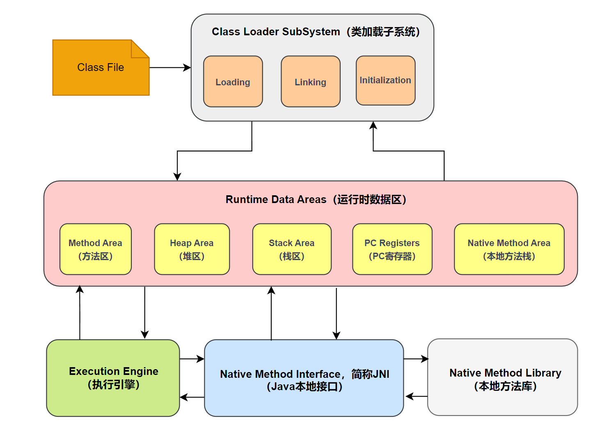

## 概述

Java虚拟机（JVM）是一个虚拟的计算机系统，它作为Java字节码的运行环境，提供了Java的跨平台能力。JVM可以运行那些编译为字节码的Java程序，这些字节码在不同的操作系统和硬件架构上都能被JVM解释执行，从而实现了“一次编写，到处运行”。

JVM在执行字节码时，首先将字节码加载到其内部，然后进行验证、准备、解析和初始化等步骤，最后执行字节码。在执行过程中，JVM还负责管理内存，包括类加载、对象的分配和回收等。

JVM的体系结构主要包括类加载器、运行时数据区、执行引擎等部分。其中，类加载器负责从文件系统或网络中加载Class信息，运行时数据区提供了JVM运行Java程序所需的内存模型，执行引擎则负责字节码的执行。

JVM 架构图如下：



## Class File


Java的`.class`文件是Java编译器从`.java`源文件编译得到的。它包含了Java虚拟机（JVM）在运行时需要的类或接口的信息，包括类或接口的名称、方法和字段的声明以及字节码等。

以下是一个简单的Java源文件和其编译后的`.class`文件的示例。

Java源文件（`HelloWorld.java`）：

```java
public class HelloWorld {
    public static void main(String[] args) {
        System.out.println("Hello, World!");
    }
}
```

编译Java源文件：

在命令行中，你可以使用`javac`命令来编译Java源文件，生成`.class`文件：

```bash
javac HelloWorld.java
```

这将生成一个名为`HelloWorld.class`的文件，这就是`.class`文件。你可以使用`java`命令来运行这个`.class`文件：

```bash
java HelloWorld
```

这将输出：

```
Hello, World!
```

注意：`.class`文件是二进制文件，不能直接用文本编辑器打开查看。如果你想查看`.class`文件的内容，可以使用`javap`命令，这是Java的反编译器：

```bash
javap -c HelloWorld
```

这将输出`HelloWorld`类的字节码。


## Class Loader

Java类加载器是Java运行时环境的一部分，负责在运行时动态加载Java类到Java虚拟机中。它们是Java的核心组件之一，使得Java能够成为一个真正的动态语言。

类加载器的主要任务是根据一个类的全限定名来加载该类的二进制字节流到Java虚拟机内部，然后将这些静态的二进制字节流转换成为运行时数据结构，在堆区生成一个代表这个类的`java.lang.Class`对象。

Java的类加载器有以下三种：

1. **引导类加载器（Bootstrap ClassLoader）**：这是Java类加载层次结构中最顶层的类加载器，负责加载Java核心库，如`java.lang.*`和`java.util.*`等。这个加载器是用C++编写的，是虚拟机的一部分，它不是一个Java类。

2. **扩展类加载器（Extension ClassLoader）**：这是引导类加载器的子类加载器，负责加载Java的扩展库，如`javax.*`等。

3. **系统类加载器（System ClassLoader）**：也称为应用类加载器，它是扩展类加载器的子类加载器，负责加载应用程序类路径（classpath）上的类库。

类加载器的工作过程主要包括加载、链接（验证、准备、解析）和初始化三大步骤。其中，加载是类加载过程的一个阶段，会在.class文件被加载后形成Java类型的初始定义信息，链接过程则负责把类型的二进制数据合并到JRE中，而初始化则会执行类构造器。

> Java还允许我们自定义类加载器，只需要继承`java.lang.ClassLoader`类，然后重写`findClass(String name)`方法即可。这使得我们可以从非标准来源（如网络、数据库等）加载类，或实现类的热加载等功能。

## Runtime Data Area

运行时数据区（Runtime Data Area）是Java虚拟机（JVM）在执行Java程序时用于存储各种数据的内存区域。根据其生命周期和可见性，运行时数据区可以划分为以下几个部分：

1. **方法区（Method Area）**：方法区用于存储已被虚拟机加载的类信息、常量、静态变量、即时编译器编译后的代码等数据。这部分内存的回收目标主要针对常量池的回收和对类型的卸载，一般情况下，不需要手动进行内存管理。

2. **堆区（Heap）**：堆区是被所有线程共享的一块内存区域，主要用于存放对象实例和数组。这是垃圾收集器管理的主要区域，通常分为新生代和老年代。新生代再细分为Eden区和两个Survivor区（一般称为From Survivor和To Survivor或者S0和S1）。大部分情况，新创建的对象都会被分配到Eden区（一些大对象特殊处理），Survivor区用于存放新生代中Eden区和Survivor区的存活对象。

3. **虚拟机栈（Java Virtual Machine Stacks）**：每个Java线程在创建时都会创建一个虚拟机栈，其生命周期与线程相同。虚拟机栈描述的是Java方法执行的内存模型：每个方法在执行的时候都会创建一个栈帧用于存储局部变量表、操作数栈、动态链接、方法出口等信息。每一个方法从调用直至执行完成的过程，就对应着一个栈帧在虚拟机栈中入栈到出栈的过程。

4. **本地方法栈（Native Method Stacks）**：本地方法栈与虚拟机栈所发挥的作用是非常相似的，其区别不过是虚拟机栈为虚拟机执行Java方法（也就是字节码）服务，而本地方法栈则为虚拟机使用到的Native方法服务。

5. **程序计数器（Program Counter Register）**：程序计数器是一块较小的内存空间，它的作用可以看做是当前线程所执行的字节码的行号指示器。字节码解释器工作时就是通过改变这个计数器的值来选取下一条需要执行的字节码指令，它是程序控制流的指示器，分支、循环、跳转、异常处理、线程恢复等基础功能都需要依赖这个计数器完成。

## Execution Engine

执行引擎（Execution Engine）是Java虚拟机的核心组成部分之一，负责执行虚拟机字节码。执行引擎在执行字节码时，最初采用的是解释执行的方式，即通过解释器读取字节码，然后执行。这种方式简单、高效，但是当需要执行的字节码量较大时，解释执行的效率就显得较低。

为了提高执行效率，Java虚拟机引入了即时编译器（Just-In-Time compiler，JIT）。即时编译器会将热点代码（执行频率较高的代码）编译为本地机器码，然后直接调用，从而提高执行效率。即时编译器在编译时还会进行各种优化，如方法内联、死代码消除等，进一步提高执行效率。

执行引擎还包括一个垃圾回收器（Garbage Collector），负责回收堆内存中不再使用的对象，以防止内存泄漏。

总的来说，执行引擎是Java虚拟机的“心脏”，负责执行字节码，通过解释执行、即时编译等技术，保证了Java程序的高效运行。


## 本地方法接口

Java Native Interface（JNI，也被称为本地方法接口）是Java的一个特性，它允许Java代码和其他语言写的代码进行交互。JNI是Java虚拟机（JVM）的一部分，它使得Java代码能够调用或被C、C++等其他语言的代码调用。

JNI的主要用途是提供与特定系统交互的能力，或者利用其他语言（如C、C++）已有的库。例如，Java的标准库就使用JNI来提供一些系统级的功能，如文件系统操作、线程管理和网络编程等。

使用JNI，Java代码可以做到以下几点：

1. 声明一个方法为`native`，表示这个方法是用其他语言实现的。
2. 加载包含实现这些`native`方法的库。
3. 调用这些`native`方法。

虽然JNI提供了强大的功能，但是使用JNI也有一些需要注意的地方：

1. 使用JNI编写的代码更难以移植，因为它依赖于特定的系统和硬件。
2. 使用JNI可能会降低程序的稳定性，因为JNI允许直接操作系统级别的资源，这可能会导致系统错误或内存泄漏。
3. 使用JNI可能会降低程序的性能，因为调用`native`方法需要进行一些额外的操作，如参数转换和错误检查等。

> 在大多数情况下，应优先使用Java提供的标准库或其他Java库。

## 本地方法库

本地方法库（Native Method Libraries）是Java虚拟机（JVM）的一部分，它包含了用于实现本地方法（native methods）的代码。本地方法是用C、C++或其他语言实现的方法，它们可以被Java代码通过Java Native Interface（JNI）调用。

本地方法库提供了Java与操作系统或硬件交互的能力，使得Java能够使用一些Java语言本身无法提供的系统级功能，如访问系统底层资源、使用特定硬件设备等。此外，本地方法库还可以让Java利用已有的C、C++等语言的库，避免重复开发。