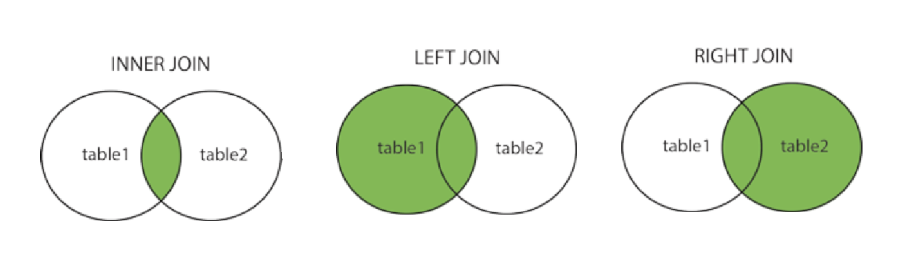

## 为什么要使用联结？

表的联结是 SQL 的强大功能之一，我们可以在数据检索查询的执行中联结（`join`）表。在学习联结的知识点之前，我们先来了解一下关系表以及关系数据库设计。

为什么要使用联结？

在关系数据库中，数据被存储在表格中，每个表格都有一个唯一的名字。表格中的每一行（也被称为记录或元组）代表一个对象的实例（比如一个员工），每一列（也被称为字段或属性）代表该对象的一个属性（比如员工的姓名）。

假设我们现在有两张表：

- 供应商表：供应商的名字、地址、联系方式等

- 产品表：包含了产品类别、产品描述、产品价格、生产该产品的供应商等

也就是说，我们将供应商的信息与产品信息分开存储。

这样做的好处在于：

- **避免重复**：供应商的信息不重复，则不会浪费时间和空间
- **更改方便**：如果供应商的信息需要更新，则只需要改动一次即可
- **数据一致**：数据没有重复，显然数据是一致的，这也便于处理数据

为了避免相同数据出现多次，我们就需要将信息拆分为多张表，一类数据划分为一张表。这就是关系表设计的基础。

在关系表的设计中，各个表之间通过某些值（即关系设计中的关系）进行互相关联。

在上面的例子中：

- 供应商表 `vendors`：包含所有供应商信息，并且每个供应商都具有唯一的标识，我们称之为 **主键**（primary key），一般是供应商ID。

- 产品表 `products`：包含了所有产品信息以及供应商ID（也就是 `vendors` 表中的主键）。需要注意， `vendors` 表中的主键又称为 `products` 表的 **外键**。这个外键的作用就是将  `vendors`表和 `products` 表关联起来。通过供应商ID能从  `vendors` 表中找到相应的供应商信息。

> 备注：
>
> - **主键**：能够唯一区分表中每个行的值。
> - **外键**：包含另一张表的主键值，将两张表联系起来

因此，使用联结可以在一条 `select` 语句检索出存储在多个表的数据。

::: tip

联结是一种机制，用来在一条 `SELECT` 语句中关联表，因此称为联结。使用指定的语法，就可以联结多张表并返回一组输出。表之间的关系是在运行时构造的，联结在运行时关联表中正确的行。

:::

## 基本语法

在 SQL 中，创建联结的基本语法如下：

```sql
SELECT column_name(s)
FROM table1
JOIN table2
ON table1.column_name = table2.column_name;
```

创建联结的要求有两个：

- 指明要联结的所有表
- 指明联结的方式

例如，假设我们有两个表，`employees` 和 `departments`，我们可以使用以下 SQL 语句创建联结：

```sql
SELECT employees.name, departments.department_name
FROM employees
JOIN departments
ON employees.department_id = departments.department_id;
```

这个查询将 `employees` 表和 `departments` 表联结在一起，联结的条件是 `employees` 表的 `department_id` 字段等于 `departments` 表的 `department_id` 字段。查询的结果是每个员工的姓名和他们所在的部门名称。

## 内部联结

内部联结是基于两个表之间的相等测试进行的联结。这是最常见的联结类型，通常用于连接具有相同或相似信息的表。

例如：

```sql
SELECT orders.order_id, customers.customer_name
FROM orders
INNER JOIN customers
ON orders.customer_id = customers.customer_id;
```

这个查询将 `orders` 表和 `customers` 表联结在一起，联结的条件是 `orders` 表的 `customer_id` 字段等于 `customers` 表的 `customer_id` 字段。

> 备注：
>
> - 完全限定列名：用一个点分隔的表名和列名
> - 使用时机：引用的列可能出现二义性时

## 联结多个表

SQL 对一条 `SELECT` 语句中可以联结的表的数目没有限制。

例如，如果我们有三个表，`orders`、`customers` 和 `products`，我们可以使用以下 SQL 语句联结这三个表：

```sql
SELECT orders.order_id, customers.customer_name, products.product_name
FROM orders
INNER JOIN customers ON orders.customer_id = customers.customer_id
INNER JOIN products ON orders.product_id = products.product_id;
```

> **注意！避免联结不必要的表**：
>
> - MySQL在运行时关联指定的每个表以处理联结。
>
> - 联结的表越多，性能下降越厉害。

## 表别名

之前记录过，我们会给计算字段起别名，也可以给列名起别名。现在，我们还可以给表名起别名，这在联结多个表时非常有用，可以使 SQL 语句更简洁。

例如：

```sql
SELECT o.order_id, c.customer_name, p.product_name
FROM orders AS o
INNER JOIN customers AS c ON o.customer_id = c.customer_id
INNER JOIN products AS p ON o.product_id = p.product_id;
```

> 备注：表别名只在查询执行中使用，其不会返回到客户机

## 自联结

::: tip

自联结是一种特殊的联结，用于从相同的表中检索数据。

:::

现在看一个需求：

- 从 `products` 表中查询 `prod_id` 为 `'abc'` 的产品的供应商 ID
- 查询该供应商生产的其他产品信息

代码示例如下：

```sql
select
	prod_id, prod_name
from
	products
where
	vend_id = (
    	select vend_id from products
        where prod_id = 'abc'
    );
```

可以看到，我们使用了子查询作为解决方案。

该方法先是做了一个简单的检索，查询到 `prod_id` 为 `'abc'` 的产品的供应商 ID，即 `vend_id`。该 `vend_id` 用于外部查询的 `where` 子句中。这样就检索出该供应商 ID 生产的所有产品。

现在，我们有了另一种解决方案，即使用自联结。

```sql
select
	p1.prod_id,
	p1.prod_name
from
	products as p1,
	products as p2,
where
	p1.vend_id = p2.vend_id
	and p2.prod_id = 'abc';
```

记录：

- 如果使用了子查询语句，用于从相同的表中检索数据，那么此时可以用自联结的方式来代替子查询。
- 从上面的代码中可以看到，在 `from` 子句中，引用了两次 `products` 表，并分别起了表别名（`p1` 和 `p2`）。起别名的作用是让 MySQL 知道引用的是哪个实例，这可以避免发生二义性问题。
- 在 `where` 子句中，通过匹配 `p1` 中的 `vend_id` 和  `p2` 中的 `vend_id` 来联结两个表，然后按照 `p2` 中的 `prod_id` 来过滤数据，最后返回检索的数据。

## 自然联结

::: tip

自然联结是一种特殊的等值联结，它排除了联结时相同的列多次出现的情况。

:::

我们知道，为了对表进行联结，被联结的列应该出现在不止一个表中。前面记录过的内部联结会返回所有数据（相同的列可能会多次出现）。

我们可以使用**自然联结**，来排除联结时相同的列多次出现的情况，使得每个列只返回一次。

来看下面代码：

```sql
select
	c.*,
	o.order_num,
	o.order_data,
	oi.prod_id,
	oi.quantity,
	oi.item_price
from
	customers as c,
	orders as o,
	orderitems as oi
where
	c.cust_id = o.cust_id
	and oi.order_num = o.order_num
	and prod_id = 'xxx';
```

记录：

- 在上述代码中，我们可以看到：我们对表 `c` 使用了通配符 `*` ，而对所有其他表的列使用了明确的字段来完成检索，这就是自然联结。
- 自然联结的作用就是：没有重复的列被检索出来

> 事实上，我们建立的每个内部联结都是自然联结。

## 外部联结

::: tip

外部联结是一种特殊的联结，它不仅返回两个表中匹配的行，还返回其中一个表中的所有行，即使在另一个表中没有匹配的行。这种联结类型在处理可能没有关联数据的情况时有用。

:::

在 MySQL 中，我们可以使用 `LEFT JOIN`、`RIGHT JOIN` 或 `FULL JOIN` 来创建外部联结：

- **左联结（LEFT JOIN）**：返回左表中的所有行，即使在右表中没有匹配的行。如果在右表中没有匹配的行，则结果集中的右表列将包含 NULL。

- **右联结（RIGHT JOIN）**：返回右表中的所有行，即使在左表中没有匹配的行。如果在左表中没有匹配的行，则结果集中的左表列将包含 NULL。

- **全联结（FULL JOIN）**：返回左表和右表中的所有行。如果某一边没有匹配的行，则结果集中的那一边的列将包含 NULL。注意，MySQL 不直接支持 FULL JOIN，但可以通过 UNION 关键字将 LEFT JOIN 和 RIGHT JOIN 结果合并来实现。



举个例子，假设我们有两个表，一个是 `orders` 表，记录了所有的订单信息，一个是 `customers` 表，记录了所有的客户信息。

我们想要获取所有客户的订单信息，包括那些没有下过订单的客户。

在这种情况下，我们可以使用左联结（LEFT JOIN）：

```sql
SELECT customers.customer_name, orders.order_id
FROM customers
LEFT JOIN orders ON customers.customer_id = orders.customer_id;
```

这个查询将返回 `customers` 表中的所有行。如果某个客户在 `orders` 表中没有匹配的行（即该客户没有下过订单），则结果集中的 `orders.order_id` 列将包含 NULL。

这样，我们就可以看到所有客户的订单信息，包括那些没有下过订单的客户。

## 使用带聚集函数的联结

聚集函数可以与联结一起使用。

假设我们有两个表，`orders` 表和 `customers` 表，我们想要找出每个客户的订单数量，我们可以使用 `COUNT()` 函数和联结查询：

```sql
SELECT customers.customer_name, COUNT(orders.order_id) AS order_count
FROM customers
LEFT JOIN orders ON customers.customer_id = orders.customer_id
GROUP BY customers.customer_name;
```

这个查询首先使用 `LEFT JOIN` 将 `customers` 表和 `orders` 表联结在一起，然后使用 `GROUP BY` 按 `customer_name` 分组，最后使用 `COUNT()` 函数计算每个客户的订单数量。

> 注意，当我们在联结查询中使用聚集函数时，通常需要使用 `GROUP BY` 语句，以便按某个或某些列进行分组。

## 总结

- 在使用联结表时，要根据具体需求选择合适的联结类型。如果只需要返回两个表中都有的数据，可以使用内部联结。如果需要返回其中一个表中的所有数据，即使在另一个表中没有匹配的行，可以使用外部联结（如 `LEFT JOIN`、`RIGHT JOIN`）。
- 必须提供并使用正确的 **联结条件**，以确保返回正确的数据。联结条件通常是两个表中的字段相等，例如 `table1.id = table2.id`。
- 在一个联结中可以包含多个表，每个表之间的联结可以采用不同的联结类型。在构建复杂的联结查询时，建议分别测试每个联结，确保每个联结的正确性，然后再将它们组合在一起。
- 当在联结查询中使用聚集函数时，通常需要使用 `GROUP BY` 语句，以便按某个或某些列进行分组。
- 在联结查询中，可以使用表别名来简化 SQL 语句，特别是在联结多个表时。
- 自联结是一种特殊的联结，用于从同一表中检索数据，例如，获取员工及其经理的信息。
- 自然联结是一种特殊的等值联结，它排除了联结时相同的列多次出现的情况。

::: tip 阿里巴巴开发手册

【强制】 超过三个表禁止`join`。需要`join`的字段，数据类型保持绝对一致；多表关联查询时，保证被关联 的字段需要有索引。

> 说明：即使双表`join`也要注意表索引、`SQL`性能。 

【强制】 不得使用外键与级联，一切外键概念必须在应用层解决。 

> 说明：（概念解释）学生表中的`student_id`是主键，那么成绩表中的`student_id`则为外键。如果更新学生表中的 `student_id`，同时触发成绩表中的`student_id`更新，即为级联更新。外键与级联更新适用于单机低并发，不适合分布式、 高并发集群；级联更新是强阻塞，存在数据库更新风暴的风险；外键影响数据库的插入速度。 

:::