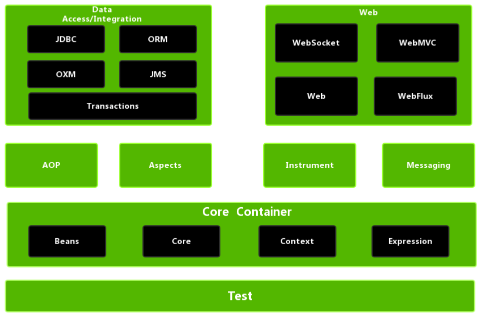

## 什么是Spring

Spring是一款主流的Java EE轻量级开源框架，由Rod Johnson创立，旨在简化Java企业级应用的开发过程。Spring的应用范围广泛，不仅限于服务器端开发。从简单性、可测试性和松耦合性来看，所有Java应用都可以从Spring中受益。除了提供自身的功能，Spring框架还能整合其他技术和框架。

自从Spring诞生以来，一直受到开发人员的热烈欢迎，并被广泛用作Java企业级应用程序开发的首选框架。如今，Spring已经成为Java EE的代名词，是构建Java EE应用的事实标准。

<SiteInfo
name="Spring"
desc="Spring makes Java simple."
url="https://spring.io/"
preview="/assets/pageImg/02_Spring.jpg"
repo="https://github.com/spring-projects/spring-framework"
/>


自2004年4月Spring 1.0版本正式发布以来，Spring已经发展到了第6个大版本，即Spring 6。

## Spring的定义和组成

广义上的`Spring`指的是以`Spring Framework`为核心的一整套`Spring`技术栈。经过多年的发展，`Spring`已经从一个单一的应用框架，发展成为包含多个子项目（模块）的成熟技术体系，如`Spring Framework`、`Spring MVC`、`SpringBoot`、`Spring Cloud`、`Spring Data`、`Spring Security`等，其中`Spring Framework`是所有子项目的基础。狭义上的`Spring`则特指`Spring Framework`，通常我们称之为`Spring`框架。

`Spring`框架是一个分层的、面向切面的Java应用程序的轻量级解决方案，它是`Spring`技术栈的核心和基础，旨在简化企业级应用开发的复杂性。

`Spring`的两个核心模块是`IoC`和`AOP`。

**`IoC`** ：*Inverse of Control*，即“控制反转”，是指将对象的创建过程交由Spring管理。

**`AOP`** ：*Aspect Oriented Programming*，即“面向切面编程”，用于封装多个类的公共行为，减少重复代码，降低模块间的耦合度，并解决系统层面的问题，如日志、事务、权限等。


## Spring 主要特性

1. **控制反转（IoC）**：`Spring` 容器负责管理对象的生命周期和依赖关系。
2. **面向切面编程（AOP）**：`Spring` 支持面向切面编程，可以方便地实现如日志、事务管理等公共功能。
3. **非侵入式**：对应用程序结构的影响极小，对领域模型零污染，对功能性组件只需使用简单的注解标记，不会破坏原有结构，开发起来结构清晰、简洁且优雅。
4. **事务管理**：`Spring` 提供了一套抽象的事务管理接口，可以与多种事务管理器无缝集成。
5. **MVC Web 框架**：`Spring MVC` 提供了一套 `MVC Web` 框架，可以与其他视图技术（如 `JSP`、`Freemarker`、`Thymeleaf` 等）无缝集成。
6. **与主流框架集成**：`Spring` 可以与 `Hibernate`、`MyBatis`、`JPA` 等主流框架无缝集成。

## 模块组成



**①Spring Core（核心容器）**

Spring Core是Spring框架的核心部分，提供了IoC（控制反转）和DI（依赖注入）的基本实现，以及Bean的配置、装载和创建。主要包含以下模块：

- spring-core：提供IoC和DI的基本实现
- spring-beans：负责BeanFactory和Bean的装配管理
- spring-context：提供Spring上下文，即IoC容器（ApplicationContext）
- spring-expression：提供Spring表达式语言

**②Spring AOP**

Spring AOP模块提供了面向切面编程的实现，包括以下模块：

- spring-aop：提供面向切面编程的基本实现，整合了ASM，CGLib，JDK Proxy
- spring-aspects：集成了AspectJ，一个面向切面编程的框架
- spring-instrument：提供动态Class Loading的功能

**③Spring Data Access**

Spring Data Access模块提供了数据访问的封装，包括以下模块：

- spring-jdbc：提供对JDBC的封装，简化JDBC操作
- spring-orm：提供Java对象与数据库数据的映射框架
- spring-oxm：提供对象与XML文件的映射框架
- spring-jms：提供对Java Message Service的封装，用于服务间的通信
- spring-tx：提供对JDBC事务的管理

**④Spring Web**

Spring Web模块提供了Web开发的支持，包括以下模块：

- spring-web：提供基础的Web支持，建立于spring-context之上，通过Servlet或Listener来初始化IoC容器
- spring-webmvc：提供Web MVC的实现
- spring-websocket：提供与前端的全双工通信协议
- spring-webflux：Spring 5.0提供的非阻塞式Reactive Web框架，用于替代传统的Java Servlet

**⑤Spring Message**

Spring Message模块提供了消息传送服务的支持：

- Spring-messaging：Spring 4.0提供的，为Spring集成一些基础的报文传送服务

**⑥Spring Test**

Spring Test模块提供了集成测试的支持：

- spring-test：主要是对JUnit的封装，提供集成测试支持

## Spring版本信息

需要注意的是，Spring 5.x和6.x在某些方面存在差异，特别是在对JDK版本、Tomcat版本以及一些注解和包的使用上：

|               | **Spring 5.x**     | **Spring 6.x**       |
|:--------------|:-------------------|----------------------|
| `JDK`版本       | `>= 1.8`           | `>= 17`              |
| `Tomcat`版本    | `9.x`              | `10.x`               |
| `Annotation`包 | `javax.annotation` | `jakarta.annotation` |
| `Servlet`包    | `javax.servlet`    | `jakarta.servlet`    |
| `JMS`包        | `javax.jms`        | `jakarta.jms`        |
| `JavaMail`包   | `javax.mail`       | `jakarta.mail`       |

我们在使用不同版本的Spring时，需要根据具体需求调整代码。

## 简单示例

在 Spring 中，我们通常会通过 XML 或注解的方式来配置 Bean。

以下是一个简单的 XML 配置示例：

```xml
<bean id="exampleBean" class="com.example.ExampleBean">
    <property name="beanOne" ref="anotherExampleBean"/>
    <property name="beanTwo" ref="yetAnotherBean"/>
    <property name="integerProperty" value="1"/>
</bean>
```

在这个示例中，我们定义了一个名为 `exampleBean` 的 Bean，它的类型为 `com.example.ExampleBean`。我们还为这个 Bean 的 `beanOne`、`beanTwo` 和 `integerProperty` 属性分别注入了 `anotherExampleBean`、`yetAnotherBean` 和 `1`。

以下是一个简单的 Spring 应用示例：

```java
import org.springframework.context.ApplicationContext;
import org.springframework.context.support.ClassPathXmlApplicationContext;

public class MainApp {
   public static void main(String[] args) {
      ApplicationContext context = new ClassPathXmlApplicationContext("Beans.xml");
      HelloWorld obj = (HelloWorld) context.getBean("helloWorld");
      obj.getMessage();
   }
}
```

这里我们首先创建了一个 `ApplicationContext`，然后通过 `context.getBean("helloWorld")` 获取了一个名为 `helloWorld` 的 Bean，最后调用了这个 Bean 的 `getMessage()` 方法。

## 总结

Spring 是一个强大的企业级 Java 应用框架，它提供了一套完整的解决方案，包括 IoC 容器、AOP、事务管理、MVC Web 框架等。通过使用 Spring，我们可以更好地组织和管理代码，提高开发效率。

> **参考资料和资源**：
>
> - **Spring官网**：[spring.io](https://spring.io/)，提供了Spring Framework以及其他Spring项目的信息和文档。
> - **Spring Framework项目和文档**：[Spring Framework](https://spring.io/projects/spring-framework)，可以直接访问Spring Framework的最新版本和相关文档。
> - 源码解读：[Spring系列 | 互联网公司常用框架源码赏析](https://doocs.github.io/source-code-hunter/#/?id=spring-系列)
> - *JavaGuide* ：[Spring常见面试题总结](https://javaguide.cn/system-design/framework/spring/spring-knowledge-and-questions-summary.html)