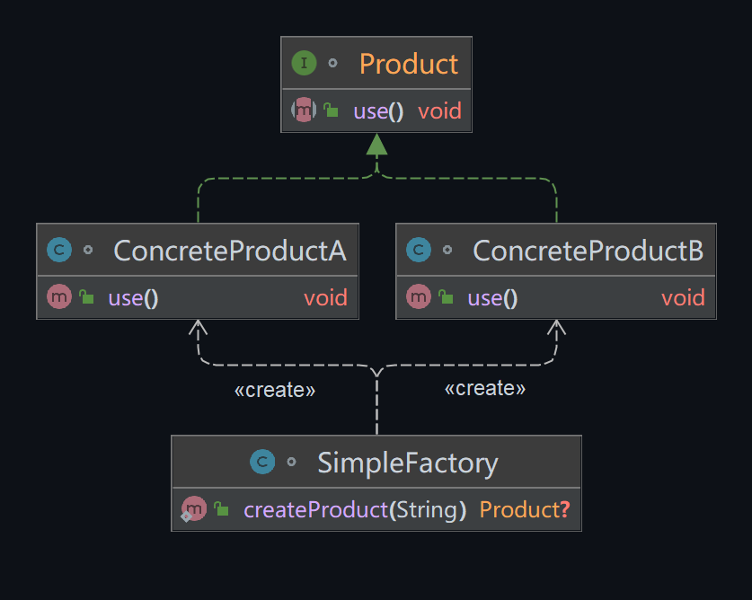

::: important 

首先明确一点，简单工厂模式并不属于 *GoF* 的23种设计模式之一。

这是因为，简单工厂模式中的工厂类职责相对过重，且当新产品加入时，需要修改工厂类，这违反了开闭原则。但是，简单工厂模式因其实现简单，使用方便，在实际开发中仍然被广泛使用。

:::

## 模式举例

在Java JDK中，`java.util.Calendar` 类就是使用了简单工厂模式。`Calendar` 类有一个静态方法 `getInstance()`，它根据当前的时区和语言环境返回一个日历。这个方法内部实际上是创建了 `GregorianCalendar` 的实例，但是用户并不需要知道这个细节，用户只需要知道这个方法会返回一个 `Calendar` 的实例。

## 模式定义

简单工厂模式（有时也称为**静态工厂方法**）在我们的日常编程中非常常见，它主要用于创建对象。当我们需要创建某个类的对象，但是又不希望直接使用new操作符来创建时，就可以使用简单工厂模式。

::: tip 定义

简单工厂模式，就是**将产品的创建过程封装在一个工厂类中**，把创建对象的流程集中在这个工厂类里面。

:::

在没有**工厂类**之前，客户端一般会使用`new`关键字来直接创建产品对象。引入工厂类之后，客户端可以通过调用工厂类的静态方法得到产品对象。简单工厂模式的要点在于：当你需要什么，只需要传入一个正确的参数，就可以获取你所需要的对象，而无须知道其创建细节。


## 角色分析



在简单工厂模式中，主要有两个角色：

1. **工厂（Factory）**：负责创建产品的类。根据传入的参数，决定创建出哪一种产品类的实例。
2. **产品（Product）**：工厂类创建的对象的接口。

## 示例代码

```java
// 定义产品接口
interface Product {
    void use();
}

// 具体的产品A
class ConcreteProductA implements Product {
    public void use() {
        System.out.println("Using product A");
    }
}

// 具体的产品B
class ConcreteProductB implements Product {
    public void use() {
        System.out.println("Using product B");
    }
}

// 工厂类
class SimpleFactory {
    public static Product createProduct(String type) {
        if ("A".equals(type)) {
            return new ConcreteProductA();
        } else if ("B".equals(type)) {
            return new ConcreteProductB();
        }
        return null;
    }
}

public class Main {
    public static void main(String[] args) {
        Product productA = SimpleFactory.createProduct("A");
        if (productA != null) {
            productA.use();
        }

        Product productB = SimpleFactory.createProduct("B");
        if (productB != null) {
            productB.use();
        }
    }
}
```

## 模式总结

简单工厂模式是一种简单的创建型设计模式，它可以根据传入的参数决定创建出哪一种产品类的实例，客户端无需知道具体的产品类，只需要知道产品的接口或者抽象类即可。

但是，这种模式的缺点是当产品种类非常多时，工厂类的职责过重，且不易于扩展，违反了开闭原则。一旦添加新产品就不得不修改工厂类的逻辑（修改那个静态方法），在产品类型较多时，有可能造成工厂逻辑过于复杂，不利于系统的扩展和维护。