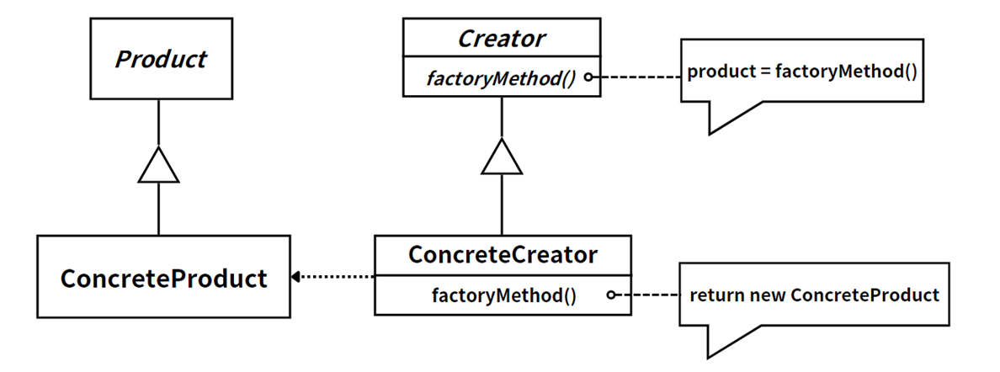
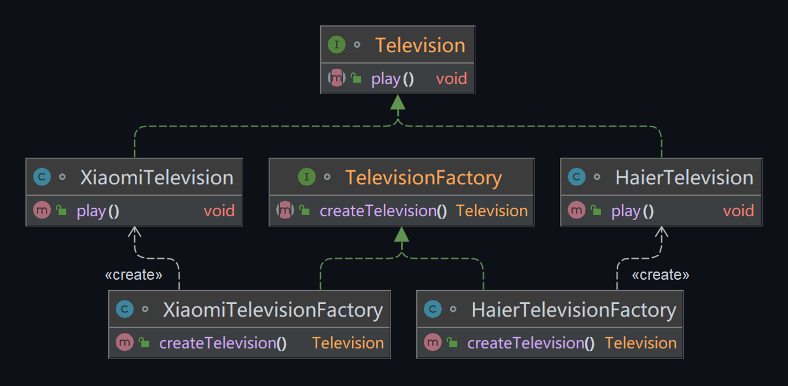

## 模式举例

在JDBC中，`DriverManager`类的`getConnection()`方法是一个工厂方法，它根据传入的URL、用户名和密码返回一个`java.sql.Connection`的实例。这个`Connection`实例实际上是由注册到`DriverManager`的数据库驱动提供的。

当我们调用`DriverManager.getConnection()`方法时，`DriverManager`会遍历它知道的所有数据库驱动，询问它们是否能处理传入的URL。第一个能处理该URL的驱动就会被用来创建`Connection`实例。

例如，如果我们传入的URL是`"jdbc:mysql://localhost:3306/mydb"`，那么`DriverManager`就会选择MySQL的驱动来创建`Connection`实例。如果URL是`"jdbc:postgresql://localhost:5432/mydb"`，那么就会选择PostgreSQL的驱动。

这就是为什么我们需要在使用`DriverManager`之前注册数据库驱动的原因。在早期的JDBC版本中，我们需要显式地注册驱动，例如`Class.forName("com.mysql.jdbc.Driver")`。但在现代的JDBC版本中，由于服务提供者接口（SPI）的存在，只要驱动在类路径中，它就会被自动注册。

## 模式定义

工厂方法（Factory Method）模式，引入了抽象工厂和具体工厂的概念，每个具体工厂只负责创建一个具体产品（重写抽象工厂定义的抽象方法），这样，我们在添加新产品类时只需要添加新的工厂类，而无需修改原来工厂类的代码。这就使得产品的生产更加灵活，支持扩展，符合开闭原则。

::: tip 定义

工厂方法模式（Factory Method），定义一个用于创建对象的接口，**让子类决定实例化哪一个类**，该模式使一个**类的实例化延迟到其子类完成**。

:::

上一节我们提到的简单工厂模式，只有一个工厂类，负责创建所有产品。如果添加了新的产品，就需要修改工厂类的代码。而工厂方法模式，则通过定义工厂接口和具体工厂类来解决这个问题。在工厂方法模式中，每个具体工厂类只负责创建一种产品，当需要添加新的产品时，只需要添加相应的具体工厂类，无需修改已有的工厂类代码。

例如，如果我们有一个产品接口`Product`和两个具体产品`ProductA`和`ProductB`，在简单工厂模式中，我们可能有一个`Factory`类，它有一个`createProduct(String type)`方法，根据`type`的不同创建不同的产品。如果我们要添加一个新的产品`ProductC`，就需要修改`Factory`类的`createProduct`方法。

而在工厂方法模式中，我们会有一个`Factory`接口和两个具体工厂类`FactoryA`和`FactoryB`，`FactoryA`负责创建`ProductA`，`FactoryB`负责创建`ProductB`。如果我们要添加一个新的产品`ProductC`，只需要添加一个新的具体工厂类`FactoryC`，无需修改已有的工厂类代码。

## 角色分析



工厂方法模式有四个角色：

- 抽象工厂 `Creator`：**定义抽象工厂方法，用于创建产品对象**。
- 抽象产品 `Product`：**描述产品的通用行为**。
- 具体工厂 `ConcreteCreator`：**实现了抽象工厂中的抽象方法，创建具体的产品**。
- 具体产品 `ConcreteProduct`：**具体的产品，是工厂创建的真正对象**。

## 示例代码

```java
// 抽象产品 - 电视机
interface Television {
    void play();
}

// 具体产品 - 海尔电视机
class HaierTelevision implements Television {
    public void play() {
        System.out.println("Playing Haier Television");
    }
}

// 具体产品 - 小米电视机
class XiaomiTelevision implements Television {
    public void play() {
        System.out.println("Playing Xiaomi Television");
    }
}

// 抽象工厂 - 电视机工厂
interface TelevisionFactory {
    Television createTelevision();
}

// 具体工厂 - 海尔电视机工厂
class HaierTelevisionFactory implements TelevisionFactory {
    public Television createTelevision() {
        return new HaierTelevision();
    }
}

// 具体工厂 - 小米电视机工厂
class XiaomiTelevisionFactory implements TelevisionFactory {
    public Television createTelevision() {
        return new XiaomiTelevision();
    }
}

// 客户端代码
public class Client {
    public static void main(String[] args) {
        TelevisionFactory haierFactory = new HaierTelevisionFactory();
        Television haierTelevision = haierFactory.createTelevision();
        haierTelevision.play();

        TelevisionFactory xiaomiFactory = new XiaomiTelevisionFactory();
        Television xiaomiTelevision = xiaomiFactory.createTelevision();
        xiaomiTelevision.play();
    }
}
```

运行结果：

```
Playing Haier Television
Playing Xiaomi Television
```




## 模式总结

> “在工厂方法模式中，父类决定实例的生成方式，但并不决定所要生成的具体的类，具体的处理全部交给子类负责。将生成实例的框架（framework）和实际负责生成实例的类进行解耦”。

我们总结一下，对于工厂方法模式来说，它就是封装一个创建对象的抽象类（或者说接口），由该抽象类的子类来决定实例化哪一个产品类，因此我们说工厂方法模式将类的实例化延迟到子类中完成。产品类可以有很多个，作为客户端（调用者）来说，只需调用工厂方法返回产品即可（我要什么你就给我什么）。