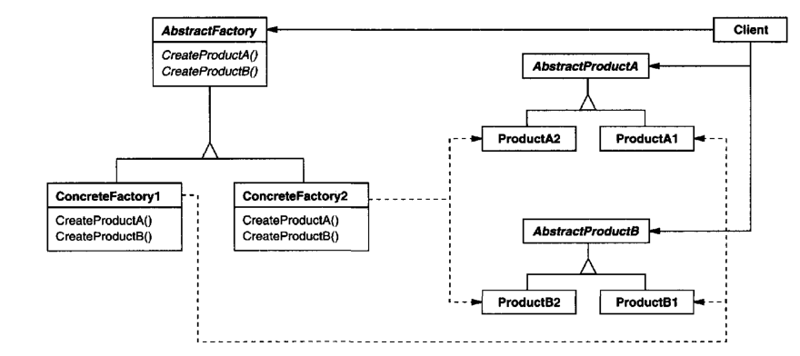
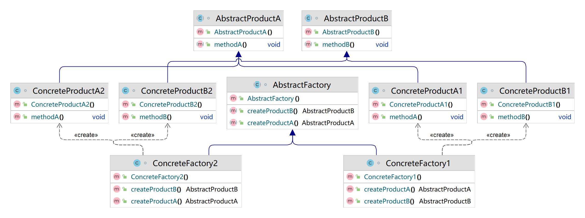

## 模式举例

`java.sql.Connection` 是一个抽象工厂。它返回不同的抽象产品，如 `Statement`、`PreparedStatement`、`CallableStatement`等。这些产品都是抽象的，具体的实现由数据库驱动提供。这样，JDBC API可以与多种数据库驱动一起工作，而不需要改变API的代码。

## 模式定义

在工厂方法模式中，每个具体工厂只负责创建**单一的**具体产品。有时，我们需要一个工厂可以提供多个产品对象，而不是单一的产品对象。但如果有多类产品呢？

::: tip 定义

抽象工厂模式（Abstract Factory Pattern），**提供一个创建一系列相关或相互依赖对象的接口，而无需指定它们具体的类**。

:::

抽象工厂模式属于对象创建型设计模式。它提供了一种方式，可以将一组具有同一主题的单独但相关/依赖的工厂封装起来，而客户端不需要知道它从这些内部工厂中获取的对象是如何创建的。简单来说，**抽象工厂模式可以确保⼀系列相关的产品被⼀起创建，这些产品能够相互配合使⽤**。

## 角色分析

抽象工厂模式包含⼀个抽象工厂接口，多个具体工厂，多个抽象产品接口，多个具体产品类，其中每个具体工厂负责创建⼀组相关的产品。 



抽象工厂模式的主要组件：

1. **抽象产品（`AbstractProduct`）**：这是一个产品家族，声明了产品的主要特性和行为，可定义多个抽象产品接口。
2. **具体产品（`ConcreteProduct`）**：这些类实现了抽象产品的接口，以生成具体的产品。
3. **抽象工厂（`AbstractFactory`）**：这是一个接口，声明了创建抽象产品的方法，每个方法对应一个产品。
4. **具体工厂（`ConcreteFactory`）**：这些类实现了抽象工厂的创建方法，以生成具体的产品。

在抽象工厂模式中，客户端通过抽象工厂接口创建产品，而无需知道实际的产品类。这样，客户端可以从具体工厂中独立出来，只需要与抽象工厂和产品接口交互。这使得系统在不修改客户端代码的情况下，可以更换或添加新的产品或产品家族。

## 代码示例

```java
abstract class AbstractProductA {  //角色1：抽象产品（电视）
    public abstract void methodA();  //播放
}

class ConcreteProductA1 extends AbstractProductA {  //角色2：具体产品（如海尔电视）
    @Override
    public void methodA() {
        System.out.println("海尔电视机播放中......");
    }
}

class ConcreteProductA2 extends AbstractProductA {  //角色2：具体产品（如TCL电视）
    @Override
    public void methodA() {
        System.out.println("TCL电视机播放中......");
    }
}

abstract class AbstractProductB {   //角色1：抽象产品（空调）
    public abstract void methodB();  //调温
}

class ConcreteProductB1 extends AbstractProductB {  //角色2：具体产品（如海尔空调）
	@Override
    public void methodB() {
        System.out.println("海尔空调温度改变中......");
    }
}

class ConcreteProductB2 extends AbstractProductB {  //角色2：具体产品（TCL空调）
	@Override
    public void methodB() {
        System.out.println("TCL空调温度改变中......");
    }
}

abstract class AbstractFactory { //角色3：抽象工厂
    public abstract AbstractProductA createProductA(); //生产电视
    public abstract AbstractProductB createProductB(); //生产空调
}

class ConcreteFactory1 extends AbstractFactory {   //角色4：具体工厂（海尔）
    @Override
    public AbstractProductA createProductA() {
        System.out.println("海尔工厂生产海尔电视机");
        return new ConcreteProductA1();
    }

    @Override
    public AbstractProductB createProductB() {
        System.out.println("海尔工厂生产海尔空调");
        return new ConcreteProductB1();
    }
}

class ConcreteFactory2 extends AbstractFactory {  //角色4：具体工厂（TCL）
    @Override
    public AbstractProductA createProductA() {
        System.out.println("TCL工厂生产TCL电视机");
        return new ConcreteProductA2();
    }
    @Override
    public AbstractProductB createProductB() {
        System.out.println("TCL工厂生产TCL空调");
        return new ConcreteProductB2();
    }
}

public class Client {   //客户端
    public static void main(String args[]) {
        // 创建海尔工厂
        AbstractFactory haierFactory = new ConcreteFactory1();
        // 使用海尔工厂创建产品
        AbstractProductA haierTV = haierFactory.createProductA();
        AbstractProductB haierAirConditioner = haierFactory.createProductB();
        // 使用海尔产品
        haierTV.methodA();
        haierAirConditioner.methodB();

        // 创建TCL工厂
        AbstractFactory tclFactory = new ConcreteFactory2();
        // 使用TCL工厂创建产品
        AbstractProductA tclTV = tclFactory.createProductA();
        AbstractProductB tclAirConditioner = tclFactory.createProductB();
        // 使用TCL产品
        tclTV.methodA();
        tclAirConditioner.methodB();
    }
}
```

运行结果：

```java
海尔工厂生产海尔电视机
海尔工厂生产海尔空调
海尔电视机播放中......
海尔空调温度改变中......
TCL工厂生产TCL电视机
TCL工厂生产TCL空调
TCL电视机播放中......
TCL空调温度改变中......
```

类图：



后续如何扩展？

举个栗子，比如增加索尼工厂：

```java
class ConcreteProductA3 extends AbstractProductA {  //角色2：具体产品（Sony电视）
    @Override
    public void methodA() {
        System.out.println("Sony电视机播放中......");
    }
}

class ConcreteProductB3 extends AbstractProductB {  //角色2：具体产品（Sony空调）
	@Override
    public void methodB() {
        System.out.println("Sony空调温度改变中......");
    }
}

class ConcreteFactory3 extends AbstractFactory {   //角色4：具体工厂（Sony）
    @Override
    public AbstractProductA createProductA() {
        System.out.println("Sony工厂生产Sony电视机");
        return new ConcreteProductA3();
    }
    @Override
    public AbstractProductB createProductB() {
        System.out.println("Sony工厂生产Sony空调");
        return new ConcreteProductB3();
    }
}
```

## 模式总结

前面我们提到过的工厂方法模式，是定义了一个创建对象的接口，但由子类决定实例化哪一个类。工厂方法让类的实例化推迟到子类。而抽象工厂模式，则是提供一个接口，用于创建相关或依赖对象的家族，而不需要明确指定具体类。抽象工厂模式允许客户端使用抽象的接口，从而可以操作一组相关的产品，而不需要知道或关心实际生产这些产品的具体类。

抽象工厂模式适用于以下场景：

1. **产品族和产品等级结构**：当一个系统需要提供多个产品系列，每个产品系列包含多个相关的产品，而系统只需要使用其中某一系列的产品时，可以使用抽象工厂模式。例如，一个家具工厂可能生产椅子、桌子和沙发，这些产品可以按照风格（现代、古典）或材料（木制、塑料）进行分类。

2. **系统需要独立于其产品的创建、组合和表示**：当一个系统需要与具体产品类解耦，以便在不修改客户端代码的情况下更换或添加新的产品或产品系列时，可以使用抽象工厂模式。

3. **强调一系列相关产品的接口**：当你想强调一系列相关产品的接口以便于共享产品实现时，可以使用抽象工厂模式。

4. **提供一个产品库**：当你想提供一个产品类库，而只想显示它们的接口而不是实现时，可以使用抽象工厂模式。