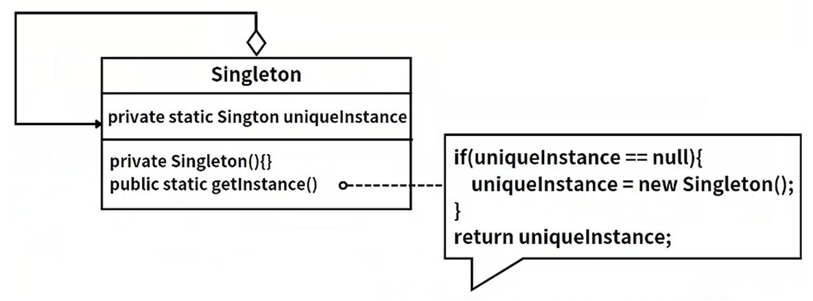

## 模式举例

Spring框架中的Bean默认都是单例的。当我们在Spring配置文件中定义一个Bean时，Spring容器会在启动时立即创建该Bean的实例。然后，每次通过`ApplicationContext.getBean()`方法获取该Bean时，都会返回同一个实例。

## 模式定义

在开发中可能有这样一些特殊的类，必须保证它们在系统中只存在一个实例，每次使用该类时，必须使用同一个实例。这样的类称为单例类，而这种设计模式称为单例设计模式，属于创建型模式。

::: tip 定义

单例模式（Singleton Pattern），**确保一个类只有一个实例，并提供一个全局访问点来访问这个唯一实例**。

:::

单例模式主要用于那些在系统中只需要一个实例对象的场景，例如配置管理器，线程池，缓存，日志对象等。这种模式可以保证系统中一个类只有一个实例而且该实例易于被外界访问，从而方便对实例个数的控制并节约系统资源。

## 角色分析

在单例模式中，只存在一个角色：

- 单例（Singleton）：包含一个实例且能自行创建这个实例的类。

掌握单例模式只需记住三个要点：

- **提供私有的构造方法**：保证类的外部无法使用`new`来创建实例。
- **提供一个静态私有成员变量**：保存类的唯一实例。
- **提供一个公有的静态方法**：用于外界获取单例类的实例对象。

这三个要点确保了系统内只有一个该类的实例，并且这个实例易于被外部访问。

类图如下：



## 示例代码

以下是几种常见的单例模式实现：

1. **饿汉式**：

```java
public class Singleton {
    private static Singleton instance = new Singleton();

    private Singleton() {}

    public static Singleton getInstance() {
        return instance;
    }
}
```

2. **懒汉式**：

```java
public class Singleton {
    private static Singleton instance;

    private Singleton() {}

    public static synchronized Singleton getInstance() {
        if (instance == null) {
            instance = new Singleton();
        }
        return instance;
    }
}
```

3. **双重检测锁**：

```java
public class Singleton {
    private volatile static Singleton instance;

    private Singleton() {}

    public static Singleton getInstance() {
        if (instance == null) {
            synchronized (Singleton.class) {
                if (instance == null) {
                    instance = new Singleton();
                }
            }
        }
        return instance;
    }
}
```

4. **静态内部类实现方式**：

```java
public class Singleton {
    private static class SingletonHolder {
        private static final Singleton INSTANCE = new Singleton();
    }

    private Singleton() {}

    public static Singleton getInstance() {
        return SingletonHolder.INSTANCE;
    }
}
```


## 模式总结

单例模式主要解决的是资源共享和控制访问的问题。在某些场景下，我们需要确保某个类只有一个实例，以便所有的其他对象都能访问这个实例，而不是各自拥有一个实例。这样可以保证数据在多个实例间的同步，并且可以节省系统资源。

需要注意的是，单例模式并不适合所有的场景。如果实例化的对象占用的资源少，且不需要频繁访问，那么单例模式没有带来大的优势，反而可能会导致过度设计。