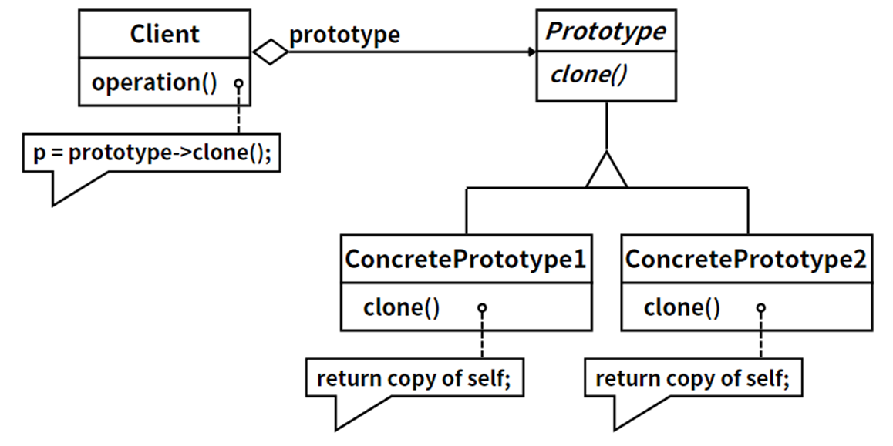
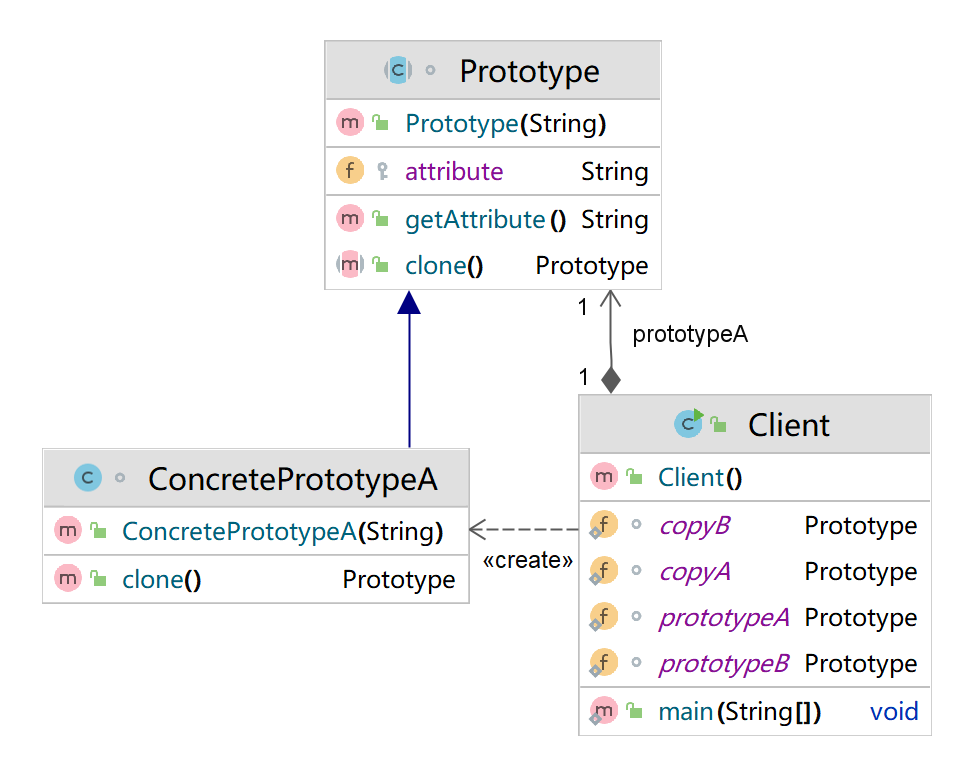

## 模式举例

Java 的 `java.lang.Object` 类中定义了一个 `clone()` 方法，它是一个原生方法。这提供了对象复制的能力，但是这个方法是 protected 的，所以如果一个类没有实现 `Cloneable` 接口并重写 `clone()` 方法，那么我们不能直接调用这个类的 `clone()` 方法。Java 的集合类，如 `ArrayList`，`HashSet` 等，都实现了 `Cloneable` 接口并重写了 `clone()` 方法，这使得我们可以方便地复制一个集合。

## 模式定义

在开发中，有些对象的创建过程较为复杂（比如需要经过⼀系列的计算和资源消耗），而且有时候需要频繁创建，原型模式通过给出一个原型对象来指明所要创建的对象的类型，然后用复制这个原型对象的办法创建出更多同类型的对象，不必关心具体的创建细节，可以降低对象创建的成本。

::: tip 定义

**原型模式（Prototype Pattern）**，采用原型实例指定创建对象的种类，并且通过拷贝这些原型创建新的对象。原型模式允许一个对象再创建另外一个可定制的对象，无需知道任何创建的细节。

::: 

原型模式是一种创建型设计模式，它使用复制（克隆）的方式来创建对象，而不是通过新建类的实例。说白了，原型模式复制已有对象，提高相同类型对象的创建效率。客户类需要一个与某个对象相同的对象，它通过调用原型类的克隆方法来复制新的对象，而无需知道具体的类型。客户类不需要直接创建对象，而是请求原型类复制一个原型实例。

> **注意：**
>
> 克隆复制的对象与原对象不共享内存，是完全独立的，修改克隆对象不会影响原对象，但如果对象内部有引用类型属性，需要注意深浅拷贝的问题。

## 角色分析



原型模式主要包含两种角色：

1. **抽象原型类（`Prototype`）**：这是一个接口或抽象类，定义了复制自身的方法 `clone()`。
2. **具体原型类（`ConcretePrototype`）**：实现或继承了抽象原型类，重写了 `clone()` 方法，用于创建新的对象实例。

> 原型模式是一种创建型设计模式，它允许通过复制现有的对象实例来创建新的对象，而不是通过新建方式。在这个模式中，客户端直接与原型对象关联，并通过调用原型对象的 `clone()` 方法来创建新的对象实例。这种模式广泛应用于各种软件的复制、粘贴功能中。在Java语言中，所有类都继承自 `java.lang.Object`，并且 `Object` 类提供了一个 `clone()` 方法，用于复制对象。如果一个类实现了 `Cloneable` 接口，那么就表示这个类支持复制。值得注意的是，使用 `clone()` 方法复制对象通常比使用 `new` 运算符创建新对象更高效，也更具有扩展性。

## 示例代码

```java
/*
 * 原型模式用于复制已有对象，以提高相同类型对象的创建效率。
 * 角色1：抽象原型类Prototype，定义克隆原型对象的抽象方法。
 * 角色2：具体原型类ConcretePrototype，作为Prototype的子类，重写抽象方法。
 * 要点：Client关联Prototype。
 * 注意：通过克隆方法创建的对象是全新的对象，在内存中拥有新的地址。
 * 本例是通用实现方法。
 */
abstract class Prototype {  //角色1：抽象原型类Prototype
    protected String attribute;  //属性

    public Prototype(String attribute) { //构造器
        this.attribute = attribute;
    }

    public String getAttribute() {  //getter方法
        return attribute;
    }

    public abstract Prototype clone();  //抽象的克隆方法
}

class ConcretePrototypeA extends Prototype {  //角色2：具体原型类
    public ConcretePrototypeA(String attribute) {  //构造器
        super(attribute);  //调用父类的构造器
    }

    @Override
    public Prototype clone() {  //重写抽象的克隆方法
        //创建一个原型对象
        Prototype prototype = new ConcretePrototypeA(getAttribute());
        return prototype;  //返回一个原型对象
    }
}

class ConcretePrototypeB extends Prototype {
    public ConcretePrototypeB(String attribute) {
        super(attribute);
    }

    @Override
    public Prototype clone() {
        Prototype prototype = new ConcretePrototypeB(getAttribute());
        return prototype;
    }
}

public class Client {
    static Prototype prototypeA, copyA;  //Client关联prototype
    static Prototype prototypeB, copyB;

    public static void main(String[] args) {
        prototypeA = new ConcretePrototypeA("原型对象A");
        copyA = prototypeA.clone();  //克隆原型对象
        System.out.println("原型对象：" + prototypeA.getAttribute());
        System.out.println("克隆对象：" + copyA.getAttribute());

        prototypeB = new ConcretePrototypeB("原型对象B");
        copyB = prototypeB.clone();
        System.out.println("原型对象：" + prototypeB.getAttribute());
        System.out.println("克隆对象：" + copyB.getAttribute());
    }
}
```

类图：



原型模式的通用实现方式是在抽象方法里使用`new`运算符创建原型对象，将相关参数传入新建的原型对象后再返回。通过克隆方法创建的对象是全新的对象，在内存中拥有新的地址。

原型模式的专用实现方式使用Java语言中顶级对象`Object`定义的克隆方法`clone()`和不含任何抽象方法的克隆接口`java.lang.Cloneable`。

## 浅拷贝和深拷贝

上面讲了，原型模式通过复制一个已有实例来简化对象的创建过程，实际上这种复制分为深拷贝和浅拷贝。

**浅拷贝（Shallow Copy）**：创建一个新对象，然后将当前对象的非静态字段复制到该新对象。如果字段是值类型的，则对该字段执行逐位复制。如果字段是引用类型的，则复制引用但不复制引用的对象。因此，原始对象及其副本引用同一对象。浅拷贝在处理复杂对象（如类、数组等）时，只复制对象本身和对象中的值类型字段，不复制对象的引用字段。

**深拷贝（Deep Copy）**：创建一个新对象，然后将当前对象的非静态字段复制到该新对象，无论字段是值类型的还是引用类型的，都会创建一个新的副本。对于引用类型的字段，深拷贝会递归地复制其所引用的对象，直到整个对象图都被复制。深拷贝在处理复杂对象时，既复制对象本身，也复制对象中的引用类型字段。

浅拷贝和深拷贝的主要区别在于是否支持引用类型的复制，浅拷贝不支持，而深拷贝支持。在Java中，可以通过实现`Cloneable`接口和重写`clone`方法来实现浅拷贝，通过序列化（`Serializable`）可以实现深拷贝。

> 被复制对象的属性值与原型对象相同的属性值相同。如果原型对象包含引用类型的对象作为成员，则克隆对象的引用类型仍然指向原来的对象，这种方式称之为浅克隆。浅克隆仅仅复制值类型（如char、int和double等类型）的成员变量，而不复制引用类型（如class、interface和数组等）的对象。
>
> 也就是说，其中的引用类型的成员并不复制（特殊的String类型除外）。浅克隆存在的问题是，当修改克隆对象的引用类型的成员变量的属性时，原型对象也会相应地改变，即浅克隆对象与原型对象不是真正独立。原型对象除了它本身被复制外，它所包含的所有成员变量也将被复制，这种克隆称之为深克隆。当原型对象的成员变量是引用类型时，需要对它再做一次克隆。

## 模式总结

很多软件提供的复制、粘贴功能都是原型模式的应用。原型模式用以实现**类型相同、内存地址不同**的对象复制。原型模式通过**复制一个已有实例**简化对象的创建过程。

因此，原型模式适用于以下场景：

1. 类初始化消耗资源较多，如数据、硬件资源等。
2. 系统需要大量体积小、类相似的对象时。
3. 需要避免创建一个与产品类层次平行的工厂类层次时。