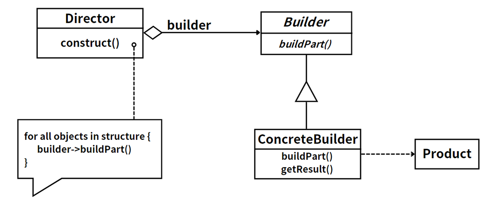

## 模式举例

在 *Java* 中，`StringBuilder`类就是使用了建造者模式。`StringBuilder`提供了一种可变的字符序列，我们可以通过`append()`方法来添加字符或者字符串，最后通过`toString()`方法来获取最终构建的字符串。这种方式就是典型的建造者模式，我们可以分步骤地构建一个复杂的字符串对象。

在 *Java 8* 中，`Stream API`也使用了建造者模式。我们可以通过一系列的方法（如`filter`、`map`等）来对集合进行操作，每个方法都返回一个新的`Stream`对象，这些方法就像是在构建一个处理流程。最后，我们可以通过一个终止操作（如`collect`、`forEach`等）来获取处理结果。这种方式也是典型的建造者模式，我们可以分步骤地构建一个复杂的数据处理流程。

## 模式定义

建造者模式主要用于“分步骤构建一个复杂的对象”。在这种类型的设计模式中，构建算法是独立于部件的创建和组装方式的。构建和组装部件的步骤对于客户端是透明的。

::: tip 定义

建造者模式（Builder Pattern），**将一个复杂对象的构建与它的表示分离，使得同样的构建过程可以创建不同的表示**。

:::

建造者模式允许用户只通过指定复杂对象的类型和内容就可以构建它们，而无需关心内部的具体构建细节。他将对象的构建（由Builder负责）和装配（由Director负责）过程分离，实现了建造和装配的解耦，从而可以创建出复杂的对象。通过使用不同的建造器和装配方式，可以创建出不同的对象或产品。此外，建造者模式还有助于实现代码的复用。

## 角色分析



建造者模式包含以下四个角色：

1. **产品（`Product`）**：复杂对象，包含多个部分，这些部分可以按照一定的步骤和过程组合在一起。产品类定义了组成字段及其setter/getter方法。
2. **抽象建造者（`Builder`）**：接口，定义了创建产品各个部分的抽象方法。
3. **具体建造者（`ConcreteBuilder`）**：抽象建造者的实现类，它重写了基类的抽象方法，负责构造和装配产品的各个部分，并定义了获取完整产品的方法。具体建造者与产品类形成创建依赖关系。
4. **指挥者（`Director`）**：一个负责控制复杂产品构建过程的类，它聚合了抽象建造者对象，通过调用建造者的方法来创建产品。

建造者模式的主要优点是将复杂对象的构建与表示分离，使得同样的构建过程可以创建不同的表示，增加了系统的灵活性。同时，它隐藏了产品内部的构建细节，对外提供统一的创建接口，简化了使用者的使用。

## 示例代码

### （1）经典写法

```java
// Product
class Product {
    private String partA;
    private String partB;

    public void setPartA(String partA) {
        this.partA = partA;
    }

    public void setPartB(String partB) {
        this.partB = partB;
    }

    @Override
    public String toString() {
        return "Product{" +
                "partA='" + partA + '\'' +
                ", partB='" + partB + '\'' +
                '}';
    }
}

// Builder
interface Builder {
    void buildPartA();
    void buildPartB();
    Product getResult();
}

// ConcreteBuilder
class ConcreteBuilder implements Builder {
    private Product product = new Product();

    public void buildPartA() {
        product.setPartA("Part A built");
    }

    public void buildPartB() {
        product.setPartB("Part B built");
    }

    public Product getResult() {
        return product;
    }
}

// Director
class Director {
    private Builder builder;

    public Director(Builder builder) {
        this.builder = builder;
    }

    public Product construct() {
        builder.buildPartA();
        builder.buildPartB();
        return builder.getResult();
    }
}

public class Client1 {
    public static void main(String[] args) {
        Builder builder = new ConcreteBuilder();
        Director director = new Director(builder);
        Product product = director.construct();
        System.out.println(product);
    }
}
```

### （2）流式写法

```java
// Product
class Product {
    private String partA;
    private String partB;

    public Product setPartA(String partA) {
        this.partA = partA;
        return this;
    }

    public Product setPartB(String partB) {
        this.partB = partB;
        return this;
    }

    @Override
    public String toString() {
        return "Product{" +
                "partA='" + partA + '\'' +
                ", partB='" + partB + '\'' +
                '}';
    }
}

// Builder
interface Builder {
    Builder buildPartA(String partA);
    Builder buildPartB(String partB);
    Product getResult();
}

// ConcreteBuilder
class ConcreteBuilder implements Builder {
    private Product product = new Product();

    public Builder buildPartA(String partA) {
        product.setPartA(partA);
        return this;
    }

    public Builder buildPartB(String partB) {
        product.setPartB(partB);
        return this;
    }

    public Product getResult() {
        return product;
    }
}

// Director
class Director {
    private Builder builder;

    public Director withBuilder(Builder builder) {
        this.builder = builder;
        return this;
    }

    public Product construct() {
        return builder.getResult();
    }
}

public class Client2 {
    public static void main(String[] args) {
        Product product = new Director()
            .withBuilder(new ConcreteBuilder()
                .buildPartA("Part A built")
                .buildPartB("Part B built"))
            .construct();
        System.out.println(product);
    }
}
```

## 模式总结

在建造者模式中，产品是需要建造的复杂对象，包含多个组成部分。抽象建造者定义了创建产品各个部分的方法。具体建造者实现了抽象建造者的方法，提供具体的实现。指挥者负责调用建造者的方法来创建产品，管理建造过程。

建造者模式分离了对象子组件的单独建造（由`Builder`负责）和装配（由`Director`负责），从而可以建造出复杂的对象，实现了建造和装配的解耦。