## 创建型

### [工厂方法模式](./创建型模式/2_工厂方法.md)

::: tip 定义

定义一个用于创建对象的接口，让子类决定实例化哪一个类，将类的实例化操作延迟到子类中完成。

:::

### [抽象工厂模式](./创建型模式/3_抽象工厂.md)

::: tip 定义

提供一个创建一系列相关或相互依赖对象的接口，而无需指定它们具体的类。

:::

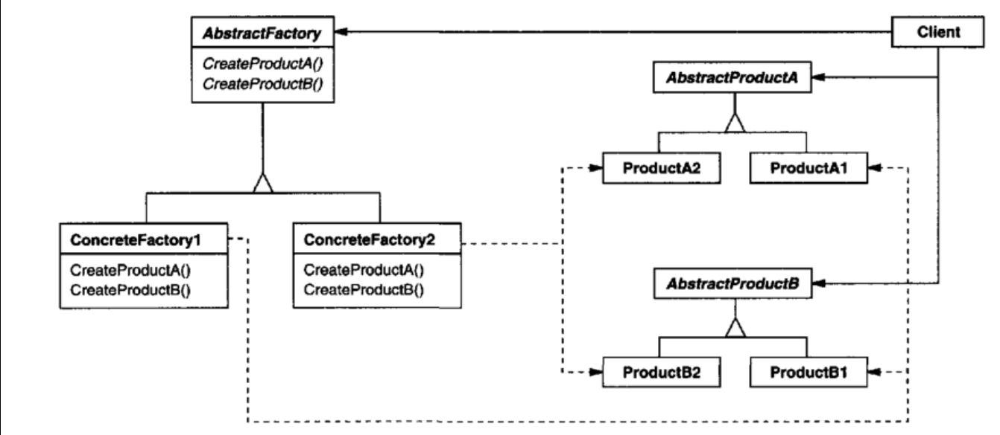

### [单例模式](./创建型模式/4_单例.md)

::: tip 定义

确保一个类只有一个实例，并提供一个全局访问点来访问这个唯一实例。

:::

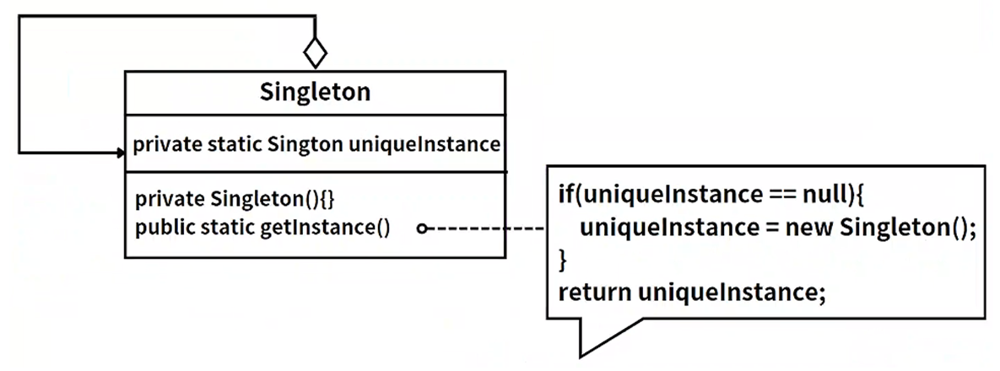

### [原型模式](./创建型模式/5_原型.md)

::: tip 定义

采用原型实例指定创建对象的种类，并且通过拷贝这些原型创建新的对象。原型模式允许一个对象再创建另外一个可定制的对象，无需知道任何创建的细节。

:::

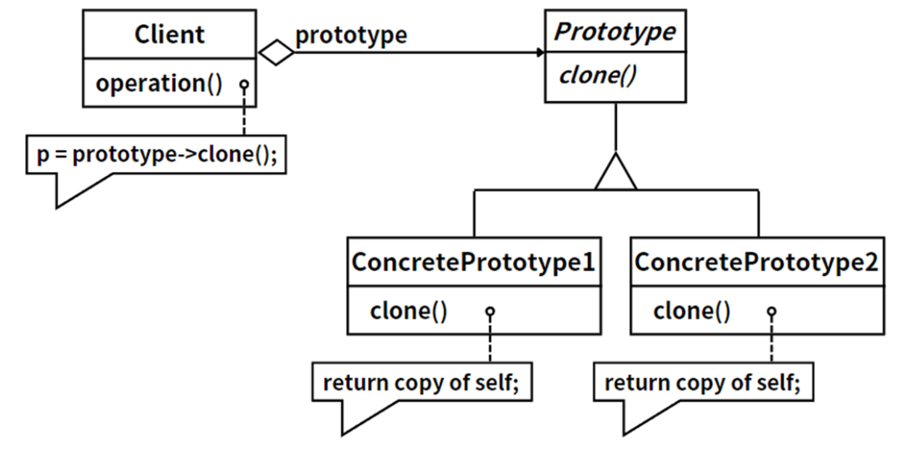

### [建造者模式](./创建型模式/6_建造者.md)

::: tip 定义

将一个复杂对象的构建与它的表示分离，使得同样的构建过程可以创建不同的表示。

:::

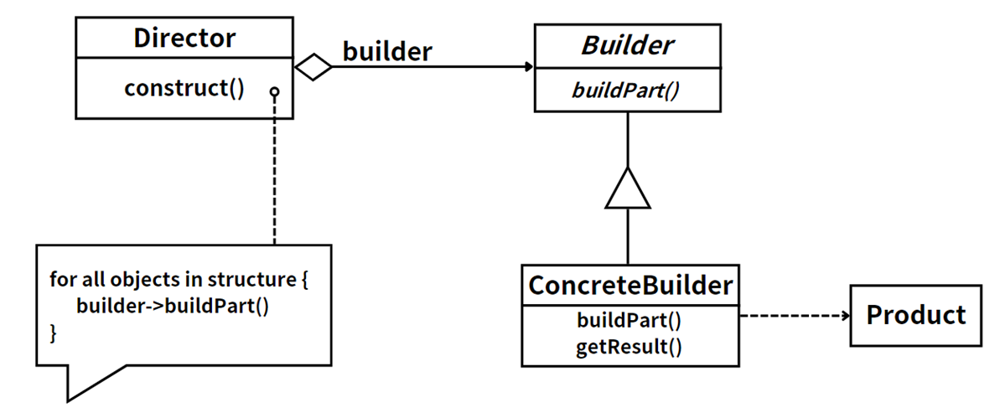

## 结构型模式

### [外观模式](./结构型模式/01_外观模式)

::: tip 定义

外部与一个子系统的通信必须通过一个统一的外观对象进行，为子系统中的一组接口提供一个一致的界面。

:::

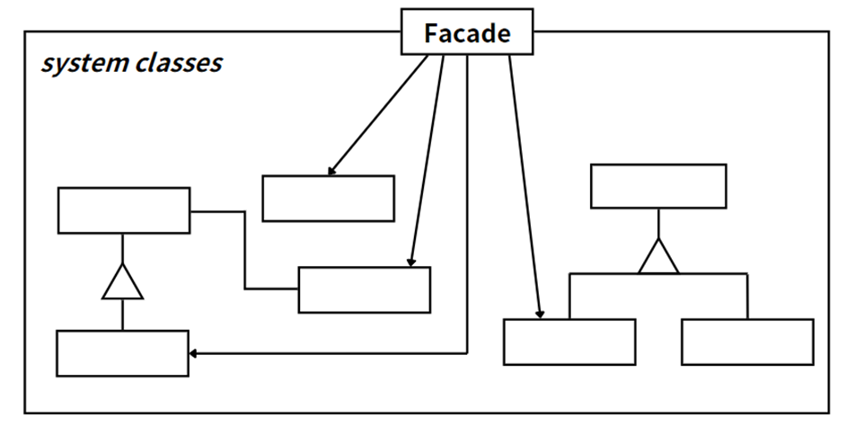

### [适配器模式](./结构型模式/02_适配器模式.md)

::: tip 定义

将一个接口转换成客户希望的另一个接口，适配器模式使接口不兼容的那些类可以一起工作。

:::

类适配器模式。

对象适配器模式。

### [组合模式](./结构型模式/03_组合模式.md)

::: tip 定义

组合多个对象形成树形结构，以表示具有部分—整体关系的层次结构。

:::

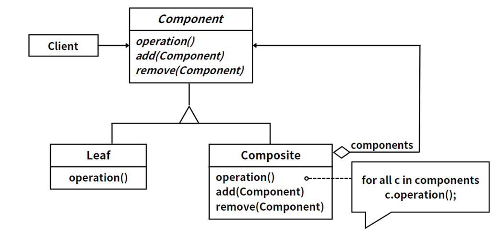

### [代理模式](./结构型模式/04_代理模式.md)

::: tip 定义

给某一个对象提供一个代理，并由代理对象控制对原对象的引用。

:::

### [桥接模式](./结构型模式/05_桥接模式.md)

::: tip

将抽象部分与它的实现部分分离，使它们都可以独立地变化。

:::

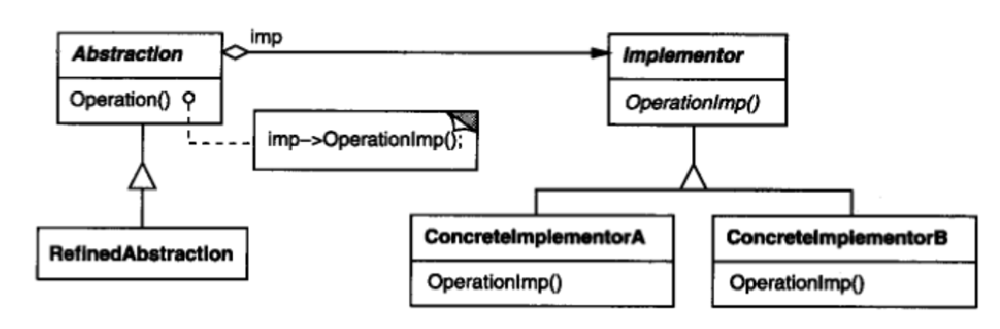

### [装饰模式](./结构型模式/06_装饰模式.md)

::: tip 定义

不改变原有对象的前提下，动态地给一个对象增加一些额外的功能。

:::

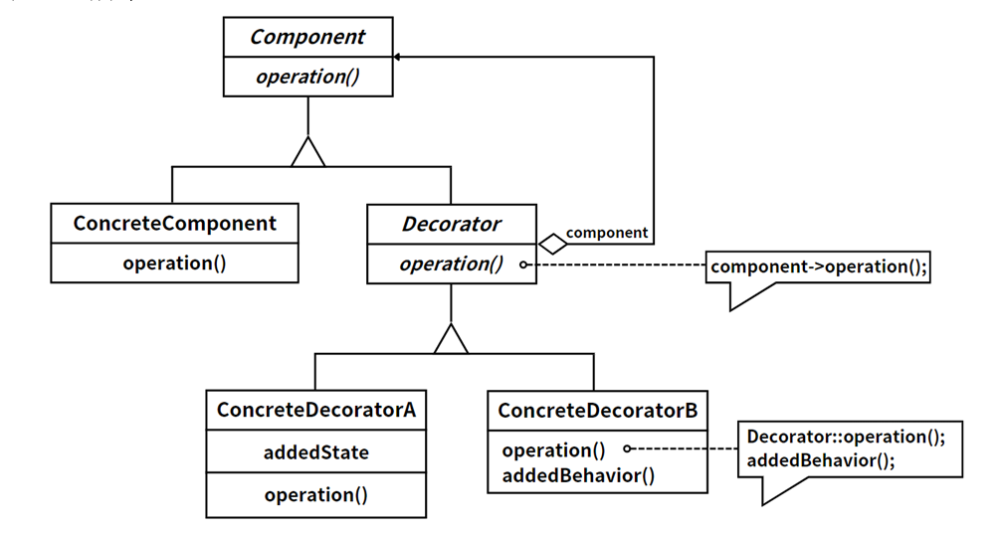

### [享元模式](./结构型模式/07_享元模式.md)

::: tip 定义

运用共享技术有效地支持大量细粒度对象的复用。

:::

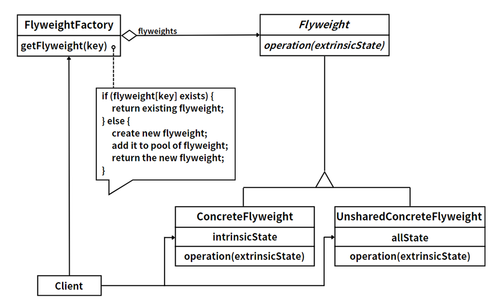

## 行为型模式

### [策略模式](./行为型模式/01_策略模式.md)

::: tip 定义

定义一系列算法，将每一个算法封装起来，并让它们可以相互替换。

:::

### [模板方法模式](./行为型模式/02_模板方法模式.md)

::: tip 定义

定义一个操作中算法的骨架，而将一些步骤延迟到子类中。

:::

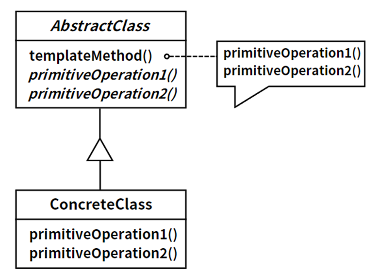

### [中介者模式](./行为型模式/03_中介者模式.md)

::: tip 定义

用一个中介对象来封装一系列的对象交互，使各对象不需要显式地相互引用，从而使其耦合松散。

:::

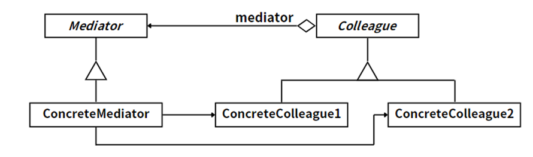

### [观察者模式](./行为型模式/04_观察者模式.md)

::: tip 定义

定义对象间的一种一对多的依赖关系，使得每当一个对象改变状态，则所有依赖于它的对象都会得到通知并自动更新。

:::

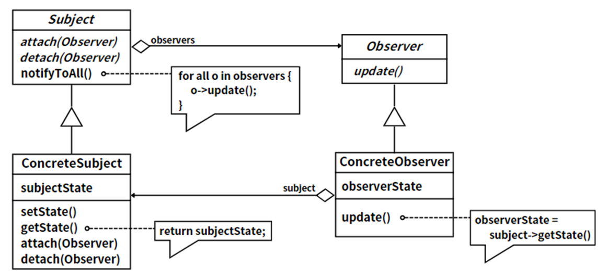

### [迭代器模式](./行为型模式/05_迭代器模式.md)

::: tip 定义

提供一种方法顺序访问一个聚合对象中的各个元素，而又不需要暴露该对象的内部表示。

:::

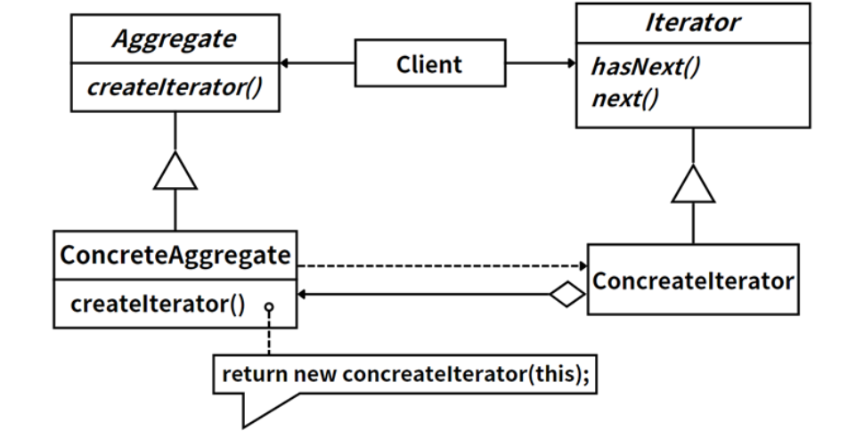

### [备忘录模式](./行为型模式/06_备忘录模式.md)

::: tip 定义

在不破坏封装性的前提下，捕获一个对象的内部状态，并在该对象之外保存这个状态，以便以后恢复该对象到之前的状态。

:::

### [状态模式](./行为型模式/07_状态模式.md)

::: tip 定义

允许一个对象在其内部状态改变时改变其行为，看起来对象好像修改了其类。

:::

### [命令模式](./行为型模式/08_命令模式.md)

::: tip 定义

将一个请求封装为一个对象，可以用不同的请求对客户进行参数化；对请求排队或记录请求日志，以及支持可撤销的操作。

:::

### [责任链模式](./行为型模式/09_责任链模式.md)

::: tip 定义

为解除请求的发送者和接收者之间的耦合，使多个对象都有机会处理这个请求，将这些对象连成一条链，并沿着这条链传递该请求，直到有一个对象处理它为止。

:::

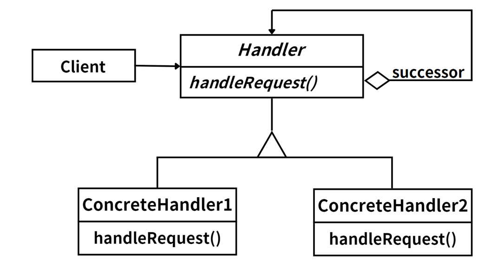

### [访问者模式](./行为型模式/10_访问者模式.md)

::: tip 定义

表示一个作用于某对象结构中的各元素的操作。它使您可以在不改变各元素的类的前提下定义作用于这些元素的新操作。

:::

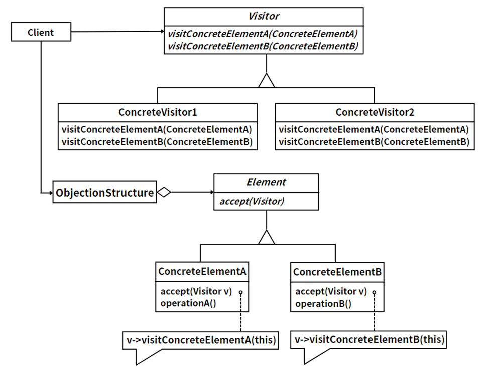

### [解释器模式](./行为型模式/11_解释器模式.md)

::: tip 定义

给定一种语言，定义它的文法的一种表示，并定义一个解释器，这个解释器使用该表示来解释语言中的句子。

:::

