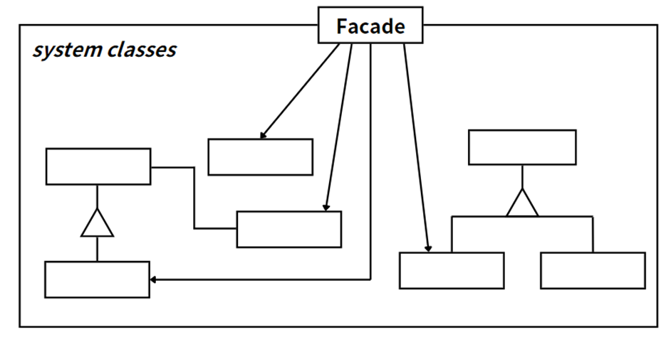

## 模式举例

Java 的 Collections 类是外观模式的一个很好的例子。Collections 类提供了一系列静态方法，用于操作或返回集合。这些方法隐藏了实际的实现细节，为客户端提供了一个简单的接口来操作集合。

## 模式定义

外观模式也称门面模式，是对象结构型模式，门面模式可以将子系统关在“门里”隐藏起来，客户端只需要通过外观接口与外观对象进行交互，而不需要直接和多个子系统交互，无论子系统多么复杂，对于外部来说是隐藏的，这样可以降低系统的耦合度。

::: tip 定义

外观模式（Facade  Pattern），**外部与一个子系统的通信必须通过一个统一的外观对象进行，为子系统中的一组接口提供一个一致的界面**。外观模式定义了一个高层接口，这个接口使得这一子系统更加容易使用。

:::

在微服务架构场景下会有多个Web服务，此时经常会使用一个统一的网关入口来自动转发到不同的Web服务，这种为多个微服务提供统一的访问入口，就称为网关（Gateway）。这可以简化客户端的操作，只需要与网关交互，而不需要知道后端的具体微服务。网关本质上也是一种外观模式，但还可以提供诸如负载均衡、缓存、访问限制、认证授权等附加功能服务。

## 角色分析



外观类：对外提供⼀个统⼀的高层次接口，将客户端的请求代理给子系统。

子系统类：实现子系统的功能，处理外观类指派的任务。

## 示例代码

```java
// 子系统A
class SubsystemA {
    public void operationA() {
        System.out.println("SubsystemA operation");
    }
}

// 子系统B
class SubsystemB {
    public void operationB() {
        System.out.println("SubsystemB operation");
    }
}

// 子系统C
class SubsystemC {
    public void operationC() {
        System.out.println("SubsystemC operation");
    }
}

// 外观类
class Facade {
    private SubsystemA subsystemA;
    private SubsystemB subsystemB;
    private SubsystemC subsystemC;

    public Facade() {
        this.subsystemA = new SubsystemA();
        this.subsystemB = new SubsystemB();
        this.subsystemC = new SubsystemC();
    }

    // 外观方法，封装了对子系统的操作
    public void facadeOperation() {
        subsystemA.operationA();
        subsystemB.operationB();
        subsystemC.operationC();
    }
}

// 客户端
public class Main {
    public static void main(String[] args) {
        // 创建外观对象
        Facade facade = new Facade();
        // 客户端通过外观类调用子系统的操作
        facade.facadeOperation();
    }
}
```

## 模式总结

外观模式提供了一种简化接口的方式，使得客户端不需要直接与系统的各个子系统进行交互，而是通过一个统一的接口进行交互，这样可以降低系统的复杂性，提高了易用性。即使子系统的实现发生了变化，只要外观接口没变，客户端代码就无需修改。另外，子系统可以有多个"外观"，外观并不参与子系统的业务逻辑，外观只是提供接口，保持独立性。

> 如果需要添加新的子系统或修改子系统的行为，就可能需要修改外观类（违背了“开闭原则”）。

总的来说，在外观模式中，一个子系统的外部与其内部的通信通过一个统一的外观类进行，外观类将客户端与子系统的内部复杂性隔离开，使得客户端只需要与外观类角色打交道，而不需要与子系统内部的许多对象打交道。