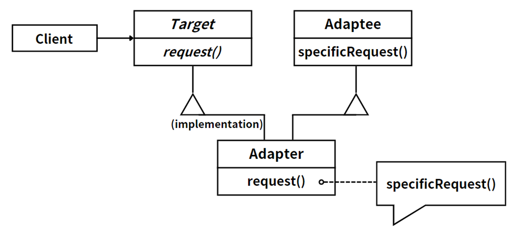
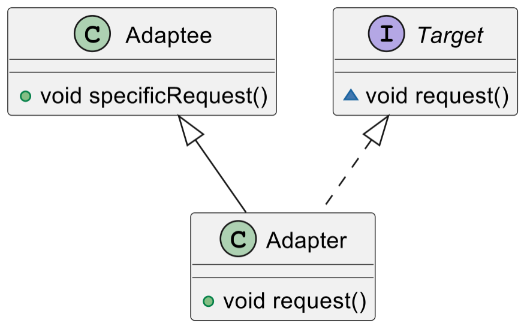
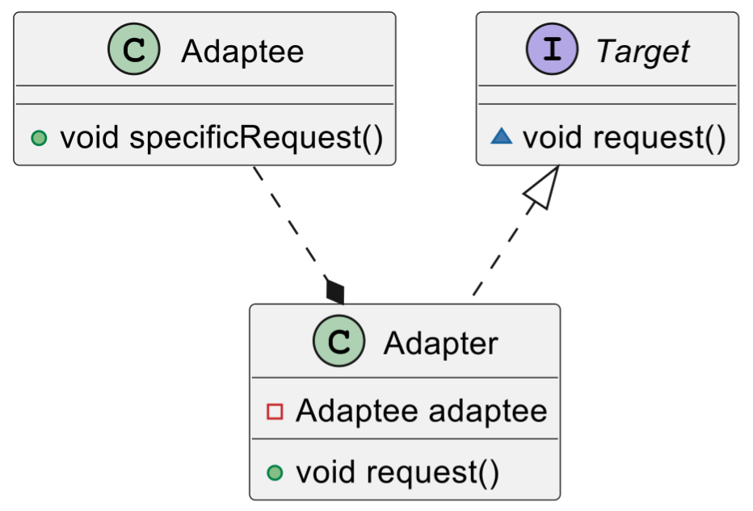

## 模式举例

`Arrays#asList()`：Java 的 `Arrays` 类的 `asList()` 方法接受一个数组并返回一个固定大小的 `List`。这个 `List` 是一个视图，它内部仍然引用原始数组。这样，我们就可以使用 `List` 接口来操作数组。这是一个将数组适配为 `List` 的适配器。

## 模式定义

适配器模式（*Adapter Pattern*）是一种结构型设计模式，它可以将一个类的接口转换成客户希望的另一个接口，主要目的是充当两个不同接口之间的桥梁，将一个接口转换成客户希望的另一个接口，使接口不兼容的那些对象可以一起工作。

比如，笔记本电脑的工作电压是 `DC 20V`，我们的生活用电是 `220V`。正常使用笔记本电脑，必须有一个电源适配器。

::: tip 定义

适配器模式（Adapter Pattern），**将一个接口转换成客户希望的另一个接口，适配器模式使接口不兼容的那些类可以一起工作**。适配器模式的别名为包装器（`Wrapper`）模式。

:::

适配器模式常用于以下场景：

- 系统需要使用现有的类，而这些类的接口不符合系统的需求。
- 想要构建一个可以重用的类，该类可以与其他不相关的类或不可预见的类（即那些接口可能不一定兼容的类）协同工作。

## 角色分析



在适配器模式中，有以下几个角色：

1. **目标（`Target`）**：这是客户端期望的接口。比如目标是DC 20V的电压。

2. **适配者（`Adaptee`）**：这是需要被适配的类或接口。比如适配者是220V的交流电。

3. **适配器（`Adapter`）**：这是适配器模式的核心。适配器包含了一个适配者的实例，并实现了目标接口。适配器的任务就是将目标接口的调用转换为对适配者的调用。在上述例子中，适配器就是电源转换器。

在开发中，适配器模式可以帮助我们实现以下目标：

- **重用现有的类**：如果一个类的功能基本满足需求，但是它的接口与新的系统不兼容，那么我们可以通过适配器模式来重用这个类，而不需要修改这个类的代码。

- **扩展现有类的功能**：如果我们希望在不修改现有类的情况下，为这个类添加新的功能，那么我们可以通过适配器模式来实现。我们可以创建一个新的适配器类，这个类包含了现有类的实例，并实现了新的接口。在这个新的接口中，我们可以添加新的功能。

## 示例代码

### 类适配器模式



我们先来看类适配器模式：

```java
//角色1：适配者类 (已有的、需要被适配的类)
class Adaptee {
    public void specificRequest() {
        System.out.println("Specific request...");
    }
}

//角色2：目标接口 (我们期望的接口)
interface Target {
    void request();
}

//角色3：适配器类 (继承了Adaptee并实现Target接口，解决接口不兼容的问题)
class Adapter extends Adaptee implements Target {
	@Override
	public void request() {
		super.specificRequest(); //调用基类方法
	}
}
```

适配器类`Adapter`继承了 `Adaptee` 并实现了 `Target` 接口。在 `request` 方法中，它调用了 `Adaptee` 的 `specificRequest` 方法。这样，当客户端通过 `Target` 接口调用 `request` 方法时，实际上会执行 `Adaptee` 的 `specificRequest` 方法，从而实现了接口的适配。

客户端代码如下：

```java
public class Client {
	public static void main(String[] args) {
		Target adapter = new Adapter();  // 可选择不同类型的适配器
		adapter.request(); // 调用接口方法
	}
}
```

### 对象适配器模式



我们再来看对象适配器模式：

```java
//角色1：适配者类 (已有的、需要被适配的类)
class Adaptee {
	public void specificRequest() {
		System.out.println("Specific request...");
	}
}

//角色2：目标接口 (我们期望的接口)
interface Target {
	void request();
}

//角色3：适配器类 (聚合Adaptee类，实现Target接口，解决接口不兼容的问题)
class Adapter implements Target {
    
	private Adaptee adaptee; // 持有一个 Adaptee 的实例

	public Adapter(Adaptee adaptee) {
		this.adaptee = adaptee;
	}

	@Override
	public void request() {
		adaptee.specificRequest(); // 调用成员对象的方法，实现接口兼容
	}
}
```

客户端代码如下：

```java
public class Client {
	public static void main(String[] args) {
		Target adapter = new Adapter(new Adaptee());
		adapter.request();
	}
}
```

## 模式总结

适配器模式是一种结构型设计模式，用于将一个类的接口转换成客户希望的另一个接口，充当两个不同接口之间的桥梁，使得接口不兼容的对象可以一起工作。在Java中，适配器模式有两种常见的实现方式：类适配器模式和对象适配器模式。

在类适配器模式中，适配器类继承了适配者类并实现了目标接口，在适配器类中调用适配者类的方法来实现目标接口的方法。

而在对象适配器模式中，适配器类持有一个适配者类的实例，并实现了目标接口，在适配器类中调用适配者类的方法来实现目标接口的方法。

适配器模式可以帮助实现重用现有类、扩展现有类的功能等目标，它主要关注于解决接口不兼容的问题，使得不兼容的类能够协同工作。