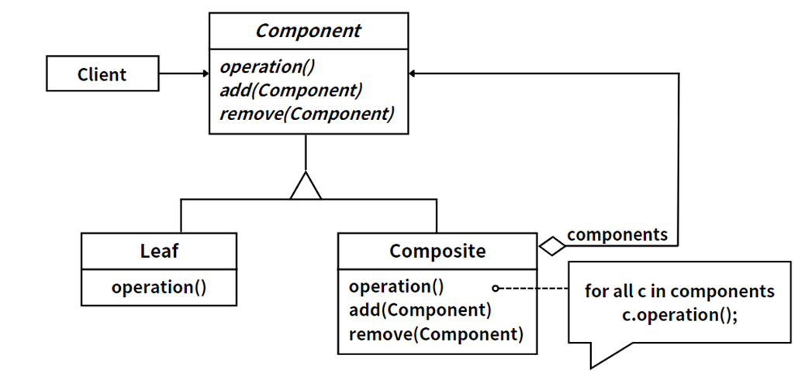
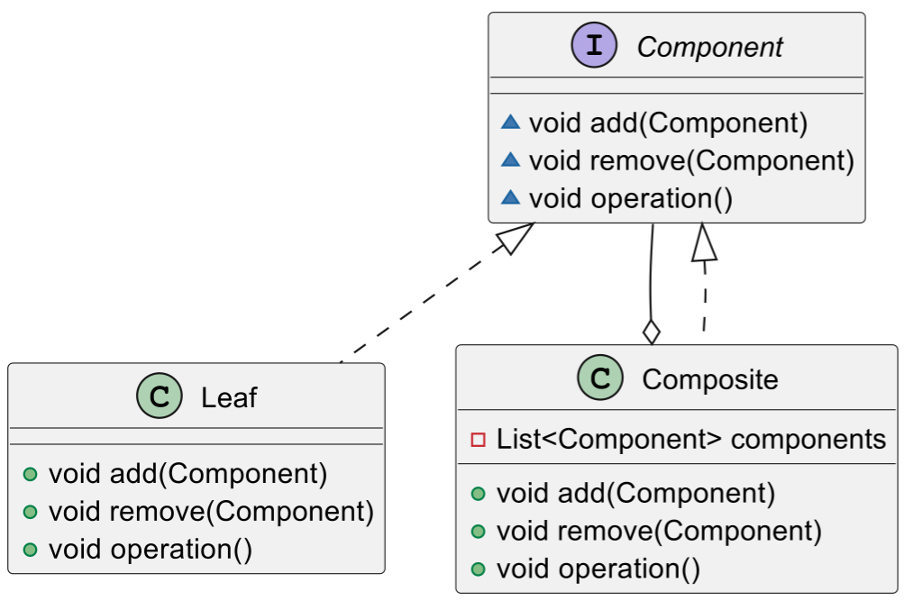
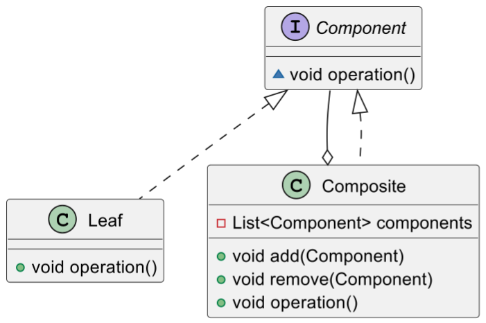

## 模式举例

在Java中，`File` 类可以代表一个文件或一个目录。对于目录，我们可以调用其 `listFiles()` 方法来获取其包含的所有文件和子目录，这些文件和子目录又可以是 File 对象。这种层次结构的设计就是典型的组合模式。

## 模式定义

树形结构在软件开发中随处可见，如操作系统的文件目录结构、应用软件中的菜单结构和公司组织机构等。组合模式将对象组织到树形结构中，用以描述整体与部分的关系。组合模式是对象结构型模式。组合模式根据抽象构件的定义形式，可划分为**透明组合模式**和**安全组合模式**。

::: tip 定义

组合模式（Composite Pattern），**组合多个对象形成树形结构以表示具有部分—整体关系的层次结构**。组合模式让客户端可以统一地对待单个对象和组合对象。

:::

组合模式允许我们将对象组合成树形结构来表示**"部分-整体"**的层次结构，使得客户端可以统一对待单个对象和组合对象。在 Java 的 File 类中，我们可以看到组合模式的应用，它允许我们以统一的方式处理文件和目录，无需关心它们的具体类型。

## 模式角色



组合模式中的三个角色具有以下特性：

1. Component（抽象构件）：这是组合中对象声明接口，在适当的情况下，实现所有类共有接口的默认行为。它的主要角色是为Composite定义行为，以及管理和访问Composite组件。
2. Leaf（叶子构件）：在组合中表示叶节点对象，叶节点没有子节点。它实现了在Component接口中定义的操作。
3. Composite（容器构件）：在组合中表示节点对象，节点有子节点。它的作用是定义包含Component的子部件的行为，以及实现在Component中定义的与子部件有关的操作。

组合模式允许客户端通过一致的方式处理单个对象和组合对象，这使得客户端与复杂元素的内部结构解耦，使得客户端可以一致地处理复杂和简单的元素。

## 透明组合模式

### 角色分析



组合模式主要包含以下三种角色：

1. 抽象组件（Component）：这是组合中对象声明接口，定义所有类共有接口的默认行为，为树叶构件和树枝构件声明公共接口。

2. 叶子组件（Leaf）：在组合中表示叶节点对象，叶节点没有子节点。在实现抽象组件接口的过程中，叶子节点需要提供具体的实现，重写基类的抽象方法`operation()`，其他抽象方法可以是空实现。

3. 复合组件（Composite）：定义有枝节点行为，用来存储子部件，在抽象组件接口中实现与子部件有关操作，如增加(add)和删除(remove)等，并且聚合基类`Component`。

在透明组合模式中，用户只需要对抽象组件进行操作，用户不需要关心是叶子组件还是复合组件，也不需要知道具体的实现细节，这样就可以使用户与复杂的对象结构解耦。

### 举个例子

```java
import java.util.ArrayList;
import java.util.List;

// 抽象构件，表示抽象的根结果
abstract class Component {
    protected String name;  // 组件名称

    public Component(String name) {  // 构造方法
        this.name = name;
    }

    protected abstract void operation();  // 业务方法
    protected void add(Component c) {  // 添加成员
        throw new UnsupportedOperationException("Unsupported Operation");
    }
}

// 叶子构件
class Leaf extends Component {
    public Leaf(String name) {
        super(name);  // 调用父类构造方法
    }

    @Override
    protected void operation() {  // 打印组件名称
        System.out.println("Leaf: " + name);
    }
}

// 容器构件
class Composite extends Component {
    protected List<Component> components;

    public Composite(String name) { // 构造器
        super(name);
        components = new ArrayList<>();
    }

    @Override
    public void add(Component c) {  // 添加子组件
        components.add(c);
    }
    
    @Override
    protected void operation() {
        System.out.println("Composite: " + name);
        for (Component c : components) {  // 遍历子组件
            c.operation();  // 方法递归调用
        }
    }
}

public class Client {  // 客户端
    public static void main(String[] args) {
        // 创建根容器组件
        Component university = new Composite("清华大学");
        
        // 创建子容器组件
        Component computerCollege = new Composite("计算机学院");
        university.add(computerCollege);
        Component infoEngineerCollege = new Composite("信息工程学院");
        university.add(infoEngineerCollege);
        
        // 创建叶子组件并添加到相应的容器组件
        computerCollege.add(new Leaf("软件工程系"));
        computerCollege.add(new Leaf("网络工程系"));
        computerCollege.add(new Leaf("计算机科学与技术系"));
        infoEngineerCollege.add(new Leaf("通信工程系"));
        infoEngineerCollege.add(new Leaf("电子工程系"));

        university.operation(); // 调用递归方法，遍历根容器组件
    }
}
```

### 模式分析

在透明组合模式中，用户不必关心自己处理是叶子组件还是复合组件，简化了客户端的代码。这里我们定义了包含叶子组件和复合组件的类层次机构，叶子对象可以被组合成更复杂的容器对象，而这个容器对象又可以被组合，这样不断地递归下去。客户代码中，任何用到叶子对象的地方都可以使用容器对象。 

## 安全组合模式

### 角色分析



同样的，安全组合模式也是三种角色，唯一不同的是，在安全组合模式中，`Component`不声明管理成员对象的方法`add()、remove()、getChild()等`，而是在`Composite`中声明并实现。这种做法是安全的，因为它不会向`Leaf`提供管理成员对象的那些方法。

### 举个例子

```java
import java.util.ArrayList;
import java.util.List;

// 组件接口
interface Component {
    void operation();
}

// 叶子节点
class Leaf implements Component {
    private String name;

    public Leaf(String name) {
        this.name = name;
    }

    @Override
    public void operation() {
        System.out.println("Leaf: " + name);
    }
}

// 组合节点
class Composite implements Component {
    private String name;
    private List<Component> components;

    public Composite(String name) {
        this.name = name;
        components = new ArrayList<>();
    }

    public void add(Component component) {
        components.add(component);
    }

    public void remove(Component component) {
        components.remove(component);
    }

    @Override
    public void operation() {
        System.out.println("Composite: " + name);
        for (Component component : components) {
            component.operation();
        }
    }
}

public class Client {
    public static void main(String[] args) {
        // 创建根容器组件
        Composite university = new Composite("清华大学");

        // 创建子容器组件
        Composite computerCollege = new Composite("计算机学院");
        university.add(computerCollege);
        Composite infoEngineerCollege = new Composite("信息工程学院");
        university.add(infoEngineerCollege);

        // 创建叶子组件并添加到相应的容器组件
        computerCollege.add(new Leaf("软件工程系"));
        computerCollege.add(new Leaf("网络工程系"));
        computerCollege.add(new Leaf("计算机科学与技术系"));
        infoEngineerCollege.add(new Leaf("通信工程系"));
        infoEngineerCollege.add(new Leaf("电子工程系"));

        university.operation(); // 调用递归方法，遍历根容器组件
    }
}
```

### 模式分析

安全组合模式避免了透明组合模式的安全性问题，但安全组合模式因叶子和分支有不同的接口而失去了透明性。

## 模式总结

组合模式是一种结构型设计模式，它允许你将对象组合成树形结构来表现"整体-部分"的层次结构。组合模式使得用户可以统一对待单个对象和对象组合，从而使得客户端代码更加简洁和灵活。

**关键点：**

- **统一接口**：组合模式通过将叶子节点和容器节点都实现相同的组件接口，使得客户端可以一致地对待单个对象和对象组合。

- **递归组合**：容器节点中通常包含了子组件的集合，使得可以通过递归的方式来遍历整个组合结构，从而实现统一的操作。

- **透明组合 vs 安全组合**：
  - **透明组合**：将管理子组件的方法定义在抽象组件中，但是可能会导致叶子节点不支持添加、删除子节点的操作，需要在叶子节点中抛出异常或者提供空实现。
  - **安全组合**：将管理子组件的方法定义在容器组件中，使得叶子节点不会包含这些方法，从而保证了类型安全。

当你需要表示对象的整体-部分层次结构，并希望用户统一对待单个对象和对象组合时，实现更加灵活的结构时，可以考虑使用组合模式。