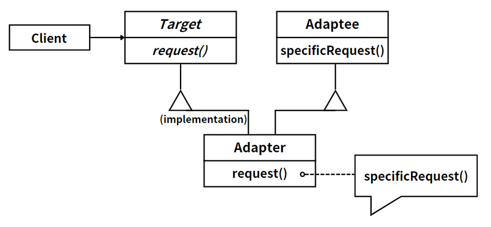

## 模式举例

`Spring` 框架的 `AOP`（面向切面编程）功能也是代理模式的一个应用。在 `Spring AOP` 中，切面（`Aspect`）可以看作是代理，它在目标对象的方法调用前后添加了一些额外的行为（如日志、事务管理等）。这些切面通常是通过动态代理实现的。

## 模式定义

代理模式（Proxy Pattern）为其他对象提供一种代理以控制对这个对象的访问。代理类负责为委托类预处理消息，过滤消息并转发消息，以及进行消息的后期处理。

::: tip 定义

代理模式（Proxy Pattern），**给某一个对象提供一个代理，并由代理对象控制对原对象的引用**。

:::

说白了就是，代理模式通过封装一个已有的接口，并向调用方返回相同的接口类型，能让调用方在不改变任何代码的前提下，增强某些功能。

代理模式常用于以下场景：

- 远程代理：为一个对象在不同的地址空间提供局部代表。
- 虚拟代理：根据需要创建开销很大的对象。
- 安全代理：控制对原始对象的访问。
- 智能引用：取代简单的指针，进行额外的操作。

## 角色分析



1. `Target`（目标接口）：这是客户端所期望的接口，可以是具体的或抽象的类，也可以是接口。在这个上述例子中，`Target`接口定义了一个`request()`方法。
2. `Adaptee`（被适配者）：这是需要被适配的类，它有一个`specificRequest()`方法，这个方法在当前系统中无法直接使用，需要被转换成客户端可以使用的形式。
3. `Adapter`（适配器）：适配器类是代理模式的核心，它实现了`Target`接口，并持有一个`Adaptee`的实例。适配器的`request()`方法内部会调用`Adaptee`的`specificRequest()`方法，这样`Adaptee`的`specificRequest()`方法就被“适配”成了`Target`的`request()`方法。

代理模式的主要目的是让客户端通过`Target`接口与`Adaptee`类进行交互，而无需关心`Adaptee`的存在，可降低系统的耦合度。

## 示例

### 经典代码（静态代理）

```java
// Target接口
interface Target {
    void request();
}

// 实际对象类
class RealObject implements Target {
    @Override
    public void request() {
        System.out.println("RealObject is handling the request.");
    }
}

// 代理类
class ProxyObject implements Target {
    private RealObject realObject;

    public ProxyObject() {
        this.realObject = new RealObject();
    }

    @Override
    public void request() {
        System.out.println("ProxyObject is preparing for the request.");
        realObject.request();
        System.out.println("ProxyObject is finishing the request.");
    }
}

// 客户端代码
public class Client {
    public static void main(String[] args) {
        Target target = new ProxyObject();
        target.request();
    }
}
```

在这里，`RealObject`是实际对象，`ProxyObject`是代理对象，它们都实现了`Target`接口。客户端通过`Target`接口与`RealObject`进行交互，而无需直接与`RealObject`交互。`ProxyObject`在调用`RealObject`的`request()`方法之前和之后，可以执行一些额外的操作，比如准备和清理工作。

### 动态代理

在Java中，可以使用`java.lang.reflect.Proxy`类来创建动态代理。

```java
import java.lang.reflect.InvocationHandler;
import java.lang.reflect.Method;
import java.lang.reflect.Proxy;

// Target接口
interface Target {
    void request();
}

// 实际对象类
class RealObject implements Target {
    @Override
    public void request() {
        System.out.println("RealObject is handling the request.");
    }
}

// 动态代理处理器
class DynamicProxyHandler implements InvocationHandler {
    private Object realObject;

    public DynamicProxyHandler(Object realObject) {
        this.realObject = realObject;
    }

    @Override
    public Object invoke(Object proxy, Method method, Object[] args) throws Throwable {
        System.out.println("DynamicProxyHandler is preparing for the request.");
        Object result = method.invoke(realObject, args);
        System.out.println("DynamicProxyHandler is finishing the request.");
        return result;
    }
}

// 客户端代码
public class Client {
    public static void main(String[] args) {
        RealObject realObject = new RealObject();
        Target proxy = (Target) Proxy.newProxyInstance(
            RealObject.class.getClassLoader(),
            RealObject.class.getInterfaces(),
            new DynamicProxyHandler(realObject)
        );
        proxy.request();
    }
}
```

在这个示例中，`DynamicProxyHandler`是一个实现了`InvocationHandler`接口的类，它在调用实际对象的方法之前和之后，可以执行一些额外的操作。`Proxy.newProxyInstance()`方法用于创建动态代理对象，它需要一个类加载器，一个接口数组，以及一个`InvocationHandler`实例作为参数。

> JDK动态代理技术略有限制，即被代理的类必须实现某个接口，否则无法使用JDK自带的动态代理。
>
> 另一种更加灵活、功能更加强大的动态代理技术就是 CGLib（Code Generation Lib，代码生成库）。
>
> 与JDK动态代理不同，CGLib可以代理任何类，不仅仅是接口，它通过创建一个被代理对象的子类来实现代理。CGLib主要用于那些需要对类进行代理但又不能或不方便实现接口的场景，例如：AOP（面向切面编程），测试等。


## 模式总结

代理模式在需要控制对对象的访问时非常有用，它可以为对象提供一个简单的代理或占位符。代理模式的主要优点是它可以在不改变原有对象的情况下通过引入代理对象来进行一些额外的操作，如加载、安全控制等。但是，代理模式也可能导致请求处理速度变慢，特别是在网络环境中。

注意，静态代理（Static Proxy）是指代理类和代理方法在编译后生成固定的.class文件，且代理类继承自特定的抽象基类或实现特定的接口。其特点在于，可以在不修改目标对象功能的前提下，通过代理对象对目标业务方法进行扩展。

局限性如下：

1. **代码重复**：如果需要代理的方法多且都使用相同的增强方法，那么代理类中将存在大量重复代码，这降低了代码的可重用性。

2. **类数量过多**：如果需要为多个真实主题类提供代理，那么需要创建多个代理类，可能导致类数量过多，这被称为类爆炸问题。